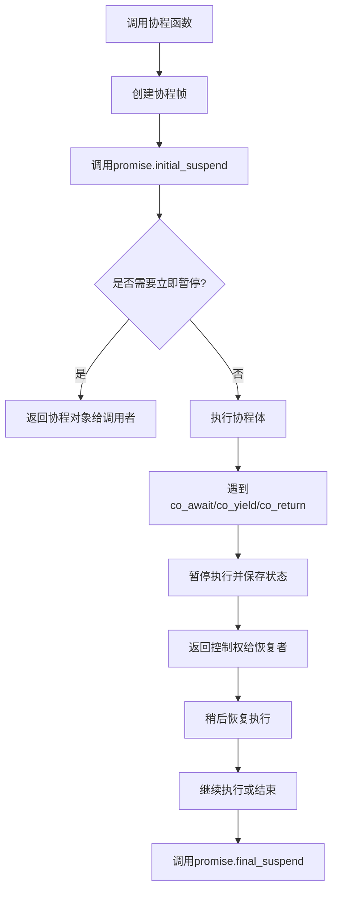

# C++ 20协程

## 什么是协程？

协程(Coroutines)是C++20引入的一项重要新特性，它为C++带来了编写异步、非阻塞代码的强大能力。简单来说，协程是可以暂停执行并在之后恢复的函数。与普通函数不同，协程可以在执行到某一点时"让出"控制权，稍后再从中断的地方继续执行。

:::note
协程与线程的主要区别：线程由操作系统调度，而协程是在应用程序层面进行协作式调度的，不涉及操作系统的线程切换开销。
:::

## 协程的基本概念

在深入了解C++20协程之前，我们需要理解几个关键概念：

1. **协程状态(Coroutine State)** - 保存协程执行状态的数据结构
2. **协程句柄(Coroutine Handle)** - 用于恢复或销毁协程的句柄
3. **承诺对象(Promise)** - 控制协程行为的对象
4. **协程返回对象(Coroutine Return Object)** - 协程返回给调用者的结果

## 协程的基本语法

C++20引入了三个关键字来支持协程：

- `co_await` - 暂停协程执行，等待某个操作完成
- `co_yield` - 暂停协程执行并返回一个值
- `co_return` - 完成协程执行并返回一个值

如果一个函数中使用了任何一个这样的关键字，它就成为了一个协程。

## 简单的协程示例

让我们从一个简单的例子开始，看看协程的基本使用方式：

```cpp
#include <coroutine>
#include <iostream>
#include <string>

// 一个简单的协程返回类型
struct SimpleCoroutine {
    struct promise_type {
        std::string value;
        
        SimpleCoroutine get_return_object() {
            return SimpleCoroutine{std::coroutine_handle<promise_type>::from_promise(*this)};
        }
        
        std::suspend_always initial_suspend() { return {}; }
        std::suspend_always final_suspend() noexcept { return {}; }
        void return_value(std::string v) { value = v; }
        void unhandled_exception() { std::terminate(); }
    };
    
    std::coroutine_handle<promise_type> handle;
    
    SimpleCoroutine(std::coroutine_handle<promise_type> h) : handle(h) {}
    ~SimpleCoroutine() {
        if (handle) handle.destroy();
    }
    
    std::string get_result() {
        handle.resume();
        auto result = handle.promise().value;
        return result;
    }
};

// 一个简单的协程函数
SimpleCoroutine hello_coroutine() {
    co_return "Hello, Coroutine!";
}

int main() {
    auto coroutine = hello_coroutine();
    std::cout << coroutine.get_result() << std::endl;
    return 0;
}
```

**输出**:
```
Hello, Coroutine!
```

## 协程的工作原理

当编译器看到一个函数使用了协程关键字，它就会将该函数转换为状态机。让我们分解协程的执行流程：



## 协程的关键组件详解

### 1. std::suspend_always 和 std::suspend_never

这两个类型决定协程在特定点是否需要暂停：

- `std::suspend_always`: 总是暂停
- `std::suspend_never`: 从不暂停

### 2. promise_type

每个协程都需要定义一个`promise_type`。它控制协程的行为，包括：

- `initial_suspend()`: 协程开始时是否暂停
- `final_suspend() noexcept`: 协程结束时是否暂停
- `get_return_object()`: 创建协程返回对象
- `return_value()` 或 `return_void()`: 处理`co_return`语句
- `unhandled_exception()`: 处理协程中的异常

### 3. 协程句柄 (std::coroutine_handle)

用于恢复或销毁协程：

```cpp
std::coroutine_handle<promise_type> handle;
// 恢复协程执行
handle.resume();
// 检查协程是否完成
bool is_done = handle.done();
// 销毁协程
handle.destroy();
```

## 使用co_yield创建生成器

生成器是协程的一个常见应用，它可以产生一系列值：

```cpp
#include <coroutine>
#include <iostream>
#include <exception>

template <typename T>
class Generator {
public:
    struct promise_type {
        T value;
        
        Generator get_return_object() {
            return Generator{std::coroutine_handle<promise_type>::from_promise(*this)};
        }
        
        std::suspend_always initial_suspend() { return {}; }
        std::suspend_always final_suspend() noexcept { return {}; }
        void return_void() {}
        std::suspend_always yield_value(T v) {
            value = v;
            return {};
        }
        void unhandled_exception() { std::terminate(); }
    };
    
    std::coroutine_handle<promise_type> handle;
    
    Generator(std::coroutine_handle<promise_type> h) : handle(h) {}
    ~Generator() {
        if (handle) handle.destroy();
    }
    
    // 迭代器接口
    class iterator {
    public:
        iterator(std::coroutine_handle<promise_type> h = nullptr) : handle(h) {
            if (handle && !handle.done()) {
                handle.resume();
            }
        }
        
        bool operator!=(const iterator& other) const {
            return handle != other.handle || (handle && other.handle && handle.done() != other.handle.done());
        }
        
        iterator& operator++() {
            handle.resume();
            return *this;
        }
        
        const T& operator*() const {
            return handle.promise().value;
        }
        
    private:
        std::coroutine_handle<promise_type> handle;
    };
    
    iterator begin() { return iterator{handle}; }
    iterator end() { return iterator{}; }
};

// 使用生成器生成斐波那契数列
Generator<int> fibonacci(int n) {
    int a = 0, b = 1;
    
    for (int i = 0; i < n; i++) {
        co_yield a;
        int tmp = a;
        a = b;
        b = tmp + b;
    }
}

int main() {
    for (int n : fibonacci(10)) {
        std::cout << n << " ";
    }
    std::cout << std::endl;
    return 0;
}
```

**输出**:
```
0 1 1 2 3 5 8 13 21 34
```

## 使用co_await实现异步操作

`co_await`表达式允许协程等待异步操作完成：

```cpp
#include <coroutine>
#include <iostream>
#include <thread>
#include <chrono>
#include <functional>

// 可等待对象
struct Awaitable {
    bool await_ready() const { return false; }
    void await_suspend(std::coroutine_handle<> h) {
        std::thread([h]() {
            std::this_thread::sleep_for(std::chrono::seconds(1));
            h.resume();
        }).detach();
    }
    void await_resume() {}
};

struct Task {
    struct promise_type {
        Task get_return_object() {
            return Task{std::coroutine_handle<promise_type>::from_promise(*this)};
        }
        std::suspend_never initial_suspend() { return {}; }
        std::suspend_never final_suspend() noexcept { return {}; }
        void return_void() {}
        void unhandled_exception() { std::terminate(); }
    };
    
    std::coroutine_handle<promise_type> handle;
    
    Task(std::coroutine_handle<promise_type> h) : handle(h) {}
    ~Task() {
        if (handle) handle.destroy();
    }
};

// 异步任务
Task async_task() {
    std::cout << "开始异步任务" << std::endl;
    co_await Awaitable{};  // 暂停并在1秒后恢复
    std::cout << "异步任务完成" << std::endl;
}

int main() {
    std::cout << "主线程开始" << std::endl;
    auto task = async_task();
    std::cout << "主线程继续执行其他工作" << std::endl;
    std::this_thread::sleep_for(std::chrono::seconds(2));
    std::cout << "主线程完成" << std::endl;
    return 0;
}
```

**输出**:
```
主线程开始
开始异步任务
主线程继续执行其他工作
异步任务完成
主线程完成
```

## 实际应用案例

### 案例1：异步HTTP请求处理

在Web服务器应用中，协程可以优雅地处理异步HTTP请求：

```cpp
// 注意：这是概念示例代码，需要实际的HTTP库支持
Task handle_request(HttpRequest request) {
    // 异步读取数据库
    auto db_result = co_await db.query(request.user_id);
    
    // 异步调用外部API
    auto api_result = co_await external_api.call(request.params);
    
    // 合并结果并返回
    HttpResponse response;
    response.data = process_results(db_result, api_result);
    co_return response;
}
```

### 案例2：游戏AI状态机

在游戏开发中，协程可以简化AI状态机的实现：

```cpp
Task enemy_behavior(Enemy* enemy) {
    while (enemy->is_alive()) {
        // 巡逻状态
        co_await patrol(enemy);
        
        // 检测到玩家，切换到追击状态
        if (enemy->detect_player()) {
            co_await chase(enemy);
            
            // 如果足够近，攻击
            if (enemy->in_attack_range()) {
                co_await attack(enemy);
            }
        }
        
        // 等待下一个AI更新
        co_await next_frame();
    }
}
```

## 协程的优势

1. **简化异步代码** - 协程允许以同步风格编写异步代码，提高可读性
2. **降低资源开销** - 比线程更轻量
3. **提高性能** - 减少了线程切换的开销
4. **流式处理** - 通过生成器可以实现惰性求值和流式处理

## 协程的局限性

1. **编译器支持** - 需要C++20兼容的编译器
2. **学习曲线** - 概念和模板编程要求较高
3. **生态系统** - 相比于其他语言的协程生态，C++20协程的库支持仍在发展中

## 总结

C++20协程为C++引入了强大的异步编程能力，使开发者能够以更自然的方式编写非阻塞代码。通过`co_await`、`co_yield`和`co_return`关键字，我们可以创建可暂停和恢复的函数，从而大幅简化复杂异步逻辑的实现。

虽然C++20协程的语法和概念需要一定时间来掌握，但它们提供的优势使这种投入非常值得：代码更清晰、更易维护，且在处理IO密集型任务时性能更佳。

随着C++生态系统继续发展，我们可以期待更多基于协程的高级库和框架出现，进一步简化异步编程体验。

## 练习与进阶学习

1. 实现一个简单的Task类，可以执行异步操作并返回结果
2. 使用协程实现一个基于事件循环的简单调度器
3. 尝试用协程改写一个使用回调或Promise的异步程序
4. 探索C++标准库中与协程相关的其他类和概念，如`std::suspend_always`、`std::suspend_never`等

:::tip
学习协程时，先掌握基础概念和简单应用，然后逐步探索更复杂的模式。协程非常适合处理IO密集型任务，如网络编程、文件操作等。
:::

## 附加资源

- C++标准文档中关于协程的章节
- CppCon和C++ Now会议上关于协程的演讲
- 协程相关开源库，如cppcoro、concurrencpp等
- 各大编译器的协程实现状态和限制