# C++ 20模块

C++20引入了模块系统，这是C++语言自诞生以来最重要的改变之一。模块系统解决了传统头文件包含方式存在的许多问题，如编译速度慢、符号污染、包含顺序敏感等。本文将介绍C++20模块的基本概念、使用方法以及最佳实践。

## 传统头文件的问题

在深入了解模块之前，我们先回顾一下传统头文件方法存在的问题：

1. **重复解析**：当一个头文件被多次包含时，即使有包含保护，编译器仍需要多次解析相同的文件
2. **符号污染**：头文件中的所有宏、命名空间等都会污染全局命名空间
3. **包含顺序敏感**：头文件的包含顺序可能影响编译结果
4. **编译速度慢**：大型项目中，头文件的解析和处理占用了大量编译时间

看看传统的头文件使用方式：

```cpp
// math_utils.h
#ifndef MATH_UTILS_H
#define MATH_UTILS_H

int add(int a, int b);
double multiply(double a, double b);

#endif

// math_utils.cpp
#include "math_utils.h"

int add(int a, int b) {
    return a + b;
}

double multiply(double a, double b) {
    return a * b;
}

// main.cpp
#include "math_utils.h"
#include <iostream>

int main() {
    std::cout << add(5, 3) << std::endl;
    return 0;
}
```

## C++ 20模块基础

模块是C++20中引入的一种新的代码组织方式，它们具有以下特点：

1. **只编译一次**：模块内容只需编译一次，在导入时直接使用已编译的结果
2. **明确的导出**：只有显式导出的声明才能被模块外部使用
3. **无符号污染**：模块中的宏、命名空间不会自动扩散到导入模块的代码中
4. **顺序无关**：模块导入的顺序不影响程序行为
5. **更快的编译速度**：大型项目可能会显著提升编译性能

## 创建和使用模块

### 模块的定义和导出

模块使用`module`和`export`关键字定义：

```cpp
// math.cppm (模块接口文件)
export module math; // 声明这是一个名为"math"的模块

// 导出函数
export int add(int a, int b) {
    return a + b;
}

// 导出类
export class Calculator {
public:
    double multiply(double a, double b) {
        return a * b;
    }
};

// 非导出函数（模块内部使用）
int subtract(int a, int b) {
    return a - b;
}
```

### 模块的导入和使用

在其他源文件中，可以使用`import`关键字导入模块：

```cpp
// main.cpp
import math; // 导入math模块
#include <iostream>

int main() {
    // 使用模块中导出的函数
    std::cout << "5 + 3 = " << add(5, 3) << std::endl;
    
    // 使用模块中导出的类
    Calculator calc;
    std::cout << "4 * 2.5 = " << calc.multiply(4, 2.5) << std::endl;
    
    // 错误：subtract未被导出
    // std::cout << subtract(10, 4) << std::endl;
    
    return 0;
}
```

### 模块分区

对于大型模块，可以将其分割成多个分区（partition）：

```cpp
// math-core.cppm (分区接口文件)
export module math:core; // 声明这是math模块的core分区

export int add(int a, int b) {
    return a + b;
}

export int subtract(int a, int b) {
    return a - b;
}

// math-advanced.cppm (分区接口文件)
export module math:advanced;

export double power(double base, int exponent) {
    double result = 1.0;
    for (int i = 0; i < exponent; ++i) {
        result *= base;
    }
    return result;
}

// math.cppm (主模块接口文件)
export module math;

// 导出分区
export import :core;
export import :advanced;

// 可以添加其他导出内容
export const double PI = 3.14159265358979;
```

### 模块实现文件

模块可以分为接口文件和实现文件：

```cpp
// math.cppm (接口文件)
export module math;

// 只导出声明
export int factorial(int n);
export double power(double base, int exponent);

// math-impl.cpp (实现文件)
module math; // 实现文件使用module但不带export

int factorial(int n) {
    if (n <= 1) return 1;
    return n * factorial(n - 1);
}

double power(double base, int exponent) {
    double result = 1.0;
    for (int i = 0; i < exponent; ++i) {
        result *= base;
    }
    return result;
}
```

## 模块与头文件的混用

在过渡阶段，模块可以与传统头文件混用：

### 在模块中导入头文件

```cpp
// string_utils.cppm
export module string_utils;

// 全局模块片段，仅用于包含头文件
module;
#include <string>
#include <algorithm>

// 实际模块代码
export module string_utils;

export std::string reverse(const std::string& input) {
    std::string result = input;
    std::reverse(result.begin(), result.end());
    return result;
}
```

### 通过模块导出标准库

```cpp
// std_string.cppm
export module std.string;

export import <string>;
export import <string_view>;
```

## 模块的优势

### 更快的编译速度

模块只需编译一次，然后在使用时导入已编译的结果，大型项目可能会看到显著的编译速度提升。

```mermaid
gantt
    title 编译过程对比
    dateFormat  s
    axisFormat %S
    
    section 传统头文件
    解析头文件1    :h1, 0, 2s
    解析头文件2    :h2, after h1, 2s
    编译源文件1    :c1, after h2, 3s
    解析头文件1(再次)    :h1_2, after c1, 2s
    解析头文件2(再次)    :h2_2, after h1_2, 2s
    编译源文件2    :c2, after h2_2, 3s
    
    section 模块
    编译模块1      :m1, 0, 3s
    编译模块2      :m2, after m1, 3s
    导入模块1(瞬时)  :im1, after m2, 0.2s
    导入模块2(瞬时)  :im2, after im1, 0.2s
    编译主文件     :mc, after im2, 2s
```



### 更好的封装性

模块提供了真正的封装，只有显式导出的声明才能被外部使用。

### 避免符号污染

模块中定义的宏不会影响导入该模块的代码。

## 真实应用场景

### 图形库封装

```cpp
// graphics.cppm
export module graphics;

// 隐藏内部实现细节
import <vector>;
import <memory>;

namespace internal {
    struct Renderer {
        void* nativeHandle;
        // ...实现细节
    };
}

// 只导出用户需要的接口
export class GraphicsEngine {
public:
    GraphicsEngine();
    ~GraphicsEngine();
    
    export void drawTriangle(float x1, float y1, float x2, float y2, float x3, float y3);
    export void setColor(int r, int g, int b, int a = 255);
    
private:
    std::unique_ptr<internal::Renderer> renderer;
};

// 在应用程序中使用
// app.cpp
import graphics;
import <iostream>;

int main() {
    try {
        GraphicsEngine engine;
        engine.setColor(255, 0, 0);  // 红色
        engine.drawTriangle(0, 0, 100, 100, 0, 100);
    } catch (const std::exception& e) {
        std::cerr << "Error: " << e.what() << std::endl;
    }
    return 0;
}
```

### 数学库

```cpp
// math_lib.cppm
export module math_lib;

export namespace math {
    // 基本函数
    export double sin(double x);
    export double cos(double x);
    export double tan(double x);
    
    // 常量
    export inline constexpr double PI = 3.14159265358979323846;
    export inline constexpr double E = 2.71828182845904523536;
    
    // 复数类
    export class Complex {
    public:
        Complex(double real = 0, double imag = 0);
        
        double real() const;
        double imag() const;
        
        Complex operator+(const Complex& other) const;
        Complex operator*(const Complex& other) const;
        
    private:
        double re, im;
    };
}

// 在科学计算应用中使用
// science_app.cpp
import math_lib;
import <iostream>;

int main() {
    double angle = math::PI / 4;  // 45度
    std::cout << "sin(π/4) = " << math::sin(angle) << std::endl;
    
    math::Complex c1(3, 4);
    math::Complex c2(1, 2);
    math::Complex result = c1 * c2;
    
    std::cout << "Result: " << result.real() << " + " << result.imag() << "i" << std::endl;
    return 0;
}
```

## 编译器支持

:::caution
截至2023年，并非所有编译器都完全支持C++20模块。以下是主要编译器对模块的支持情况：
- **MSVC**: Visual Studio 2019 16.8+支持
- **GCC**: GCC 11+有实验性支持
- **Clang**: Clang 16+有基本支持
:::

使用不同编译器编译模块的命令示例：

```bash
# MSVC
cl /std:c++latest /experimental:module /c math.cppm
cl /std:c++latest /experimental:module main.cpp math.obj

# GCC
g++ -std=c++20 -fmodules-ts -c math.cppm
g++ -std=c++20 -fmodules-ts main.cpp math.o

# Clang
clang++ -std=c++20 -fmodules --precompile math.cppm -o math.pcm
clang++ -std=c++20 -fmodules -c math.pcm -o math.o
clang++ -std=c++20 -fmodules main.cpp math.o
```

## 最佳实践

1. **命名惯例**：使用`.cppm`或`.ixx`扩展名标识模块接口文件
2. **模块粒度**：根据功能划分模块，避免过大或过小的模块
3. **明确导出**：只导出真正需要的API，保持内部实现细节不可见
4. **避免循环导入**：设计模块时避免循环依赖
5. **混合过渡**：在大型项目中，可以逐步将头文件转换为模块

## 总结

C++20模块是C++语言演进的重要一步，它解决了传统头文件系统的许多固有问题：提高了编译速度，消除了全局命名空间污染，提供了更好的封装性，使代码组织更加清晰。

虽然模块系统需要时间才能被广泛采用，但它代表了C++未来的发展方向。对于新项目，特别是如果使用支持模块的现代编译器，强烈建议探索和采用模块系统。

## 练习

1. 创建一个名为`math_utils`的模块，导出基本的数学函数（加、减、乘、除）和一个计算器类。
2. 将现有的头文件库转换为模块系统。
3. 创建一个包含多个分区的复杂模块，探索模块组织方式。
4. 比较在大型项目中使用模块和传统头文件的编译速度差异。

## 进一步阅读

- C++20标准文档中关于模块的部分
- 各大编译器关于模块的文档：MSVC、GCC、Clang
- 《Professional C++》第5版及更新版本中的模块章节