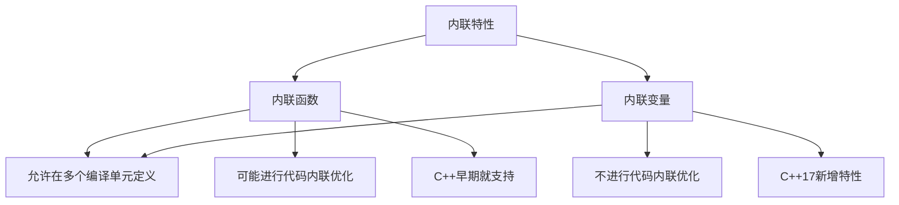

# C++ 17内联变量

## 简介

在C++17之前，我们可以使用内联函数（inline functions）来避免函数在多个编译单元中被重复定义时产生的链接错误。然而，对于变量，特别是在头文件中定义的全局变量或静态成员变量，则没有类似的机制。C++17引入了内联变量（inline variables）特性，允许我们在头文件中定义变量，而不必担心违反"一处定义原则"（One Definition Rule, ODR）导致的链接错误。

## 内联变量的基本概念

内联变量是使用`inline`关键字声明的变量，它告诉编译器可以在多个编译单元中有多个相同的定义，链接器会将这些定义合并为一个实例。这与内联函数的行为非常相似。

:::note 内联变量的特点
1. 可以在头文件中定义全局变量，而不会引起链接错误
2. 可以在类中直接定义静态成员变量，而不需要在源文件中再次定义
3. 所有内联变量的定义必须相同
:::

## 内联变量的基本用法

### 1. 在头文件中定义全局变量

在C++17之前，如果我们在头文件中定义全局变量，当这个头文件被多个源文件包含时，会导致链接错误。使用内联变量可以解决这个问题：

```cpp
// constants.h
#ifndef CONSTANTS_H
#define CONSTANTS_H

// 使用内联变量
inline const double PI = 3.14159265358979323846;
inline const double GRAVITY = 9.8;

#endif
```

现在，无论有多少个源文件包含这个头文件，链接器都会确保只有一个PI变量的实例。

### 2. 类内静态成员变量的定义

在C++17之前，静态成员变量必须在类外进行定义：

```cpp
// 旧方式
class MyClass {
public:
    static const int VALUE = 100; // 这只是声明，需要在实现文件中定义
    static const double RATE; // 非整型常量甚至不能在类内初始化
};

// 在.cpp文件中
const int MyClass::VALUE; // 即使已经在类内初始化，也需要定义
const double MyClass::RATE = 0.5;
```

使用内联变量后，可以直接在类内定义：

```cpp
// C++17新方式
class MyClass {
public:
    inline static const int VALUE = 100; // 无需在类外再定义
    inline static const double RATE = 0.5; // 可以在类内直接初始化任何类型
    
    // 甚至可以内联非常量静态变量
    inline static int counter = 0;
};
```

## 内联变量与模板

内联变量在模板编程中特别有用，可以简化模板变量的声明和定义：

```cpp
template <typename T>
struct TypeInfo {
    inline static const bool is_integral = std::is_integral<T>::value;
    inline static const char* name = typeid(T).name();
    inline static int count = 0; // 每种类型的实例计数
};

// 使用
void example() {
    TypeInfo<int>::count++;
    std::cout << "Is int integral: " << TypeInfo<int>::is_integral << std::endl;
    std::cout << "Type name: " << TypeInfo<int>::name << std::endl;
    std::cout << "Count: " << TypeInfo<int>::count << std::endl;
}
```

## 实际应用场景

### 配置常量管理

内联变量非常适合用于管理应用程序的配置常量：

```cpp
// config.h
#ifndef CONFIG_H
#define CONFIG_H

namespace app_config {
    inline const int MAX_CONNECTIONS = 100;
    inline const std::string DEFAULT_SERVER = "localhost";
    inline const int TIMEOUT_MS = 30000;
    
    // 甚至可以使用复杂类型
    inline const std::vector<std::string> ALLOWED_HOSTS = {"localhost", "127.0.0.1"};
}

#endif
```

这样，应用程序的所有部分都可以包含这个头文件并使用这些常量。

### 单例模式实现

内联变量让单例模式的实现变得更加简单：

```cpp
class Singleton {
private:
    Singleton() = default;
    
public:
    // 禁止复制和移动
    Singleton(const Singleton&) = delete;
    Singleton& operator=(const Singleton&) = delete;
    
    // 使用内联静态变量存储单例实例
    inline static Singleton instance{};
    
    void doSomething() {
        std::cout << "Singleton is doing something" << std::endl;
    }
};

// 使用
void example() {
    Singleton::instance.doSomething();
}
```

### 编译期常量和函数

结合constexpr和内联变量，可以创建编译期计算的常量：

```cpp
// 编译期计算阶乘
template<int N>
struct Factorial {
    inline static constexpr int value = N * Factorial<N-1>::value;
};

template<>
struct Factorial<0> {
    inline static constexpr int value = 1;
};

// 使用
void example() {
    constexpr int fact5 = Factorial<5>::value; // 在编译期计算5!
    std::cout << "5! = " << fact5 << std::endl; // 输出: 5! = 120
}
```

## 内联变量的注意事项

使用内联变量时，需要注意以下几点：

1. **定义一致性**: 所有编译单元中的内联变量定义必须完全相同，否则会导致未定义行为。

2. **可变内联变量**: 对于非const的内联变量，需要小心处理并发访问问题。

3. **内存和性能**: 内联关键字并不意味着变量会被"内联"到使用它的代码中，它仅表示该变量可以在多个编译单元中定义。

4. **调试难度**: 因为内联变量在所有编译单元中共享，追踪其值的变化可能会更加困难。

## 内联变量与内联函数的比较

内联变量和内联函数有相似之处，但也有区别：



## 总结

C++17的内联变量特性极大地简化了全局常量和静态成员变量的管理。它允许我们在头文件中直接定义这些变量，而不必担心链接错误。这个特性对于编写模块化、可维护的代码特别有用，尤其是在处理配置常量、单例模式和模板元编程时。

通过合理使用内联变量，我们可以:
- 减少代码冗余
- 提高代码的可维护性
- 简化静态成员变量的定义
- 更方便地实现模板元编程

## 练习

1. 创建一个使用内联变量的数学常量头文件，包含多种常用的数学常量（π, e等）。
2. 实现一个简单的日志类，使用内联静态变量来控制日志级别。
3. 尝试使用内联变量优化现有的单例模式实现。
4. 创建一个配置类，使用内联变量存储应用程序的各种配置项。

## 参考资源

- [C++17标准文档](https://www.iso.org/standard/68564.html)
- [C++17: The Complete Guide](https://leanpub.com/cpp17) by Nicolai M. Josuttis
- [cppreference - inline specifier](https://en.cppreference.com/w/cpp/language/inline)

通过掌握内联变量，你将能够编写更加简洁、模块化的C++代码，特别是在处理头文件和模板时。