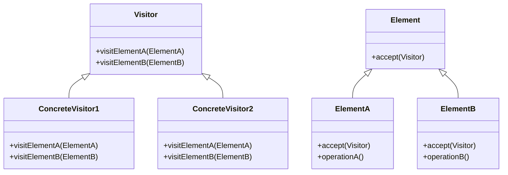

# C++ 访问者模式

## 介绍

访问者模式是一种行为型设计模式，它允许你在不修改类的情况下为类层次结构添加新的操作。这种模式的核心思想是将数据结构与操作分离，实现了"开放-封闭原则"（对扩展开放，对修改封闭）。

当你有一个稳定的对象结构，但经常需要添加新的操作时，访问者模式特别有用。它能够让你在不改变这些对象的类的前提下定义新的操作，这些操作会"访问"这些对象。

:::note
访问者模式是C++中较为高级的设计模式之一，需要对面向对象编程和多态有较好的理解。
:::

## 访问者模式的基本结构

访问者模式由以下几个关键组件组成：



1. **Visitor（访问者）**：声明了一组访问方法，每个方法对应于一种可访问的具体元素类型。
2. **ConcreteVisitor（具体访问者）**：实现了访问者接口中声明的方法，每个方法都定义了对一种具体元素的操作。
3. **Element（元素）**：定义了一个accept方法，接受访问者对象作为参数。
4. **ConcreteElement（具体元素）**：实现了accept方法，通常会调用访问者对应的访问方法。

## 访问者模式的实现

下面是一个简单的C++访问者模式实现：

```cpp
#include <iostream>
#include <vector>
#include <memory>

// 前向声明
class Circle;
class Square;
class Rectangle;

// 访问者接口
class Visitor {
public:
    virtual void visit(Circle* circle) = 0;
    virtual void visit(Square* square) = 0;
    virtual void visit(Rectangle* rectangle) = 0;
    virtual ~Visitor() {}
};

// 元素接口
class Shape {
public:
    virtual void accept(Visitor* visitor) = 0;
    virtual ~Shape() {}
};

// 具体元素类
class Circle : public Shape {
public:
    Circle(double radius) : radius_(radius) {}
    
    void accept(Visitor* visitor) override {
        visitor->visit(this);
    }
    
    double getRadius() const {
        return radius_;
    }
    
private:
    double radius_;
};

class Square : public Shape {
public:
    Square(double side) : side_(side) {}
    
    void accept(Visitor* visitor) override {
        visitor->visit(this);
    }
    
    double getSide() const {
        return side_;
    }
    
private:
    double side_;
};

class Rectangle : public Shape {
public:
    Rectangle(double width, double height) : width_(width), height_(height) {}
    
    void accept(Visitor* visitor) override {
        visitor->visit(this);
    }
    
    double getWidth() const {
        return width_;
    }
    
    double getHeight() const {
        return height_;
    }
    
private:
    double width_;
    double height_;
};

// 具体访问者类
class AreaCalculator : public Visitor {
public:
    void visit(Circle* circle) override {
        double area = 3.14159 * circle->getRadius() * circle->getRadius();
        std::cout << "Circle area: " << area << std::endl;
    }
    
    void visit(Square* square) override {
        double area = square->getSide() * square->getSide();
        std::cout << "Square area: " << area << std::endl;
    }
    
    void visit(Rectangle* rectangle) override {
        double area = rectangle->getWidth() * rectangle->getHeight();
        std::cout << "Rectangle area: " << area << std::endl;
    }
};

class PerimeterCalculator : public Visitor {
public:
    void visit(Circle* circle) override {
        double perimeter = 2 * 3.14159 * circle->getRadius();
        std::cout << "Circle perimeter: " << perimeter << std::endl;
    }
    
    void visit(Square* square) override {
        double perimeter = 4 * square->getSide();
        std::cout << "Square perimeter: " << perimeter << std::endl;
    }
    
    void visit(Rectangle* rectangle) override {
        double perimeter = 2 * (rectangle->getWidth() + rectangle->getHeight());
        std::cout << "Rectangle perimeter: " << perimeter << std::endl;
    }
};

int main() {
    std::vector<std::unique_ptr<Shape>> shapes;
    shapes.push_back(std::make_unique<Circle>(5.0));
    shapes.push_back(std::make_unique<Square>(4.0));
    shapes.push_back(std::make_unique<Rectangle>(3.0, 5.0));
    
    AreaCalculator areaCalc;
    PerimeterCalculator perimeterCalc;
    
    // 计算所有形状的面积
    std::cout << "Areas of shapes:" << std::endl;
    for (const auto& shape : shapes) {
        shape->accept(&areaCalc);
    }
    
    std::cout << "\nPerimeters of shapes:" << std::endl;
    // 计算所有形状的周长
    for (const auto& shape : shapes) {
        shape->accept(&perimeterCalc);
    }
    
    return 0;
}
```

程序输出：

```
Areas of shapes:
Circle area: 78.5398
Square area: 16
Rectangle area: 15

Perimeters of shapes:
Circle perimeter: 31.4159
Square perimeter: 16
Rectangle perimeter: 16
```

## 双分派（Double Dispatch）

访问者模式使用了一种称为"双分派"的技术，它是访问者模式的核心。双分派是指对方法的选择取决于两个对象的类型：

1. 被访问元素的类型（通过虚函数accept）
2. 访问者的类型（通过虚函数visit）

这种机制允许我们根据两个对象的具体类型调用正确的方法，而不需要使用大量的类型检查或条件分支。

:::tip
双分派是访问者模式的关键，它利用了C++的虚函数机制，使得程序能够根据元素和访问者的具体类型执行相应的操作。
:::

## 访问者模式的应用场景

访问者模式在以下场景中特别有用：

1. **当对象结构相对稳定，但需要经常添加新的操作**：例如，一个文档对象模型（DOM）树的结构确定，但可能需要对其执行不同的操作，如格式化、验证或转换。

2. **当操作需要在不相关的类上执行**：例如，一组不同的图形对象需要被绘制、移动或调整大小。

3. **当操作需要访问对象的内部状态**：访问者可以访问元素类的内部状态，但又不破坏其封装性。

4. **当需要在一组对象上执行一组不同的操作**：例如，在一个编译器中，语法树的结构是固定的，但可能需要执行多种不同的操作，如代码生成、类型检查、优化等。

## 实际案例：文档处理系统

以下是一个更复杂的实际应用场景示例，展示如何使用访问者模式构建一个简单的文档处理系统：

```cpp
#include <iostream>
#include <vector>
#include <memory>
#include <string>

// 前向声明
class TextElement;
class ImageElement;
class TableElement;

// 文档访问者接口
class DocumentVisitor {
public:
    virtual void visit(TextElement* text) = 0;
    virtual void visit(ImageElement* image) = 0;
    virtual void visit(TableElement* table) = 0;
    virtual ~DocumentVisitor() {}
};

// 文档元素接口
class DocumentElement {
public:
    virtual void accept(DocumentVisitor* visitor) = 0;
    virtual ~DocumentElement() {}
};

// 具体文档元素
class TextElement : public DocumentElement {
public:
    TextElement(const std::string& content) : content_(content) {}
    
    void accept(DocumentVisitor* visitor) override {
        visitor->visit(this);
    }
    
    std::string getContent() const {
        return content_;
    }
    
private:
    std::string content_;
};

class ImageElement : public DocumentElement {
public:
    ImageElement(const std::string& path, int width, int height) 
        : path_(path), width_(width), height_(height) {}
    
    void accept(DocumentVisitor* visitor) override {
        visitor->visit(this);
    }
    
    std::string getPath() const {
        return path_;
    }
    
    int getWidth() const {
        return width_;
    }
    
    int getHeight() const {
        return height_;
    }
    
private:
    std::string path_;
    int width_;
    int height_;
};

class TableElement : public DocumentElement {
public:
    TableElement(int rows, int cols) : rows_(rows), cols_(cols) {}
    
    void accept(DocumentVisitor* visitor) override {
        visitor->visit(this);
    }
    
    int getRows() const {
        return rows_;
    }
    
    int getCols() const {
        return cols_;
    }
    
private:
    int rows_;
    int cols_;
};

// 具体访问者：HTML导出器
class HTMLExportVisitor : public DocumentVisitor {
public:
    void visit(TextElement* text) override {
        std::cout << "<p>" << text->getContent() << "</p>" << std::endl;
    }
    
    void visit(ImageElement* image) override {
        std::cout << "getPath() << "\" width=\"" 
                  << image->getWidth() << "\" height=\"" << image->getHeight() 
                  << "\" />" << std::endl;
    }
    
    void visit(TableElement* table) override {
        std::cout << "<table>" << std::endl;
        for (int i = 0; i < table->getRows(); ++i) {
            std::cout << "  <tr>" << std::endl;
            for (int j = 0; j < table->getCols(); ++j) {
                std::cout << "    <td>Cell(" << i << "," << j << ")</td>" << std::endl;
            }
            std::cout << "  </tr>" << std::endl;
        }
        std::cout << "</table>" << std::endl;
    }
};

// 具体访问者：纯文本导出器
class PlainTextExportVisitor : public DocumentVisitor {
public:
    void visit(TextElement* text) override {
        std::cout << text->getContent() << std::endl << std::endl;
    }
    
    void visit(ImageElement* image) override {
        std::cout << "[Image: " << image->getPath() << ", " 
                  << image->getWidth() << "x" << image->getHeight() << "]" 
                  << std::endl << std::endl;
    }
    
    void visit(TableElement* table) override {
        std::cout << "Table (" << table->getRows() << "x" << table->getCols() << "):" << std::endl;
        for (int i = 0; i < table->getRows(); ++i) {
            for (int j = 0; j < table->getCols(); ++j) {
                std::cout << "Cell(" << i << "," << j << ")\t";
            }
            std::cout << std::endl;
        }
        std::cout << std::endl;
    }
};

// 文档类，包含多个元素
class Document {
public:
    void addElement(std::unique_ptr<DocumentElement> element) {
        elements_.push_back(std::move(element));
    }
    
    void accept(DocumentVisitor* visitor) {
        for (const auto& element : elements_) {
            element->accept(visitor);
        }
    }
    
private:
    std::vector<std::unique_ptr<DocumentElement>> elements_;
};

int main() {
    // 创建一个文档
    Document doc;
    
    // 添加各种元素
    doc.addElement(std::make_unique<TextElement>("这是一个示例文档。"));
    doc.addElement(std::make_unique<ImageElement>("image.jpg", 800, 600));
    doc.addElement(std::make_unique<TextElement>("下面是一个表格："));
    doc.addElement(std::make_unique<TableElement>(3, 4));
    
    // 创建不同的访问者
    HTMLExportVisitor htmlExporter;
    PlainTextExportVisitor plainTextExporter;
    
    // 使用HTML导出器
    std::cout << "HTML导出结果：" << std::endl;
    std::cout << "---------------------------" << std::endl;
    doc.accept(&htmlExporter);
    
    // 使用纯文本导出器
    std::cout << "\n纯文本导出结果：" << std::endl;
    std::cout << "---------------------------" << std::endl;
    doc.accept(&plainTextExporter);
    
    return 0;
}
```

程序输出：

```
HTML导出结果：
---------------------------
<p>这是一个示例文档。</p>

<p>下面是一个表格：</p>
<table>
  <tr>
    <td>Cell(0,0)</td>
    <td>Cell(0,1)</td>
    <td>Cell(0,2)</td>
    <td>Cell(0,3)</td>
  </tr>
  <tr>
    <td>Cell(1,0)</td>
    <td>Cell(1,1)</td>
    <td>Cell(1,2)</td>
    <td>Cell(1,3)</td>
  </tr>
  <tr>
    <td>Cell(2,0)</td>
    <td>Cell(2,1)</td>
    <td>Cell(2,2)</td>
    <td>Cell(2,3)</td>
  </tr>
</table>

纯文本导出结果：
---------------------------
这是一个示例文档。

[Image: image.jpg, 800x600]

下面是一个表格：

Table (3x4):
Cell(0,0)	Cell(0,1)	Cell(0,2)	Cell(0,3)	
Cell(1,0)	Cell(1,1)	Cell(1,2)	Cell(1,3)	
Cell(2,0)	Cell(2,1)	Cell(2,2)	Cell(2,3)	
```

## 访问者模式的优缺点

### 优点

1. **分离操作与对象结构**：访问者模式将操作从对象结构中分离出来，使得添加新操作变得容易。
2. **集中相关操作**：相关的操作可以集中在一个访问者类中，而不是分散在多个元素类中。
3. **添加新操作很简单**：只需要添加一个新的访问者类，而不需要修改现有的元素类。
4. **积累状态**：访问者可以在遍历元素时积累状态。

### 缺点

1. **添加新的具体元素类很困难**：每当添加新的具体元素类时，需要更新所有的访问者接口和实现。
2. **破坏封装性**：访问者通常需要访问元素的内部状态，这可能会破坏元素的封装性。
3. **复杂性**：访问者模式的实现相对复杂，初学者可能难以理解。

:::warning
访问者模式适用于元素类层次结构稳定且不经常变化的情况。如果元素结构经常变化，那么每次变化都需要修改所有访问者类，这会使代码难以维护。
:::

## 总结

访问者模式是一种强大的设计模式，它允许你将算法与对象结构分离，从而实现对类层次结构的扩展而不需要修改现有代码。通过使用双分派机制，访问者模式能够根据元素和访问者的具体类型执行正确的操作。

尽管访问者模式有其局限性，特别是当需要频繁添加新的元素类型时，但在适当的场景下，它能够提供清晰、灵活且可扩展的代码结构。

理解访问者模式需要对面向对象编程和多态有较好的认识，但掌握了这一模式会极大地丰富你的设计模式工具箱，使你能够更有效地处理复杂的类层次结构。

## 练习与资源

### 练习

1. 尝试扩展文档处理系统示例，添加一个新的文档元素类型（如LinkElement）和一个新的访问者（如PDFExportVisitor）。

2. 实现一个表示算术表达式的类层次结构（如Number、AddExpression、SubtractExpression等），然后使用访问者模式实现表达式求值和打印功能。

3. 思考：为什么在访问者模式中，我们使用了双分派技术而不是简单的instanceof检查（在C++中即RTTI，如dynamic_cast）？

### 附加资源

- 《Design Patterns: Elements of Reusable Object-Oriented Software》- Gang of Four (GoF)
- 《Modern C++ Design》- Andrei Alexandrescu
- [Refactoring.Guru - Visitor Pattern](https://refactoring.guru/design-patterns/visitor)
- [Source Making - Visitor Pattern](https://sourcemaking.com/design_patterns/visitor)

通过深入学习访问者模式，你将能够更好地理解面向对象设计的高级概念，并在适当的场景中应用这一强大的模式。