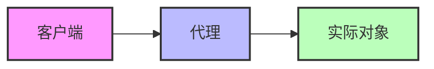

# C++ 代理模式

## 什么是代理模式？

代理模式是一种结构型设计模式，它允许你提供一个代理或占位符来控制对另一个对象的访问。代理对象充当原始对象的接口，客户端与代理交互，而代理则与实际对象交互。

简单来说，代理模式就像现实生活中的中介人，客户不直接与服务提供者交互，而是通过中介人进行沟通。



## 为什么需要代理模式？

代理模式在以下情况特别有用：

- **控制访问**：限制对原始对象的直接访问
- **延迟初始化**：推迟创建开销大的对象，直到真正需要时
- **添加功能**：在访问对象前后添加额外的操作
- **远程代理**：在不同地址空间中表示对象
- **保护代理**：控制对敏感原始对象的访问权限

## C++ 中代理模式的基本实现

让我们通过一个简单的例子来理解代理模式：

```cpp
#include <iostream>
#include <string>

// 抽象主题接口
class Subject {
public:
    virtual void request() = 0;
    virtual ~Subject() {}
};

// 真实主题类
class RealSubject : public Subject {
public:
    void request() override {
        std::cout << "RealSubject: 处理请求" << std::endl;
    }
};

// 代理类
class Proxy : public Subject {
private:
    RealSubject* realSubject;

public:
    Proxy() : realSubject(nullptr) {}

    ~Proxy() {
        delete realSubject;
    }

    void request() override {
        // 懒初始化 - 需要时才创建真实对象
        if (realSubject == nullptr) {
            std::cout << "Proxy: 创建并初始化真实主题对象" << std::endl;
            realSubject = new RealSubject();
        }
        
        std::cout << "Proxy: 在调用真实对象前的预处理" << std::endl;
        
        // 将请求委托给真实主题
        realSubject->request();
        
        std::cout << "Proxy: 在调用真实对象后的后处理" << std::endl;
    }
};

// 客户端代码
int main() {
    Subject* proxy = new Proxy();
    
    // 通过代理访问服务
    proxy->request();
    std::cout << "\n再次调用:\n";
    proxy->request();
    
    delete proxy;
    
    return 0;
}
```

**执行输出**:

```
Proxy: 创建并初始化真实主题对象
Proxy: 在调用真实对象前的预处理
RealSubject: 处理请求
Proxy: 在调用真实对象后的后处理

再次调用:
Proxy: 在调用真实对象前的预处理
RealSubject: 处理请求
Proxy: 在调用真实对象后的后处理
```

在这个例子中：
1. 我们定义了一个抽象接口 `Subject`，声明了 `request()` 方法
2. `RealSubject` 是真实的服务提供者
3. `Proxy` 持有对 `RealSubject` 的引用并实现相同的接口
4. 当 `request()` 被调用时，代理添加一些行为并将请求转发给真实对象

## 代理模式的常见类型

### 1. 虚拟代理 (Virtual Proxy)

虚拟代理用于延迟创建开销较大的对象，直到真正需要它为止。上面的示例就是一个虚拟代理的例子。

### 2. 保护代理 (Protection Proxy)

保护代理控制对敏感原始对象的访问权限，例如基于访问权限检查。

```cpp
#include <iostream>
#include <string>

class Internet {
public:
    virtual void connectTo(const std::string& serverHost) = 0;
    virtual ~Internet() {}
};

class RealInternet : public Internet {
public:
    void connectTo(const std::string& serverHost) override {
        std::cout << "连接到 " << serverHost << std::endl;
    }
};

class ProxyInternet : public Internet {
private:
    RealInternet* internet;
    std::vector<std::string> bannedSites;

public:
    ProxyInternet() : internet(new RealInternet()) {
        bannedSites = {"banned.com", "illegal.org", "unsafe.net"};
    }

    ~ProxyInternet() {
        delete internet;
    }

    void connectTo(const std::string& serverHost) override {
        // 检查访问权限
        for (const auto& site : bannedSites) {
            if (serverHost == site) {
                std::cout << "访问被拒绝: " << serverHost << " 在黑名单上" << std::endl;
                return;
            }
        }
        
        internet->connectTo(serverHost);
    }
};

int main() {
    Internet* internet = new ProxyInternet();
    
    internet->connectTo("google.com");      // 允许
    internet->connectTo("banned.com");      // 拒绝
    internet->connectTo("github.com");      // 允许
    internet->connectTo("illegal.org");     // 拒绝
    
    delete internet;
    
    return 0;
}
```

**执行输出**:

```
连接到 google.com
访问被拒绝: banned.com 在黑名单上
连接到 github.com
访问被拒绝: illegal.org 在黑名单上
```

### 3. 远程代理 (Remote Proxy)

远程代理提供本地代表，代表位于不同地址空间中的对象。这在分布式系统中很常见。

### 4. 智能引用 (Smart Reference)

智能引用在访问对象时执行额外的操作，例如引用计数或线程安全检查。

## 实际应用场景

### 图像加载器

一个常见的代理模式应用是图像加载器，它可以显示占位符，并在后台加载实际图像：

```cpp
#include <iostream>
#include <string>
#include <thread>
#include <chrono>

// 图像抽象接口
class Image {
public:
    virtual void display() = 0;
    virtual ~Image() {}
};

// 真实图像类
class RealImage : public Image {
private:
    std::string filename;

    void loadFromDisk() {
        std::cout << "加载图像: " << filename << std::endl;
        // 模拟图像加载的耗时操作
        std::this_thread::sleep_for(std::chrono::seconds(2));
    }

public:
    RealImage(const std::string& filename) : filename(filename) {
        loadFromDisk();
    }

    void display() override {
        std::cout << "显示图像: " << filename << std::endl;
    }
};

// 图像代理
class ProxyImage : public Image {
private:
    std::string filename;
    RealImage* realImage;

public:
    ProxyImage(const std::string& filename) : filename(filename), realImage(nullptr) {}

    ~ProxyImage() {
        delete realImage;
    }

    void display() override {
        if (realImage == nullptr) {
            std::cout << "显示占位符，图像正在加载中..." << std::endl;
            realImage = new RealImage(filename);
        }
        realImage->display();
    }
};

int main() {
    // 使用代理创建图像
    Image* image1 = new ProxyImage("photo1.jpg");
    Image* image2 = new ProxyImage("photo2.jpg");

    // 首次加载和显示图像1（会加载图像）
    std::cout << "首次显示图像1：" << std::endl;
    image1->display();
    
    // 再次显示图像1（不会再次加载）
    std::cout << "\n再次显示图像1：" << std::endl;
    image1->display();
    
    // 显示图像2（会加载图像）
    std::cout << "\n首次显示图像2：" << std::endl;
    image2->display();
    
    delete image1;
    delete image2;

    return 0;
}
```

**执行输出**:

```
首次显示图像1：
显示占位符，图像正在加载中...
加载图像: photo1.jpg
显示图像: photo1.jpg

再次显示图像1：
显示图像: photo1.jpg

首次显示图像2：
显示占位符，图像正在加载中...
加载图像: photo2.jpg
显示图像: photo2.jpg
```

### 数据库连接池

使用代理模式实现数据库连接池，以管理数据库连接的获取和释放：

```cpp
#include <iostream>
#include <vector>
#include <string>

// 数据库连接接口
class DBConnection {
public:
    virtual void executeQuery(const std::string& query) = 0;
    virtual ~DBConnection() {}
};

// 真实数据库连接
class RealDBConnection : public DBConnection {
private:
    std::string connectionString;
    
public:
    RealDBConnection(const std::string& connStr) : connectionString(connStr) {
        std::cout << "创建到 " << connectionString << " 的数据库连接" << std::endl;
    }
    
    ~RealDBConnection() {
        std::cout << "关闭到 " << connectionString << " 的数据库连接" << std::endl;
    }
    
    void executeQuery(const std::string& query) override {
        std::cout << "在 " << connectionString << " 上执行: " << query << std::endl;
    }
};

// 数据库连接池
class DBConnectionPool {
private:
    std::vector<RealDBConnection*> availableConnections;
    std::vector<RealDBConnection*> usedConnections;
    std::string connectionString;
    
public:
    DBConnectionPool(const std::string& connStr, int poolSize) : connectionString(connStr) {
        for (int i = 0; i < poolSize; i++) {
            availableConnections.push_back(new RealDBConnection(connectionString));
        }
    }
    
    ~DBConnectionPool() {
        // 清理所有连接
        for (auto conn : availableConnections) {
            delete conn;
        }
        for (auto conn : usedConnections) {
            delete conn;
        }
    }
    
    RealDBConnection* getConnection() {
        if (availableConnections.empty()) {
            std::cout << "警告: 连接池空, 创建新连接" << std::endl;
            return new RealDBConnection(connectionString);
        }
        
        RealDBConnection* conn = availableConnections.back();
        availableConnections.pop_back();
        usedConnections.push_back(conn);
        return conn;
    }
    
    void releaseConnection(RealDBConnection* conn) {
        for (auto it = usedConnections.begin(); it != usedConnections.end(); ++it) {
            if (*it == conn) {
                usedConnections.erase(it);
                availableConnections.push_back(conn);
                std::cout << "连接返回到池中" << std::endl;
                return;
            }
        }
    }
};

// 数据库连接代理
class DBConnectionProxy : public DBConnection {
private:
    DBConnectionPool* pool;
    RealDBConnection* connection;
    
public:
    DBConnectionProxy(DBConnectionPool* pool) : pool(pool), connection(nullptr) {}
    
    ~DBConnectionProxy() {
        if (connection) {
            pool->releaseConnection(connection);
        }
    }
    
    void executeQuery(const std::string& query) override {
        if (!connection) {
            connection = pool->getConnection();
        }
        connection->executeQuery(query);
    }
};

int main() {
    // 创建连接池，初始有2个连接
    DBConnectionPool* pool = new DBConnectionPool("mysql://localhost:3306/mydb", 2);
    
    // 使用代理访问数据库
    DBConnection* proxy1 = new DBConnectionProxy(pool);
    DBConnection* proxy2 = new DBConnectionProxy(pool);
    
    proxy1->executeQuery("SELECT * FROM users");
    proxy2->executeQuery("SELECT * FROM products");
    
    // 释放代理将自动归还连接到池
    delete proxy1;
    delete proxy2;
    
    // 再次使用连接池
    DBConnection* proxy3 = new DBConnectionProxy(pool);
    proxy3->executeQuery("UPDATE users SET age = 30 WHERE id = 1");
    delete proxy3;
    
    // 清理资源
    delete pool;
    
    return 0;
}
```

## 代理模式与其他模式的关系

- **装饰器模式**：两者结构类似，但意图不同。装饰器为对象添加新行为，而代理控制对对象的访问。
- **适配器模式**：适配器提供不同的接口，而代理提供相同的接口。
- **外观模式**：外观定义全新的接口，而代理保持相同接口。

## 代理模式的优缺点

### 优点
- 在客户端无感知的情况下控制服务对象
- 支持开闭原则，可以在不改变服务或客户端的情况下引入新代理
- 可以管理服务对象的生命周期
- 延迟加载提高性能

### 缺点
- 代码可能会变得更加复杂
- 服务的响应可能会延迟
- 在某些模式实现中，需要额外创建许多类，增加代码复杂度

## 总结

代理模式是一种强大的设计模式，它允许你控制对对象的访问，同时保持接口的统一性。在C++中，代理模式有多种形式，包括虚拟代理、保护代理、远程代理和智能引用。

代理模式适用于以下场景：
- 需要延迟初始化对象
- 需要访问控制
- 需要在访问对象前后添加行为
- 需要管理资源生命周期

熟练运用代理模式可以让你的代码更加模块化、可维护，并能解决多种复杂问题。

## 练习

1. 实现一个智能指针代理，它能跟踪对象的引用计数。
2. 创建一个远程代理，它可以通过网络调用远程服务。
3. 实现一个缓存代理，它可以缓存计算结果，避免重复计算。
4. 编写一个日志代理，它可以记录所有对服务对象的调用。

:::tip
代理模式是一种非常实用的设计模式，在大型项目中经常会用到。掌握它将帮助你编写更加健壮和可维护的代码。
:::

## 资源推荐

- 《设计模式：可复用面向对象软件的基础》- GoF
- 《Modern C++ Design》- Andrei Alexandrescu
- 《Head First 设计模式》- 更加通俗易懂的设计模式入门书籍