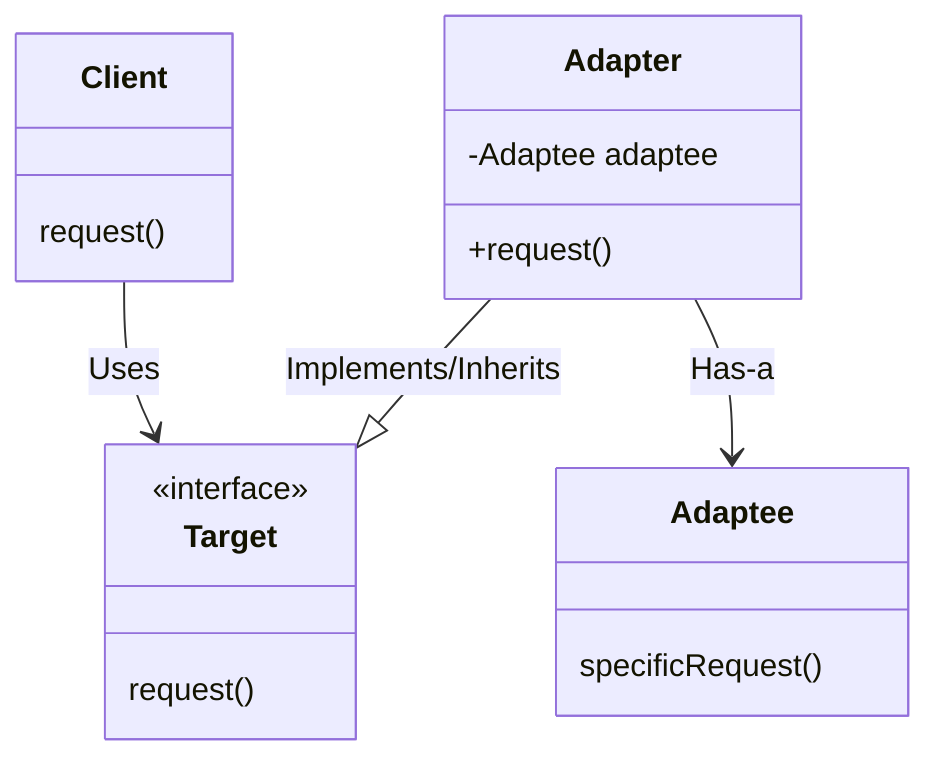

# C++ 适配器模式

## 什么是适配器模式？

适配器模式（Adapter Pattern）是一种结构型设计模式，它允许不兼容的接口能够在一起工作。适配器模式的核心思想是在两个不兼容的接口之间添加一个"转换器"，使原本不能一起工作的类能够协同工作。

:::note 生活中的例子
想象一下国际旅行时带的电源适配器：你的设备（如笔记本）有一种插头，但目的地国家的电源插座是另一种规格。电源适配器允许你的设备在不同规格的插座上使用。
:::

在软件设计中，当你需要使用一个现有的类，但其接口与你的需求不匹配时，适配器模式就派上了用场。

## 适配器模式的类型

在C++中，适配器模式主要有两种实现方式：

1. **类适配器**：使用多重继承实现
2. **对象适配器**：使用组合实现

## 适配器模式的结构



## 对象适配器实现示例

让我们通过一个简单的示例来理解适配器模式：

假设我们有一个旧的计算器系统，它可以执行基本的数学运算，但我们需要它支持科学计算功能。

```cpp
// 旧的计算器系统（不能修改）
class OldCalculator {
public:
    double add(double a, double b) {
        return a + b;
    }
    
    double subtract(double a, double b) {
        return a - b;
    }
};

// 目标接口：我们想要的科学计算器接口
class ScientificCalculator {
public:
    virtual double add(double a, double b) = 0;
    virtual double subtract(double a, double b) = 0;
    virtual double multiply(double a, double b) = 0;
    virtual double divide(double a, double b) = 0;
    virtual double power(double base, double exponent) = 0;
    virtual ~ScientificCalculator() {}
};

// 适配器类：将OldCalculator适配到ScientificCalculator接口
class CalculatorAdapter : public ScientificCalculator {
private:
    OldCalculator oldCalc;
    
public:
    double add(double a, double b) override {
        return oldCalc.add(a, b);
    }
    
    double subtract(double a, double b) override {
        return oldCalc.subtract(a, b);
    }
    
    double multiply(double a, double b) override {
        // 使用加法实现乘法（简化示例）
        double result = 0;
        for (int i = 0; i < b; i++) {
            result = oldCalc.add(result, a);
        }
        return result;
    }
    
    double divide(double a, double b) override {
        // 使用减法实现除法（简化示例）
        if (b == 0) return INFINITY;
        double result = a;
        int count = 0;
        while (result >= b) {
            result = oldCalc.subtract(result, b);
            count++;
        }
        return count;
    }
    
    double power(double base, double exponent) override {
        // 使用乘法实现幂运算（简化示例）
        double result = 1.0;
        for (int i = 0; i < exponent; i++) {
            result = multiply(result, base);
        }
        return result;
    }
};
```

### 使用适配器

```cpp
#include <iostream>

int main() {
    ScientificCalculator* calculator = new CalculatorAdapter();
    
    std::cout << "加法: " << calculator->add(5, 3) << std::endl;
    std::cout << "减法: " << calculator->subtract(5, 3) << std::endl;
    std::cout << "乘法: " << calculator->multiply(5, 3) << std::endl;
    std::cout << "除法: " << calculator->divide(15, 3) << std::endl;
    std::cout << "幂运算: " << calculator->power(2, 3) << std::endl;
    
    delete calculator;
    return 0;
}
```

### 输出结果

```
加法: 8
减法: 2
乘法: 15
除法: 5
幂运算: 8
```

## 类适配器实现示例

类适配器使用多重继承实现。在C++中，我们可以继承目标接口和被适配的类：

```cpp
// 类适配器实现
class ClassCalculatorAdapter : 
    public ScientificCalculator,     // 继承目标接口
    private OldCalculator            // 私有继承被适配类
{
public:
    double add(double a, double b) override {
        // 直接调用基类方法
        return OldCalculator::add(a, b);
    }
    
    double subtract(double a, double b) override {
        // 直接调用基类方法
        return OldCalculator::subtract(a, b);
    }
    
    double multiply(double a, double b) override {
        // 使用基类方法实现
        double result = 0;
        for (int i = 0; i < b; i++) {
            result = OldCalculator::add(result, a);
        }
        return result;
    }
    
    double divide(double a, double b) override {
        // 实现同上
        if (b == 0) return INFINITY;
        double result = a;
        int count = 0;
        while (result >= b) {
            result = OldCalculator::subtract(result, b);
            count++;
        }
        return count;
    }
    
    double power(double base, double exponent) override {
        // 实现同上
        double result = 1.0;
        for (int i = 0; i < exponent; i++) {
            result = multiply(result, base);
        }
        return result;
    }
};
```

## 现实世界中的适配器模式应用

### 1. 图形库适配

假设你的项目使用了第三方图形库A，但现在你想切换到功能更强大的图形库B。你可以创建一个适配器类，让新代码通过统一的接口与任意一个图形库交互。

```cpp
// 第三方图形库A
class GraphicsLibraryA {
public:
    void drawRectangle(int x, int y, int width, int height) {
        std::cout << "GraphicsLibraryA: 绘制矩形 在(" << x << "," << y << ") 宽度=" 
                  << width << " 高度=" << height << std::endl;
    }
    
    void drawCircle(int x, int y, int radius) {
        std::cout << "GraphicsLibraryA: 绘制圆形 在(" << x << "," << y << ") 半径=" 
                  << radius << std::endl;
    }
};

// 第三方图形库B
class GraphicsLibraryB {
public:
    void drawRectangleB(int topLeftX, int topLeftY, int bottomRightX, int bottomRightY) {
        std::cout << "GraphicsLibraryB: 绘制矩形 左上角(" << topLeftX << "," << topLeftY 
                  << ") 右下角(" << bottomRightX << "," << bottomRightY << ")" << std::endl;
    }
    
    void drawCircleB(int centerX, int centerY, int radius) {
        std::cout << "GraphicsLibraryB: 绘制圆形 中心点(" << centerX << "," << centerY 
                  << ") 半径=" << radius << std::endl;
    }
};

// 统一的图形接口
class GraphicsInterface {
public:
    virtual void drawRectangle(int x, int y, int width, int height) = 0;
    virtual void drawCircle(int x, int y, int radius) = 0;
    virtual ~GraphicsInterface() {}
};

// 图形库A的适配器
class GraphicsLibraryAAdapter : public GraphicsInterface {
private:
    GraphicsLibraryA libA;
    
public:
    void drawRectangle(int x, int y, int width, int height) override {
        libA.drawRectangle(x, y, width, height);
    }
    
    void drawCircle(int x, int y, int radius) override {
        libA.drawCircle(x, y, radius);
    }
};

// 图形库B的适配器
class GraphicsLibraryBAdapter : public GraphicsInterface {
private:
    GraphicsLibraryB libB;
    
public:
    void drawRectangle(int x, int y, int width, int height) override {
        // 转换坐标格式
        libB.drawRectangleB(x, y, x + width, y + height);
    }
    
    void drawCircle(int x, int y, int radius) override {
        libB.drawCircleB(x, y, radius);
    }
};
```

使用示例：

```cpp
// 应用程序代码
void drawShapes(GraphicsInterface& graphics) {
    graphics.drawRectangle(10, 10, 100, 50);
    graphics.drawCircle(50, 50, 25);
}

int main() {
    GraphicsLibraryAAdapter adapterA;
    GraphicsLibraryBAdapter adapterB;
    
    std::cout << "使用图形库A:" << std::endl;
    drawShapes(adapterA);
    
    std::cout << "\n使用图形库B:" << std::endl;
    drawShapes(adapterB);
    
    return 0;
}
```

### 2. 数据转换适配器

假设你有一个数据分析系统，需要处理各种格式的数据（XML、JSON、CSV等）：

```cpp
// 简化的示例代码
class DataAnalyzer {
public:
    void analyze(std::vector<std::pair<std::string, double>> data) {
        // 分析数据的代码
        std::cout << "分析 " << data.size() << " 条数据记录" << std::endl;
        for (const auto& item : data) {
            std::cout << "键: " << item.first << ", 值: " << item.second << std::endl;
        }
    }
};

// 数据源接口
class DataSource {
public:
    virtual std::vector<std::pair<std::string, double>> getData() = 0;
    virtual ~DataSource() {}
};

// XML数据源
class XMLDataSource {
public:
    std::string getXMLData() {
        // 假设这返回XML格式的数据
        return "<data><item><key>apple</key><value>2.5</value></item><item><key>orange</key><value>3.0</value></item></data>";
    }
};

// XML适配器
class XMLDataAdapter : public DataSource {
private:
    XMLDataSource xmlSource;
    
public:
    std::vector<std::pair<std::string, double>> getData() override {
        std::string xml = xmlSource.getXMLData();
        std::vector<std::pair<std::string, double>> result;
        
        // 这里应该有XML解析代码，简化版本：
        result.push_back({"apple", 2.5});
        result.push_back({"orange", 3.0});
        
        return result;
    }
};

// JSON数据源
class JSONDataSource {
public:
    std::string getJSONData() {
        // 假设这返回JSON格式的数据
        return "{\"items\": [{\"key\":\"banana\", \"value\":1.2}, {\"key\":\"grape\", \"value\":4.5}]}";
    }
};

// JSON适配器
class JSONDataAdapter : public DataSource {
private:
    JSONDataSource jsonSource;
    
public:
    std::vector<std::pair<std::string, double>> getData() override {
        std::string json = jsonSource.getJSONData();
        std::vector<std::pair<std::string, double>> result;
        
        // 这里应该有JSON解析代码，简化版本：
        result.push_back({"banana", 1.2});
        result.push_back({"grape", 4.5});
        
        return result;
    }
};
```

使用示例：

```cpp
int main() {
    DataAnalyzer analyzer;
    
    // 使用XML数据源
    XMLDataAdapter xmlAdapter;
    std::cout << "从XML数据源分析:" << std::endl;
    analyzer.analyze(xmlAdapter.getData());
    
    // 使用JSON数据源
    JSONDataAdapter jsonAdapter;
    std::cout << "\n从JSON数据源分析:" << std::endl;
    analyzer.analyze(jsonAdapter.getData());
    
    return 0;
}
```

## 适配器模式的优缺点

### 优点

1. **复用已有代码**：可以利用现有类的实现而不需要修改其代码
2. **增加类的透明性**：将实现和抽象分离
3. **提高代码的复用性**：一个适配器可以服务于多个被适配对象
4. **增加系统的灵活性**：可以让不兼容的类一起工作

### 缺点

1. **增加复杂性**：引入额外的适配器类会增加系统的复杂性
2. **不支持所有可能的转换**：在某些情况下，接口差异过大时适配可能不完全
3. **效率损失**：可能因为额外的适配层导致性能下降

## 适配器模式与其他设计模式的关系

- **桥接模式**：两者都是为了将抽象与实现分离。但桥接模式是在设计之初就考虑的，而适配器是为了解决已有系统的兼容问题。
- **装饰器模式**：装饰器添加功能而不改变接口，适配器改变接口以匹配客户端的期望。
- **代理模式**：代理为对象提供替身，适配器为不兼容的对象提供不同的接口。

## 总结

适配器模式是一种强大的结构型设计模式，它解决了不兼容接口之间的协作问题。通过创建一个"中间人"适配器类，你可以使原本不能一起工作的类能够协同工作。

在C++中，适配器模式通常有两种实现方式：
1. **类适配器**：使用多重继承
2. **对象适配器**：使用组合（更常用）

适配器模式在实际开发中非常有用，尤其是在以下情况：
- 集成第三方库或旧系统
- 系统重构时需要兼容旧接口
- 需要使用现有的类，但其接口与需求不匹配

## 练习

1. 创建一个适配器，将一个列表（List）接口适配为栈（Stack）接口。
2. 实现一个适配器，使得旧版文件I/O接口与新版的流式I/O接口兼容。
3. 设计一个适配器，将传统的迭代器适配为C++11的范围迭代器。

## 扩展阅读

- 《设计模式：可复用面向对象软件的基础》by Erich Gamma等人（"四人帮"）
- C++标准库中的适配器：`std::stack`, `std::queue`, `std::priority_queue`
- C++标准库的迭代器适配器：`std::reverse_iterator`, `std::back_inserter`

:::tip 实践提示
当面临接口不匹配问题时，先考虑是否可以修改现有代码。如果无法修改（如使用第三方库），再考虑使用适配器模式。选择对象适配器通常更灵活，因为它不需要多重继承。
:::