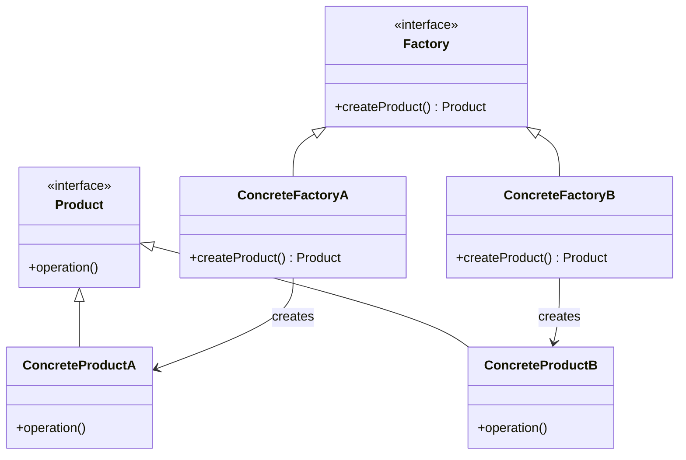
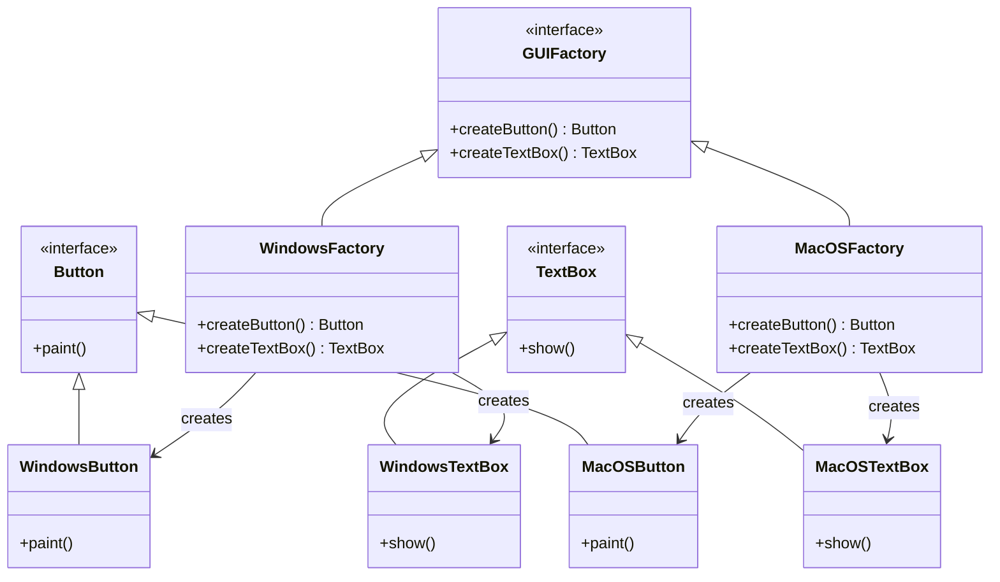

# C++ 工厂模式

## 什么是工厂模式？

工厂模式是一种创建型设计模式，它提供了一种创建对象的最佳方式。在工厂模式中，我们在创建对象时不会对客户端暴露创建逻辑，而是通过使用一个共同的接口来指向新创建的对象。这种模式属于创建型模式，它提供了一种创建对象的方式，而无需指定将要创建的对象的确切类。

:::tip
工厂模式非常适合当你需要根据不同条件创建不同类型的对象，但希望使用统一接口处理这些对象时使用。
:::

## 为什么需要工厂模式？

在面向对象编程中，创建对象通常是通过 `new` 关键字直接实例化一个类来完成的。但在某些复杂场景下，直接实例化可能带来以下问题：

1. **耦合性增加**：客户端代码与具体类紧密耦合
2. **可维护性降低**：每次添加新类型都需要修改客户端代码
3. **代码重复**：创建对象的逻辑可能在多处重复
4. **对象创建与使用逻辑混杂**：不符合单一职责原则

工厂模式通过引入一个工厂类来解决这些问题，将对象的创建与使用分离，提高了代码的可维护性和灵活性。

## 工厂模式的类型

在C++中，工厂模式主要有以下三种实现方式：

1. **简单工厂模式**：通过一个工厂类根据传入的参数决定创建出哪一种产品类的实例
2. **工厂方法模式**：定义一个创建对象的接口，但由子类决定实例化的类是哪一个
3. **抽象工厂模式**：提供一个创建一系列相关或相互依赖对象的接口，而无需指定它们具体的类

下面我们将逐一介绍这三种模式。

## 简单工厂模式

简单工厂模式是最基础的工厂模式，它通过一个工厂类根据传入的参数来创建不同的产品对象。

### 代码示例

```cpp
#include <iostream>
#include <memory>
#include <string>

// 产品接口
class Product {
public:
    virtual ~Product() = default;
    virtual void operation() = 0;
};

// 具体产品A
class ConcreteProductA : public Product {
public:
    void operation() override {
        std::cout << "ConcreteProductA operation" << std::endl;
    }
};

// 具体产品B
class ConcreteProductB : public Product {
public:
    void operation() override {
        std::cout << "ConcreteProductB operation" << std::endl;
    }
};

// 简单工厂
class SimpleFactory {
public:
    // 根据类型创建产品
    static std::unique_ptr<Product> createProduct(const std::string& type) {
        if (type == "A") {
            return std::make_unique<ConcreteProductA>();
        } else if (type == "B") {
            return std::make_unique<ConcreteProductB>();
        }
        return nullptr;
    }
};

// 客户端代码
int main() {
    // 使用工厂创建产品A
    auto productA = SimpleFactory::createProduct("A");
    if (productA) {
        productA->operation();  // 输出: ConcreteProductA operation
    }
    
    // 使用工厂创建产品B
    auto productB = SimpleFactory::createProduct("B");
    if (productB) {
        productB->operation();  // 输出: ConcreteProductB operation
    }
    
    return 0;
}
```

### 输出结果

```
ConcreteProductA operation
ConcreteProductB operation
```

### 简单工厂模式的优缺点

**优点：**
- 客户端与具体产品类解耦
- 集中管理对象的创建逻辑
- 客户端无需了解具体产品类的实现细节

**缺点：**
- 工厂类职责过重，违反单一职责原则
- 添加新产品需要修改工厂类代码，违反开闭原则
- 工厂类中包含了所有产品创建逻辑，不易于维护

## 工厂方法模式

工厂方法模式通过定义一个用于创建对象的接口，让子类决定实例化哪一个类。工厂方法使一个类的实例化延迟到其子类。

### 代码示例

```cpp
#include <iostream>
#include <memory>
#include <string>

// 产品接口
class Product {
public:
    virtual ~Product() = default;
    virtual void operation() = 0;
};

// 具体产品A
class ConcreteProductA : public Product {
public:
    void operation() override {
        std::cout << "ConcreteProductA operation" << std::endl;
    }
};

// 具体产品B
class ConcreteProductB : public Product {
public:
    void operation() override {
        std::cout << "ConcreteProductB operation" << std::endl;
    }
};

// 工厂接口
class Factory {
public:
    virtual ~Factory() = default;
    virtual std::unique_ptr<Product> createProduct() = 0;
};

// 具体工厂A，创建产品A
class ConcreteFactoryA : public Factory {
public:
    std::unique_ptr<Product> createProduct() override {
        return std::make_unique<ConcreteProductA>();
    }
};

// 具体工厂B，创建产品B
class ConcreteFactoryB : public Factory {
public:
    std::unique_ptr<Product> createProduct() override {
        return std::make_unique<ConcreteProductB>();
    }
};

// 客户端代码
int main() {
    // 使用工厂A创建产品
    ConcreteFactoryA factoryA;
    auto productA = factoryA.createProduct();
    productA->operation();  // 输出: ConcreteProductA operation
    
    // 使用工厂B创建产品
    ConcreteFactoryB factoryB;
    auto productB = factoryB.createProduct();
    productB->operation();  // 输出: ConcreteProductB operation
    
    return 0;
}
```

### 输出结果

```
ConcreteProductA operation
ConcreteProductB operation
```

### 工厂方法模式的类图



### 工厂方法模式的优缺点

**优点：**
- 符合开闭原则，添加新产品只需添加新的工厂类而无需修改现有代码
- 符合单一职责原则，每个工厂类只负责创建对应的产品
- 客户端代码只需要与抽象产品和抽象工厂交互，实现了更好的解耦

**缺点：**
- 类的数量增加，每增加一个产品就需要增加一个工厂类，导致系统复杂度增加
- 引入了抽象层，增加了系统的抽象性和理解难度

## 抽象工厂模式

抽象工厂模式提供一个创建一系列相关或相互依赖对象的接口，而无需指定它们具体的类。当系统需要一组相关的产品时，抽象工厂模式特别有用。

### 代码示例

```cpp
#include <iostream>
#include <memory>
#include <string>

// 按钮接口
class Button {
public:
    virtual ~Button() = default;
    virtual void paint() = 0;
};

// 文本框接口
class TextBox {
public:
    virtual ~TextBox() = default;
    virtual void show() = 0;
};

// Windows按钮
class WindowsButton : public Button {
public:
    void paint() override {
        std::cout << "Rendering a Windows style button." << std::endl;
    }
};

// macOS按钮
class MacOSButton : public Button {
public:
    void paint() override {
        std::cout << "Rendering a macOS style button." << std::endl;
    }
};

// Windows文本框
class WindowsTextBox : public TextBox {
public:
    void show() override {
        std::cout << "Displaying a Windows style text box." << std::endl;
    }
};

// macOS文本框
class MacOSTextBox : public TextBox {
public:
    void show() override {
        std::cout << "Displaying a macOS style text box." << std::endl;
    }
};

// GUI工厂接口
class GUIFactory {
public:
    virtual ~GUIFactory() = default;
    virtual std::unique_ptr<Button> createButton() = 0;
    virtual std::unique_ptr<TextBox> createTextBox() = 0;
};

// Windows GUI工厂
class WindowsFactory : public GUIFactory {
public:
    std::unique_ptr<Button> createButton() override {
        return std::make_unique<WindowsButton>();
    }
    
    std::unique_ptr<TextBox> createTextBox() override {
        return std::make_unique<WindowsTextBox>();
    }
};

// macOS GUI工厂
class MacOSFactory : public GUIFactory {
public:
    std::unique_ptr<Button> createButton() override {
        return std::make_unique<MacOSButton>();
    }
    
    std::unique_ptr<TextBox> createTextBox() override {
        return std::make_unique<MacOSTextBox>();
    }
};

// 应用程序类
class Application {
private:
    std::unique_ptr<Button> button;
    std::unique_ptr<TextBox> textBox;
    
public:
    Application(GUIFactory& factory) {
        button = factory.createButton();
        textBox = factory.createTextBox();
    }
    
    void render() {
        button->paint();
        textBox->show();
    }
};

// 客户端代码
int main() {
    // 创建Windows风格的GUI
    std::cout << "Creating Windows UI:" << std::endl;
    WindowsFactory windowsFactory;
    Application windowsApp(windowsFactory);
    windowsApp.render();
    
    std::cout << "\nCreating macOS UI:" << std::endl;
    MacOSFactory macFactory;
    Application macApp(macFactory);
    macApp.render();
    
    return 0;
}
```

### 输出结果

```
Creating Windows UI:
Rendering a Windows style button.
Displaying a Windows style text box.

Creating macOS UI:
Rendering a macOS style button.
Displaying a macOS style text box.
```

### 抽象工厂模式的类图



### 抽象工厂模式的优缺点

**优点：**
- 保证了一系列相关产品的一致性
- 隔离了具体类的创建，使得客户端与这些类的实现解耦
- 当多个产品需要一起工作时，它能确保客户端使用的产品都来自同一个产品族

**缺点：**
- 扩展新产品族很困难，需要修改抽象工厂的接口
- 系统结构较为复杂，增加了理解和实现的难度
- 产品族的概念不易理解

## 工厂模式的实际应用场景

工厂模式在实际开发中有广泛的应用，以下是一些常见场景：

1. **GUI框架**：不同操作系统需要不同风格的UI组件，可以使用抽象工厂模式来创建跨平台GUI组件

2. **数据库访问**：在应用程序中支持多种数据库（MySQL、PostgreSQL、SQLite等），可以使用工厂模式创建不同的数据库连接器

```cpp
// 数据库连接器接口
class DBConnector {
public:
    virtual ~DBConnector() = default;
    virtual void connect() = 0;
    virtual void executeQuery(const std::string& query) = 0;
    virtual void disconnect() = 0;
};

// MySQL连接器
class MySQLConnector : public DBConnector {
    // 实现...
};

// PostgreSQL连接器
class PostgreSQLConnector : public DBConnector {
    // 实现...
};

// 数据库连接器工厂
class DBConnectorFactory {
public:
    static std::unique_ptr<DBConnector> createConnector(const std::string& dbType) {
        if (dbType == "MySQL") {
            return std::make_unique<MySQLConnector>();
        } else if (dbType == "PostgreSQL") {
            return std::make_unique<PostgreSQLConnector>();
        }
        return nullptr;
    }
};
```

3. **文档生成器**：生成不同格式的文档（PDF、HTML、Markdown）

4. **游戏开发**：创建不同类型的游戏角色、怪物或物品

5. **插件系统**：加载不同的插件并创建相应的实例

## 使用工厂模式的最佳实践

1. **选择合适的工厂模式**
   - 简单工厂：适用于产品类型较少且相对稳定的场景
   - 工厂方法：适用于产品类型可能频繁变化的场景
   - 抽象工厂：适用于需要一组相关产品的场景

2. **使用接口或抽象类定义产品**
   - 确保所有具体产品类都实现相同的接口
   - 避免在工厂中返回具体类型，应返回接口类型

3. **使用智能指针管理对象生命周期**
   - 优先使用 `std::unique_ptr` 或 `std::shared_ptr` 而非裸指针
   - 避免内存泄漏问题

4. **考虑使用模板实现工厂**
   - 模板可以简化工厂的实现，减少重复代码

```cpp
template<typename T>
class GenericFactory {
public:
    static std::unique_ptr<T> create() {
        return std::make_unique<T>();
    }
};
```

5. **结合其他设计模式**
   - 工厂模式经常与单例模式、原型模式等其他创建型模式结合使用

:::caution
不要过度使用工厂模式！如果对象创建逻辑简单，直接使用构造函数或静态工厂方法可能更合适。
:::

## 总结

工厂模式是一种强大的创建型设计模式，能有效解耦对象的创建与使用。在C++中，我们学习了三种主要工厂模式：

1. **简单工厂模式**：通过一个工厂类根据参数创建不同的产品
2. **工厂方法模式**：定义一个创建对象的接口，由子类决定实例化的类
3. **抽象工厂模式**：提供一个创建一系列相关对象的接口

每种模式都有其适用场景和优缺点，选择合适的模式取决于具体的需求和系统复杂度。

工厂模式的核心思想是将对象的创建与使用分离，这种分离带来了更好的可维护性、更大的灵活性，以及更低的耦合度。

## 练习

1. 实现一个简单工厂模式，创建不同类型的几何图形（圆形、矩形、三角形）。
2. 使用工厂方法模式实现一个日志系统，支持输出到文件、控制台和网络。
3. 设计一个抽象工厂模式，为不同主题（明亮主题、暗黑主题）创建一组UI组件。
4. 改进上述任一练习，添加注册机制使其能动态添加新的产品类型而无需修改工厂代码。

## 进阶阅读资源

- 《设计模式：可复用面向对象软件的基础》by Erich Gamma等（四人帮）
- 《现代C++设计模式》by Dmitri Nesteruk
- [Refactoring Guru - Factory Pattern](https://refactoring.guru/design-patterns/factory-method)
- [Microsoft Learn - Factory Pattern](https://learn.microsoft.com/en-us/previous-versions/msp-n-p/ee817667(v=pandp.10))

通过理解和应用工厂模式，你将能够编写更加灵活、可维护的代码，并能更好地应对变化的需求。