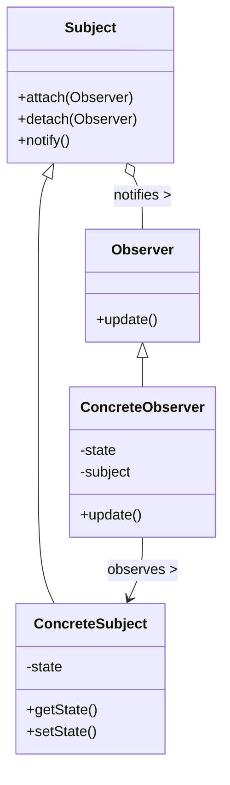

# C++ 观察者模式

## 什么是观察者模式？

观察者模式是一种行为设计模式，它定义了对象之间的一对多依赖关系，使得当一个对象（称为"主题"或"被观察者"）改变状态时，所有依赖于它的对象（称为"观察者"）都会得到通知并自动更新。

观察者模式在实际开发中非常有用，尤其是在实现事件处理系统、GUI界面更新、数据监控等场景中。

:::note
观察者模式也常被称为"发布-订阅"(Publish-Subscribe)模式，虽然两者在实现细节上有些差异，但核心思想是相似的。
:::

## 观察者模式的结构

观察者模式主要包含以下几个组件：



1. **Subject（主题）**：维护观察者列表，提供添加和删除观察者的接口
2. **Observer（观察者）**：为所有具体观察者定义一个更新接口
3. **ConcreteSubject（具体主题）**：存储状态，当状态发生改变时通知观察者
4. **ConcreteObserver（具体观察者）**：实现Observer更新接口，以便在收到通知时更新自身状态

## C++ 实现观察者模式

下面，我们将通过一个简单的例子来实现观察者模式。假设我们正在构建一个简单的天气监测系统，当天气数据（温度、湿度等）变化时，多个显示设备需要更新其显示内容。

### 基础版实现

首先，定义观察者和主题的抽象类：

```cpp
#include <iostream>
#include <vector>
#include <algorithm>

// 观察者抽象类
class Observer {
public:
    virtual ~Observer() = default;
    virtual void update(float temp, float humidity, float pressure) = 0;
};

// 主题抽象类
class Subject {
public:
    virtual ~Subject() = default;
    virtual void registerObserver(Observer* o) = 0;
    virtual void removeObserver(Observer* o) = 0;
    virtual void notifyObservers() = 0;
};
```

接下来，实现具体的天气数据主题类：

```cpp
// 具体主题：天气数据
class WeatherData : public Subject {
private:
    std::vector<Observer*> observers;
    float temperature;
    float humidity;
    float pressure;

public:
    void registerObserver(Observer* o) override {
        observers.push_back(o);
    }

    void removeObserver(Observer* o) override {
        auto it = std::find(observers.begin(), observers.end(), o);
        if (it != observers.end()) {
            observers.erase(it);
        }
    }

    void notifyObservers() override {
        for (auto observer : observers) {
            observer->update(temperature, humidity, pressure);
        }
    }

    // 当天气数据改变时，调用此方法
    void measurementsChanged() {
        notifyObservers();
    }

    // 设置测量值
    void setMeasurements(float temp, float humidity, float pressure) {
        this->temperature = temp;
        this->humidity = humidity;
        this->pressure = pressure;
        measurementsChanged();
    }
};
```

最后，实现具体的观察者类，这里我们创建两个不同的显示面板：

```cpp
// 具体观察者：当前状态显示
class CurrentConditionsDisplay : public Observer {
private:
    float temperature;
    float humidity;
    Subject* weatherData;

public:
    CurrentConditionsDisplay(Subject* weatherData) : weatherData(weatherData) {
        weatherData->registerObserver(this);
    }

    void update(float temp, float humidity, float pressure) override {
        this->temperature = temp;
        this->humidity = humidity;
        display();
    }

    void display() const {
        std::cout << "当前状态: 温度 " << temperature << "°C, 湿度 " << humidity << "%" << std::endl;
    }
};

// 具体观察者：统计信息显示
class StatisticsDisplay : public Observer {
private:
    float maxTemp = 0.0f;
    float minTemp = 200.0f;
    float tempSum = 0.0f;
    int numReadings = 0;
    Subject* weatherData;

public:
    StatisticsDisplay(Subject* weatherData) : weatherData(weatherData) {
        weatherData->registerObserver(this);
    }

    void update(float temp, float humidity, float pressure) override {
        tempSum += temp;
        numReadings++;

        if (temp > maxTemp) {
            maxTemp = temp;
        }
        if (temp < minTemp) {
            minTemp = temp;
        }

        display();
    }

    void display() const {
        std::cout << "统计信息: 平均温度 " << (tempSum / numReadings)
                  << "°C, 最高温度 " << maxTemp << "°C, 最低温度 " << minTemp << "°C"
                  << std::endl;
    }
};
```

让我们来使用这些类：

```cpp
int main() {
    // 创建天气数据主题
    WeatherData weatherData;
    
    // 创建观察者并注册到主题
    CurrentConditionsDisplay currentDisplay(&weatherData);
    StatisticsDisplay statisticsDisplay(&weatherData);
    
    // 模拟天气变化
    std::cout << "第一次天气更新:" << std::endl;
    weatherData.setMeasurements(26.0f, 65.0f, 1013.1f);
    
    std::cout << "\n第二次天气更新:" << std::endl;
    weatherData.setMeasurements(28.2f, 70.0f, 997.0f);
    
    std::cout << "\n第三次天气更新:" << std::endl;
    weatherData.setMeasurements(22.5f, 90.0f, 1012.2f);
    
    return 0;
}
```

### 输出结果

执行上述代码，输出结果为：

```
第一次天气更新:
当前状态: 温度 26°C, 湿度 65%
统计信息: 平均温度 26°C, 最高温度 26°C, 最低温度 26°C

第二次天气更新:
当前状态: 温度 28.2°C, 湿度 70%
统计信息: 平均温度 27.1°C, 最高温度 28.2°C, 最低温度 26°C

第三次天气更新:
当前状态: 温度 22.5°C, 湿度 90%
统计信息: 平均温度 25.5667°C, 最高温度 28.2°C, 最低温度 22.5°C
```

## 使用标准库改进观察者模式

在现代C++中，我们可以使用智能指针和函数对象来改进观察者模式的实现：

```cpp
#include <iostream>
#include <vector>
#include <memory>
#include <functional>
#include <string>

// 使用智能指针和函数对象的观察者模式
class WeatherStation {
public:
    // 定义天气更新的回调类型
    using Observer = std::function<void(float temp, float humidity, float pressure)>;

private:
    std::vector<Observer> observers;
    float temperature = 0.0f;
    float humidity = 0.0f;
    float pressure = 0.0f;

public:
    // 添加观察者
    void addObserver(Observer observer) {
        observers.push_back(observer);
    }

    // 设置测量值并通知观察者
    void setMeasurements(float temp, float humidity, float pressure) {
        this->temperature = temp;
        this->humidity = humidity;
        this->pressure = pressure;
        
        // 通知所有观察者
        for (const auto& observer : observers) {
            observer(temperature, humidity, pressure);
        }
    }
};

// 显示类
class Display {
private:
    std::string name;

public:
    Display(const std::string& name) : name(name) {}
    
    void showTemperature(float temp) {
        std::cout << name << ": 当前温度 " << temp << "°C" << std::endl;
    }
    
    void showFullReport(float temp, float humidity, float pressure) {
        std::cout << name << ": 温度 " << temp << "°C, 湿度 " 
                  << humidity << "%, 气压 " << pressure << " hPa" << std::endl;
    }
};
```

使用示例：

```cpp
int main() {
    WeatherStation station;
    
    // 创建显示器
    Display phoneApp("手机App");
    Display homeDisplay("家用显示器");
    Display webInterface("网页界面");
    
    // 注册观察者
    station.addObserver([&phoneApp](float t, float h, float p) {
        phoneApp.showTemperature(t);
    });
    
    station.addObserver([&homeDisplay](float t, float h, float p) {
        homeDisplay.showFullReport(t, h, p);
    });
    
    station.addObserver([&webInterface](float t, float h, float p) {
        webInterface.showFullReport(t, h, p);
    });
    
    // 更新天气数据
    std::cout << "天气更新:" << std::endl;
    station.setMeasurements(25.2f, 60.0f, 1013.25f);
    
    return 0;
}
```

### 输出结果

```
天气更新:
手机App: 当前温度 25.2°C
家用显示器: 温度 25.2°C, 湿度 60%, 气压 1013.25 hPa
网页界面: 温度 25.2°C, 湿度 60%, 气压 1013.25 hPa
```

## 观察者模式的实际应用场景

1. **用户界面更新**：当应用程序的数据模型发生变化时，需要更新多个UI组件。

2. **事件处理系统**：如按钮点击、鼠标移动等事件的处理机制。

3. **消息通知系统**：如聊天应用中的新消息通知、邮件客户端的新邮件提醒。

4. **分布式系统中的状态同步**：当一个节点状态变化时，其他节点需要同步更新。

5. **财务软件中的数据更新**：当基础数据变化时，自动更新所有依赖的计算结果。

:::tip
实际开发中，很多C++框架和库已经内建了观察者模式的实现，如Qt的信号与槽机制。
:::

## 观察者模式的优缺点

### 优点

1. **低耦合性**：主题和观察者之间是松散耦合的，主题只知道观察者实现了某个接口。
2. **支持广播通信**：一个主题可以通知多个观察者。
3. **开闭原则**：无需修改现有代码即可添加新的观察者。

### 缺点

1. **可能导致性能问题**：当有大量观察者时，通知所有观察者可能会导致性能下降。
2. **可能引起循环依赖**：如果不小心设计，观察者和主题之间可能形成循环依赖。
3. **通知顺序不确定**：观察者被通知的顺序通常是不确定的。

## 最佳实践

1. **使用智能指针管理观察者**：避免内存泄漏和悬垂指针问题。
2. **考虑观察者注销机制**：确保观察者能够适时地从主题中注销。
3. **避免在通知方法中修改观察者列表**：这可能导致迭代器失效。
4. **考虑使用线程安全的实现**：在多线程环境中使用观察者模式需要额外注意。

## 总结

观察者模式是一种强大的设计模式，它通过建立对象间的一对多依赖关系，在主题状态变化时自动通知所有相关的观察者。在C++中，我们可以使用继承和多态实现传统的观察者模式，也可以利用现代C++特性（如智能指针和函数对象）创建更灵活的实现。

观察者模式广泛应用于图形用户界面、事件处理系统和分布式系统中，它有助于保持系统组件间的低耦合性，同时提供了灵活的对象间通信机制。

## 练习

1. 扩展天气监测系统，添加一个新的显示组件，用于显示天气预报。
2. 修改观察者接口，使其能够指定只接收特定类型的更新（如只关注温度变化）。
3. 实现一个使用观察者模式的简单聊天室系统，用户可以发送消息，所有在线用户都能接收到。
4. 探索如何在多线程环境中安全地使用观察者模式。

## 其他资源

- 《设计模式：可复用面向对象软件的基础》- 经典的设计模式书籍
- 《Effective Modern C++》- 学习现代C++最佳实践
- [C++ Reference](https://en.cppreference.com/) - 官方C++参考文档

通过观察者模式，你可以构建更灵活、可扩展的系统，更好地应对复杂的对象间通信需求。随着你的C++技能提升，你会发现这种模式在各种场景中都有广泛的应用。