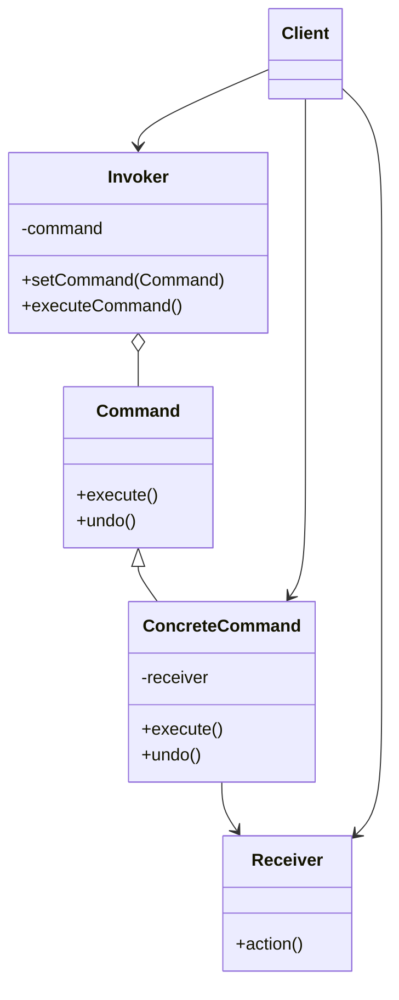

# C++ 命令模式

## 什么是命令模式？

命令模式（Command Pattern）是一种行为型设计模式，它将请求封装为一个对象，从而允许你使用不同的请求、队列或日志请求来参数化客户端，并支持可撤销的操作。

简单来说，命令模式将"请求"封装成对象，以便用不同的请求对客户端进行参数化。

:::tip
命令模式的核心优势在于它将**发出请求的对象**与**知道如何执行请求的对象**解耦。
:::

## 命令模式的基本结构

命令模式包含以下几个核心组件：



1. **命令（Command）**：声明执行操作的接口。
2. **具体命令（ConcreteCommand）**：实现Command接口，定义一个执行与特定接收者相关操作的绑定。
3. **客户端（Client）**：创建具体命令对象并设置其接收者。
4. **调用者（Invoker）**：要求命令执行请求。
5. **接收者（Receiver）**：知道如何实施与执行一个请求相关的操作。

## C++ 实现命令模式

下面我们通过一个简单的例子来实现命令模式。假设我们有一个灯（接收者），我们想通过遥控器（调用者）控制开关灯（命令）。

```cpp
#include <iostream>
#include <string>
#include <memory>
#include <vector>

// 接收者类 - 灯
class Light {
private:
    std::string location;

public:
    Light(const std::string& location) : location(location) {}

    void turnOn() {
        std::cout << location << " 灯打开了！" << std::endl;
    }

    void turnOff() {
        std::cout << location << " 灯关闭了！" << std::endl;
    }
};

// 命令接口
class Command {
public:
    virtual ~Command() = default;
    virtual void execute() = 0;
    virtual void undo() = 0;
};

// 具体命令：开灯命令
class LightOnCommand : public Command {
private:
    Light* light;

public:
    LightOnCommand(Light* light) : light(light) {}

    void execute() override {
        light->turnOn();
    }

    void undo() override {
        light->turnOff();
    }
};

// 具体命令：关灯命令
class LightOffCommand : public Command {
private:
    Light* light;

public:
    LightOffCommand(Light* light) : light(light) {}

    void execute() override {
        light->turnOff();
    }

    void undo() override {
        light->turnOn();
    }
};

// 调用者：遥控器
class RemoteControl {
private:
    std::vector<std::unique_ptr<Command>> onCommands;
    std::vector<std::unique_ptr<Command>> offCommands;
    Command* lastCommand = nullptr;

public:
    RemoteControl(size_t slots = 7) {
        // 初始化遥控器槽位
        onCommands.resize(slots);
        offCommands.resize(slots);
    }

    void setCommand(size_t slot, std::unique_ptr<Command> onCommand, std::unique_ptr<Command> offCommand) {
        onCommands[slot] = std::move(onCommand);
        offCommands[slot] = std::move(offCommand);
    }

    void onButtonPushed(size_t slot) {
        if (onCommands[slot]) {
            onCommands[slot]->execute();
            lastCommand = onCommands[slot].get();
        }
    }

    void offButtonPushed(size_t slot) {
        if (offCommands[slot]) {
            offCommands[slot]->execute();
            lastCommand = offCommands[slot].get();
        }
    }

    void undoButtonPushed() {
        if (lastCommand) {
            lastCommand->undo();
        }
    }
};

// 客户端代码
int main() {
    // 创建接收者
    Light livingRoomLight("客厅");
    Light kitchenLight("厨房");

    // 创建调用者
    RemoteControl remote(2);

    // 设置客厅灯命令
    remote.setCommand(0, 
        std::make_unique<LightOnCommand>(&livingRoomLight),
        std::make_unique<LightOffCommand>(&livingRoomLight));

    // 设置厨房灯命令
    remote.setCommand(1,
        std::make_unique<LightOnCommand>(&kitchenLight),
        std::make_unique<LightOffCommand>(&kitchenLight));

    // 测试遥控器
    std::cout << "===== 测试遥控器 =====" << std::endl;
    remote.onButtonPushed(0);  // 打开客厅灯
    remote.offButtonPushed(0); // 关闭客厅灯
    remote.undoButtonPushed(); // 撤销上一个操作，打开客厅灯
    
    remote.onButtonPushed(1);  // 打开厨房灯
    remote.undoButtonPushed(); // 撤销上一个操作，关闭厨房灯

    return 0;
}
```

**运行结果：**
```
===== 测试遥控器 =====
客厅 灯打开了！
客厅 灯关闭了！
客厅 灯打开了！
厨房 灯打开了！
厨房 灯关闭了！
```

## 命令模式详解

让我们一步步分析上面的代码：

1. **接收者（Receiver）**：`Light`类实现了我们的接收者，它知道如何执行实际的操作（开灯、关灯）。

2. **命令接口（Command）**：定义了所有命令必须实现的接口，包含`execute()`和`undo()`方法。

3. **具体命令（Concrete Command）**：`LightOnCommand`和`LightOffCommand`类实现了命令接口，封装了对特定接收者（Light）的操作请求。

4. **调用者（Invoker）**：`RemoteControl`类请求命令对象执行命令，但并不知道命令是如何执行的。

5. **客户端（Client）**：在`main`函数中，客户端创建具体命令对象，并将其与接收者关联，然后将命令对象提供给调用者。

## 命令模式的优点

1. **解耦**：命令模式将发出请求的对象与执行请求的对象解耦。

2. **可扩展性**：你可以轻松添加新命令而不修改现有代码。

3. **命令队列**：可以将命令放入队列中，支持命令的延迟执行。

4. **撤销/重做**：命令模式通过`undo()`方法支持撤销操作。

5. **宏命令**：可以组合多个命令为一个宏命令。

## 实际应用场景

### 1. 图形用户界面（GUI）应用

在GUI应用中，每个按钮点击、菜单选择都可以被封装成命令对象。

```cpp
// GUI命令示例
class Button {
private:
    Command* command;
    std::string label;
    
public:
    Button(Command* cmd, const std::string& lbl) : command(cmd), label(lbl) {}
    
    void click() {
        std::cout << "按钮 [" << label << "] 被点击" << std::endl;
        command->execute();
    }
};

// 使用
int main() {
    Document doc;
    Button saveButton(new SaveCommand(&doc), "保存");
    Button printButton(new PrintCommand(&doc), "打印");
    
    saveButton.click(); // 保存文档
    printButton.click(); // 打印文档
}
```

### 2. 事务系统

在数据库系统中，可以使用命令模式实现事务操作，支持回滚功能。

### 3. 多级撤销功能

文本编辑器中的撤销/重做功能，可以使用命令模式记录每一步操作。

```cpp
class TextEditor {
private:
    std::string text;
    std::vector<Command*> history;
    int currentPosition = -1;
    
public:
    void executeCommand(Command* cmd) {
        cmd->execute();
        
        // 清除当前位置之后的所有命令（如果有撤销后又执行新命令的情况）
        while (history.size() > currentPosition + 1) {
            delete history.back();
            history.pop_back();
        }
        
        history.push_back(cmd);
        currentPosition++;
    }
    
    void undo() {
        if (currentPosition >= 0) {
            history[currentPosition]->undo();
            currentPosition--;
        }
    }
    
    void redo() {
        if (currentPosition < history.size() - 1) {
            currentPosition++;
            history[currentPosition]->execute();
        }
    }
};
```

### 4. 线程池任务调度

将任务封装为命令对象，放入队列中由线程池执行。

### 5. 智能家居控制系统

就像我们的示例一样，智能家居系统可以使用命令模式控制各种设备。

## 命令模式的扩展：宏命令

宏命令是命令模式的扩展，它允许你将多个命令组合在一起，作为一个命令执行。

```cpp
// 宏命令
class MacroCommand : public Command {
private:
    std::vector<std::unique_ptr<Command>> commands;
    
public:
    void addCommand(std::unique_ptr<Command> command) {
        commands.push_back(std::move(command));
    }
    
    void execute() override {
        for (auto& command : commands) {
            command->execute();
        }
    }
    
    void undo() override {
        // 逆序执行撤销操作
        for (auto it = commands.rbegin(); it != commands.rend(); ++it) {
            (*it)->undo();
        }
    }
};

// 使用宏命令
int main() {
    Light livingRoomLight("客厅");
    Light kitchenLight("厨房");
    
    auto macroOn = std::make_unique<MacroCommand>();
    macroOn->addCommand(std::make_unique<LightOnCommand>(&livingRoomLight));
    macroOn->addCommand(std::make_unique<LightOnCommand>(&kitchenLight));
    
    // 一次性打开所有灯
    macroOn->execute();
    
    // 一次性关闭所有灯
    macroOn->undo();
    
    return 0;
}
```

## 总结

命令模式是一个非常实用的设计模式，它可以：

1. 将发出请求的对象与执行请求的对象解耦。
2. 支持可撤销的操作。
3. 支持命令的队列和宏操作。
4. 支持事务型操作。

在实际编程中，当你需要**参数化对象**、**队列化请求**或者**支持撤销操作**时，命令模式是一个很好的选择。

:::caution 注意事项
使用命令模式时，需要注意内存管理问题，尤其是在创建大量命令对象时可能会导致内存占用增加。在C++中，可以使用智能指针来减轻这个负担。
:::

## 练习

1. 扩展遥控器示例，添加更多设备（如音响、电视等）和相应的命令。
2. 实现一个简单的文本编辑器，使用命令模式支持撤销/重做功能。
3. 设计一个使用命令模式的任务调度系统，可以延迟执行、取消任务。
4. 尝试实现一个支持多级撤销的绘图应用，每个绘图操作都是一个命令。

## 相关模式

- **策略模式**：与命令模式类似，但策略模式通常不关注撤销操作。
- **责任链模式**：可以与命令模式结合，创建一系列处理命令的处理器。
- **组合模式**：可以用来实现宏命令。
- **备忘录模式**：可以与命令模式结合，支持撤销操作。

通过理解和应用命令模式，你将能够编写更加灵活、可维护的代码，特别是在需要处理操作历史、撤销/重做功能或者事件驱动系统时。