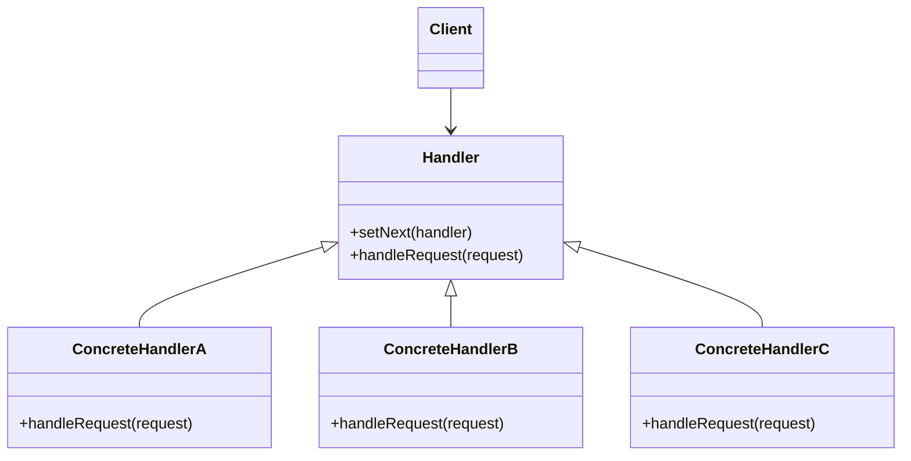

# C++ 责任链模式

## 什么是责任链模式？

责任链模式（Chain of Responsibility Pattern）是一种行为型设计模式，它允许多个对象有机会处理请求，从而避免请求的发送者和接收者之间的耦合关系。将这些对象连成一条链，并沿着这条链传递请求，直到有对象处理它为止。

:::note
责任链模式是23种经典设计模式之一，属于行为型模式。它特别适用于处理流程化的请求处理场景。
:::

这种模式的核心思想是：

1. 将请求的发送者和接收者解耦
2. 将多个处理者连成一条链
3. 请求沿着链传递，直到被处理或到达链尾

## 责任链模式的结构

责任链模式通常包含以下几个关键角色：



- **Handler（处理者）**: 定义一个处理请求的接口，并包含设置继任者的方法
- **ConcreteHandler（具体处理者）**: 处理它所负责的请求，如果可以处理就处理，否则将请求转发给继任者
- **Client（客户端）**: 向链上的具体处理者提交请求

## 实现责任链模式

下面我们用C++来实现一个简单的责任链模式：

```cpp
#include <iostream>
#include <string>
#include <memory>

// 处理请求的基类
class Handler {
protected:
    std::shared_ptr<Handler> nextHandler;
    
public:
    virtual ~Handler() = default;
    
    // 设置下一个处理者
    void setNext(std::shared_ptr<Handler> handler) {
        nextHandler = handler;
    }
    
    // 处理请求的虚函数
    virtual void handleRequest(int request) = 0;
};

// 具体处理者A，处理10以内的请求
class ConcreteHandlerA : public Handler {
public:
    void handleRequest(int request) override {
        if (request <= 10) {
            std::cout << "ConcreteHandlerA 处理请求: " << request << std::endl;
        } else if (nextHandler) {
            std::cout << "ConcreteHandlerA 无法处理，传递给下一处理者" << std::endl;
            nextHandler->handleRequest(request);
        } else {
            std::cout << "ConcreteHandlerA 无法处理，且没有下一处理者" << std::endl;
        }
    }
};

// 具体处理者B，处理20以内的请求
class ConcreteHandlerB : public Handler {
public:
    void handleRequest(int request) override {
        if (request <= 20) {
            std::cout << "ConcreteHandlerB 处理请求: " << request << std::endl;
        } else if (nextHandler) {
            std::cout << "ConcreteHandlerB 无法处理，传递给下一处理者" << std::endl;
            nextHandler->handleRequest(request);
        } else {
            std::cout << "ConcreteHandlerB 无法处理，且没有下一处理者" << std::endl;
        }
    }
};

// 具体处理者C，处理30以内的请求
class ConcreteHandlerC : public Handler {
public:
    void handleRequest(int request) override {
        if (request <= 30) {
            std::cout << "ConcreteHandlerC 处理请求: " << request << std::endl;
        } else if (nextHandler) {
            std::cout << "ConcreteHandlerC 无法处理，传递给下一处理者" << std::endl;
            nextHandler->handleRequest(request);
        } else {
            std::cout << "ConcreteHandlerC 无法处理，且没有下一处理者" << std::endl;
        }
    }
};

int main() {
    // 创建处理者
    auto handlerA = std::make_shared<ConcreteHandlerA>();
    auto handlerB = std::make_shared<ConcreteHandlerB>();
    auto handlerC = std::make_shared<ConcreteHandlerC>();
    
    // 设置责任链
    handlerA->setNext(handlerB);
    handlerB->setNext(handlerC);
    
    // 发送请求
    std::cout << "处理请求5：" << std::endl;
    handlerA->handleRequest(5);
    
    std::cout << "\n处理请求15：" << std::endl;
    handlerA->handleRequest(15);
    
    std::cout << "\n处理请求25：" << std::endl;
    handlerA->handleRequest(25);
    
    std::cout << "\n处理请求35：" << std::endl;
    handlerA->handleRequest(35);
    
    return 0;
}
```

### 输出结果

```
处理请求5：
ConcreteHandlerA 处理请求: 5

处理请求15：
ConcreteHandlerA 无法处理，传递给下一处理者
ConcreteHandlerB 处理请求: 15

处理请求25：
ConcreteHandlerA 无法处理，传递给下一处理者
ConcreteHandlerB 无法处理，传递给下一处理者
ConcreteHandlerC 处理请求: 25

处理请求35：
ConcreteHandlerA 无法处理，传递给下一处理者
ConcreteHandlerB 无法处理，传递给下一处理者
ConcreteHandlerC 无法处理，且没有下一处理者
```

## 责任链模式的应用场景

责任链模式适用于以下场景：

1. **多个对象可以处理同一请求**，但具体由哪个对象处理在运行时确定
2. **不明确接收者的情况下**，向多个对象中的某一个提交请求
3. **处理者集合需要动态指定**的情况

### 现实世界中的责任链模式

让我们来看几个责任链模式的实际应用：

1. **图形用户界面中的事件处理**：当用户点击一个按钮时，事件首先由按钮处理，如果按钮不处理，则由容器处理，依此类推。

2. **请假审批流程**：员工请假需要依次经过直属主管、部门经理、总经理的审批，不同级别的假期由不同级别的管理者审批。

3. **Web应用中的过滤器链**：HTTP请求经过多个过滤器的处理，如身份验证、日志记录、内容压缩等。

## 实际案例：日志记录系统

下面我们实现一个简单的日志记录系统，使用责任链模式处理不同级别的日志：

```cpp
#include <iostream>
#include <string>
#include <memory>

// 日志级别枚举
enum class LogLevel {
    INFO,
    DEBUG,
    WARNING,
    ERROR
};

// 日志处理者基类
class LogHandler {
protected:
    std::shared_ptr<LogHandler> nextHandler;
    LogLevel level;
    
public:
    LogHandler(LogLevel level) : level(level) {}
    virtual ~LogHandler() = default;
    
    // 设置下一个处理者
    void setNext(std::shared_ptr<LogHandler> handler) {
        nextHandler = handler;
    }
    
    // 处理日志请求
    void logMessage(LogLevel messageLevel, const std::string& message) {
        if (messageLevel >= level) {
            write(message);
        }
        
        // 传递给下一个处理者，无论当前是否处理
        if (nextHandler) {
            nextHandler->logMessage(messageLevel, message);
        }
    }
    
    // 由子类实现的日志写入方法
    virtual void write(const std::string& message) = 0;
};

// 控制台日志处理者
class ConsoleLogHandler : public LogHandler {
public:
    ConsoleLogHandler(LogLevel level) : LogHandler(level) {}
    
    void write(const std::string& message) override {
        std::cout << "控制台日志: " << message << std::endl;
    }
};

// 文件日志处理者
class FileLogHandler : public LogHandler {
public:
    FileLogHandler(LogLevel level) : LogHandler(level) {}
    
    void write(const std::string& message) override {
        std::cout << "文件日志: " << message << " (写入到文件)" << std::endl;
    }
};

// 邮件日志处理者
class EmailLogHandler : public LogHandler {
public:
    EmailLogHandler(LogLevel level) : LogHandler(level) {}
    
    void write(const std::string& message) override {
        std::cout << "邮件提醒: " << message << " (发送邮件通知)" << std::endl;
    }
};

int main() {
    // 创建日志处理链
    auto consoleLogger = std::make_shared<ConsoleLogHandler>(LogLevel::INFO);
    auto fileLogger = std::make_shared<FileLogHandler>(LogLevel::DEBUG);
    auto emailLogger = std::make_shared<EmailLogHandler>(LogLevel::ERROR);
    
    consoleLogger->setNext(fileLogger);
    fileLogger->setNext(emailLogger);
    
    // 输出不同级别的日志
    std::cout << "===== 输出INFO级别日志 =====" << std::endl;
    consoleLogger->logMessage(LogLevel::INFO, "系统正常启动");
    
    std::cout << "\n===== 输出DEBUG级别日志 =====" << std::endl;
    consoleLogger->logMessage(LogLevel::DEBUG, "正在加载配置文件");
    
    std::cout << "\n===== 输出WARNING级别日志 =====" << std::endl;
    consoleLogger->logMessage(LogLevel::WARNING, "配置文件格式可能有问题");
    
    std::cout << "\n===== 输出ERROR级别日志 =====" << std::endl;
    consoleLogger->logMessage(LogLevel::ERROR, "系统崩溃，无法继续运行");
    
    return 0;
}
```

### 输出结果

```
===== 输出INFO级别日志 =====
控制台日志: 系统正常启动
文件日志: 系统正常启动 (写入到文件)

===== 输出DEBUG级别日志 =====
控制台日志: 正在加载配置文件
文件日志: 正在加载配置文件 (写入到文件)

===== 输出WARNING级别日志 =====
控制台日志: 配置文件格式可能有问题
文件日志: 配置文件格式可能有问题 (写入到文件)

===== 输出ERROR级别日志 =====
控制台日志: 系统崩溃，无法继续运行
文件日志: 系统崩溃，无法继续运行 (写入到文件)
邮件提醒: 系统崩溃，无法继续运行 (发送邮件通知)
```

## 责任链模式的优缺点

### 优点

1. **降低耦合度**：发送者和接收者都不需要知道对方的存在，各个处理者也不需要知道整个链的结构
2. **增强了给对象指派职责的灵活性**：通过改变链内的成员或调动它们的次序，可以动态地新增或删除责任
3. **符合开闭原则**：可以在不修改现有代码的情况下增加新的处理者

### 缺点

1. **不保证请求一定被处理**：请求可能到达链的末端也没有被处理
2. **性能问题**：如果链过长，或者链中大部分处理者都不能处理请求，会影响性能
3. **调试困难**：责任链上的错误可能难以跟踪和定位

:::tip
在使用责任链模式时，建议设置默认处理者，确保请求在链尾也能得到适当处理。
:::

## 责任链模式与其他设计模式的区别

1. **责任链模式 vs 命令模式**：命令模式关注的是请求本身，将请求封装为对象；责任链模式关注的是请求的处理者，将处理者连成一条链。

2. **责任链模式 vs 装饰器模式**：两者都涉及对象链，但装饰器模式是为了增强对象的功能，而责任链模式是为了处理请求。

## 总结

责任链模式是一种强大的行为设计模式，它通过构建处理者链并沿着链传递请求，有效地将请求的发送者和处理者解耦。这种模式在需要多级处理或处理者需要动态变化的场景下特别有用。

通过将请求的处理分散到多个对象中，责任链模式使系统更加灵活，并且符合单一职责原则和开闭原则。但使用时需要注意请求可能不被处理的情况，并根据具体需求设计合理的链结构。

## 练习

1. 实现一个简单的Web服务器中间件系统，使用责任链模式处理HTTP请求，包括身份验证、日志记录、内容类型检查等中间件。

2. 设计一个文件处理系统，不同的处理器处理不同格式的文件（如文本文件、图像文件、音频文件等）。

3. 实现一个采购审批系统，根据采购金额的不同，由不同级别的管理者进行审批。

## 附加资源

- 《设计模式：可复用面向对象软件的基础》- Gamma、Helm、Johnson、Vlissides（GoF）
- 《Head First设计模式》- Freeman等
- 《C++设计模式》- James W. Cooper