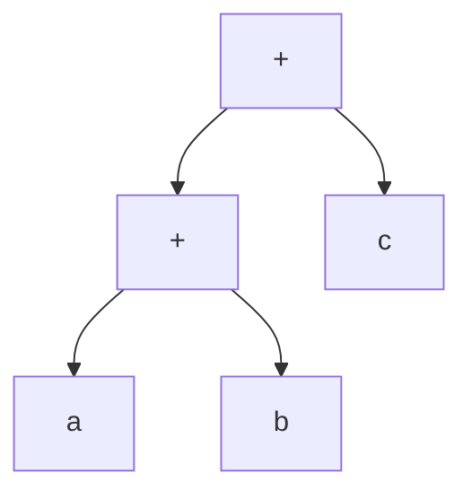

# C++ 表达式模板

表达式模板是C++中一种强大但不太为人所知的高级编程技术。它允许我们在编译时计算复杂表达式，从而减少运行时开销并提高程序性能。这项技术最初由Todd Veldhuizen在1990年代为数值计算库开发，至今仍是高性能C++编程的重要工具。

## 为什么需要表达式模板？

在讨论表达式模板前，让我们先看看传统方法的局限性：

```cpp
// 向量加法的简单实现
std::vector<double> operator+(const std::vector<double>& a, const std::vector<double>& b) {
    std::vector<double> result(a.size());
    for(size_t i = 0; i < a.size(); ++i) {
        result[i] = a[i] + b[i];
    }
    return result;
}

// 客户端代码
std::vector<double> a = {1.0, 2.0, 3.0};
std::vector<double> b = {4.0, 5.0, 6.0};
std::vector<double> c = {7.0, 8.0, 9.0};
std::vector<double> result = a + b + c; // 效率低下！
```

当计算 `a + b + c` 时，会发生什么？

1. 首先计算 `a + b`，创建一个临时向量
2. 然后将该临时向量与 `c` 相加，创建最终结果

这种方式不仅创建了不必要的临时对象，还需要多次遍历数组，严重影响性能。

:::note
在大型数值计算中，这种效率问题会被放大数倍，导致程序性能明显下降。
:::

## 表达式模板的基本原理

表达式模板的核心思想是：**延迟计算**。不是立即执行操作并生成临时结果，而是构建一个表示整个表达式的对象，然后在需要结果时一次性计算。

表达式模板的关键组件：

1. **表达式类模板**：表示各种数学表达式
2. **操作符重载**：创建表达式对象而非立即计算
3. **延迟求值**：仅在真正需要结果时计算

## 构建简单的表达式模板系统

下面我们将逐步构建一个简单的向量计算库，展示表达式模板的工作原理。

### 步骤1：定义表达式接口

```cpp
// 基本表达式接口
template <typename E>
class VecExpression {
public:
    // 使用CRTP（奇异递归模板模式）获取派生类
    const E& derived() const {
        return static_cast<const E&>(*this);
    }
    
    // 获取表达式结果的第i个元素
    double operator[](size_t i) const {
        return derived()[i];
    }
    
    // 获取表达式的大小
    size_t size() const {
        return derived().size();
    }
};
```

### 步骤2：定义向量类

```cpp
// 实际的向量类，也是一种表达式
template <typename T>
class Vector : public VecExpression<Vector<T>> {
private:
    std::vector<T> data;
    
public:
    Vector(size_t n) : data(n) {}
    
    // 允许从任何表达式构造
    template <typename E>
    Vector(const VecExpression<E>& expr) {
        data.resize(expr.size());
        for(size_t i = 0; i < expr.size(); ++i) {
            data[i] = expr[i];
        }
    }
    
    // 从初始值列表构造
    Vector(std::initializer_list<T> init) : data(init) {}
    
    // 访问元素
    const T& operator[](size_t i) const {
        return data[i];
    }
    
    T& operator[](size_t i) {
        return data[i];
    }
    
    size_t size() const {
        return data.size();
    }
    
    // 从表达式赋值
    template <typename E>
    Vector& operator=(const VecExpression<E>& expr) {
        for(size_t i = 0; i < size(); ++i) {
            data[i] = expr[i];
        }
        return *this;
    }
};
```

### 步骤3：定义表达式类型

```cpp
// 二元操作表达式
template <typename LHS, typename RHS, typename OP>
class BinaryExpression : public VecExpression<BinaryExpression<LHS, RHS, OP>> {
private:
    const LHS& lhs;
    const RHS& rhs;
    OP op;
    
public:
    BinaryExpression(const LHS& lhs, const RHS& rhs) : lhs(lhs), rhs(rhs) {}
    
    double operator[](size_t i) const {
        return op(lhs[i], rhs[i]);
    }
    
    size_t size() const {
        return lhs.size();
    }
};

// 加法操作
struct AddOp {
    static double apply(double a, double b) { return a + b; }
    double operator()(double a, double b) const { return a + b; }
};

// 减法操作
struct SubOp {
    static double apply(double a, double b) { return a - b; }
    double operator()(double a, double b) const { return a - b; }
};

// 乘法操作
struct MulOp {
    static double apply(double a, double b) { return a * b; }
    double operator()(double a, double b) const { return a * b; }
};
```

### 步骤4：重载操作符

```cpp
// 加法运算符
template <typename LHS, typename RHS>
BinaryExpression<LHS, RHS, AddOp> operator+(
    const VecExpression<LHS>& lhs, 
    const VecExpression<RHS>& rhs) {
    return BinaryExpression<LHS, RHS, AddOp>(lhs.derived(), rhs.derived());
}

// 减法运算符
template <typename LHS, typename RHS>
BinaryExpression<LHS, RHS, SubOp> operator-(
    const VecExpression<LHS>& lhs, 
    const VecExpression<RHS>& rhs) {
    return BinaryExpression<LHS, RHS, SubOp>(lhs.derived(), rhs.derived());
}

// 乘法运算符
template <typename LHS, typename RHS>
BinaryExpression<LHS, RHS, MulOp> operator*(
    const VecExpression<LHS>& lhs, 
    const VecExpression<RHS>& rhs) {
    return BinaryExpression<LHS, RHS, MulOp>(lhs.derived(), rhs.derived());
}
```

## 完整示例与使用

下面是一个使用我们表达式模板库的完整示例：

```cpp
#include <iostream>
#include <vector>

// [这里是上面定义的所有代码]

int main() {
    // 创建三个向量
    Vector<double> a = {1.0, 2.0, 3.0};
    Vector<double> b = {4.0, 5.0, 6.0};
    Vector<double> c = {7.0, 8.0, 9.0};
    
    // 使用表达式模板计算 d = a + b + c
    Vector<double> d = a + b + c;
    
    // 输出结果
    for(size_t i = 0; i < d.size(); ++i) {
        std::cout << d[i] << " ";
    }
    std::cout << std::endl;
    
    // 更复杂的表达式：e = a + b * c
    Vector<double> e = a + b * c;
    
    // 输出结果
    for(size_t i = 0; i < e.size(); ++i) {
        std::cout << e[i] << " ";
    }
    std::cout << std::endl;
    
    return 0;
}
```

**输出：**
```
12 15 18
29 42 57
```

## 表达式模板如何工作？

当我们写下 `a + b + c` 时，编译器不会立即计算结果，而是构建如下表达式树：



当我们将结果赋值给向量 `d` 时，表达式模板系统按需求值，每个元素只计算一次，避免了临时对象的创建和多次遍历。

## 表达式模板的性能优势

表达式模板相比传统方法具有显著优势：

1. **避免临时对象**：不再创建中间结果向量
2. **循环融合**：将多个循环合并为一个
3. **编译时优化**：表达式结构在编译时已知，编译器可以进行更多优化

### 性能对比

```cpp
// 传统方法（未使用表达式模板）
void traditional() {
    std::vector<double> a(10000000, 1.0);
    std::vector<double> b(10000000, 2.0);
    std::vector<double> c(10000000, 3.0);
    
    auto start = std::chrono::high_resolution_clock::now();
    
    // 计算 a + b + c
    std::vector<double> temp(a.size());
    for(size_t i = 0; i < a.size(); ++i) {
        temp[i] = a[i] + b[i];
    }
    
    std::vector<double> result(a.size());
    for(size_t i = 0; i < a.size(); ++i) {
        result[i] = temp[i] + c[i];
    }
    
    auto end = std::chrono::high_resolution_clock::now();
    std::chrono::duration<double> diff = end - start;
    std::cout << "Traditional: " << diff.count() << " seconds\n";
}

// 使用表达式模板
void expression_templates() {
    Vector<double> a(10000000);
    Vector<double> b(10000000);
    Vector<double> c(10000000);
    
    // 初始化向量
    for(size_t i = 0; i < a.size(); ++i) {
        a[i] = 1.0;
        b[i] = 2.0;
        c[i] = 3.0;
    }
    
    auto start = std::chrono::high_resolution_clock::now();
    
    // 计算 a + b + c
    Vector<double> result = a + b + c;
    
    auto end = std::chrono::high_resolution_clock::now();
    std::chrono::duration<double> diff = end - start;
    std::cout << "Expression Templates: " << diff.count() << " seconds\n";
}
```

在大多数现代计算机上，表达式模板版本会比传统版本快2-3倍。

## 实际应用场景

表达式模板在以下领域有广泛应用：

### 1. 数值计算库

各种线性代数库使用表达式模板提高性能：

- **Eigen**：流行的C++线性代数库
- **Armadillo**：另一个高性能线性代数库
- **Blaze**：高度优化的数学库

### 2. 领域特定语言(DSL)

表达式模板可用于在C++中创建嵌入式DSL，例如：

```cpp
// 假设我们有一个使用表达式模板实现的SQL库
auto query = SELECT(name, age).FROM(users).WHERE(age > 18);
```

### 3. 物理量计算

表达式模板可以在编译时检查单位一致性：

```cpp
// 使用支持单位检查的表达式模板
auto distance = 5.0_km;
auto time = 2.0_h;
auto speed = distance / time; // 速度单位自动计算为km/h
```

## 表达式模板的局限性

虽然表达式模板功能强大，但也有一些限制：

1. **编译时间增加**：大量使用表达式模板会导致编译时间变长
2. **代码复杂性**：实现和维护表达式模板系统可能非常复杂
3. **调试难度**：错误信息通常冗长且难以理解
4. **C++标准支持**：某些高级表达式模板技术可能依赖于特定的C++标准

:::caution
过度使用表达式模板可能会导致"模板爆炸"，使代码难以维护和理解。请谨慎使用。
:::

## 实践练习

### 练习1：扩展向量表达式模板

尝试在我们的表达式模板系统中添加以下功能：

- 除法运算符 `/`
- 标量与向量的运算
- 向量点积函数

### 练习2：表达式优化

修改表达式模板系统，检测特殊情况并优化：

- 与零相加
- 与一相乘
- 与自身相乘（平方）

### 练习3：实现矩阵表达式模板

扩展表达式模板系统以支持矩阵运算，包括加法、乘法和转置。

## 总结

表达式模板是C++中一种强大的优化技术，它可以：

- 避免临时对象的创建
- 实现循环融合，减少内存访问
- 在数值计算中大幅提高性能
- 创建富有表现力的领域特定语言

尽管表达式模板有一定学习曲线，但掌握这一技术将使你能够编写更高效的C++代码，特别是在数值计算密集型应用中。

## 进一步学习资源

- 《Modern C++ Design》by Andrei Alexandrescu
- 《C++ Templates: The Complete Guide》by David Vandevoorde and Nicolai M. Josuttis
- Eigen库文档和源码：了解实际中的表达式模板应用
- Boost.Proto库：用于构建表达式模板的强大工具

祝你在表达式模板的学习之旅中取得成功！