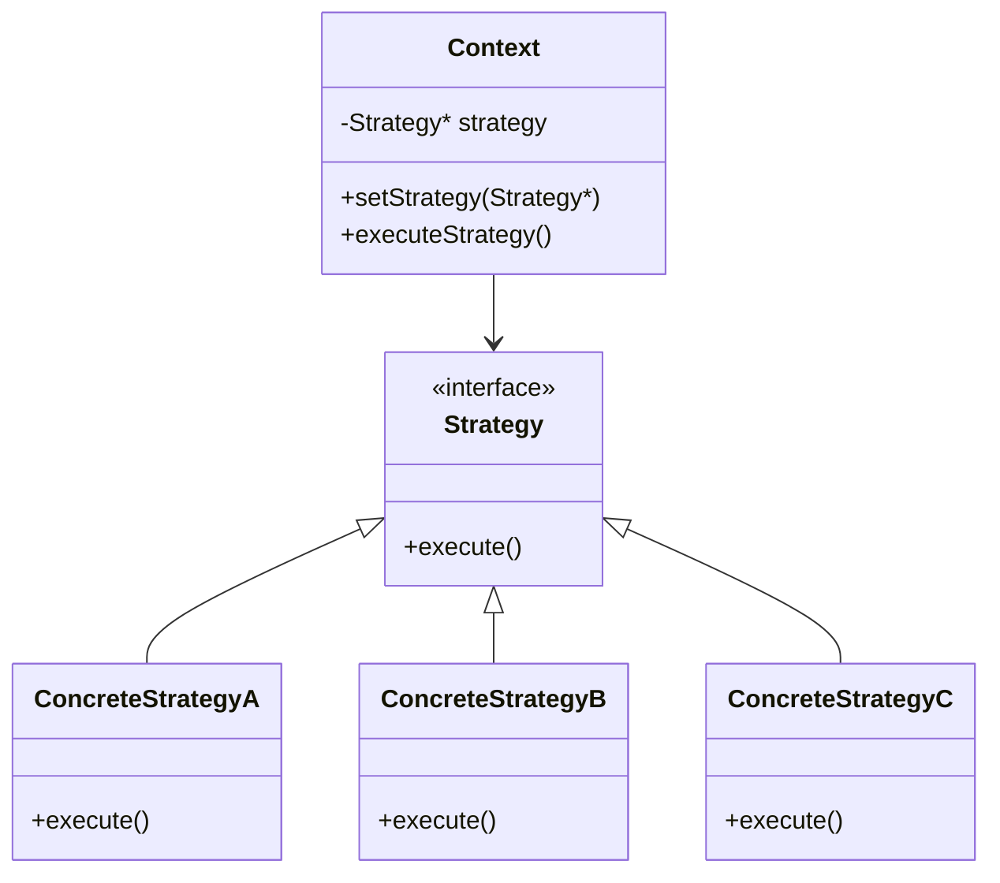

# C++ 策略模式

## 策略模式简介

策略模式是一种行为设计模式，它允许在运行时选择算法的行为。策略模式定义了一系列的算法，把它们一个个封装起来，并且使它们可以互相替换。这种模式让算法的变化独立于使用算法的客户端。

:::tip 重点
策略模式的核心思想是将算法的**定义**、**选择**和**使用**分离开来。
:::

## 为什么需要策略模式？

想象一下，你正在开发一个导航应用，需要根据不同的条件（时间最短、距离最短、费用最低等）计算路线。如果将所有这些算法混合在一个类中，代码将变得难以维护：

```cpp
class Navigator {
public:
    void buildRoute(const std::string& routeType) {
        if (routeType == "fastest") {
            // 实现最快路线算法
            std::cout << "构建最快路线" << std::endl;
        } else if (routeType == "shortest") {
            // 实现最短路线算法
            std::cout << "构建最短路线" << std::endl;
        } else if (routeType == "economic") {
            // 实现最经济路线算法
            std::cout << "构建最经济路线" << std::endl;
        }
    }
};
```

这种实现有几个明显问题：

1. 违反了开闭原则：添加新的路线类型需要修改现有代码
2. 代码难以维护：所有算法混杂在一个方法中
3. 代码重用困难：算法无法在其他上下文中使用

## 策略模式的结构

策略模式包含以下三个主要部分：



1. **策略（Strategy）**：定义所有支持的算法的公共接口
2. **具体策略（Concrete Strategy）**：实现策略接口的不同算法
3. **上下文（Context）**：维护一个对策略对象的引用，负责调用策略

## C++ 中的策略模式实现

以下是导航应用的策略模式实现：

```cpp
#include <iostream>
#include <memory>
#include <string>

// 策略接口
class RouteStrategy {
public:
    virtual ~RouteStrategy() = default;
    virtual void buildRoute(const std::string& from, const std::string& to) const = 0;
};

// 具体策略 - 最快路线
class FastestRouteStrategy : public RouteStrategy {
public:
    void buildRoute(const std::string& from, const std::string& to) const override {
        std::cout << "构建从 " << from << " 到 " << to << " 的最快路线。" << std::endl;
        std::cout << "优先考虑高速公路和快速通道。" << std::endl;
    }
};

// 具体策略 - 最短路线
class ShortestRouteStrategy : public RouteStrategy {
public:
    void buildRoute(const std::string& from, const std::string& to) const override {
        std::cout << "构建从 " << from << " 到 " << to << " 的最短路线。" << std::endl;
        std::cout << "选择最短距离，不考虑交通状况。" << std::endl;
    }
};

// 具体策略 - 最经济路线
class EconomicRouteStrategy : public RouteStrategy {
public:
    void buildRoute(const std::string& from, const std::string& to) const override {
        std::cout << "构建从 " << from << " 到 " << to << " 的最经济路线。" << std::endl;
        std::cout << "避免收费道路和拥堵地区。" << std::endl;
    }
};

// 上下文
class Navigator {
private:
    std::unique_ptr<RouteStrategy> strategy;

public:
    Navigator() : strategy(nullptr) {}
    
    void setStrategy(std::unique_ptr<RouteStrategy> strategy) {
        this->strategy = std::move(strategy);
    }
    
    void buildRoute(const std::string& from, const std::string& to) {
        if (strategy) {
            strategy->buildRoute(from, to);
        } else {
            std::cout << "请先设置导航策略！" << std::endl;
        }
    }
};

int main() {
    Navigator navigator;
    
    std::cout << "旅行开始，从北京到上海..." << std::endl;
    
    navigator.setStrategy(std::make_unique<FastestRouteStrategy>());
    navigator.buildRoute("北京", "上海");
    
    std::cout << "\n交通状况变糟，切换策略..." << std::endl;
    
    navigator.setStrategy(std::make_unique<ShortestRouteStrategy>());
    navigator.buildRoute("北京", "上海");
    
    std::cout << "\n油价上涨，切换策略..." << std::endl;
    
    navigator.setStrategy(std::make_unique<EconomicRouteStrategy>());
    navigator.buildRoute("北京", "上海");
    
    return 0;
}
```

### 输出结果

```
旅行开始，从北京到上海...
构建从 北京 到 上海 的最快路线。
优先考虑高速公路和快速通道。

交通状况变糟，切换策略...
构建从 北京 到 上海 的最短路线。
选择最短距离，不考虑交通状况。

油价上涨，切换策略...
构建从 北京 到 上海 的最经济路线。
避免收费道路和拥堵地区。
```

## 策略模式的优点

1. **开闭原则**：可以添加新策略而无需修改现有代码
2. **单一职责原则**：每个策略只负责一种算法
3. **更好的灵活性**：策略可以在运行时动态替换
4. **避免条件语句**：减少了大量的条件判断
5. **代码复用**：策略可以在不同的上下文中使用

## 策略模式的缺点

1. **客户端必须了解所有策略**：客户端需要知道有哪些策略可用
2. **增加了对象数量**：每个策略都是一个单独的类
3. **可能存在未使用的策略**：如果系统提供了许多策略，但客户端只使用其中一部分

## 使用策略模式的实际案例

### 案例1：排序算法选择

```cpp
#include <iostream>
#include <vector>
#include <memory>
#include <algorithm>

// 策略接口
class SortStrategy {
public:
    virtual ~SortStrategy() = default;
    virtual void sort(std::vector<int>& data) const = 0;
};

// 冒泡排序策略
class BubbleSort : public SortStrategy {
public:
    void sort(std::vector<int>& data) const override {
        std::cout << "使用冒泡排序..." << std::endl;
        int n = data.size();
        for (int i = 0; i < n - 1; i++) {
            for (int j = 0; j < n - i - 1; j++) {
                if (data[j] > data[j + 1]) {
                    std::swap(data[j], data[j + 1]);
                }
            }
        }
    }
};

// 快速排序策略
class QuickSort : public SortStrategy {
public:
    void sort(std::vector<int>& data) const override {
        std::cout << "使用快速排序..." << std::endl;
        std::sort(data.begin(), data.end());
    }
};

// 上下文
class Sorter {
private:
    std::unique_ptr<SortStrategy> strategy;

public:
    void setStrategy(std::unique_ptr<SortStrategy> strategy) {
        this->strategy = std::move(strategy);
    }
    
    void sortData(std::vector<int>& data) {
        if (strategy) {
            strategy->sort(data);
        } else {
            std::cout << "请先设置排序策略！" << std::endl;
        }
    }
};

// 打印数组
void printArray(const std::vector<int>& data) {
    for (int num : data) {
        std::cout << num << " ";
    }
    std::cout << std::endl;
}

int main() {
    std::vector<int> data = {64, 34, 25, 12, 22, 11, 90};
    Sorter sorter;
    
    std::cout << "原始数据: ";
    printArray(data);
    
    // 小数据量使用冒泡排序
    sorter.setStrategy(std::make_unique<BubbleSort>());
    sorter.sortData(data);
    std::cout << "排序后: ";
    printArray(data);
    
    // 重置数据
    data = {64, 34, 25, 12, 22, 11, 90, 88, 76, 54, 43, 32, 21};
    std::cout << "\n新的数据集: ";
    printArray(data);
    
    // 大数据量使用快速排序
    sorter.setStrategy(std::make_unique<QuickSort>());
    sorter.sortData(data);
    std::cout << "排序后: ";
    printArray(data);
    
    return 0;
}
```

### 案例2：支付系统

```cpp
#include <iostream>
#include <memory>
#include <string>

// 策略接口
class PaymentStrategy {
public:
    virtual ~PaymentStrategy() = default;
    virtual void pay(double amount) const = 0;
};

// 信用卡支付策略
class CreditCardPayment : public PaymentStrategy {
private:
    std::string name;
    std::string cardNumber;
    std::string cvv;
    std::string dateOfExpiry;

public:
    CreditCardPayment(const std::string& name, const std::string& cardNumber,
                      const std::string& cvv, const std::string& dateOfExpiry)
        : name(name), cardNumber(cardNumber), cvv(cvv), dateOfExpiry(dateOfExpiry) {}

    void pay(double amount) const override {
        std::cout << amount << "元已通过信用卡支付。" << std::endl;
        std::cout << "信用卡详情：" << name << ", " 
                 << "卡号: " << maskCardNumber(cardNumber) << std::endl;
    }

private:
    std::string maskCardNumber(const std::string& cardNumber) const {
        if (cardNumber.length() < 4) return cardNumber;
        std::string masked = std::string(cardNumber.length() - 4, '*');
        return masked + cardNumber.substr(cardNumber.length() - 4);
    }
};

// 支付宝支付策略
class AlipayPayment : public PaymentStrategy {
private:
    std::string email;
    
public:
    AlipayPayment(const std::string& email) : email(email) {}
    
    void pay(double amount) const override {
        std::cout << amount << "元已通过支付宝支付。" << std::endl;
        std::cout << "支付宝账户：" << email << std::endl;
    }
};

// 微信支付策略
class WechatPayment : public PaymentStrategy {
private:
    std::string phoneNumber;
    
public:
    WechatPayment(const std::string& phoneNumber) : phoneNumber(phoneNumber) {}
    
    void pay(double amount) const override {
        std::cout << amount << "元已通过微信支付。" << std::endl;
        std::cout << "微信账户：" << phoneNumber << std::endl;
    }
};

// 上下文 - 购物车
class ShoppingCart {
private:
    double totalAmount;
    std::unique_ptr<PaymentStrategy> paymentStrategy;
    
public:
    ShoppingCart() : totalAmount(0) {}
    
    void addItem(double price) {
        totalAmount += price;
    }
    
    double getTotalAmount() const {
        return totalAmount;
    }
    
    void setPaymentStrategy(std::unique_ptr<PaymentStrategy> strategy) {
        paymentStrategy = std::move(strategy);
    }
    
    void checkout() {
        if (paymentStrategy) {
            paymentStrategy->pay(totalAmount);
        } else {
            std::cout << "请选择支付方式！" << std::endl;
        }
    }
};

int main() {
    ShoppingCart cart;
    
    cart.addItem(100);
    cart.addItem(50);
    cart.addItem(200);
    
    std::cout << "购物车总金额: " << cart.getTotalAmount() << "元" << std::endl;
    
    std::cout << "\n使用信用卡支付：" << std::endl;
    cart.setPaymentStrategy(std::make_unique<CreditCardPayment>(
        "张三", "1234567890123456", "123", "12/2025"));
    cart.checkout();
    
    std::cout << "\n使用支付宝支付：" << std::endl;
    cart.setPaymentStrategy(std::make_unique<AlipayPayment>("example@alipay.com"));
    cart.checkout();
    
    std::cout << "\n使用微信支付：" << std::endl;
    cart.setPaymentStrategy(std::make_unique<WechatPayment>("13800138000"));
    cart.checkout();
    
    return 0;
}
```

## 策略模式与C++的关系

C++的多态性非常适合实现策略模式。继承和虚函数使得我们能够轻松创建和替换不同的策略。此外，C++11引入的智能指针（如`std::unique_ptr`）使得策略对象的内存管理变得更加安全和简单。

:::note 现代C++技巧
在C++中，除了使用传统的类继承方式实现策略模式外，还可以利用函数对象、lambda表达式或`std::function`来实现更灵活的策略模式变体。
:::

## 策略模式与函数对象和Lambda表达式

现代C++提供了更简洁的方式来实现策略模式：

```cpp
#include <iostream>
#include <functional>
#include <vector>

class TextFormatter {
private:
    std::function<std::string(const std::string&)> formattingStrategy;
    
public:
    void setStrategy(const std::function<std::string(const std::string&)>& strategy) {
        formattingStrategy = strategy;
    }
    
    std::string format(const std::string& text) {
        if (formattingStrategy) {
            return formattingStrategy(text);
        }
        return text; // 默认不做格式化
    }
};

int main() {
    TextFormatter formatter;
    std::string text = "hello world";
    
    // 使用Lambda表达式作为策略
    formatter.setStrategy([](const std::string& s) {
        std::string result = s;
        for (char& c : result) c = std::toupper(c);
        return result;
    });
    std::cout << "大写格式: " << formatter.format(text) << std::endl;
    
    formatter.setStrategy([](const std::string& s) {
        std::string result;
        for (size_t i = 0; i < s.length(); ++i) {
            result += s[i];
            if (i < s.length() - 1) result += "-";
        }
        return result;
    });
    std::cout << "连字符格式: " << formatter.format(text) << std::endl;
    
    return 0;
}
```

## 何时使用策略模式

以下场景适合使用策略模式：

1. 当一个类定义了多种行为，并且这些行为以多个条件语句的形式出现
2. 当需要使用一个算法的不同变体
3. 当算法使用的数据不应该被客户端知道
4. 当一个类中有很多行为，每个行为都在特定条件下执行

## 策略模式与其他设计模式的关系

- **工厂方法模式**：工厂方法可以用来创建适当的策略对象
- **模板方法模式**：模板方法在编译时定义算法骨架，而策略模式允许在运行时更改整个算法
- **命令模式**：命令模式可以用策略模式来参数化
- **状态模式**：状态模式可以被视为策略模式的扩展，但状态可以改变自身状态，策略通常不会

## 总结

策略模式是一种强大的设计模式，它通过定义一系列的算法，将每个算法封装成独立的类，并使它们可以互相替换。这种模式的主要优点包括：

1. 遵循开闭原则，易于扩展
2. 避免了大量的条件判断
3. 提高了代码的复用性和可维护性
4. 可以在运行时切换算法行为

在C++中，策略模式可以通过类继承和多态来实现，也可以利用现代C++的函数对象和Lambda表达式获得更简洁的实现。当你面对一个含有多种算法或行为的问题，并且这些算法需要动态切换时，请考虑使用策略模式。

## 练习

1. 创建一个文本压缩系统，实现多种压缩策略（如ZIP、RAR、Gzip等）。
2. 开发一个简单的游戏，其中角色可以采用不同的攻击策略（远程攻击、近战攻击、魔法攻击等）。
3. 实现一个验证系统，支持多种验证策略（电子邮件、手机号码、用户名密码等）。

## 进一步阅读

- 《设计模式：可复用面向对象软件的基础》（GoF设计模式）
- 《Head First设计模式》（更加通俗易懂的设计模式介绍）
- 《Effective C++》第35条：考虑使用非成员函数替换成员函数
- 《C++ Templates》：了解C++模板与策略模式的关系