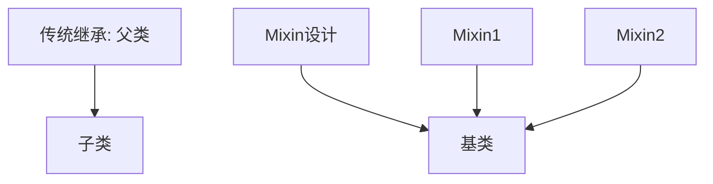

# C++ Mixin类

## 什么是Mixin类？

Mixin类是一种特殊类型的类，它被设计用来为其他类提供额外的功能，而不需要使用传统的继承方式。在C++中，Mixin模式是一种代码复用技术，允许我们将功能模块化并灵活地组合到不同的类中。

:::note
Mixin一词源于"mix in"，暗示将一些功能"混入"到另一个类中。这个概念在多种编程语言中都有应用，包括C++，Python和Ruby等。
:::

## Mixin与传统继承的区别

在传统的继承中，子类继承父类的全部功能，形成一种"是一个"(is-a)的关系。而Mixin则更像是"具有某种能力"(has-ability)的关系：



## C++ 中实现Mixin的方法

### 1. 使用模板和多重继承

C++中最常见的Mixin实现方式是通过模板和多重继承的组合：

```cpp
// 定义Mixin类：打印功能
template <typename Base>
class PrintableMixin : public Base {
public:
    void print() const {
        std::cout << "Data: " << this->getData() << std::endl;
    }
};

// 定义Mixin类：日志功能
template <typename Base>
class LoggableMixin : public Base {
public:
    void log(const std::string& message) const {
        std::cout << "Log: " << message << " (data: " << this->getData() << ")" << std::endl;
    }
};

// 基础类
class BasicData {
public:
    BasicData(int data) : data_(data) {}
    int getData() const { return data_; }

private:
    int data_;
};

// 组合多个Mixin
using LoggableAndPrintableData = PrintableMixin<LoggableMixin<BasicData>>;
```

使用示例：

```cpp
int main() {
    LoggableAndPrintableData obj(42);
    obj.print();      // 输出: Data: 42
    obj.log("测试");  // 输出: Log: 测试 (data: 42)
    return 0;
}
```

### 2. 使用CRTP模式（奇异递归模板模式）

另一种实现Mixin的方式是使用CRTP (Curiously Recurring Template Pattern)：

```cpp
// Mixin基类
template <typename Derived>
class SerializableMixin {
public:
    std::string serialize() const {
        const Derived& derived = static_cast<const Derived&>(*this);
        return derived.serializeImpl();
    }
};

// 使用Mixin的类
class User : public SerializableMixin<User> {
public:
    User(const std::string& name, int age) : name_(name), age_(age) {}
    
    std::string serializeImpl() const {
        return "name: " + name_ + ", age: " + std::to_string(age_);
    }

private:
    std::string name_;
    int age_;
};
```

使用示例：

```cpp
int main() {
    User user("张三", 30);
    std::cout << user.serialize() << std::endl;  // 输出: name: 张三, age: 30
    return 0;
}
```

## Mixin的实际应用场景

### 1. 图形用户界面组件

在GUI库中，我们可以使用Mixin为基础控件添加不同的功能：

```cpp
// 基础按钮类
class Button {
public:
    Button(const std::string& label) : label_(label) {}
    void draw() { std::cout << "绘制按钮: " << label_ << std::endl; }

protected:
    std::string label_;
};

// 添加动画效果的Mixin
template<typename Base>
class AnimatedMixin : public Base {
public:
    using Base::Base;  // 继承构造函数
    
    void animate() {
        std::cout << "为 " << this->label_ << " 添加动画效果" << std::endl;
    }
};

// 添加工具提示的Mixin
template<typename Base>
class TooltipMixin : public Base {
public:
    using Base::Base;
    
    void setTooltip(const std::string& tip) {
        tooltip_ = tip;
    }
    
    void showTooltip() {
        std::cout << "显示提示: " << tooltip_ << std::endl;
    }
    
private:
    std::string tooltip_;
};

// 创建具有动画和工具提示功能的按钮
using FancyButton = TooltipMixin<AnimatedMixin<Button>>;
```

使用示例：

```cpp
int main() {
    FancyButton btn("提交");
    btn.draw();        // 输出: 绘制按钮: 提交
    btn.animate();     // 输出: 为 提交 添加动画效果
    btn.setTooltip("点击以提交表单");
    btn.showTooltip(); // 输出: 显示提示: 点击以提交表单
    return 0;
}
```

### 2. 游戏实体系统

在游戏开发中，可以使用Mixin为游戏对象添加不同的能力：

```cpp
// 基础游戏实体
class GameObject {
public:
    GameObject(const std::string& name) : name_(name) {}
    std::string getName() const { return name_; }

protected:
    std::string name_;
};

// 可移动的Mixin
template<typename Base>
class MovableMixin : public Base {
public:
    using Base::Base;
    
    void setPosition(float x, float y) {
        x_ = x;
        y_ = y;
        std::cout << this->getName() << " 移动到位置 (" << x_ << ", " << y_ << ")" << std::endl;
    }
    
private:
    float x_ = 0.0f;
    float y_ = 0.0f;
};

// 可破坏的Mixin
template<typename Base>
class DestructibleMixin : public Base {
public:
    using Base::Base;
    
    void setHealth(int health) {
        health_ = health;
    }
    
    void takeDamage(int amount) {
        health_ -= amount;
        std::cout << this->getName() << " 受到 " << amount << " 点伤害，剩余生命值: " << health_ << std::endl;
        
        if (health_ <= 0) {
            std::cout << this->getName() << " 被摧毁!" << std::endl;
        }
    }
    
private:
    int health_ = 100;
};

// 创建一个可移动且可破坏的敌人
using Enemy = DestructibleMixin<MovableMixin<GameObject>>;
```

使用示例：

```cpp
int main() {
    Enemy goblin("哥布林");
    goblin.setPosition(10.0f, 20.0f); // 输出: 哥布林 移动到位置 (10, 20)
    goblin.setHealth(50);
    goblin.takeDamage(30);           // 输出: 哥布林 受到 30 点伤害，剩余生命值: 20
    goblin.takeDamage(25);           // 输出: 哥布林 受到 25 点伤害，剩余生命值: -5
                                     // 输出: 哥布林 被摧毁!
    return 0;
}
```

## Mixin的优缺点

### 优点
1. **灵活组合功能** - 可以根据需要组合不同的功能
2. **避免深层继承层次** - 减少传统多层继承带来的复杂性
3. **代码复用** - 功能模块可以在多个不相关的类中重用

### 缺点
1. **可能导致复杂的类型层次** - 特别是当组合多个Mixin时
2. **编译时间增加** - 大量使用模板可能导致编译变慢
3. **错误消息难以理解** - 由于模板，编译错误可能很复杂

:::caution
在使用多个Mixin时，要小心处理多重继承可能带来的歧义问题，特别是钻石继承情况。
:::

## 最佳实践

1. **保持Mixin简单** - 每个Mixin应该只提供一个清晰、明确的功能
2. **避免Mixin之间的依赖** - Mixin应尽可能独立
3. **使用描述性命名** - 清晰表明Mixin提供的功能
4. **文档化Mixin的要求** - 明确说明使用你的Mixin的类需要实现哪些方法

## 总结

Mixin类是C++中实现代码复用的强大工具，它允许我们以更灵活的方式组合功能。与传统继承相比，Mixin模式能更好地支持"组合优于继承"的设计原则。通过模板和多重继承的结合，我们可以创建出具有多种能力的类，而不必拘泥于严格的继承层次结构。

在实际项目中，Mixin可以帮助我们创建更模块化、可维护的代码库，特别适合需要高度定制化组件的领域，如UI框架、游戏引擎和通用工具库等。

## 练习

1. 创建一个`Cacheable` Mixin，为任何类添加缓存功能
2. 实现一个`Observable` Mixin，使类能够支持观察者模式
3. 设计一个文件系统类，使用Mixin添加压缩、加密和日志功能
4. 尝试将多个Mixin组合到一个类中，观察是否出现任何问题，如何解决这些问题？

## 进一步阅读

- 《Effective C++》和《More Effective C++》 - Scott Meyers
- 《Modern C++ Design》 - Andrei Alexandrescu
- 《C++ Templates: The Complete Guide》 - David Vandevoorde和Nicolai M. Josuttis

通过掌握Mixin模式，你将能够编写更加灵活、可组合的C++代码，充分利用C++语言的强大特性。