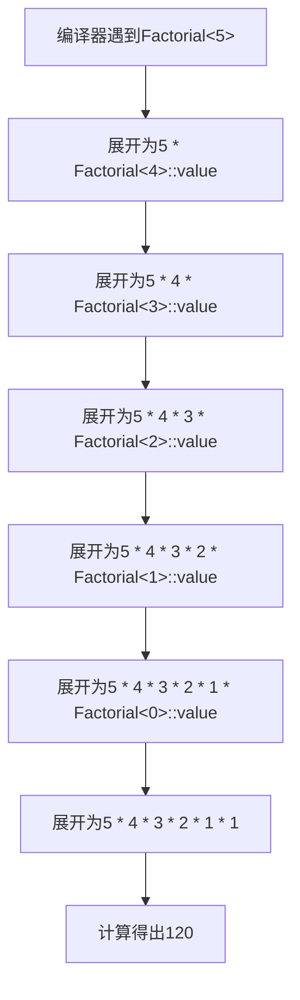

# C++ 编译时编程

## 什么是编译时编程？

编译时编程是C++中一种强大的技术，它允许我们在程序**编译期间**而不是运行期间执行某些计算和逻辑操作。这意味着可以将一些工作从程序运行时转移到编译时，从而提高程序的运行效率。

:::tip 好处
编译时编程能够提高程序的性能，减少运行时开销，并且可以捕获更多的错误在编译阶段。
:::

C++编译时编程主要涉及以下几个方面：
- 模板元编程（Template Metaprogramming）
- 常量表达式（Constexpr）
- 编译时类型特性（Type Traits）
- 编译时断言（Static Assertions）

让我们一步步探索这些技术。

## 模板元编程基础

模板元编程是C++编译时编程的核心技术之一，它利用C++模板系统在编译期进行计算。

### 递归模板实现编译时计算

以计算阶乘为例：

```cpp
// 递归模板
template <int N>
struct Factorial {
    static constexpr int value = N * Factorial<N-1>::value;
};

// 基准情况
template <>
struct Factorial<0> {
    static constexpr int value = 1;
};

// 使用
constexpr int result = Factorial<5>::value; // 编译时计算 5! = 120
```

上面的代码在编译时计算了5的阶乘。当你查看编译后的代码，实际上`result`已经是值120了，而不是在运行时才计算。

### 编译时计算的工作原理



## 使用constexpr进行编译时计算

从C++11开始，C++引入了`constexpr`关键字，使编译时编程变得更加直观和强大。

### constexpr函数

```cpp
// 使用constexpr定义一个编译时计算阶乘的函数
constexpr int factorial(int n) {
    return (n <= 1) ? 1 : (n * factorial(n-1));
}

// 编译时计算
constexpr int val = factorial(5); // 编译时计算，结果为120

// 运行时也可以使用相同的函数
int runtime_val = factorial(val); // 运行时使用val=120作为参数
```

:::note 比较
与模板元编程相比，`constexpr`函数通常更易读、更容易维护，并且既可以在编译时使用，也可以在运行时使用。
:::

### C++ 14和C++17中的constexpr增强

C++14允许在constexpr函数中使用更多的语言特性：

```cpp
constexpr int sum(int n) {
    int result = 0;
    for (int i = 0; i <= n; ++i) {
        result += i;
    }
    return result;
}

constexpr int val = sum(10); // 编译时计算1+2+...+10 = 55
```

C++17中，可以在constexpr函数中使用if语句、switch语句等更多控制流：

```cpp
constexpr int max(int a, int b) {
    if (a > b) 
        return a;
    else
        return b;
}
```

## 编译时类型特性(Type Traits)

C++标准库提供了`<type_traits>`头文件，它包含许多用于在编译时检查和操作类型的模板。

```cpp
#include <type_traits>
#include <iostream>

template <typename T>
void process(T value) {
    if constexpr (std::is_integral<T>::value) {
        std::cout << "处理整数: " << value << std::endl;
    } else if constexpr (std::is_floating_point<T>::value) {
        std::cout << "处理浮点数: " << value << std::endl;
    } else {
        std::cout << "处理其他类型" << std::endl;
    }
}

// 使用
int main() {
    process(42);       // 输出: 处理整数: 42
    process(3.14);     // 输出: 处理浮点数: 3.14
    process("hello");  // 输出: 处理其他类型
    return 0;
}
```

在上面的例子中，`if constexpr`是C++17引入的，它允许我们根据编译时的条件来编译不同的代码分支。

## 编译时断言(Static Assertions)

`static_assert`是C++11引入的关键字，用于在编译时检查条件是否满足：

```cpp
template <typename T>
class Vector {
public:
    static_assert(std::is_default_constructible<T>::value,
                  "Vector中的元素类型必须支持默认构造!");
    
    // 类的其余部分...
};

// 使用
struct NoDefaultCtor {
    NoDefaultCtor() = delete;
    NoDefaultCtor(int) {}
};

Vector<int> vi;        // 正常编译
// Vector<NoDefaultCtor> vnc;  // 编译错误，提示"Vector中的元素类型必须支持默认构造!"
```

## 实际应用案例

### 案例1: 编译时多态性

利用模板和编译时编程可以实现编译时多态性，避免运行时的虚函数调用开销：

```cpp
// 传统运行时多态
class Shape {
public:
    virtual double area() const = 0;
    virtual ~Shape() {}
};

class Circle : public Shape {
private:
    double radius;
public:
    Circle(double r) : radius(r) {}
    double area() const override { return 3.14159 * radius * radius; }
};

// 编译时多态（CRTP模式）
template <typename Derived>
class ShapeBase {
public:
    double area() const {
        return static_cast<const Derived*>(this)->area_impl();
    }
};

class CircleCRTP : public ShapeBase<CircleCRTP> {
private:
    double radius;
public:
    CircleCRTP(double r) : radius(r) {}
    double area_impl() const { return 3.14159 * radius * radius; }
};
```

在编译时多态的版本中，虚函数调用被完全消除，因为编译器已经知道了确切的类型。

### 案例2: 优化的容器实现

```cpp
template <typename T, size_t N>
class StaticArray {
    T data[N];
public:
    constexpr T& operator[](size_t i) {
        return data[i];
    }
    
    constexpr const T& operator[](size_t i) const {
        return data[i];
    }
    
    constexpr size_t size() const {
        return N;
    }
};

// 编译时计算数组和
template <typename T, size_t N>
constexpr T sum(const StaticArray<T, N>& arr) {
    T result = {};
    for (size_t i = 0; i < N; ++i) {
        result += arr[i];
    }
    return result;
}

// 使用示例
int main() {
    // 编译时初始化和计算
    constexpr StaticArray<int, 5> arr = {1, 2, 3, 4, 5};
    constexpr int total = sum(arr);  // 编译时计算结果为15
    
    static_assert(total == 15, "Sum calculation error!");
    
    return 0;
}
```

这个优化的静态数组在编译时就已经计算出了数组的和，无需运行时开销。

### 案例3: 编译时确保单位一致性

```cpp
template <int M, int K, int S>
class Unit {
public:
    // M为米，K为千克，S为秒的幂次
    constexpr Unit() {}
    
    // 单位乘法
    template <int M2, int K2, int S2>
    constexpr auto operator*(const Unit<M2, K2, S2>&) const {
        return Unit<M + M2, K + K2, S + S2>{};
    }
    
    // 单位除法
    template <int M2, int K2, int S2>
    constexpr auto operator/(const Unit<M2, K2, S2>&) const {
        return Unit<M - M2, K - K2, S - S2>{};
    }
};

// 预定义单位
using Meter = Unit<1, 0, 0>;        // 米
using Kilogram = Unit<0, 1, 0>;     // 千克
using Second = Unit<0, 0, 1>;       // 秒
using Velocity = Unit<1, 0, -1>;    // 速度 (米/秒)
using Acceleration = Unit<1, 0, -2>; // 加速度 (米/秒²)
using Force = Unit<1, 1, -2>;       // 力 (牛顿)

// 使用示例
template <typename UnitType, typename T = double>
class Quantity {
    T value;
public:
    constexpr Quantity(T v) : value(v) {}
    
    template <typename OtherUnit, typename OtherT>
    constexpr auto operator*(const Quantity<OtherUnit, OtherT>& other) const {
        using ResultUnit = decltype(UnitType{} * OtherUnit{});
        return Quantity<ResultUnit, decltype(value * other.value)>(value * other.value);
    }
};

int main() {
    Quantity<Meter> distance(100.0);        // 100米
    Quantity<Second> time(10.0);            // 10秒
    
    // 编译时检查单位一致性
    auto velocity = distance / time;        // 正确: 米/秒
    
    Quantity<Kilogram> mass(5.0);           // 5千克
    auto force = mass * velocity / time;    // 正确: 千克*米/秒²
    
    // auto invalid = distance + mass;      // 错误: 不能加米和千克
    return 0;
}
```

这个例子通过模板元编程和编译时计算确保了物理单位在计算中的一致性，可以在编译期捕获单位错误。

## 高级特性: C++20中的概念(Concepts)

C++20引入了概念(Concepts)，这是编译时编程的一个重要扩展，它提供了一种简洁的方式来表达模板参数的约束：

```cpp
#include <concepts>

// 定义一个概念
template <typename T>
concept Numeric = std::integral<T> || std::floating_point<T>;

// 使用概念约束模板参数
template <Numeric T>
T add(T a, T b) {
    return a + b;
}

// 使用示例
int main() {
    int a = add(5, 3);           // 正确
    double b = add(3.14, 2.71);  // 正确
    // std::string c = add("hello", "world"); // 错误: std::string不满足Numeric概念
    return 0;
}
```

Concepts使编译时约束更加清晰和可读，并且可以大大改善错误消息。

## 总结

编译时编程是C++中一项强大的技术，它可以：

1. 将计算从运行时转移到编译时，提高程序性能
2. 在编译阶段捕获错误，而不是运行时
3. 实现泛型编程和元编程，生成优化的代码
4. 通过静态类型检查提高代码安全性

本文介绍了几种主要的编译时编程技术：
- 模板元编程
- constexpr函数和变量
- 类型特性(Type Traits)
- 静态断言(static_assert)
- 编译时条件语句(if constexpr)
- 概念(Concepts)

通过这些技术，C++程序员可以编写更加高效、安全和灵活的代码。

## 进一步学习

要深入了解C++编译时编程，可以尝试以下练习和资源：

### 练习

1. 创建一个编译时计算斐波那契数列的模板类和constexpr函数，比较两种方式的使用体验。
2. 实现一个编译时的字符串哈希函数，用于常量字符串的高效比较。
3. 设计一个利用编译时编程的日志系统，可以在编译时决定是否包含调试信息。
4. 尝试使用C++20的concepts重写一些之前使用SFINAE或type_traits的代码。

### 资源推荐

1. 《C++ Templates - The Complete Guide》- David Vandevoorde, Nicolai M. Josuttis
2. 《Modern C++ Design: Generic Programming and Design Patterns Applied》- Andrei Alexandrescu
3. [C++ Reference](https://en.cppreference.com/) - 查询最新的C++标准和特性
4. [Boost MPL库](https://www.boost.org/doc/libs/release/libs/mpl/) - 学习高级模板元编程技术

记住，编译时编程需要时间来掌握，但它是C++中最强大的特性之一，值得投入时间学习。