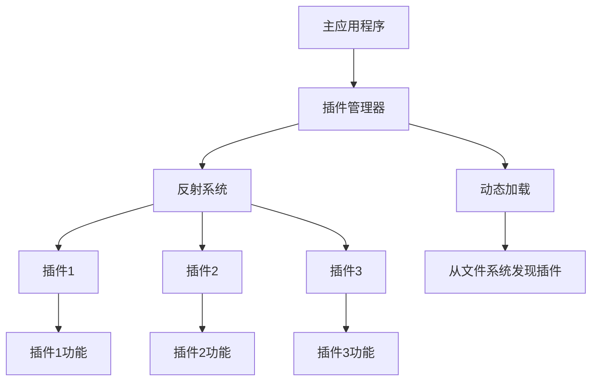

# C++ 反射技术

## 什么是反射？

反射（Reflection）是一种程序在运行时检查、分析和修改自身结构和行为的能力。简单来说，反射允许程序"自我审视"，获取自身类型、属性和方法的相关信息，甚至在运行时动态调用这些方法。

:::note
在很多现代编程语言（如Java、C#、Python）中，反射是内置功能。但C++标准库并没有直接提供内置的反射机制。
:::

## 为什么C++需要反射？

虽然C++以其高效和直接的特性而闻名，但在某些场景下，反射技术非常有用：

1. **序列化和反序列化**：将对象转换为可存储或传输的格式
2. **对象关系映射（ORM）**：数据库操作
3. **插件系统**：动态加载和使用组件
4. **GUI框架**：动态创建和操作界面元素
5. **自动化测试**：动态生成测试用例

## C++ 中实现反射的方法

由于C++标准没有内置反射机制，我们需要通过一些技巧来实现类似的功能。以下是几种常见方法：

### 1. 使用宏和预处理器

这是最基本的方法，使用宏来注册类的信息。

```cpp
#include <iostream>
#include <map>
#include <string>
#include <functional>

// 类型信息存储
class TypeInfo {
public:
    std::string name;
    std::map<std::string, std::function<void*()>> constructors;
};

// 全局类型注册表
std::map<std::string, TypeInfo> typeRegistry;

// 定义注册宏
#define REGISTER_CLASS(className) \
    namespace { \
        class className##Registrar { \
        public: \
            className##Registrar() { \
                TypeInfo info; \
                info.name = #className; \
                info.constructors["default"] = []() -> void* { return new className(); }; \
                typeRegistry[#className] = info; \
            } \
        }; \
        className##Registrar _##className##Registrar; \
    }

// 示例类
class MyClass {
public:
    MyClass() { std::cout << "MyClass constructed!" << std::endl; }
    void sayHello() { std::cout << "Hello from MyClass!" << std::endl; }
};

// 注册类
REGISTER_CLASS(MyClass)

// 使用反射创建对象
int main() {
    // 查找类型
    if (typeRegistry.find("MyClass") != typeRegistry.end()) {
        // 创建实例
        MyClass* obj = static_cast<MyClass*>(typeRegistry["MyClass"].constructors["default"]());
        // 使用实例
        obj->sayHello();
        // 清理
        delete obj;
    } else {
        std::cout << "Class not registered!" << std::endl;
    }
    
    return 0;
}
```

输出:
```
MyClass constructed!
Hello from MyClass!
```

### 2. 使用模板元编程

模板元编程可以在编译时生成反射所需的类型信息。

```cpp
#include <iostream>
#include <string>
#include <map>
#include <typeinfo>
#include <typeindex>

// 属性基类
class PropertyBase {
public:
    virtual ~PropertyBase() = default;
    virtual const std::type_info& getType() const = 0;
    virtual std::string getName() const = 0;
};

// 属性模板类
template <typename Class, typename T>
class Property : public PropertyBase {
    T Class::* member;
    std::string name;

public:
    Property(const std::string& name, T Class::* member)
        : name(name), member(member) {}

    const std::type_info& getType() const override {
        return typeid(T);
    }

    std::string getName() const override {
        return name;
    }

    T& get(Class& obj) const {
        return obj.*member;
    }

    void set(Class& obj, const T& value) const {
        obj.*member = value;
    }
};

// 类型注册器
class TypeRegistry {
    std::map<std::type_index, std::map<std::string, std::unique_ptr<PropertyBase>>> registry;

public:
    template <typename Class, typename T>
    void registerProperty(const std::string& name, T Class::* member) {
        auto& props = registry[std::type_index(typeid(Class))];
        props[name] = std::make_unique<Property<Class, T>>(name, member);
    }

    template <typename Class>
    Property<Class, int>* getProperty(const std::string& name) {
        auto& props = registry[std::type_index(typeid(Class))];
        auto it = props.find(name);
        if (it != props.end()) {
            return dynamic_cast<Property<Class, int>*>(it->second.get());
        }
        return nullptr;
    }
};

// 全局注册表
TypeRegistry globalRegistry;

// 示例类
class Person {
public:
    int age;
    std::string name;

    Person() : age(0), name("") {}
    Person(int age, const std::string& name) : age(age), name(name) {}
};

int main() {
    // 注册属性
    globalRegistry.registerProperty("age", &Person::age);
    
    // 创建对象
    Person person(30, "Alice");
    
    // 使用反射获取和设置属性
    auto ageProp = globalRegistry.getProperty<Person>("age");
    if (ageProp) {
        std::cout << "Original age: " << ageProp->get(person) << std::endl;
        ageProp->set(person, 31);
        std::cout << "New age: " << ageProp->get(person) << std::endl;
    }
    
    return 0;
}
```

输出:
```
Original age: 30
New age: 31
```

### 3. 使用第三方库

有几个流行的C++反射库可以简化工作：

1. **rttr** (Run Time Type Reflection) - 提供了运行时反射功能
2. **meta** - 编译时反射库
3. **Magic Enum** - 为枚举提供反射能力

下面是使用 rttr 库的示例：

```cpp
#include <rttr/registration>
#include <iostream>
#include <string>

using namespace rttr;

class Person {
private:
    int age;
    std::string name;
    
public:
    Person() : age(0), name("") {}
    Person(int age, std::string name) : age(age), name(name) {}
    
    int getAge() const { return age; }
    void setAge(int age) { this->age = age; }
    
    std::string getName() const { return name; }
    void setName(const std::string& name) { this->name = name; }
    
    void displayInfo() const {
        std::cout << "Person: " << name << ", " << age << " years old" << std::endl;
    }
};

// 注册类型及其成员
RTTR_REGISTRATION {
    registration::class_<Person>("Person")
        .constructor<>()
        .constructor<int, std::string>()
        .property("age", &Person::getAge, &Person::setAge)
        .property("name", &Person::getName, &Person::setName)
        .method("displayInfo", &Person::displayInfo);
}

int main() {
    // 通过反射创建对象
    type personType = type::get_by_name("Person");
    variant obj = personType.create();
    
    // 检查创建是否成功
    if (!obj.is_valid()) {
        std::cout << "Failed to create object!" << std::endl;
        return 1;
    }
    
    Person& person = obj.get_value<Person>();
    
    // 通过反射设置属性值
    property ageProperty = personType.get_property("age");
    property nameProperty = personType.get_property("name");
    
    ageProperty.set_value(person, 25);
    nameProperty.set_value(person, std::string("John"));
    
    // 通过反射调用方法
    method displayMethod = personType.get_method("displayInfo");
    displayMethod.invoke(person);
    
    return 0;
}
```

输出:
```
Person: John, 25 years old
```

## 实际应用场景

### 1. 序列化框架

```cpp
#include <iostream>
#include <map>
#include <string>
#include <vector>
#include <functional>
#include <sstream>

// 类型反射基础设施
class ReflectionRegistry {
public:
    template<typename T>
    static void registerType(const std::string& name) {
        serializers[name] = [](void* obj) -> std::string {
            return static_cast<T*>(obj)->serialize();
        };
        
        deserializers[name] = [](const std::string& data) -> void* {
            T* obj = new T();
            obj->deserialize(data);
            return obj;
        };
    }
    
    static std::string serialize(const std::string& typeName, void* obj) {
        if (serializers.find(typeName) != serializers.end()) {
            return serializers[typeName](obj);
        }
        return "";
    }
    
    static void* deserialize(const std::string& typeName, const std::string& data) {
        if (deserializers.find(typeName) != deserializers.end()) {
            return deserializers[typeName](data);
        }
        return nullptr;
    }
    
private:
    static std::map<std::string, std::function<std::string(void*)>> serializers;
    static std::map<std::string, std::function<void*(const std::string&)>> deserializers;
};

std::map<std::string, std::function<std::string(void*)>> ReflectionRegistry::serializers;
std::map<std::string, std::function<void*(const std::string&)>> ReflectionRegistry::deserializers;

// 示例类
class User {
public:
    int id;
    std::string name;
    int age;
    
    User() : id(0), name(""), age(0) {}
    User(int id, const std::string& name, int age) : id(id), name(name), age(age) {}
    
    std::string serialize() const {
        std::stringstream ss;
        ss << id << "|" << name << "|" << age;
        return ss.str();
    }
    
    void deserialize(const std::string& data) {
        std::stringstream ss(data);
        std::string part;
        
        std::getline(ss, part, '|');
        id = std::stoi(part);
        
        std::getline(ss, part, '|');
        name = part;
        
        std::getline(ss, part, '|');
        age = std::stoi(part);
    }
    
    void display() const {
        std::cout << "User: ID=" << id << ", Name=" << name << ", Age=" << age << std::endl;
    }
};

// 注册User类
void registerTypes() {
    ReflectionRegistry::registerType<User>("User");
}

int main() {
    // 注册类型
    registerTypes();
    
    // 创建用户对象
    User user(1, "Alice", 30);
    std::cout << "Original user: ";
    user.display();
    
    // 序列化
    std::string serializedData = ReflectionRegistry::serialize("User", &user);
    std::cout << "Serialized data: " << serializedData << std::endl;
    
    // 反序列化
    User* deserializedUser = static_cast<User*>(ReflectionRegistry::deserialize("User", serializedData));
    std::cout << "Deserialized user: ";
    deserializedUser->display();
    
    // 清理
    delete deserializedUser;
    
    return 0;
}
```

输出:
```
Original user: User: ID=1, Name=Alice, Age=30
Serialized data: 1|Alice|30
Deserialized user: User: ID=1, Name=Alice, Age=30
```

### 2. 插件系统

反射技术可以用于构建可扩展的插件系统，允许在运行时发现和加载新功能。



简化示例代码：

```cpp
#include <iostream>
#include <map>
#include <string>
#include <memory>
#include <vector>

// 插件接口
class Plugin {
public:
    virtual ~Plugin() = default;
    virtual std::string getName() const = 0;
    virtual void execute() = 0;
};

// 插件管理器
class PluginManager {
    std::map<std::string, std::unique_ptr<Plugin>> plugins;

public:
    void registerPlugin(const std::string& name, std::unique_ptr<Plugin> plugin) {
        plugins[name] = std::move(plugin);
    }

    Plugin* getPlugin(const std::string& name) {
        auto it = plugins.find(name);
        if (it != plugins.end()) {
            return it->second.get();
        }
        return nullptr;
    }

    void executePlugin(const std::string& name) {
        Plugin* plugin = getPlugin(name);
        if (plugin) {
            plugin->execute();
        } else {
            std::cout << "Plugin '" << name << "' not found!" << std::endl;
        }
    }

    void listPlugins() {
        std::cout << "Available plugins:" << std::endl;
        for (const auto& pair : plugins) {
            std::cout << "- " << pair.first << std::endl;
        }
    }
};

// 工厂函数类型
using PluginCreator = std::unique_ptr<Plugin>(*)();

// 插件注册表
std::map<std::string, PluginCreator> pluginRegistry;

// 注册宏
#define REGISTER_PLUGIN(className) \
    std::unique_ptr<Plugin> create##className() { \
        return std::make_unique<className>(); \
    } \
    struct Register##className { \
        Register##className() { \
            pluginRegistry[#className] = create##className; \
        } \
    } register##className;

// 示例插件
class LoggerPlugin : public Plugin {
public:
    std::string getName() const override {
        return "Logger";
    }

    void execute() override {
        std::cout << "Logger plugin is executing!" << std::endl;
    }
};
REGISTER_PLUGIN(LoggerPlugin)

class DatabasePlugin : public Plugin {
public:
    std::string getName() const override {
        return "Database";
    }

    void execute() override {
        std::cout << "Database plugin is executing!" << std::endl;
    }
};
REGISTER_PLUGIN(DatabasePlugin)

int main() {
    PluginManager manager;

    // 使用反射加载插件
    for (const auto& pair : pluginRegistry) {
        manager.registerPlugin(pair.first, pair.second());
    }

    // 列出可用插件
    manager.listPlugins();

    // 执行插件
    manager.executePlugin("LoggerPlugin");
    manager.executePlugin("DatabasePlugin");
    manager.executePlugin("UnknownPlugin");

    return 0;
}
```

输出:
```
Available plugins:
- DatabasePlugin
- LoggerPlugin
Logger plugin is executing!
Database plugin is executing!
Plugin 'UnknownPlugin' not found!
```

## C++ 反射的局限性与挑战

1. **性能开销**：反射通常需要在运行时维护额外的类型信息，可能带来性能损失
2. **复杂性**：实现反射需要复杂的代码，难以维护
3. **类型安全**：运行时类型检查可能导致类型安全问题
4. **标准支持缺乏**：C++标准不提供内置反射，需要使用第三方库或自定义解决方案

## C++ 反射的未来

C++标准委员会正在考虑在未来版本中添加反射功能。目前有几个提案：

- P0194R3: 静态反射
- P0385R2: 静态反射（扩展）
- P0590R0: 在编译时通过反射修改类型

当这些提案被接受后，将大大简化C++中反射的实现，让它成为语言的内置功能。

## 总结

虽然C++不像其他一些现代语言那样提供内置的反射机制，但我们可以通过各种技术实现类似的功能：

1. **宏和预处理器** - 简单但有限
2. **模板元编程** - 功能强大但语法复杂
3. **第三方库** - 提供更完整的解决方案

反射技术在序列化、插件系统、GUI框架和ORM等场景中非常有用，但也带来了性能开销和复杂性的代价。随着C++标准的演进，未来可能会看到更加直接和强大的反射支持。

## 练习

1. 实现一个简单的反射系统，能够注册和创建类的实例
2. 扩展上面的序列化示例，使其支持嵌套对象的序列化和反序列化
3. 使用rttr库创建一个简单的属性编辑器，允许在运行时编辑对象的属性
4. 设计一个基于反射的简单组件系统，允许组件在运行时被添加到对象中

## 参考资源

- [C++ Templates: The Complete Guide](http://www.tmplbook.com/)
- [RTTR库文档](https://www.rttr.org/)
- [Magic Enum库](https://github.com/Neargye/magic_enum)
- [C++标准委员会关于反射的提案](http://www.open-std.org/jtc1/sc22/wg21/docs/papers/2017/p0194r3.html)

:::tip
虽然C++目前的反射功能有限，但通过正确的技术和设计，你可以实现强大的反射系统，让你的代码更加灵活和可扩展。随着C++标准的发展，反射将变得更加强大和易用。
:::