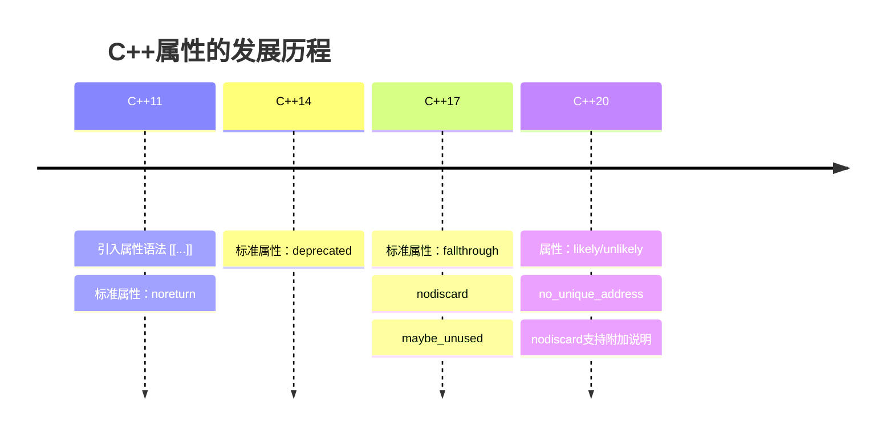

# C++ 属性

## 什么是C++属性？

C++属性(attributes)是C++11标准引入的一种语言特性，它允许程序员为编译器、IDE或其他工具提供额外的信息，以便优化代码生成、进行静态分析或提供特殊处理。属性不会改变程序的功能语义，但可以影响编译器如何处理代码，或者为开发人员提供警告和建议。

属性使用双方括号语法 `[[attribute_name]]` 声明，可以应用于多种代码元素，如变量、函数、类型等。

:::note
属性是元编程(metaprogramming)的一部分，它们提供关于代码的信息，而不是改变代码本身的行为。
:::

## 基本语法

C++属性的语法如下:

```cpp
[[attribute_name]] // 基本形式
[[attribute_name(args)]] // 带参数的形式
[[namespace::attribute_name]] // 带命名空间的形式
```

属性可以放置在多种代码元素之前，例如:

```cpp
[[noreturn]] void terminate_program(); // 应用于函数

class [[deprecated]] OldClass {}; // 应用于类

for [[likely]] (int i = 0; i < n; ++i) // 应用于语句
```

## 常见的标准C++属性

### 1. `[[noreturn]]`

表示函数不会返回控制权给调用者。例如，终止程序或抛出异常的函数。

```cpp
#include <iostream>
#include <cstdlib>

[[noreturn]] void terminate_program() {
    std::cout << "程序即将终止!" << std::endl;
    std::exit(1);
    // 不需要return语句，因为函数永远不会正常返回
}

int main() {
    std::cout << "调用terminate_program()之前" << std::endl;
    terminate_program();
    // 以下代码永远不会执行
    std::cout << "这行永远不会被执行" << std::endl;
    return 0;
}
```

输出:
```
调用terminate_program()之前
程序即将终止!
```

### 2. `[[deprecated]]` 和 `[[deprecated("reason")]]`

表示某个实体(函数、类、变量等)已经过时，不推荐使用。可以提供一个可选的字符串解释原因。使用被标记为deprecated的实体时，编译器会产生警告。

```cpp
#include <iostream>

[[deprecated("使用new_function替代")]] 
void old_function() {
    std::cout << "这是一个过时的函数" << std::endl;
}

void new_function() {
    std::cout << "这是新函数，请使用这个" << std::endl;
}

int main() {
    old_function(); // 编译器会警告: 'old_function' is deprecated: 使用new_function替代
    new_function();
    return 0;
}
```

### 3. `[[nodiscard]]` 和 `[[nodiscard("reason")]]`

表示函数的返回值不应该被忽略。如果调用该函数时丢弃了返回值，编译器会发出警告。C++20还允许添加解释原因的字符串。

```cpp
#include <iostream>

[[nodiscard]] bool check_status() {
    // 模拟某种状态检查
    return false; // 表示检查失败
}

[[nodiscard("忽略返回值可能导致资源泄漏")]] 
int* allocate_resource() {
    return new int[100];
}

int main() {
    // 错误用法 - 编译器会警告
    check_status();
    
    // 正确用法
    bool status = check_status();
    if (!status) {
        std::cout << "状态检查失败!" << std::endl;
    }
    
    // 错误用法 - 编译器会警告可能导致资源泄漏
    allocate_resource();
    
    // 正确用法
    int* resource = allocate_resource();
    // 使用resource
    delete[] resource;
    
    return 0;
}
```

### 4. `[[maybe_unused]]`

表示某个实体可能不会被使用，这样编译器就不会对未使用的实体发出警告。

```cpp
#include <iostream>
#include <cassert>

void debug_function([[maybe_unused]] int unused_param) {
#ifdef DEBUG
    std::cout << "Debug: " << unused_param << std::endl;
#endif
    // 在非DEBUG模式下，unused_param不会被使用
}

int main() {
    [[maybe_unused]] bool success = true;
    // 如果我们只在某些情况下使用success变量
    // 比如只在DEBUG模式下使用，使用maybe_unused可以避免警告
    
    debug_function(42);
    return 0;
}
```

### 5. `[[likely]]` 和 `[[unlikely]]`

C++20引入的属性，提示编译器某个分支更可能或不太可能被执行，以便优化代码生成。

```cpp
#include <iostream>

int process_data(int value) {
    if (value > 0) [[likely]] {
        // 编译器会优化这个分支，假设它更可能被执行
        return value * 2;
    } else [[unlikely]] {
        // 编译器假设这个分支不太可能被执行
        return 0;
    }
}

int main() {
    for (int i = -5; i <= 5; ++i) {
        std::cout << "process_data(" << i << ") = " 
                  << process_data(i) << std::endl;
    }
    return 0;
}
```

## 实际应用场景

### 场景1: 使用 `[[nodiscard]]` 增强代码安全性

在资源管理或错误检查函数中，返回值通常包含重要信息，不应该被忽略。

```cpp
#include <iostream>
#include <memory>

class ResourceManager {
public:
    [[nodiscard("忽略返回值可能导致资源泄漏")]]
    std::unique_ptr<int[]> allocate(size_t size) {
        return std::make_unique<int[]>(size);
    }
    
    [[nodiscard("必须检查操作是否成功")]]
    bool save_data(const std::string& filename) {
        // 模拟保存数据
        std::cout << "保存数据到 " << filename << std::endl;
        return true; // 返回操作是否成功
    }
};

int main() {
    ResourceManager rm;
    
    // 正确: 保存并检查返回值
    auto resource = rm.allocate(100);
    
    // 错误: 编译器会警告我们没有检查操作是否成功
    rm.save_data("data.txt");
    
    // 正确: 检查操作是否成功
    if (rm.save_data("backup.txt")) {
        std::cout << "数据保存成功!" << std::endl;
    }
    
    return 0;
}
```

### 场景2: 使用 `[[deprecated]]` 进行API更新

在大型项目中，我们可能需要逐步淘汰旧API，使用 `[[deprecated]]` 可以帮助用户平稳过渡：

```cpp
#include <iostream>
#include <string>

class StringUtils {
public:
    [[deprecated("使用 concat() 替代")]]
    static std::string combine(const std::string& a, const std::string& b) {
        return a + b;
    }
    
    static std::string concat(const std::string& a, const std::string& b) {
        return a + b;
    }
    
    // 新版本，支持更多参数
    static std::string concat(const std::string& a, const std::string& b, const std::string& c) {
        return a + b + c;
    }
};

int main() {
    // 编译器会警告此方法已过时
    std::string result1 = StringUtils::combine("Hello, ", "World!");
    
    // 推荐使用的新方法
    std::string result2 = StringUtils::concat("Hello, ", "C++");
    std::string result3 = StringUtils::concat("Hello, ", "C++", " World!");
    
    std::cout << result1 << std::endl;
    std::cout << result2 << std::endl;
    std::cout << result3 << std::endl;
    
    return 0;
}
```

输出:
```
Hello, World!
Hello, C++
Hello, C++ World!
```

### 场景3: 使用 `[[likely]]` 和 `[[unlikely]]` 优化性能关键代码

在性能关键的代码路径中，提示编译器哪些分支更可能被执行可以帮助生成更高效的代码：

```cpp
#include <iostream>
#include <vector>
#include <algorithm>
#include <chrono>
#include <random>

// 模拟一个性能关键函数
int process_value(int value) {
    if (value > 0) [[likely]] {
        // 这是常见情况，编译器会优化这个分支
        return value * value;
    } else if (value == 0) [[unlikely]] {
        // 这是罕见情况
        return 0;
    } else [[unlikely]] {
        // 这也是罕见情况
        return -value;
    }
}

int main() {
    // 创建一个主要是正数的测试数据集
    std::vector<int> data(1000000);
    
    // 生成随机数，90%为正，10%为负或零
    std::random_device rd;
    std::mt19937 gen(rd());
    std::uniform_int_distribution<> dis(-100, 900); // 90%的概率生成正数
    
    for (auto& val : data) {
        val = dis(gen);
    }
    
    // 计时测试
    auto start = std::chrono::high_resolution_clock::now();
    
    int sum = 0;
    for (int val : data) {
        sum += process_value(val);
    }
    
    auto end = std::chrono::high_resolution_clock::now();
    std::chrono::duration<double, std::milli> elapsed = end - start;
    
    std::cout << "处理完成，结果: " << sum << std::endl;
    std::cout << "处理时间: " << elapsed.count() << " 毫秒" << std::endl;
    
    return 0;
}
```

## 自定义属性

C++也允许创建自定义属性，通常用于工具、库或特定编译器的扩展功能。自定义属性应该使用命名空间，以避免与标准属性冲突：

```cpp
#include <iostream>

// 定义一个自定义属性命名空间
namespace custom {
    // 在这里我们没有实际实现属性的处理逻辑
    // 通常这需要特定的编译器、工具或库的支持
}

// 使用自定义属性
[[custom::important]]
void critical_function() {
    std::cout << "这是一个重要函数" << std::endl;
}

[[custom::test_case]]
void test_feature_x() {
    std::cout << "测试功能X" << std::endl;
}

int main() {
    critical_function();
    test_feature_x();
    return 0;
}
```

:::caution
自定义属性的处理通常需要特定的编译器支持或者是通过其他工具解析源代码来实现。上面的示例只是展示了语法，没有实际的处理逻辑。
:::

## C++ 属性的演进

属性特性随着C++标准的发展而不断扩展：



## 总结

C++属性是一种强大的元编程工具，它允许程序员向编译器提供额外的信息，而不改变程序的基本行为。通过正确使用属性，我们可以：

1. 提高代码安全性，例如通过 `[[nodiscard]]` 确保重要返回值不被忽略
2. 帮助维护API，用 `[[deprecated]]` 标记过时的功能
3. 提示编译器进行代码优化，如 `[[likely]]` 和 `[[unlikely]]`
4. 抑制不必要的编译器警告，使用 `[[maybe_unused]]`
5. 明确函数的特殊行为，比如 `[[noreturn]]`

属性是C++现代特性中相对较新的一部分，随着语言的发展和编译器的改进，它们将继续扮演重要角色，帮助程序员编写更安全、更高效的代码。

## 练习

1. 编写一个函数，使用 `[[nodiscard]]` 属性确保其返回值不被忽略。
2. 创建一个含有旧方法和新方法的类，使用 `[[deprecated]]` 标记旧方法。
3. 在一个循环或条件语句中应用 `[[likely]]` 和 `[[unlikely]]` 属性。
4. 编写一个使用 `[[noreturn]]` 的错误处理函数。

## 扩展阅读

- [C++ 属性的官方文档](https://en.cppreference.com/w/cpp/language/attributes)
- 探索更多C++20新增的属性
- 了解特定编译器支持的非标准属性，例如GCC的 `__attribute__` 或MSVC的 `__declspec`

通过掌握C++属性，你将能够更有效地利用编译器的能力，编写更加健壮和高效的代码。随着你编程经验的增长，这些属性将成为你工具箱中的重要工具。