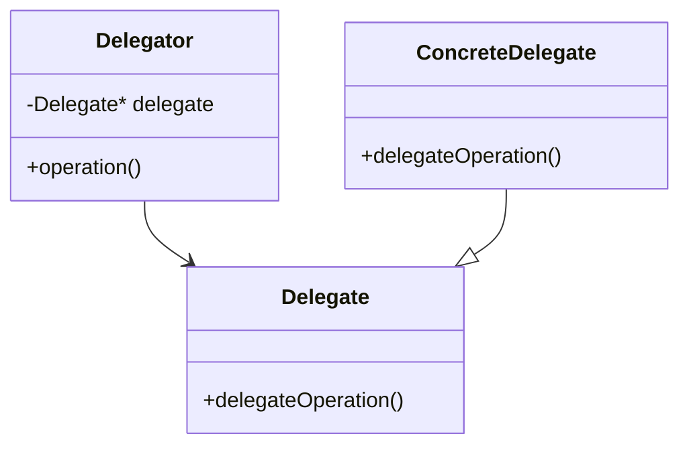

# C++ 委托模式

## 什么是委托模式？

委托模式（Delegation Pattern）是一种面向对象的设计模式，它允许对象将特定的任务委托给其他专门的辅助对象，而不是自己直接处理这些任务。这种模式可以看作是组合（Composition）的一种应用形式，是"使用组合而非继承"这一设计原则的体现。

在C++中，委托模式通过引用或指针将请求传递给另一个对象来实现功能的扩展，而不需要通过继承来实现。

:::tip
委托模式与代理模式有些相似，但委托模式更强调行为的委托而非访问控制。
:::

## 委托模式的基本结构

委托模式通常包含以下角色：



- **委托者（Delegator）**：包含对委托对象的引用，并将特定任务委托给该对象
- **委托接口（Delegate）**：定义被委托的操作
- **具体委托（ConcreteDelegate）**：实现委托接口

## 简单的委托模式示例

下面是一个简单的C++委托模式示例：

```cpp
#include <iostream>
#include <string>

// 委托接口
class Printer {
public:
    virtual void print(const std::string& message) = 0;
    virtual ~Printer() = default;
};

// 具体委托实现
class ConsolePrinter : public Printer {
public:
    void print(const std::string& message) override {
        std::cout << "Console: " << message << std::endl;
    }
};

class FilePrinter : public Printer {
public:
    void print(const std::string& message) override {
        std::cout << "File: " << message << " (写入文件)" << std::endl;
    }
};

// 委托者
class Document {
private:
    Printer* printer; // 委托打印操作给该对象

public:
    Document(Printer* p) : printer(p) {}
    
    void setPrinter(Printer* p) {
        printer = p;
    }
    
    void print(const std::string& content) {
        // 将打印操作委托给printer对象
        if (printer) {
            printer->print(content);
        }
    }
};

int main() {
    ConsolePrinter consolePrinter;
    FilePrinter filePrinter;
    
    Document doc(&consolePrinter);
    doc.print("Hello, Delegation Pattern!");  // 使用控制台打印
    
    doc.setPrinter(&filePrinter);
    doc.print("Hello again!");  // 使用文件打印
    
    return 0;
}
```

**输出结果：**
```
Console: Hello, Delegation Pattern!
File: Hello again! (写入文件)
```

在这个例子中：
- `Document`类（委托者）将打印功能委托给了`Printer`接口
- `ConsolePrinter`和`FilePrinter`是具体的委托实现，提供不同的打印功能
- `Document`可以在运行时切换使用不同的打印实现，而无需修改自身代码

## 委托模式的进阶实现：事件委托

事件委托是委托模式的一个常见应用，在C++中可以通过函数指针、函数对象或C++11的`std::function`和lambda表达式实现。

```cpp
#include <iostream>
#include <functional>
#include <vector>
#include <string>

// 事件委托类
class EventDelegate {
private:
    std::vector<std::function<void(const std::string&)>> handlers;

public:
    // 添加事件处理器
    void addHandler(const std::function<void(const std::string&)>& handler) {
        handlers.push_back(handler);
    }
    
    // 触发事件，调用所有处理器
    void invoke(const std::string& message) {
        for (const auto& handler : handlers) {
            handler(message);
        }
    }
};

class Button {
private:
    std::string name;
    EventDelegate clickEvent;

public:
    Button(const std::string& buttonName) : name(buttonName) {}
    
    // 添加点击事件处理器
    void addClickHandler(const std::function<void(const std::string&)>& handler) {
        clickEvent.addHandler(handler);
    }
    
    // 模拟按钮点击
    void click() {
        std::cout << "Button " << name << " clicked!" << std::endl;
        clickEvent.invoke(name);
    }
};

int main() {
    Button submitButton("Submit");
    Button cancelButton("Cancel");
    
    // 使用lambda表达式添加事件处理器
    submitButton.addClickHandler([](const std::string& name) {
        std::cout << "处理 " << name << " 按钮点击: 提交表单" << std::endl;
    });
    
    cancelButton.addClickHandler([](const std::string& name) {
        std::cout << "处理 " << name << " 按钮点击: 取消操作" << std::endl;
    });
    
    // 再添加一个通用日志处理器
    auto logHandler = [](const std::string& name) {
        std::cout << "记录日志: " << name << " 按钮被点击" << std::endl;
    };
    
    submitButton.addClickHandler(logHandler);
    cancelButton.addClickHandler(logHandler);
    
    // 模拟按钮点击
    submitButton.click();
    std::cout << "-------------------" << std::endl;
    cancelButton.click();
    
    return 0;
}
```

**输出结果：**
```
Button Submit clicked!
处理 Submit 按钮点击: 提交表单
记录日志: Submit 按钮被点击
-------------------
Button Cancel clicked!
处理 Cancel 按钮点击: 取消操作
记录日志: Cancel 按钮被点击
```

这个示例展示了如何使用`std::function`和lambda表达式实现更现代的C++事件委托系统。

## 委托模式与继承的对比

### 使用委托模式

```cpp
// 使用委托模式
class Engine {
public:
    void start() { std::cout << "Engine started" << std::endl; }
};

class Car {
private:
    Engine engine;  // 组合关系
public:
    void start() {
        std::cout << "Car starting procedure..." << std::endl;
        engine.start();  // 委托给Engine对象
        std::cout << "Car started" << std::endl;
    }
};
```

### 使用继承方式

```cpp
// 使用继承
class Engine {
public:
    void start() { std::cout << "Engine started" << std::endl; }
};

class Car : public Engine {  // 继承关系
public:
    void start() {
        std::cout << "Car starting procedure..." << std::endl;
        Engine::start();  // 调用父类方法
        std::cout << "Car started" << std::endl;
    }
};
```

:::note
委托模式相比继承有以下优点：
1. **更灵活**：可以在运行时改变委托对象
2. **避免类爆炸**：不需要为每种组合创建新的子类
3. **更好的封装**：只暴露必要的接口
4. **遵循单一责任原则**：每个类专注于单一职责
:::

## 实际应用场景

### 1. 图形用户界面（GUI）框架

在GUI框架中，事件处理通常使用委托模式，比如按钮点击、鼠标移动等事件：

```cpp
class Window {
private:
    std::vector<std::function<void(MouseEvent)>> mouseListeners;
    
public:
    void addMouseListener(std::function<void(MouseEvent)> listener) {
        mouseListeners.push_back(listener);
    }
    
    // 当鼠标事件发生时调用
    void onMouseEvent(MouseEvent event) {
        for (auto& listener : mouseListeners) {
            listener(event);
        }
    }
};
```

### 2. 游戏开发中的组件系统

很多现代游戏引擎使用组件系统而非深层继承体系：

```cpp
class GameObject {
private:
    std::vector<std::unique_ptr<Component>> components;
    
public:
    void addComponent(std::unique_ptr<Component> component) {
        components.push_back(std::move(component));
    }
    
    void update(float deltaTime) {
        for (auto& component : components) {
            component->update(deltaTime);  // 委托给各个组件
        }
    }
    
    void render() {
        for (auto& component : components) {
            component->render();  // 委托给各个组件
        }
    }
};
```

### 3. 日志系统

实现可插拔的日志记录器：

```cpp
class Logger {
private:
    ILogWriter* logWriter;  // 委托写日志的实际操作
    
public:
    Logger(ILogWriter* writer) : logWriter(writer) {}
    
    void setLogWriter(ILogWriter* writer) {
        logWriter = writer;
    }
    
    void log(const std::string& message) {
        if (logWriter) {
            logWriter->write(message);
        }
    }
};
```

## 委托模式的优缺点

### 优点
- **灵活性**：可以在运行时更改行为
- **可扩展性**：易于添加新功能而不修改现有代码
- **代码重用**：避免通过继承复制代码
- **松耦合**：依赖于接口而非具体实现

### 缺点
- **性能开销**：对象间的调用可能带来一定的性能开销
- **复杂性**：增加了系统中的对象数量
- **调试难度**：可能更难追踪程序执行流程

## 总结

委托模式是C++中一种强大而灵活的设计模式，它通过将任务委托给专门的对象来实现功能的扩展。它遵循"组合优于继承"的设计原则，使系统更加模块化和可维护。

在现代C++编程中，委托模式的实现变得更加灵活，尤其是通过`std::function`、lambda表达式和智能指针等特性。无论是GUI开发、游戏编程还是其他需要灵活组件架构的场景，委托模式都是一个非常有用的工具。

## 练习

1. 实现一个简单的文本编辑器，使用委托模式处理不同的文本格式化操作（加粗、斜体、下划线等）。
2. 创建一个使用委托模式的通知系统，支持通过邮件、短信和应用内消息等不同方式发送通知。
3. 在现有代码中找出使用继承但可能更适合使用委托模式的例子，并重构它。

## 进一步阅读

- 《Design Patterns: Elements of Reusable Object-Oriented Software》（GoF设计模式）
- 《Effective C++》和《More Effective C++》中关于组合与继承的章节
- 《Modern C++ Design: Generic Programming and Design Patterns Applied》