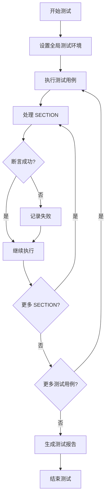

# C++ Catch2

## 什么是 Catch2？

Catch2 是一个现代化的、纯头文件的 C++ 测试框架，名称源自"C++ Automated Test Cases in a Header"的缩写。它被设计为简单易用、功能强大且灵活的测试框架，特别适合进行单元测试、集成测试和 TDD（测试驱动开发）。

:::note
Catch2 是完全开源的，可以在 GitHub 上找到它：https://github.com/catchorg/Catch2
:::

### 为什么选择 Catch2？

- **纯头文件实现**：使用时只需要包含一个头文件
- **无需外部依赖**：不需要编译或链接额外的库
- **简洁明了的语法**：测试代码易读易写
- **丰富的断言机制**：支持多种断言形式
- **自动注册测试**：不需要手动注册测试用例
- **详细的测试报告**：提供清晰的测试结果输出

## 安装与设置

### 方法一：直接下载头文件

使用 Catch2 最简单的方法是下载单个头文件并将其包含在项目中：

1. 从 Catch2 GitHub 仓库下载 `catch.hpp` 或 `catch_amalgamated.hpp` 文件
2. 将文件放在你的项目目录中
3. 在测试文件中包含该头文件

### 方法二：使用包管理器

如果你使用包管理器，可以通过以下方式安装：

- **vcpkg**：`vcpkg install catch2`
- **Conan**：将 `catch2/x.y.z` 添加到你的 `conanfile.txt`

## 创建第一个测试

让我们创建一个简单的示例来展示如何使用 Catch2：

```cpp
#define CATCH_CONFIG_MAIN  // 这会让 Catch2 自动生成 main() 函数
#include "catch.hpp"

int add(int a, int b) {
    return a + b;
}

TEST_CASE("加法函数测试", "[math]") {
    REQUIRE(add(1, 1) == 2);
    REQUIRE(add(10, 20) == 30);
    REQUIRE(add(-1, 1) == 0);
}
```

:::caution
`#define CATCH_CONFIG_MAIN` 应该只在一个源文件中出现，通常是测试的主文件。
:::

在这个例子中：
- `#define CATCH_CONFIG_MAIN` 告诉 Catch2 生成 main 函数
- `TEST_CASE` 宏定义了一个测试用例
- `REQUIRE` 是一种断言，检查条件是否为真

## Catch2 核心概念

### 测试用例与分节

Catch2 允许将测试用例分为多个分节，每个分节可以共享设置和清理代码：

```cpp
TEST_CASE("向量操作测试", "[vector]") {
    std::vector<int> v;
    
    SECTION("添加元素") {
        v.push_back(1);
        v.push_back(2);
        REQUIRE(v.size() == 2);
        REQUIRE(v[0] == 1);
        REQUIRE(v[1] == 2);
    }
    
    SECTION("清空向量") {
        v.push_back(1);
        v.clear();
        REQUIRE(v.empty());
    }
}
```

每个 `SECTION` 都会从 `TEST_CASE` 的开始重新执行，因此每次进入不同的 `SECTION` 时，向量 `v` 都是新创建的。

### 断言类型

Catch2 提供了多种断言方式：

1. **REQUIRE**：如果断言失败，测试立即终止
2. **CHECK**：如果断言失败，测试继续执行
3. **REQUIRE_FALSE** 和 **CHECK_FALSE**：验证条件为假

```cpp
TEST_CASE("断言示例", "[assertions]") {
    int x = 42;
    REQUIRE(x == 42);        // 必须为真，否则测试终止
    CHECK(x > 0);            // 检查条件，但测试继续
    REQUIRE_FALSE(x == 0);   // 必须为假，否则测试终止
}
```

### 浮点数比较

对于浮点数的比较，Catch2 提供了特殊的断言：

```cpp
TEST_CASE("浮点数比较", "[floating]") {
    double pi = 3.14159;
    REQUIRE(pi == Approx(3.14).epsilon(0.01));
}
```

`Approx` 类允许在一定精度范围内比较浮点数。

## 高级用法

### 参数化测试

Catch2 支持通过 `GENERATE` 宏进行参数化测试：

```cpp
TEST_CASE("参数化测试", "[parametrized]") {
    int a = GENERATE(1, 2, 3, 4, 5);
    int b = GENERATE(10, 20);
    
    INFO("测试 add(" << a << ", " << b << ")");
    REQUIRE(add(a, b) == a + b);
}
```

这会生成 10 个测试组合（5 个 a 值 × 2 个 b 值）。

### BDD 风格测试

Catch2 支持行为驱动开发（BDD）风格的测试编写：

```cpp
SCENARIO("用户从银行账户取款", "[account]") {
    GIVEN("一个余额为 100 的账户") {
        BankAccount account(100);
        
        WHEN("取款 50") {
            bool result = account.withdraw(50);
            
            THEN("取款成功") {
                REQUIRE(result == true);
            }
            THEN("余额变为 50") {
                REQUIRE(account.getBalance() == 50);
            }
        }
        
        WHEN("取款 200") {
            bool result = account.withdraw(200);
            
            THEN("取款失败") {
                REQUIRE(result == false);
            }
            THEN("余额保持不变") {
                REQUIRE(account.getBalance() == 100);
            }
        }
    }
}
```

这种风格的测试更加贴近自然语言描述，便于理解测试的意图。

### 异常测试

测试代码是否正确抛出异常：

```cpp
TEST_CASE("异常测试", "[exceptions]") {
    REQUIRE_THROWS_AS(throwingFunction(), std::runtime_error);
    REQUIRE_THROWS_WITH(throwingFunction(), "Expected error message");
    REQUIRE_NOTHROW(nonThrowingFunction());
}
```

## 实际应用案例

让我们看一个更加完整的例子，测试一个简单的字符串工具类：

```cpp
// StringUtils.h
#pragma once
#include <string>
#include <vector>

class StringUtils {
public:
    static std::string toUpper(const std::string& input);
    static std::string toLower(const std::string& input);
    static std::vector<std::string> split(const std::string& input, char delimiter);
    static std::string join(const std::vector<std::string>& parts, const std::string& delimiter);
};

// StringUtils.cpp
#include "StringUtils.h"
#include <algorithm>

std::string StringUtils::toUpper(const std::string& input) {
    std::string result = input;
    std::transform(result.begin(), result.end(), result.begin(), ::toupper);
    return result;
}

std::string StringUtils::toLower(const std::string& input) {
    std::string result = input;
    std::transform(result.begin(), result.end(), result.begin(), ::tolower);
    return result;
}

std::vector<std::string> StringUtils::split(const std::string& input, char delimiter) {
    std::vector<std::string> result;
    std::size_t start = 0, end = 0;
    
    while ((end = input.find(delimiter, start)) != std::string::npos) {
        result.push_back(input.substr(start, end - start));
        start = end + 1;
    }
    
    result.push_back(input.substr(start));
    return result;
}

std::string StringUtils::join(const std::vector<std::string>& parts, const std::string& delimiter) {
    if (parts.empty()) return "";
    
    std::string result = parts[0];
    for (size_t i = 1; i < parts.size(); i++) {
        result += delimiter + parts[i];
    }
    
    return result;
}
```

现在，我们为这些函数编写测试：

```cpp
#define CATCH_CONFIG_MAIN
#include "catch.hpp"
#include "StringUtils.h"

TEST_CASE("字符串转换为大写", "[string][utils]") {
    REQUIRE(StringUtils::toUpper("hello") == "HELLO");
    REQUIRE(StringUtils::toUpper("Hello World") == "HELLO WORLD");
    REQUIRE(StringUtils::toUpper("123") == "123");
    REQUIRE(StringUtils::toUpper("") == "");
}

TEST_CASE("字符串转换为小写", "[string][utils]") {
    REQUIRE(StringUtils::toLower("HELLO") == "hello");
    REQUIRE(StringUtils::toLower("Hello World") == "hello world");
    REQUIRE(StringUtils::toLower("123") == "123");
    REQUIRE(StringUtils::toLower("") == "");
}

TEST_CASE("字符串分割", "[string][utils]") {
    SECTION("基本分割") {
        auto result = StringUtils::split("a,b,c", ',');
        REQUIRE(result.size() == 3);
        REQUIRE(result[0] == "a");
        REQUIRE(result[1] == "b");
        REQUIRE(result[2] == "c");
    }
    
    SECTION("分隔符不存在") {
        auto result = StringUtils::split("abc", ',');
        REQUIRE(result.size() == 1);
        REQUIRE(result[0] == "abc");
    }
    
    SECTION("空字符串") {
        auto result = StringUtils::split("", ',');
        REQUIRE(result.size() == 1);
        REQUIRE(result[0] == "");
    }
    
    SECTION("连续分隔符") {
        auto result = StringUtils::split("a,,c", ',');
        REQUIRE(result.size() == 3);
        REQUIRE(result[0] == "a");
        REQUIRE(result[1] == "");
        REQUIRE(result[2] == "c");
    }
}

TEST_CASE("字符串连接", "[string][utils]") {
    SECTION("基本连接") {
        std::vector<std::string> parts = {"a", "b", "c"};
        REQUIRE(StringUtils::join(parts, ",") == "a,b,c");
    }
    
    SECTION("空向量") {
        std::vector<std::string> parts;
        REQUIRE(StringUtils::join(parts, ",") == "");
    }
    
    SECTION("单个元素") {
        std::vector<std::string> parts = {"only"};
        REQUIRE(StringUtils::join(parts, ",") == "only");
    }
}
```

### 运行测试

编译并运行以上测试，你将会看到类似这样的输出：

```
===============================================================================
All tests passed (16 assertions in 4 test cases)
```

如果有测试失败，你会看到详细的错误信息，包括失败的断言、期望值和实际值。

## 组织测试

随着项目规模的增长，良好组织测试变得非常重要：

### 使用标签

你可以使用标签来组织和筛选测试：

```cpp
TEST_CASE("向量测试", "[vector][container]") {
    // 测试代码
}

TEST_CASE("映射测试", "[map][container]") {
    // 测试代码
}
```

然后可以在命令行中筛选要运行的测试：
- 运行所有容器测试：`./tests [container]`
- 只运行向量测试：`./tests [vector]`

### 分割测试文件

对于大型项目，通常有多个测试文件：

1. 创建一个主测试文件，包含 Catch2 的 main 函数：

```cpp
// main-test.cpp
#define CATCH_CONFIG_MAIN
#include "catch.hpp"
```

2. 创建其他测试文件，不包含 main 函数定义：

```cpp
// vector-test.cpp
#include "catch.hpp"

TEST_CASE("向量测试", "[vector]") {
    // 测试代码
}
```

```cpp
// map-test.cpp
#include "catch.hpp"

TEST_CASE("映射测试", "[map]") {
    // 测试代码
}
```

然后将这些文件一起编译链接成一个测试可执行文件。

## Catch2 的测试生命周期

### 测试执行流程

下面是 Catch2 测试执行的流程图：



### 自定义主函数

如果需要更多控制测试的执行方式，可以自定义 main 函数：

```cpp
#define CATCH_CONFIG_RUNNER
#include "catch.hpp"

int main(int argc, char* argv[]) {
    // 初始化资源
    
    int result = Catch::Session().run(argc, argv);
    
    // 清理资源
    
    return result;
}
```

这允许在测试开始前初始化资源，并在测试结束后清理。

## 总结

Catch2 是一个功能强大且易于使用的 C++ 测试框架。它通过简单明了的语法、丰富的断言机制和灵活的测试组织方式，使得编写和维护测试变得更加容易。以下是我们学习的要点：

1. Catch2 是纯头文件实现，易于集成到项目中
2. 使用 `TEST_CASE` 和 `SECTION` 组织测试
3. 多种断言类型：`REQUIRE`、`CHECK` 等
4. 支持参数化测试和 BDD 风格测试
5. 可以通过标签组织和筛选测试

通过将 Catch2 集成到你的 C++ 项目中，你可以确保代码的正确性，捕获潜在的回归问题，并使重构变得更加安全。

## 练习

1. 创建一个简单的数学计算类 `Calculator`，实现加减乘除四则运算，并为其编写 Catch2 测试
2. 为之前实现的 `StringUtils::split` 函数添加更多的测试用例，包括边界情况和特殊情况
3. 尝试使用 BDD 风格重写其中的一些测试
4. 为一个可能抛出异常的函数编写异常测试
5. 使用 GENERATE 实现一个参数化测试，测试不同输入值的结果

## 额外资源

- Catch2 官方文档提供了详细的使用指南和 API 参考
- GitHub 上的 Catch2 仓库包含许多示例和最佳实践
- 可以结合 CMake 使用 Catch2，使测试更容易集成到构建系统中
- 考虑学习测试驱动开发（TDD）方法论，与 Catch2 结合使用效果更佳