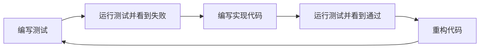

# C++ 测试驱动开发

## 什么是测试驱动开发？

测试驱动开发（Test-Driven Development，简称TDD）是一种软件开发方法，它强调在编写实际功能代码之前先编写测试代码。这种方法颠覆了传统的开发流程，使开发人员能够更加专注于需求和设计，同时也能降低软件缺陷率。

TDD的基本流程可以概括为"红-绿-重构"（Red-Green-Refactor）循环：



1. **红**：编写一个会失败的测试
2. **绿**：编写最少的代码使测试通过
3. **重构**：改进代码，确保它结构良好且高效

:::tip 为什么选择TDD？
- 确保代码有测试覆盖
- 引导开发者思考设计和需求
- 增加对代码变更的信心
- 提供即时反馈
- 促进简单设计
:::

## C++ 中的TDD工具

在C++中实施TDD，你需要掌握一些测试框架。以下是最常用的几种：

1. **Google Test**：谷歌开发的C++测试框架，支持断言、参数化测试等
2. **Catch2**：轻量级、易于使用的测试框架，只需包含头文件
3. **Boost.Test**：Boost库提供的测试工具
4. **CppUnit**：C++版本的JUnit
5. **DocTest**：类似Catch但编译更快的框架

我们将在本教程中使用Google Test作为示例，因为它功能全面且广泛使用。

## 安装配置Google Test

首先，我们需要安装Google Test框架。以下是基本步骤：

### 使用CMake安装

```cpp
// CMakeLists.txt
cmake_minimum_required(VERSION 3.10)
project(MyTDDProject)

# Google Test需要线程支持
find_package(Threads REQUIRED)

# 下载并构建GoogleTest
include(FetchContent)
FetchContent_Declare(
  googletest
  GIT_REPOSITORY https://github.com/google/googletest.git
  GIT_TAG release-1.11.0
)
FetchContent_MakeAvailable(googletest)

# 启用测试
enable_testing()

# 添加我们的可执行文件
add_executable(
  my_tests
  test.cpp
)

# 链接GoogleTest和线程库
target_link_libraries(
  my_tests
  gtest_main
  Threads::Threads
)

# 将测试添加到ctest
include(GoogleTest)
gtest_discover_tests(my_tests)
```

## 第一个TDD示例：实现一个简单计算器

让我们通过实现一个简单的计算器来演示TDD的基本流程。

### 步骤1：编写第一个失败的测试

首先，我们定义测试文件`calculator_test.cpp`：

```cpp
#include <gtest/gtest.h>

// 我们还没有实现Calculator类
#include "calculator.h"

// 测试加法功能
TEST(CalculatorTest, Addition) {
    Calculator calc;
    EXPECT_EQ(5, calc.Add(2, 3));
}

int main(int argc, char **argv) {
    ::testing::InitGoogleTest(&argc, argv);
    return RUN_ALL_TESTS();
}
```

运行这段代码时，测试将失败，因为我们还没有实现`Calculator`类。

### 步骤2：创建最简实现让测试通过

接下来，我们创建`calculator.h`：

```cpp
#ifndef CALCULATOR_H
#define CALCULATOR_H

class Calculator {
public:
    int Add(int a, int b) {
        return a + b;
    }
};

#endif // CALCULATOR_H
```

现在，我们的测试应该能通过了。这是"绿"阶段。

### 步骤3：添加更多测试

让我们为其他操作添加测试：

```cpp
// 测试减法功能
TEST(CalculatorTest, Subtraction) {
    Calculator calc;
    EXPECT_EQ(5, calc.Subtract(10, 5));
}

// 测试乘法功能
TEST(CalculatorTest, Multiplication) {
    Calculator calc;
    EXPECT_EQ(15, calc.Multiply(3, 5));
}

// 测试除法功能
TEST(CalculatorTest, Division) {
    Calculator calc;
    EXPECT_EQ(3, calc.Divide(15, 5));
    
    // 测试除以0的情况
    EXPECT_THROW(calc.Divide(10, 0), std::invalid_argument);
}
```

这些测试将再次失败，因为我们还没有实现这些方法。

### 步骤4：实现功能以通过测试

更新`calculator.h`：

```cpp
#ifndef CALCULATOR_H
#define CALCULATOR_H

#include <stdexcept>

class Calculator {
public:
    int Add(int a, int b) {
        return a + b;
    }
    
    int Subtract(int a, int b) {
        return a - b;
    }
    
    int Multiply(int a, int b) {
        return a * b;
    }
    
    int Divide(int a, int b) {
        if (b == 0) {
            throw std::invalid_argument("Division by zero");
        }
        return a / b;
    }
};

#endif // CALCULATOR_H
```

现在所有测试应该都能通过了。

### 步骤5：重构

在这个简单的例子中，代码已经很清晰了，但在实际项目中，你可能需要重构代码，例如：
- 提取共同逻辑
- 优化性能
- 改进命名
- 移除重复代码

重构后，确保所有测试仍然通过。

## 边界情况和异常测试

良好的测试应该涵盖边界情况和异常。让我们添加一些这样的测试：

```cpp
// 测试整数边界值
TEST(CalculatorTest, IntegerLimits) {
    Calculator calc;
    
    // 测试最大整数相加
    EXPECT_EQ(INT_MIN, calc.Add(INT_MAX, 1));  // 整数溢出行为
    
    // 测试最小整数相减
    EXPECT_EQ(INT_MAX, calc.Subtract(INT_MIN, 1));  // 整数下溢行为
}
```

:::caution
在实际项目中，你可能需要处理整数溢出和下溢。这里的测试主要是为了说明如何测试边界情况。
:::

## 参数化测试

对于需要测试多组输入的情况，我们可以使用参数化测试：

```cpp
class CalculatorParamTest : public ::testing::TestWithParam<std::tuple<int, int, int>> {
};

TEST_P(CalculatorParamTest, Addition) {
    Calculator calc;
    auto param = GetParam();
    int a = std::get<0>(param);
    int b = std::get<1>(param);
    int expected = std::get<2>(param);
    
    EXPECT_EQ(expected, calc.Add(a, b));
}

// 测试数据：{a, b, expected result}
INSTANTIATE_TEST_SUITE_P(
    AdditionTests,
    CalculatorParamTest,
    ::testing::Values(
        std::make_tuple(1, 1, 2),
        std::make_tuple(-1, 1, 0),
        std::make_tuple(100, 200, 300),
        std::make_tuple(0, 0, 0)
    )
);
```

## 模拟对象

在实际开发中，你的类可能依赖其他类或系统。使用模拟对象（Mock Objects）可以隔离这些依赖，专注于测试当前代码。

假设我们有一个`DataLogger`接口用于记录计算器操作：

```cpp
// datalogger.h
#ifndef DATA_LOGGER_H
#define DATA_LOGGER_H

#include <string>

class DataLogger {
public:
    virtual ~DataLogger() {}
    virtual void LogOperation(const std::string& operation, int a, int b, int result) = 0;
};

#endif // DATA_LOGGER_H
```

更新Calculator以使用DataLogger：

```cpp
// calculator.h
#ifndef CALCULATOR_H
#define CALCULATOR_H

#include <stdexcept>
#include "datalogger.h"

class Calculator {
private:
    DataLogger* logger;

public:
    Calculator(DataLogger* logger) : logger(logger) {}
    
    int Add(int a, int b) {
        int result = a + b;
        if (logger) {
            logger->LogOperation("Add", a, b, result);
        }
        return result;
    }
    
    // ... 其他方法 ...
};

#endif // CALCULATOR_H
```

使用Google Mock创建模拟对象：

```cpp
#include <gmock/gmock.h>

class MockDataLogger : public DataLogger {
public:
    MOCK_METHOD(void, LogOperation, (const std::string& operation, int a, int b, int result), (override));
};

TEST(CalculatorTest, LoggingAdd) {
    MockDataLogger mockLogger;
    Calculator calc(&mockLogger);
    
    // 设置期望：LogOperation方法应该被调用一次
    EXPECT_CALL(mockLogger, LogOperation("Add", 2, 3, 5))
        .Times(1);
    
    // 执行被测方法
    EXPECT_EQ(5, calc.Add(2, 3));
    
    // 析构时，Google Mock会自动验证期望是否满足
}
```

## 实际案例：开发一个简单字符串处理库

让我们通过一个更实际的案例来应用TDD方法：实现一个简单的字符串处理库。

### 第一个需求：字符串翻转

1. 首先编写测试：

```cpp
#include <gtest/gtest.h>
#include "string_utils.h"

TEST(StringUtilsTest, ReverseString) {
    StringUtils utils;
    EXPECT_EQ("olleh", utils.Reverse("hello"));
    EXPECT_EQ("", utils.Reverse(""));
    EXPECT_EQ("a", utils.Reverse("a"));
    EXPECT_EQ("重要很是TDD", utils.Reverse("TDD是很重要"));
}
```

2. 实现功能：

```cpp
// string_utils.h
#ifndef STRING_UTILS_H
#define STRING_UTILS_H

#include <string>
#include <algorithm>

class StringUtils {
public:
    std::string Reverse(const std::string& str) {
        std::string result = str;
        std::reverse(result.begin(), result.end());
        return result;
    }
};

#endif // STRING_UTILS_H
```

### 第二个需求：判断回文字符串

1. 先添加测试：

```cpp
TEST(StringUtilsTest, IsPalindrome) {
    StringUtils utils;
    EXPECT_TRUE(utils.IsPalindrome("radar"));
    EXPECT_TRUE(utils.IsPalindrome("level"));
    EXPECT_TRUE(utils.IsPalindrome(""));
    EXPECT_TRUE(utils.IsPalindrome("a"));
    EXPECT_FALSE(utils.IsPalindrome("hello"));
    EXPECT_FALSE(utils.IsPalindrome("radar "));
}
```

2. 实现功能：

```cpp
// string_utils.h (updated)
bool IsPalindrome(const std::string& str) {
    std::string reversed = str;
    std::reverse(reversed.begin(), reversed.end());
    return str == reversed;
}
```

### 第三个需求：忽略大小写和非字母字符的回文检查

1. 添加更复杂的测试：

```cpp
TEST(StringUtilsTest, IsPalindromeIgnoreCase) {
    StringUtils utils;
    EXPECT_TRUE(utils.IsPalindromeIgnoreCase("Radar"));
    EXPECT_TRUE(utils.IsPalindromeIgnoreCase("A man, a plan, a canal: Panama"));
    EXPECT_FALSE(utils.IsPalindromeIgnoreCase("hello world"));
}
```

2. 实现功能：

```cpp
// string_utils.h (updated)
bool IsPalindromeIgnoreCase(const std::string& str) {
    std::string processed;
    // 只保留字母字符并转为小写
    for (char c : str) {
        if (std::isalpha(c)) {
            processed.push_back(std::tolower(c));
        }
    }
    
    return IsPalindrome(processed);
}
```

通过这个案例，我们可以看到TDD如何指导我们逐步构建功能，并确保每一步都有测试覆盖。

## TDD最佳实践

1. **小步前进**：编写最小的测试，实现最小的功能，然后重构。
2. **测试先行**：坚持先写测试，再写实现。
3. **持续测试**：每次改动后都运行测试。
4. **测试覆盖率**：关注测试覆盖率，但不要为了覆盖率而编写无意义的测试。
5. **单元测试应该快速**：测试应该能够快速运行，提供即时反馈。
6. **测试应该独立**：一个测试不应依赖于另一个测试的结果。
7. **测试应该可重复**：测试结果应该是确定性的。
8. **测试代码也是代码**：测试代码需要维护，应该保持清晰和简洁。

## TDD常见问题与解决方案

### 问题1：测试太复杂

**解决方案**：
- 将复杂测试分解成多个小测试
- 使用辅助函数处理重复代码
- 考虑是否设计过于复杂

### 问题2：难以测试的代码

**解决方案**：
- 使用依赖注入
- 提取接口，使用模拟对象
- 重构代码以提高可测试性

### 问题3：测试很慢

**解决方案**：
- 减少外部依赖
- 使用更多的单元测试，少用集成测试
- 并行运行测试

## 总结

测试驱动开发是一种强大的软件开发方法，特别适合需要高质量和稳定性的C++项目。通过先编写测试，再实现功能，我们可以：

1. 确保代码按照预期工作
2. 发现设计问题
3. 增加代码修改的信心
4. 自然形成完整的测试套件
5. 提高代码质量

虽然TDD可能在开始时会让开发速度变慢，但随着项目变得更复杂，它会在长期内提高生产力和代码质量。

## 练习

1. 实现一个`Vector`类，支持基本的向量操作（加、减、点积），使用TDD方法进行开发。
2. 开发一个简单的文件读写工具类，使用模拟对象测试文件操作。
3. 对现有项目的一个类进行重构，首先编写测试，然后逐步改进代码。

## 进一步学习资源

- **书籍**：
  - 《Test-Driven Development by Example》by Kent Beck
  - 《Modern C++ Programming with Test-Driven Development》by Jeff Langr
  
- **在线教程和文档**：
  - [Google Test 文档](https://google.github.io/googletest/)
  - [Catch2 文档](https://github.com/catchorg/Catch2/blob/devel/docs/tutorial.md)
  
- **社区与实践**：
  - 参与开源项目，学习其测试实践
  - 加入相关线上社区，如C++程序员论坛
  - 尝试在小项目中应用TDD，积累经验

通过持续实践和学习，你将能够熟练地在C++项目中应用测试驱动开发，提高代码质量和开发效率。