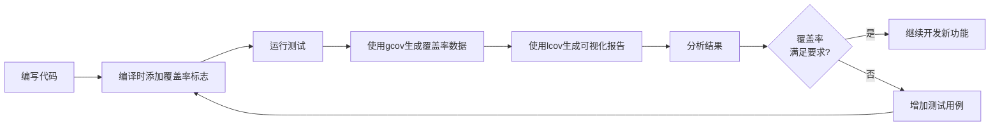

# C++ 代码覆盖率

## 什么是代码覆盖率？

代码覆盖率是衡量软件测试完整性的一个重要指标，它表示测试过程中实际执行了多少源代码。简单来说，代码覆盖率回答了这个问题：**我们的测试用例执行了多少代码？**

高覆盖率通常意味着测试更全面，发现潜在问题的可能性更高。然而，100%的覆盖率并不能保证代码完全没有问题，它只是表明所有代码都被执行到了。

:::note
代码覆盖率分析是现代软件开发中不可或缺的一部分，特别是在采用测试驱动开发(TDD)或持续集成(CI)的团队中。
:::

## 代码覆盖率的类型

在C++开发中，我们常用的代码覆盖率类型包括：

1. **语句覆盖率(Statement Coverage)**: 测试执行了多少语句
2. **分支覆盖率(Branch Coverage)**: 测试覆盖了多少条件分支
3. **函数覆盖率(Function Coverage)**: 测试调用了多少函数
4. **行覆盖率(Line Coverage)**: 测试执行了多少行代码
5. **条件覆盖率(Condition Coverage)**: 测试覆盖了多少个条件表达式的结果

## 代码覆盖率工具

### gcov 和 lcov

`gcov`是GNU编译器集合(GCC)附带的一款代码覆盖率工具，而`lcov`则是`gcov`的图形化前端。

#### 基本使用步骤：

1. 使用特殊编译标志编译程序:

```bash
g++ -fprofile-arcs -ftest-coverage -g -O0 -o myprogram myprogram.cpp
```

2. 运行程序:

```bash
./myprogram
```

3. 使用gcov生成覆盖率数据:

```bash
gcov myprogram.cpp
```

4. (可选)使用lcov生成HTML报告:

```bash
lcov --capture --directory . --output-file coverage.info
genhtml coverage.info --output-directory coverage_report
```

### 其他流行的C++代码覆盖率工具

- **Google Test 和 gcov**: Google Test可以与gcov结合使用
- **OpenCppCoverage**: Windows平台的C++代码覆盖率工具
- **Coveralls/Codecov**: 可以与CI工具集成的在线覆盖率报告服务
- **Clang的代码覆盖率工具**: Clang编译器也提供了代码覆盖率分析功能

## 代码示例：使用gcov分析覆盖率

让我们通过一个简单的例子来演示如何使用gcov分析代码覆盖率。

### 1. 创建一个简单的C++程序

```cpp
// example.cpp
#include <iostream>

int calculateFactorial(int n) {
    if (n <= 1) {
        return 1;
    }
    return n * calculateFactorial(n - 1);
}

bool isPrime(int n) {
    if (n <= 1) {
        return false;
    }
    
    if (n <= 3) {
        return true;
    }
    
    if (n % 2 == 0 || n % 3 == 0) {
        return false;
    }
    
    for (int i = 5; i * i <= n; i += 6) {
        if (n % i == 0 || n % (i + 2) == 0) {
            return false;
        }
    }
    
    return true;
}

int main() {
    std::cout << "Factorial of 5: " << calculateFactorial(5) << std::endl;
    // 不调用isPrime函数，观察覆盖率
    return 0;
}
```

### 2. 使用gcov编译并分析

```bash
g++ -fprofile-arcs -ftest-coverage -g -O0 -o example example.cpp
./example
gcov example.cpp
```

### 3. 查看覆盖率报告

执行以上命令后，会生成一个`example.cpp.gcov`文件，内容类似：

```
        -:    0:Source:example.cpp
        -:    0:Graph:example.gcno
        -:    0:Data:example.gcda
        -:    0:Runs:1
        -:    0:Programs:1
        -:    1:#include <iostream>
        -:    2:
function calculateFactorial called 6 returned 100% blocks executed 100%
        6:    3:int calculateFactorial(int n) {
        6:    4:    if (n <= 1) {
        1:    5:        return 1;
        -:    6:    }
        5:    7:    return n * calculateFactorial(n - 1);
        -:    8:}
        -:    9:
function isPrime called 0 returned 0% blocks executed 0%
    #####:   10:bool isPrime(int n) {
    #####:   11:    if (n <= 1) {
    #####:   12:        return false;
        -:   13:    }
        -:   14:    
    #####:   15:    if (n <= 3) {
    #####:   16:        return true;
        -:   17:    }
        -:   18:    
    #####:   19:    if (n % 2 == 0 || n % 3 == 0) {
    #####:   20:        return false;
        -:   21:    }
        -:   22:    
    #####:   23:    for (int i = 5; i * i <= n; i += 6) {
    #####:   24:        if (n % i == 0 || n % (i + 2) == 0) {
    #####:   25:            return false;
        -:   26:        }
        -:   27:    }
        -:   28:    
    #####:   29:    return true;
        -:   30:}
        -:   31:
function main called 1 returned 100% blocks executed 100%
        1:   32:int main() {
        1:   33:    std::cout << "Factorial of 5: " << calculateFactorial(5) << std::endl;
        -:   34:    // 不调用isPrime函数，观察覆盖率
        1:   35:    return 0;
        -:   36:}
```

从上面的报告中可以看到：
- `calculateFactorial`函数被调用了6次，覆盖率为100%
- `isPrime`函数没有被调用，覆盖率为0%
- `main`函数被调用了1次，覆盖率为100%

### 4. 改进测试，提高覆盖率

为了提高覆盖率，我们需要修改main函数，使其调用`isPrime`函数：

```cpp
int main() {
    std::cout << "Factorial of 5: " << calculateFactorial(5) << std::endl;
    
    // 测试isPrime函数，提高覆盖率
    std::cout << "Is 7 prime? " << (isPrime(7) ? "Yes" : "No") << std::endl;
    std::cout << "Is 10 prime? " << (isPrime(10) ? "Yes" : "No") << std::endl;
    std::cout << "Is 1 prime? " << (isPrime(1) ? "Yes" : "No") << std::endl;
    
    return 0;
}
```

## 在实际项目中应用代码覆盖率

### 集成到测试流程

将代码覆盖率分析集成到单元测试中是一个良好实践。例如，使用Google Test和gcov：

```cpp
// math_unittest.cpp
#include <gtest/gtest.h>
#include "math_utils.h" // 包含我们要测试的函数

TEST(FactorialTest, HandlesZeroInput) {
    EXPECT_EQ(1, calculateFactorial(0));
}

TEST(FactorialTest, HandlesPositiveInput) {
    EXPECT_EQ(1, calculateFactorial(1));
    EXPECT_EQ(2, calculateFactorial(2));
    EXPECT_EQ(6, calculateFactorial(3));
    EXPECT_EQ(24, calculateFactorial(4));
    EXPECT_EQ(120, calculateFactorial(5));
}

TEST(PrimeTest, HandlesTrueCase) {
    EXPECT_TRUE(isPrime(2));
    EXPECT_TRUE(isPrime(3));
    EXPECT_TRUE(isPrime(5));
    EXPECT_TRUE(isPrime(7));
    EXPECT_TRUE(isPrime(11));
}

TEST(PrimeTest, HandlesFalseCase) {
    EXPECT_FALSE(isPrime(0));
    EXPECT_FALSE(isPrime(1));
    EXPECT_FALSE(isPrime(4));
    EXPECT_FALSE(isPrime(6));
    EXPECT_FALSE(isPrime(9));
}

int main(int argc, char **argv) {
    ::testing::InitGoogleTest(&argc, argv);
    return RUN_ALL_TESTS();
}
```

### 在CI/CD流程中使用代码覆盖率

在持续集成系统中，你可以设置代码覆盖率阈值，例如要求所有新代码至少有80%的覆盖率：

```yaml
# 在GitHub Actions中使用代码覆盖率(示例)
name: C++ Coverage

on: [push, pull_request]

jobs:
  build:
    runs-on: ubuntu-latest

    steps:
    - uses: actions/checkout@v2
    
    - name: Install dependencies
      run: |
        sudo apt-get update
        sudo apt-get install -y g++ lcov
    
    - name: Build and test with coverage
      run: |
        g++ -fprofile-arcs -ftest-coverage -g -O0 -o myprogram *.cpp
        ./myprogram
        lcov --capture --directory . --output-file coverage.info
        lcov --remove coverage.info '/usr/*' --output-file coverage.info
        lcov --list coverage.info
    
    - name: Check coverage threshold
      run: |
        total_cov=$(lcov --summary coverage.info | grep "lines" | cut -d ':' -f 2 | cut -d '%' -f 1 | xargs)
        if (( $(echo "$total_cov < 80" | bc -l) )); then
          echo "Coverage is below threshold: $total_cov% (required: 80%)"
          exit 1
        fi
```

## 代码覆盖率的可视化

使用lcov和genhtml可以生成HTML格式的覆盖率报告，这让查看覆盖率变得更加直观。



## 代码覆盖率的局限性

虽然代码覆盖率是一个重要指标，但也存在一些局限性：

:::caution 注意代码覆盖率的局限性
1. 100%的覆盖率不代表没有bug
2. 不能确保所有边界条件都被测试
3. 无法检测出缺失的代码路径
4. 可能导致为了提高覆盖率而编写无意义的测试
:::

## 实际案例：优化测试策略

假设我们有一个简单的字符串处理函数库，通过代码覆盖率分析，我们发现某些边界情况没有被测试到：

```cpp
// 原始测试
TEST(StringUtilsTest, ReplaceString) {
    EXPECT_EQ("hello world", replaceString("hello universe", "universe", "world"));
}

// 通过覆盖率分析，我们发现需要添加更多测试
TEST(StringUtilsTest, ReplaceStringEdgeCases) {
    // 空字符串
    EXPECT_EQ("", replaceString("", "anything", "something"));
    
    // 目标不存在
    EXPECT_EQ("hello universe", replaceString("hello universe", "world", "earth"));
    
    // 目标为空
    EXPECT_EQ("hello universe", replaceString("hello universe", "", "something"));
    
    // 替换为空
    EXPECT_EQ("hello ", replaceString("hello universe", "universe", ""));
    
    // 多次替换
    EXPECT_EQ("a-b-c", replaceString("a,b,c", ",", "-"));
}
```

通过添加这些测试，我们的覆盖率从最初的60%提高到了95%以上，同时也显著提高了代码质量。

## 总结

代码覆盖率是评估测试质量的重要指标，它帮助我们:

1. 找出未被测试的代码路径
2. 提高测试的全面性和质量
3. 在持续集成过程中保证代码质量
4. 指导测试用例的编写

对于C++初学者来说，掌握代码覆盖率的概念和工具使用，能帮助你编写更健壮的程序，同时培养良好的测试习惯。

## 练习

1. 使用gcov分析你之前编写的一个C++程序的代码覆盖率
2. 为一个现有的代码库编写单元测试，目标是达到至少80%的覆盖率
3. 尝试配置一个CI/CD系统(如GitHub Actions)，自动化代码覆盖率分析
4. 分析一个有条件语句和循环的函数，观察不同测试用例如何影响分支覆盖率

## 附加资源

- [gcov 官方文档](https://gcc.gnu.org/onlinedocs/gcc/Gcov.html)
- [lcov 官方网站](http://ltp.sourceforge.net/coverage/lcov.php)
- [Google Test 框架](https://github.com/google/googletest)
- [代码覆盖率最佳实践](https://www.atlassian.com/continuous-delivery/software-testing/code-coverage)

:::tip
记住，代码覆盖率是一个质量指标，而不是目标本身。追求高覆盖率是为了提高代码质量，而不仅仅是为了数字好看。
:::