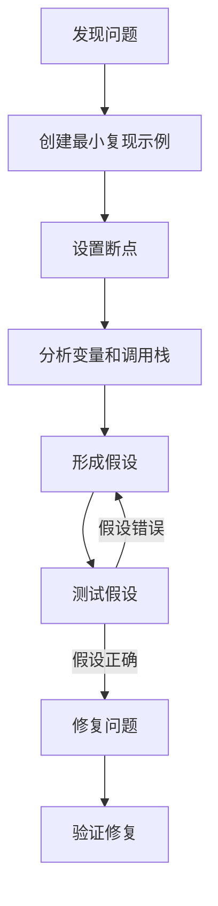

# C++ 调试最佳实践

## 调试的重要性

在C++编程中，调试是开发过程中不可或缺的环节。无论你是初学者还是有经验的开发者，程序总会出现各种各样的错误或问题。掌握有效的调试技术能帮助你更快地定位和解决这些问题，节省大量开发时间，并提高代码质量。

调试不仅仅是解决代码中的错误，它还能帮助你更深入地理解代码的执行流程和底层工作原理，这对于学习和掌握C++语言非常有价值。

## 调试前的准备工作

### 编译选项的设置

在进行调试前，确保使用正确的编译选项以生成包含调试信息的可执行文件：

```cpp
// 使用g++编译器
g++ -g -O0 -Wall -Wextra -pedantic program.cpp -o program
```

参数解释：
- `-g`: 生成调试信息
- `-O0`: 禁用优化，使代码执行与源代码一一对应
- `-Wall -Wextra -pedantic`: 启用各种警告，帮助发现潜在问题

### 选择调试工具

C++开发中常用的调试工具：

1. **GDB** - GNU调试器，命令行界面
2. **LLDB** - LLVM项目的调试器
3. **集成开发环境(IDE)中的调试器**：
   - Visual Studio的调试器
   - CLion的调试器
   - VS Code + C/C++扩展

:::tip
初学者推荐使用IDE提供的调试器，因为它们提供了可视化的界面，降低了调试的学习曲线。
:::

## 基本调试技术

### 断点的使用

断点是调试中最常用的功能，它允许你在指定位置暂停程序执行。

#### 设置断点的位置：

1. 可疑的代码段
2. 函数入口点和出口点
3. 条件分支前后
4. 循环的开始和结束

```cpp
// 示例代码
int main() {
    int sum = 0;
    for (int i = 1; i <= 10; i++) {
        sum += i;
        // 可以在这里设置断点，观察每次循环后sum的值
    }
    std::cout << "Sum: " << sum << std::endl;
    return 0;
}
```

### 监视变量

监视变量可以实时观察变量的值的变化，有助于跟踪程序状态。

```cpp
int calculate(int a, int b) {
    int result = a * b;  // 可以监视result的值
    result += (a + b);
    return result;
}
```

### 单步执行

单步执行允许你一行一行地运行代码，密切观察程序的行为：

- **Step Into**：进入函数内部
- **Step Over**：执行当前行，不进入函数
- **Step Out**：执行到当前函数返回

### 调用栈分析

调用栈显示了程序执行到当前位置所经过的函数调用序列，对于理解程序流程非常有帮助：

```cpp
void functionC() {
    // 错误发生在这里
    int* ptr = nullptr;
    *ptr = 10;  // 空指针解引用，导致崩溃
}

void functionB() {
    functionC();
}

void functionA() {
    functionB();
}

int main() {
    functionA();
    return 0;
}
```

调用栈会显示：`main -> functionA -> functionB -> functionC`，帮助你追踪到错误发生的确切位置。

## 高级调试技术

### 条件断点

条件断点只在满足特定条件时才会触发，对于调试循环或特定情况特别有用：

```cpp
// 例如在一个大循环中
for (int i = 0; i < 1000; i++) {
    // 我们只关心i=500时的情况
    // 可以设置条件断点: i == 500
    processData(i);
}
```

### 日志记录

在复杂程序中，日志是一种非常有效的调试方法：

```cpp
#include <fstream>
#include <iostream>

void log(const std::string& message) {
    static std::ofstream logFile("debug.log", std::ios::app);
    logFile << message << std::endl;
    // 也可以同时输出到控制台
    std::cout << message << std::endl;
}

void complexFunction(int value) {
    log("Entering complexFunction with value: " + std::to_string(value));
    
    if (value < 0) {
        log("Warning: value is negative");
    }
    
    // 函数的其他部分...
    
    log("Exiting complexFunction");
}
```

### 内存检查工具

C++中的内存问题往往难以调试，使用专门的工具可以帮助发现内存泄漏、越界访问等问题：

- **Valgrind**: 用于检测内存泄漏、越界访问等
- **AddressSanitizer**: 检测各种内存错误
- **LeakSanitizer**: 专注于检测内存泄漏

```cpp
// 编译时启用AddressSanitizer
// g++ -fsanitize=address -g -O0 program.cpp -o program
```

## 常见调试问题及解决方案

### 段错误(Segmentation Fault)

段错误是C++中常见的错误，通常是由于非法内存访问引起的：

```cpp
// 导致段错误的常见原因
int* ptr = nullptr;
*ptr = 10;  // 访问空指针

int arr[5];
arr[10] = 5;  // 数组越界

int* dynamicArray = new int[5];
delete[] dynamicArray;
dynamicArray[2] = 1;  // 使用已释放的内存
```

**解决方法**：
- 使用调试器定位崩溃位置
- 检查指针是否为空
- 确保数组索引在有效范围内
- 避免使用已释放的内存

### 内存泄漏

```cpp
void memoryLeakExample() {
    int* data = new int[1000];
    // 处理data
    
    // 忘记释放内存
    // 正确做法: delete[] data;
}
```

**解决方法**：
- 使用智能指针(`std::unique_ptr`, `std::shared_ptr`)
- 确保每个`new`都有对应的`delete`
- 使用RAII原则管理资源
- 使用内存检查工具

### 未初始化变量

```cpp
int calculate() {
    int value;  // 未初始化
    return value + 10;  // 使用未初始化的变量，结果不可预测
}
```

**解决方法**：
- 养成习惯，始终在声明变量时初始化
- 开启编译器警告(`-Wall -Wextra`)以捕获这类问题

## 实际案例：调试一个复杂问题

让我们通过一个实际案例来应用这些调试技术：

```cpp
#include <iostream>
#include <vector>

// 假设这是一个计算向量平均值的函数
double calculateAverage(const std::vector<int>& values) {
    double sum = 0;
    for (size_t i = 0; i <= values.size(); i++) {  // 注意这里有个bug: i <= values.size()
        sum += values[i];
    }
    return sum / values.size();
}

int main() {
    std::vector<int> data = {10, 20, 30, 40, 50};
    
    try {
        double avg = calculateAverage(data);
        std::cout << "Average: " << avg << std::endl;
    }
    catch (const std::exception& e) {
        std::cerr << "Exception caught: " << e.what() << std::endl;
    }
    
    return 0;
}
```

### 调试步骤

1. **程序崩溃**：运行程序后发现崩溃。

2. **使用调试器**：
   - 设置断点在`calculateAverage`函数开始处
   - 单步执行，观察循环变量`i`和向量大小

3. **发现问题**：
   - 当循环执行到`i = 5`时，尝试访问`values[5]`，但向量的有效索引范围是0-4
   - 错误是循环条件：`i <= values.size()`应该是`i < values.size()`

4. **修复**：
   - 修改循环条件为`i < values.size()`

5. **验证**：
   - 重新编译运行，程序正常输出"Average: 30"

### 问题反思

这个bug是一个典型的"差一错误"(off-by-one error)，在处理数组和向量时非常常见。通过调试器的帮助，我们可以很容易地识别出这个问题。

## 提高调试效率的建议

### 预防胜于调试

1. **编写可测试的代码**：小函数、清晰接口
2. **单元测试**：在开发过程中持续测试
3. **代码审查**：让其他人帮助发现问题
4. **静态代码分析**：使用工具如Clang-Tidy, Cppcheck等

### 调试习惯

1. **系统化方法**：使用科学方法而不是随机尝试
2. **复现问题**：确保能稳定重现问题再开始调试
3. **记录发现**：记录调试过程中的发现和解决方法
4. **观察模式**：寻找问题的模式而不只是症状



## 总结

调试是C++开发中不可或缺的技能。作为初学者，掌握这些调试最佳实践将帮助你更有效地发现和解决问题：

1. **使用适当的调试工具**，如调试器和内存检查器
2. **掌握基本技术**：断点、监视变量、单步执行
3. **培养预防思维**，通过单元测试和代码审查减少bug
4. **系统化调试方法**，而不是随机尝试
5. **持续学习**，每次调试都是提高编程能力的机会

调试是一项需要时间和实践才能掌握的技能。随着经验的积累，你将能够更快、更有效地解决各种复杂问题。

## 练习

1. 在以下代码中设置断点并跟踪变量i和sum的值：
```cpp
int main() {
    int sum = 0;
    for (int i = 1; i <= 100; i++) {
        if (i % 2 == 0) {
            sum += i;
        }
    }
    std::cout << "Sum of even numbers: " << sum << std::endl;
    return 0;
}
```

2. 找出并修复以下代码中的错误：
```cpp
#include <iostream>

int* createArray(int size) {
    int arr[size];
    for (int i = 0; i < size; i++) {
        arr[i] = i * 2;
    }
    return arr;
}

int main() {
    int* myArray = createArray(5);
    for (int i = 0; i < 5; i++) {
        std::cout << myArray[i] << " ";
    }
    delete[] myArray;
    return 0;
}
```

3. 使用条件断点调试以下代码，找出sum变为负数的位置：
```cpp
#include <iostream>
#include <vector>
#include <random>

int main() {
    std::random_device rd;
    std::mt19937 gen(rd());
    std::uniform_int_distribution<> dist(-10, 10);
    
    std::vector<int> numbers(100);
    for (int& n : numbers) {
        n = dist(gen);
    }
    
    int sum = 0;
    for (size_t i = 0; i < numbers.size(); i++) {
        sum += numbers[i];
    }
    
    std::cout << "Final sum: " << sum << std::endl;
    return 0;
}
```

## 附加资源

- [GDB官方文档](https://sourceware.org/gdb/current/onlinedocs/gdb/)
- [Effective Debugging: 66 Specific Ways to Debug Software and Systems](https://www.oreilly.com/library/view/effective-debugging-66/9780134394909/)
- [Debugging C/C++ with Visual Studio Code](https://code.visualstudio.com/docs/cpp/cpp-debug)
- [Valgrind User Manual](https://valgrind.org/docs/manual/manual.html)