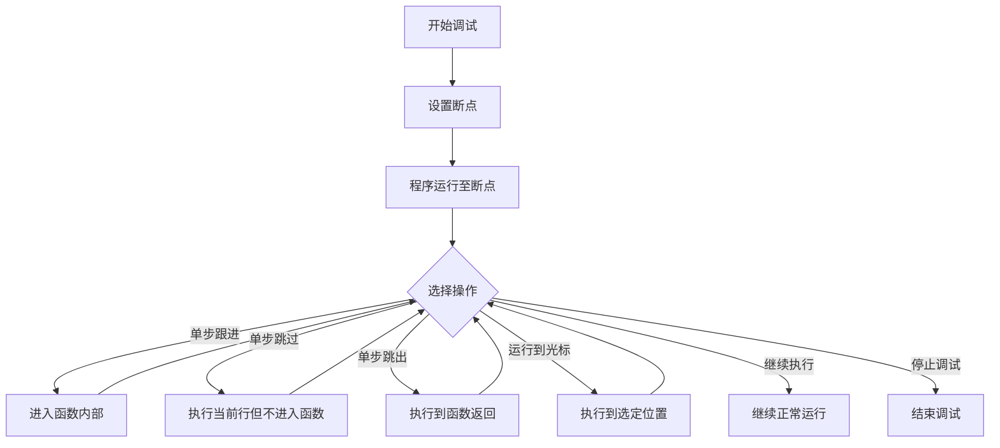

# C++ 单步执行

## 什么是单步执行？

单步执行是程序调试过程中的一项基本但非常强大的技术，它允许开发者逐行执行代码，观察程序的执行流程，检查变量的值变化，从而更容易地发现和定位问题。对于C++初学者而言，掌握单步执行技术可以帮助你更好地理解程序的运行机制，是提高代码质量的重要工具。

:::tip
单步执行是调试的基础技能，熟练掌握后将极大提高你的开发效率和解决问题的能力！
:::

## 为什么需要单步执行？

- **理解程序执行流程**：通过单步执行，你可以清晰地看到程序是如何一行一行执行的
- **监控变量变化**：实时观察变量值如何随着代码执行而改变
- **定位错误**：快速找出程序出错的确切位置
- **验证逻辑**：确认你的代码是否按照预期的逻辑路径执行

## 单步执行的基本概念

在C++调试中，单步执行通常包括以下几种操作方式：

1. **单步跟进(Step Into)**：执行当前行，如果当前行包含函数调用，则进入该函数内部
2. **单步跳过(Step Over)**：执行当前行，即使当前行是函数调用也不进入函数内部
3. **单步跳出(Step Out)**：执行到当前函数结束并返回到调用处
4. **运行到光标处(Run to Cursor)**：执行程序直到达到光标所在行



## 在不同IDE中进行单步执行

### Visual Studio中的单步执行

Visual Studio是Windows平台上最常用的C++开发环境之一，提供了强大的调试工具。

**设置断点和开始调试：**

```cpp
#include <iostream>

int calculateSum(int a, int b) {
    int sum = a + b;  // 可以在这里设置断点
    return sum;
}

int main() {
    int x = 10;
    int y = 20;
    
    std::cout << "准备计算和..." << std::endl;
    
    int result = calculateSum(x, y);  // 或者在这里设置断点
    
    std::cout << "x + y = " << result << std::endl;
    
    return 0;
}
```

**操作步骤：**

1. 在代码行左侧点击设置断点（会出现红色圆点）
2. 按F5或点击"开始调试"按钮启动调试
3. 程序会在断点处停止，此时可以：
   - 按F11进行单步跟进
   - 按F10进行单步跳过
   - 按Shift+F11进行单步跳出
   - 右键点击代码行，选择"运行到光标处"

### VSCode中的单步执行

VSCode配合适当的扩展也能提供出色的C++调试体验。

**操作步骤：**

1. 安装"C/C++"扩展
2. 配置launch.json文件
3. 在代码行号左侧点击设置断点
4. 按F5开始调试
5. 使用调试工具栏或快捷键进行单步操作：
   - 单步跟进：F11
   - 单步跳过：F10
   - 单步跳出：Shift+F11

### 命令行调试器(GDB)中的单步执行

如果你使用命令行工具，GDB是Linux和类Unix系统中常用的C++调试器。

**基本GDB命令：**

```bash
$ g++ -g -o myprogram myprogram.cpp  # 编译时添加调试信息
$ gdb myprogram                      # 启动GDB
(gdb) break main                     # 在main函数设置断点
(gdb) run                            # 运行程序到断点
(gdb) step                           # 单步跟进(相当于F11)
(gdb) next                           # 单步跳过(相当于F10)
(gdb) finish                         # 单步跳出(相当于Shift+F11)
(gdb) continue                       # 继续执行
(gdb) print x                        # 打印变量x的值
(gdb) quit                           # 退出GDB
```

## 实际案例：使用单步执行调试一个简单的问题

让我们通过一个实际例子来说明单步执行的价值。假设我们有以下代码，它应该计算一个数组元素的总和，但存在一个微妙的错误：

```cpp
#include <iostream>

int sumArray(int arr[], int size) {
    int sum = 0;
    for (int i = 0; i <= size; i++) {  // 错误：应该是i < size
        sum += arr[i];
    }
    return sum;
}

int main() {
    int numbers[] = {10, 20, 30, 40, 50};
    int size = sizeof(numbers) / sizeof(numbers[0]);
    
    int total = sumArray(numbers, size);
    
    std::cout << "数组元素总和: " << total << std::endl;
    
    return 0;
}
```

**问题分析：**

这段代码存在数组越界访问的问题，因为循环条件是`i <= size`而不是`i < size`。通过单步执行，我们可以清晰地看到这个问题：

1. 设置断点在`sumArray`函数的循环开始处
2. 开始调试，程序会在断点处停止
3. 使用单步跳过(F10)逐行执行循环
4. 观察变量`i`的值和`arr[i]`的访问情况
5. 当`i`等于`size`(5)时，会尝试访问`arr[5]`，而数组只有索引0到4的元素
6. 这时会访问到数组边界外的内存，可能导致程序崩溃或输出错误结果

通过单步执行，我们可以直观地发现并修复这个边界条件错误。

## 调试时观察变量

单步执行的一个重要方面是能够观察变量的值如何变化。大多数IDE都提供了观察窗口或变量监视功能。

### 在Visual Studio中监视变量

1. 在调试时，将鼠标悬停在变量上可以看到其当前值
2. 使用"监视"窗口添加你想跟踪的变量
3. "自动"窗口会显示当前正在使用的变量
4. "局部变量"窗口显示当前函数内的所有变量

### 条件断点

有时你可能只想在特定条件下暂停执行，如某个变量达到特定值时。大多数IDE支持条件断点：

1. 在Visual Studio中，右键点击已设置的断点
2. 选择"条件..."并输入条件表达式，例如`i == 4`
3. 程序只会在满足该条件时在断点处暂停

## 常见单步执行陷阱与避免方法

### 1. 步过第三方库函数

调试时，你通常不需要深入到标准库或第三方库的内部实现。使用单步跳过(F10)而不是单步跟进(F11)可以避免陷入这些函数的细节。

### 2. 处理大型循环

当循环执行多次时，单步执行每一次迭代可能非常耗时。解决方法：

- 使用条件断点，只在特定迭代时暂停
- 在循环后设置断点，直接执行完循环
- 使用"运行到光标处"跳到循环中的特定位置

### 3. 优化编译可能影响调试

编译器优化可能会导致代码执行顺序与源代码不完全一致，变量可能被优化掉，使调试变得困难。

:::caution
在调试时，建议使用调试构建(Debug build)而非发布构建(Release build)，因为调试构建通常会禁用优化。
:::

## 总结

单步执行是C++开发中的基础调试技术，掌握它可以帮助你：

- 更好地理解代码执行流程
- 快速定位和修复错误
- 验证程序逻辑是否正确
- 观察变量状态随代码执行的变化

通过在不同IDE中掌握单步执行的基本操作，结合断点设置、变量监视等技巧，你将能够更高效地调试C++程序，减少开发中的困惑和挫折。

## 练习与资源

### 练习

1. 尝试调试以下有错误的代码，使用单步执行找出并修复问题：
   ```cpp
   int findMax(int arr[], int size) {
       int max = 0;  // 注意：这里有问题
       for (int i = 0; i < size; i++) {
           if (arr[i] > max) {
               max = arr[i];
           }
       }
       return max;
   }
   
   int main() {
       int numbers[] = {-5, -10, -3, -8, -1};
       int size = 5;
       std::cout << "最大值：" << findMax(numbers, size) << std::endl;
       return 0;
   }
   ```

2. 编写一个简单的递归函数（如斐波那契数列计算），使用单步执行观察递归调用的过程。

### 扩展资源

- Visual Studio官方调试文档
- GDB用户手册
- VSCode C++调试配置指南
- 《C++程序设计：原理与实践》中关于调试的章节

掌握单步执行技术是成为熟练C++开发者的重要一步。通过持续实践，你将能够更自信、更高效地开发和维护C++程序。