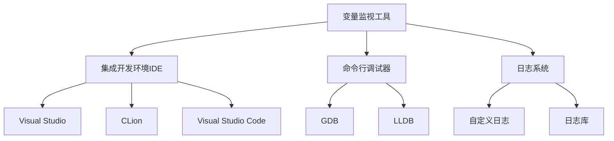

# C++ 监视变量

在C++程序开发过程中，了解程序执行时变量的值和状态变化是非常重要的。变量监视是调试过程中的关键技术，它能帮助开发者追踪程序中的数据流动，及时发现异常情况。本文将详细介绍如何在C++程序中监视变量，以及相关的调试工具和技术。

## 什么是变量监视

变量监视是指在程序执行过程中，观察和跟踪特定变量的值变化的过程。通过监视变量，开发者可以：

- 验证程序是否按照预期执行
- 找出导致程序错误的原因
- 理解复杂算法的内部工作机制
- 检测内存泄漏和资源使用情况

## 常见的变量监视方法

### 1. 使用打印语句

最简单的监视变量方法是在代码中添加打印语句。

```cpp
#include <iostream>

int main() {
    int counter = 0;
    
    for (int i = 0; i < 5; i++) {
        counter += i;
        std::cout << "Counter value after iteration " << i << ": " << counter << std::endl;
    }
    
    return 0;
}
```

输出：
```
Counter value after iteration 0: 0
Counter value after iteration 1: 1
Counter value after iteration 2: 3
Counter value after iteration 3: 6
Counter value after iteration 4: 10
```

:::tip 提示
虽然打印语句是最简单的监视方法，但在大型项目中可能会降低程序性能，并且需要在调试结束后手动移除或禁用。
:::

### 2. 使用调试器进行变量监视

现代集成开发环境(IDE)都提供了强大的调试工具，允许开发者实时监视变量的值。

#### Visual Studio 监视变量

在Visual Studio中，你可以通过以下步骤监视变量：

1. 设置断点：在代码行号左侧单击以设置断点
2. 启动调试：按F5开始调试
3. 查看变量：
   - 悬停鼠标在变量上查看其值
   - 使用"监视"窗口添加要监视的变量
   - 使用"局部变量"窗口查看作用域内的所有变量

#### 使用GDB监视变量

对于Linux或使用命令行的开发者，GDB是一个强大的调试工具：

```bash
# 编译带有调试信息的程序
g++ -g myprogram.cpp -o myprogram

# 启动GDB
gdb ./myprogram

# GDB命令
(gdb) break main     # 在main函数设置断点
(gdb) run            # 运行程序
(gdb) print counter  # 打印变量值
(gdb) watch counter  # 监视变量变化
(gdb) continue       # 继续执行
```

## 高级变量监视技术

### 条件断点

条件断点允许你在变量满足特定条件时暂停程序执行：

```cpp
// 假设你要监视当counter变量超过100时的程序状态
// 在Visual Studio中，可以右键单击断点，设置条件: counter > 100
// 在GDB中，可以使用命令:
// (gdb) break 10 if counter > 100
```

### 使用监视表达式

除了简单的变量，你还可以监视表达式：

```cpp
// 在Visual Studio的"监视"窗口中，可以添加以下表达式:
// counter + 5
// array[i]
// ptr != nullptr
```

### 监视复杂数据结构

对于结构体、类和STL容器，调试器通常能提供详细视图：

```cpp
#include <vector>
#include <string>

struct Person {
    std::string name;
    int age;
};

int main() {
    std::vector<Person> people = {
        {"Alice", 25},
        {"Bob", 30}
    };
    
    // 在调试时可以展开people查看其内容
    
    return 0;
}
```

## 内存监视

有时需要监视变量的内存地址和内存变化：

```cpp
#include <iostream>

int main() {
    int value = 42;
    int* ptr = &value;
    
    std::cout << "Variable value: " << value << std::endl;
    std::cout << "Variable address: " << &value << std::endl;
    std::cout << "Pointer value: " << ptr << std::endl;
    std::cout << "Dereferenced pointer: " << *ptr << std::endl;
    
    return 0;
}
```

输出:
```
Variable value: 42
Variable address: 0x7ffd5c8e3a1c
Pointer value: 0x7ffd5c8e3a1c
Dereferenced pointer: 42
```

在调试器中，你可以使用内存窗口直接查看内存内容。

## 实际应用案例

### 案例1：查找数组越界

```cpp
#include <iostream>

void findArrayBounds() {
    int arr[5] = {1, 2, 3, 4, 5};
    int sum = 0;
    
    // 有意引入错误：循环超出数组边界
    for (int i = 0; i <= 5; i++) {
        // 在调试器中监视i和arr[i]
        sum += arr[i];
    }
    
    std::cout << "Sum: " << sum << std::endl;
}

int main() {
    findArrayBounds();
    return 0;
}
```

通过监视变量 `i` 和 `arr[i]`，当 `i=5` 时，可以观察到访问了数组范围之外的内存，这可能导致未定义行为。

### 案例2：追踪递归函数

```cpp
#include <iostream>
#include <string>

int fibonacci(int n) {
    // 添加调试信息
    std::string indent(n, ' '); // 创建缩进
    std::cout << indent << "Computing fib(" << n << ")" << std::endl;
    
    if (n <= 1) return n;
    
    int result = fibonacci(n-1) + fibonacci(n-2);
    
    std::cout << indent << "fib(" << n << ") = " << result << std::endl;
    return result;
}

int main() {
    int result = fibonacci(5);
    std::cout << "Final result: " << result << std::endl;
    return 0;
}
```

通过监视递归调用中的变量 `n` 和返回值，可以理解递归算法的执行过程。

## 自定义监视器

对于复杂项目，你可能需要创建自定义监视器：

```cpp
#include <iostream>
#include <fstream>
#include <chrono>
#include <string>

class VariableMonitor {
private:
    std::ofstream logFile;
    std::chrono::time_point<std::chrono::system_clock> startTime;

public:
    VariableMonitor(const std::string& filename) {
        logFile.open(filename);
        startTime = std::chrono::system_clock::now();
    }

    ~VariableMonitor() {
        if (logFile.is_open()) {
            logFile.close();
        }
    }

    template <typename T>
    void log(const std::string& varName, const T& value) {
        auto now = std::chrono::system_clock::now();
        auto elapsed = std::chrono::duration_cast<std::chrono::milliseconds>(now - startTime).count();
        
        logFile << "[" << elapsed << "ms] " << varName << " = " << value << std::endl;
    }
};

int main() {
    VariableMonitor monitor("variable_log.txt");
    
    int count = 0;
    for (int i = 0; i < 5; i++) {
        count += i;
        monitor.log("count", count);
        
        // 模拟处理时间
        std::this_thread::sleep_for(std::chrono::milliseconds(100));
    }
    
    return 0;
}
```

这个自定义监视器将变量的值和时间信息记录到文件中，便于后续分析。

## 调试工具对比

不同的调试工具提供不同的变量监视功能：



## 变量监视的最佳实践

1. **选择性监视**：只监视与当前问题相关的变量，避免信息过载
2. **使用条件断点**：对于循环中的特定条件，使用条件断点更有效
3. **监视表达式**：利用表达式监视派生值，如 `x+y` 或 `ptr != nullptr`
4. **组合使用技术**：结合使用打印语句、调试器和日志系统
5. **注意性能影响**：过多的监视点可能会影响程序性能

:::caution 注意
对于多线程程序，变量监视需要特别小心，因为监视本身可能改变程序的行为（观察者效应）。
:::

## 总结

变量监视是C++程序调试中不可或缺的技术。通过掌握各种变量监视方法，从简单的打印语句到高级调试器功能，开发者可以更有效地追踪程序执行过程，快速定位和修复问题。选择合适的监视方法取决于项目规模、复杂度以及开发环境。

## 练习

1. 编写一个程序，使用不同的变量监视技术跟踪一个冒泡排序算法的执行过程。
2. 创建一个简单的计数器程序，使用条件断点在计数器达到特定值时暂停。
3. 编写一个自定义监视器类，记录一个变量在程序执行期间的所有变化。
4. 使用调试器监视一个链表或二叉树数据结构的遍历过程。
5. 尝试在多线程程序中监视共享变量，观察可能的竞态条件。

## 附加资源

- **官方文档**：
  - Visual Studio 调试指南
  - GDB 用户手册
  - CLion 调试功能指南
  
- **相关技术**：
  - 断点管理
  - 调用堆栈分析
  - 内存泄漏检测
  - 性能分析工具

- **进阶学习**：
  - 远程调试技术
  - 核心转储分析
  - 自定义调试可视化

通过持续练习和应用这些变量监视技术，你将能够更有效地开发和调试C++程序，减少错误并提高代码质量。