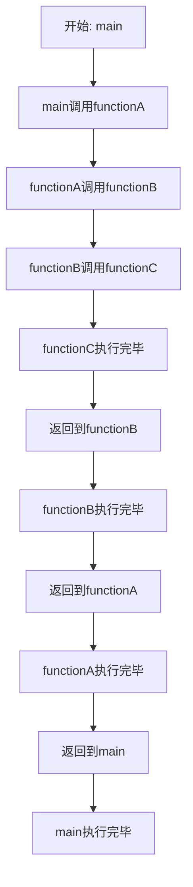

# C++ 调用堆栈

## 什么是调用堆栈

调用堆栈（Call Stack）是程序执行过程中用来跟踪函数调用关系的一种数据结构。当一个函数调用另一个函数时，被调用函数的信息会被压入堆栈；当函数执行完毕返回时，这些信息会被从堆栈中弹出。这种"后进先出"(LIFO, Last In First Out)的特性使得程序能够准确地跟踪每个函数的执行路径。

:::note
调用堆栈记录的信息通常包括：函数的返回地址、函数参数、局部变量以及其他与函数执行相关的状态信息。
:::

## 调用堆栈的工作原理

让我们通过一个简单的例子来理解调用堆栈的工作原理：

```cpp
#include <iostream>

void functionC() {
    std::cout << "Inside functionC" << std::endl;
    // functionC执行完毕，将从堆栈中弹出
}

void functionB() {
    std::cout << "Inside functionB - Before calling functionC" << std::endl;
    functionC(); // 调用functionC，functionC被压入堆栈
    std::cout << "Inside functionB - After calling functionC" << std::endl;
    // functionB执行完毕，将从堆栈中弹出
}

void functionA() {
    std::cout << "Inside functionA - Before calling functionB" << std::endl;
    functionB(); // 调用functionB，functionB被压入堆栈
    std::cout << "Inside functionA - After calling functionB" << std::endl;
    // functionA执行完毕，将从堆栈中弹出
}

int main() {
    std::cout << "Inside main - Before calling functionA" << std::endl;
    functionA(); // 调用functionA，functionA被压入堆栈
    std::cout << "Inside main - After calling functionA" << std::endl;
    return 0;
}
```

输出结果：
```
Inside main - Before calling functionA
Inside functionA - Before calling functionB
Inside functionB - Before calling functionC
Inside functionC
Inside functionB - After calling functionC
Inside functionA - After calling functionB
Inside main - After calling functionA
```

当上述代码执行时，调用堆栈的变化如下：



在调用堆栈最深处的时候（当`functionC`被调用时），堆栈从底到顶的顺序是：
1. `main`
2. `functionA`
3. `functionB`
4. `functionC`

## 如何查看调用堆栈

### 1. 使用调试器

大多数现代集成开发环境(IDE)都提供了查看调用堆栈的功能：

- **Visual Studio**: 在调试模式下，可以通过"调试 > 窗口 > 调用堆栈"查看
- **CLion**: 在调试模式下，"Frames"窗口显示调用堆栈
- **GDB命令行**: 使用`backtrace`或`bt`命令查看调用堆栈

### 2. 代码中输出调用堆栈

在某些情况下，你可能需要在代码中打印调用堆栈信息，尤其是在发生异常时：

```cpp
#include <iostream>
#include <stdexcept>
#include <cxxabi.h>  // 用于解码符号
#include <execinfo.h> // 用于获取堆栈信息

void print_stacktrace() {
    const int max_frames = 100;
    void* callstack[max_frames];
    int frames = backtrace(callstack, max_frames);
    char** symbols = backtrace_symbols(callstack, frames);

    std::cerr << "Stack trace:\n";
    for (int i = 0; i < frames; i++) {
        std::cerr << symbols[i] << std::endl;
    }

    free(symbols);
}

void functionC() {
    throw std::runtime_error("Something went wrong in functionC");
}

void functionB() {
    try {
        functionC();
    } catch (const std::exception& e) {
        std::cerr << "Exception caught: " << e.what() << std::endl;
        print_stacktrace();
        throw; // 重新抛出异常
    }
}

void functionA() {
    functionB();
}

int main() {
    try {
        functionA();
    } catch (const std::exception& e) {
        std::cerr << "Exception caught in main: " << e.what() << std::endl;
    }
    return 0;
}
```

:::caution
上面的示例代码使用了POSIX特定的函数，如`backtrace`和`backtrace_symbols`，这些函数在Linux和macOS上可用，但在Windows上不可用。在Windows平台，你需要使用Windows API如`CaptureStackBackTrace`函数。
:::

## 调用堆栈在调试中的应用

调用堆栈是程序调试中的重要工具，它有以下几个关键应用：

### 1. 定位程序崩溃位置

当程序崩溃时，调用堆栈可以帮助你准确定位崩溃发生在哪个函数，以及是如何被调用到的。

### 2. 理解程序执行流程

通过分析调用堆栈，可以了解当前执行点是如何一步步从程序入口到达的，有助于理解复杂的程序流程。

### 3. 调试递归函数

在递归函数中，调用堆栈对于理解当前处于递归的哪个层级特别有用。

```cpp
#include <iostream>

void recursive_function(int n) {
    std::cout << "Entering recursive_function with n = " << n << std::endl;
    
    if (n > 0) {
        recursive_function(n - 1);
    } else {
        // 在这里设置断点，观察调用堆栈
        std::cout << "Reached base case" << std::endl;
    }
    
    std::cout << "Leaving recursive_function with n = " << n << std::endl;
}

int main() {
    recursive_function(3);
    return 0;
}
```

当执行到`n = 0`的基本情况时，调用堆栈将显示所有递归调用层级。

### 4. 分析内存问题

调用堆栈可以帮助分析内存泄漏、缓冲区溢出等问题，通过查看哪些函数分配了内存但没有释放，或者哪些函数访问了无效内存。

## 调用堆栈溢出

调用堆栈有大小限制，当递归太深或局部变量占用太多内存时，会发生"堆栈溢出"(Stack Overflow)错误。

```cpp
void infinite_recursion() {
    // 不要在实际程序中运行此代码！
    int large_array[1000000]; // 分配大量栈内存
    infinite_recursion(); // 无限递归会导致堆栈溢出
}
```

:::warning
堆栈溢出是一种严重的错误，程序通常会立即崩溃。在设计递归函数时要格外小心，确保有正确的基本情况来终止递归。
:::

## 实际案例：使用调用堆栈解决问题

假设我们有一个程序，它在某些情况下会莫名其妙地崩溃。通过分析调用堆栈，我们可以找出问题所在：

```cpp
#include <iostream>
#include <vector>

void process_data(const std::vector<int>& data, int index) {
    // 这里没有检查索引是否有效
    std::cout << "Processing data at index " << index << ": " << data[index] << std::endl;
}

void analyze_results(const std::vector<int>& data) {
    for (int i = 0; i <= data.size(); i++) { // 注意这里的<=，会导致越界访问
        process_data(data, i);
    }
}

void run_analysis() {
    std::vector<int> sample_data = {10, 20, 30, 40, 50};
    analyze_results(sample_data);
}

int main() {
    try {
        run_analysis();
    } catch (const std::exception& e) {
        std::cerr << "Error: " << e.what() << std::endl;
        // 在实际应用中，这里可以打印调用堆栈
    }
    return 0;
}
```

当程序运行到越界访问时会崩溃，调用堆栈将显示：
1. `main`
2. `run_analysis`
3. `analyze_results`
4. `process_data`

通过这个调用链，我们可以定位到问题出在`analyze_results`函数中的循环条件有问题，应该使用`i < data.size()`而不是`i <= data.size()`。

## 总结

调用堆栈是C++程序执行过程中的重要机制，它记录了函数调用的层次关系和执行路径。理解调用堆栈有助于：

- 更好地理解程序的执行流程
- 有效地调试复杂程序
- 定位程序崩溃的原因
- 分析性能和内存问题

作为初学者，培养查看和分析调用堆栈的习惯，将大大提高你的调试效率和问题解决能力。

## 练习

1. 编写一个包含多层函数调用的程序，在每个函数中添加断点，并在调试模式下观察调用堆栈的变化。

2. 创建一个递归函数（如计算斐波那契数列），在特定条件下设置断点，查看调用堆栈的深度。

3. 故意编写一个会导致堆栈溢出的程序，并观察程序崩溃时的调用堆栈信息。

4. 修改本文中的"实际案例"代码，添加适当的异常处理和调用堆栈打印，以便在发生越界访问时能够显示完整的调用路径。

## 进一步阅读

- C++异常处理机制与调用堆栈的关系
- 不同编译器和平台下调用堆栈的实现差异
- 调用堆栈优化技术（如尾调用优化）
- 使用高级调试工具分析调用堆栈