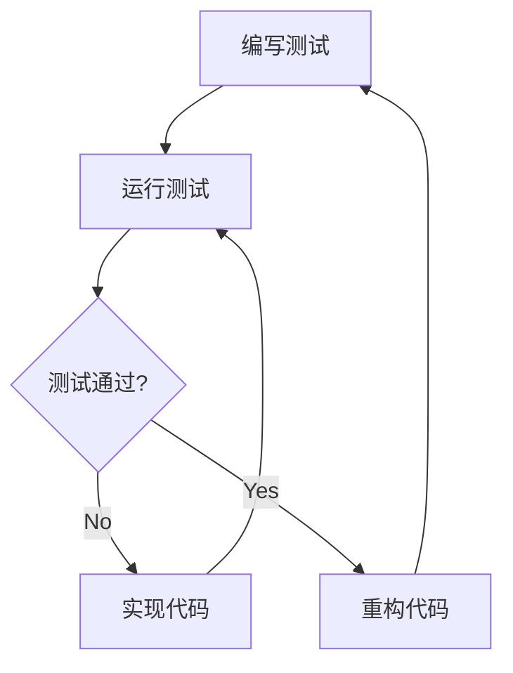

# C++ 测试框架

## 为什么需要测试框架？

在编写C++程序时，确保代码的正确性和稳定性至关重要。手动测试每个功能不仅繁琐，还容易出错。这时，测试框架就成了开发者的得力助手。

:::tip 测试框架的价值
测试框架帮助开发者自动化测试过程，提高测试效率，发现潜在问题，并确保代码修改不会破坏现有功能。
:::

## C++ 常用测试框架概览

在C++生态系统中，有几个流行的测试框架：

1. **Google Test (gtest)** - 谷歌开发的全功能C++测试框架
2. **Catch2** - 轻量级的、现代化的C++测试框架
3. **Boost.Test** - Boost库提供的测试工具
4. **doctest** - 极轻量级的单头文件测试框架
5. **CppUnit** - C++版的JUnit

本文将主要介绍Google Test和Catch2，它们是目前使用最广泛的两个框架。

## Google Test入门

### 安装与配置

首先，我们需要安装Google Test。以下是基本步骤：

1. 从[GitHub](https://github.com/google/googletest)下载源码
2. 构建库：
   ```bash
   mkdir build && cd build
   cmake ..
   make
   ```
3. 链接到你的项目

### 编写第一个测试

下面是一个使用Google Test的简单示例：

```cpp
#include <gtest/gtest.h>

// 被测试的函数
int Add(int a, int b) {
    return a + b;
}

// 测试用例
TEST(AdditionTest, PositiveNumbers) {
    EXPECT_EQ(5, Add(2, 3));
    EXPECT_EQ(10, Add(4, 6));
}

TEST(AdditionTest, NegativeNumbers) {
    EXPECT_EQ(-5, Add(-2, -3));
    EXPECT_EQ(-1, Add(-4, 3));
}

int main(int argc, char **argv) {
    ::testing::InitGoogleTest(&argc, argv);
    return RUN_ALL_TESTS();
}
```

### 运行测试

编译并运行上述代码，你会看到如下输出：

```
[==========] Running 2 tests from 1 test suite.
[----------] Global test environment set-up.
[----------] 2 tests from AdditionTest
[ RUN      ] AdditionTest.PositiveNumbers
[       OK ] AdditionTest.PositiveNumbers (0 ms)
[ RUN      ] AdditionTest.NegativeNumbers
[       OK ] AdditionTest.NegativeNumbers (0 ms)
[----------] 2 tests from AdditionTest (0 ms total)

[----------] Global test environment tear-down
[==========] 2 tests from 1 test suite ran. (0 ms total)
[  PASSED  ] 2 tests.
```

### 断言与验证

Google Test提供两类检查机制：

1. **ASSERT_***：断言失败时停止当前测试
2. **EXPECT_***：验证失败时继续执行，但标记测试失败

常用断言：
- `ASSERT_EQ(expected, actual)` / `EXPECT_EQ(expected, actual)`：检查相等
- `ASSERT_NE(val1, val2)` / `EXPECT_NE(val1, val2)`：检查不相等
- `ASSERT_LT(val1, val2)` / `EXPECT_LT(val1, val2)`：检查小于
- `ASSERT_GT(val1, val2)` / `EXPECT_GT(val1, val2)`：检查大于
- `ASSERT_TRUE(condition)` / `EXPECT_TRUE(condition)`：检查条件为真

## Catch2框架

Catch2是一个更现代、更简洁的C++测试框架，它的特点是只需要包含一个头文件。

### 安装与配置

使用Catch2非常简单：

1. 下载`catch.hpp`文件（或使用包管理器）
2. 在测试文件中包含这个头文件

### 编写Catch2测试

```cpp
#define CATCH_CONFIG_MAIN  // 这将让Catch2自动生成main()函数
#include <catch2/catch.hpp>

unsigned int Factorial(unsigned int number) {
    return number <= 1 ? 1 : number * Factorial(number - 1);
}

TEST_CASE("Factorials are computed", "[factorial]") {
    REQUIRE(Factorial(0) == 1);
    REQUIRE(Factorial(1) == 1);
    REQUIRE(Factorial(2) == 2);
    REQUIRE(Factorial(3) == 6);
    REQUIRE(Factorial(10) == 3628800);
}

TEST_CASE("Factorial edge cases", "[factorial]") {
    SECTION("Zero factorial") {
        REQUIRE(Factorial(0) == 1);
    }
    
    SECTION("Large factorials") {
        CHECK(Factorial(10) == 3628800);
    }
}
```

### Catch2特性

Catch2的一些亮点：
- 只需包含一个头文件
- BDD风格的SECTION支持
- 自动REQUIRE和CHECK断言
- 详细的测试报告
- 无需宏定义测试名称

## 测试驱动开发 (TDD) 与测试框架

测试驱动开发是一种软件开发方法，它遵循以下循环：

1. 编写测试
2. 运行测试（此时应该失败）
3. 编写最小代码使测试通过
4. 重构代码
5. 重复

让我们用一个简单的例子来实践TDD：



### TDD示例：实现一个字符串反转函数

**步骤1：编写测试**

```cpp
#include <gtest/gtest.h>
#include <string>

std::string ReverseString(const std::string& input);

TEST(StringTest, ReverseEmptyString) {
    EXPECT_EQ("", ReverseString(""));
}

TEST(StringTest, ReverseSingleChar) {
    EXPECT_EQ("a", ReverseString("a"));
}

TEST(StringTest, ReverseString) {
    EXPECT_EQ("cba", ReverseString("abc"));
    EXPECT_EQ("olleh", ReverseString("hello"));
}
```

**步骤2：实现函数**

```cpp
std::string ReverseString(const std::string& input) {
    return std::string(input.rbegin(), input.rend());
}
```

**步骤3：运行测试，确认通过**

## 模拟对象和依赖注入

在测试复杂系统时，我们常常需要隔离被测组件与其依赖。Google Test提供了Google Mock，用于创建模拟对象。

### 基本模拟示例

```cpp
#include <gmock/gmock.h>
#include <gtest/gtest.h>

// 接口
class DataProvider {
public:
    virtual ~DataProvider() = default;
    virtual int GetValue() = 0;
};

// 使用接口的类
class DataProcessor {
public:
    explicit DataProcessor(DataProvider* provider) : provider_(provider) {}
    
    int ProcessData() {
        return provider_->GetValue() * 2;
    }
    
private:
    DataProvider* provider_;
};

// 模拟对象
class MockDataProvider : public DataProvider {
public:
    MOCK_METHOD(int, GetValue, (), (override));
};

// 测试
TEST(DataProcessorTest, ProcessesDataCorrectly) {
    MockDataProvider mockProvider;
    EXPECT_CALL(mockProvider, GetValue()).WillOnce(::testing::Return(42));
    
    DataProcessor processor(&mockProvider);
    EXPECT_EQ(84, processor.ProcessData());
}
```

## 参数化测试

测试框架允许你使用不同参数重复运行相同的测试逻辑。

### Google Test参数化测试

```cpp
#include <gtest/gtest.h>

// 被测函数
bool IsPrime(int n) {
    if (n <= 1) return false;
    if (n <= 3) return true;
    if (n % 2 == 0 || n % 3 == 0) return false;
    
    for (int i = 5; i * i <= n; i += 6) {
        if (n % i == 0 || n % (i + 2) == 0) return false;
    }
    return true;
}

// 参数化测试类
class PrimeTest : public ::testing::TestWithParam<std::tuple<int, bool>> {};

TEST_P(PrimeTest, CheckPrime) {
    int input = std::get<0>(GetParam());
    bool expected = std::get<1>(GetParam());
    
    EXPECT_EQ(expected, IsPrime(input));
}

// 参数值
INSTANTIATE_TEST_SUITE_P(
    PrimeValues,
    PrimeTest,
    ::testing::Values(
        std::make_tuple(2, true),
        std::make_tuple(3, true),
        std::make_tuple(4, false),
        std::make_tuple(5, true),
        std::make_tuple(6, false),
        std::make_tuple(17, true),
        std::make_tuple(20, false)
    )
);
```

## 真实项目测试案例

### 案例：一个简单的银行账户系统

**账户类实现 (Account.h)**:

```cpp
#pragma once
#include <string>

class Account {
public:
    Account(const std::string& id, double initialBalance = 0);
    
    std::string GetId() const;
    double GetBalance() const;
    
    void Deposit(double amount);
    bool Withdraw(double amount);
    
private:
    std::string id_;
    double balance_;
};
```

**实现文件 (Account.cpp)**:

```cpp
#include "Account.h"

Account::Account(const std::string& id, double initialBalance)
    : id_(id), balance_(initialBalance) {}

std::string Account::GetId() const {
    return id_;
}

double Account::GetBalance() const {
    return balance_;
}

void Account::Deposit(double amount) {
    if (amount > 0) {
        balance_ += amount;
    }
}

bool Account::Withdraw(double amount) {
    if (amount > 0 && balance_ >= amount) {
        balance_ -= amount;
        return true;
    }
    return false;
}
```

**测试文件 (AccountTest.cpp)**:

```cpp
#include <gtest/gtest.h>
#include "Account.h"

class AccountTest : public ::testing::Test {
protected:
    void SetUp() override {
        // 每个测试前都会执行
        testAccount = new Account("test123", 100.0);
    }

    void TearDown() override {
        // 每个测试后都会执行
        delete testAccount;
    }

    Account* testAccount;
};

TEST_F(AccountTest, InitialBalanceIsCorrect) {
    EXPECT_EQ(100.0, testAccount->GetBalance());
    EXPECT_EQ("test123", testAccount->GetId());
}

TEST_F(AccountTest, DepositIncreasesBalance) {
    testAccount->Deposit(50.0);
    EXPECT_EQ(150.0, testAccount->GetBalance());
}

TEST_F(AccountTest, NegativeDepositIgnored) {
    testAccount->Deposit(-50.0);
    EXPECT_EQ(100.0, testAccount->GetBalance());
}

TEST_F(AccountTest, WithdrawDecreasesBalance) {
    bool result = testAccount->Withdraw(50.0);
    EXPECT_TRUE(result);
    EXPECT_EQ(50.0, testAccount->GetBalance());
}

TEST_F(AccountTest, InsufficientFundsWithdraw) {
    bool result = testAccount->Withdraw(150.0);
    EXPECT_FALSE(result);
    EXPECT_EQ(100.0, testAccount->GetBalance());
}

TEST_F(AccountTest, NegativeWithdrawIgnored) {
    bool result = testAccount->Withdraw(-50.0);
    EXPECT_FALSE(result);
    EXPECT_EQ(100.0, testAccount->GetBalance());
}
```

## 测试覆盖率

测试覆盖率是衡量代码被测试执行程度的指标。常见的覆盖率类型有：

1. **行覆盖率** - 被执行的代码行百分比
2. **分支覆盖率** - 执行了的决策分支百分比
3. **函数覆盖率** - 被调用的函数百分比

### 使用gcov和lcov测量覆盖率

在Linux下，可以使用gcov和lcov工具：

1. 使用特殊编译选项编译
```bash
g++ -fprofile-arcs -ftest-coverage -g -O0 -o mytest *.cpp
```

2. 运行测试后生成报告
```bash
lcov --capture --directory . --output-file coverage.info
genhtml coverage.info --output-directory out
```

## 持续集成中的测试

测试在持续集成(CI)中起着至关重要的作用。流行的CI工具如GitHub Actions、Jenkins或GitLab CI都可以自动运行你的测试套件。

一个简单的GitHub Actions配置示例：

```yaml
name: C++ Tests

on:
  push:
    branches: [ main ]
  pull_request:
    branches: [ main ]

jobs:
  build:
    runs-on: ubuntu-latest
    
    steps:
    - uses: actions/checkout@v2
      
    - name: Install dependencies
      run: sudo apt-get install -y googletest
      
    - name: Configure
      run: cmake -S . -B build
      
    - name: Build
      run: cmake --build build
      
    - name: Test
      run: cd build && ctest
```

## 测试的最佳实践

1. **测试单一责任** - 每个测试只测试一个功能点
2. **明确测试名称** - 通过测试名传达测试内容和预期结果
3. **避免测试间的依赖** - 测试应该独立运行
4. **使用设置和拆卸步骤** - 统一管理测试前后的资源
5. **测试边界条件** - 不仅测试常规输入，还要测试边界情况
6. **编写可重用的测试工具** - 创建帮助函数减少重复代码
7. **测试错误处理** - 确保代码正确处理异常情况

## 总结

测试框架是现代C++开发中不可或缺的工具。它们帮助开发者：

- 自动化测试过程
- 提高代码质量和可靠性
- 简化重构过程
- 验证边界条件和错误处理
- 提供代码文档

无论你选择Google Test、Catch2还是其他框架，重要的是建立一个全面的测试策略，确保你的代码按预期工作，并随着需求变化保持稳定。

:::tip 初学者建议
从小项目开始，逐渐学习测试技巧。自动化测试虽然有学习曲线，但它将为你节省大量调试时间，并帮助你成为更好的开发者。
:::

## 练习和资源

### 练习

1. 安装Google Test或Catch2，并编写一个简单的测试项目
2. 为一个现有类编写单元测试，力求100%覆盖率
3. 使用TDD方法实现一个简单的栈或队列
4. 尝试使用模拟对象测试一个依赖外部资源的类

### 进一步学习资源

- [Google Test文档](https://google.github.io/googletest/)
- [Catch2官方文档](https://github.com/catchorg/Catch2/blob/master/docs/Readme.md)
- 《Modern C++ Programming with Test-Driven Development》by Jeff Langr
- 《C++ Unit Testing with Google Test and Google Mock》online tutorials

测试是一项需要实践的技能，定期练习并逐步改进你的测试策略将帮助你成为一个更好的C++开发者。