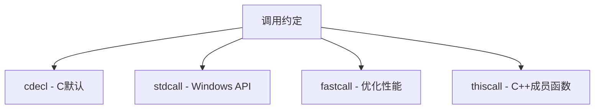

# C++ 兼容C代码

## 引言

C++语言是在C语言基础上发展而来的，它继承了C语言的大部分特性，同时又增加了面向对象编程、泛型编程等现代编程概念。由于这种血缘关系，C++对C代码有着良好的兼容性，这使得开发者可以在C++项目中复用已有的C代码，或者将C++代码与C代码混合使用。

在实际开发中，很多情况下我们需要将C和C++代码结合使用：

- 使用现有的C语言库
- 为了性能考虑使用C实现特定功能
- 需要与C语言接口的系统进行交互

本文将介绍C++兼容C代码的基本原理、实现方法以及注意事项，帮助初学者理解如何在项目中有效地混合使用这两种语言。

## C++ 兼容C的基本原理

C++兼容C的核心机制是通过`extern "C"`声明来实现的。这个声明告诉C++编译器按照C语言的方式来处理函数名，避免C++的名称修饰（name mangling）机制对函数名进行修改。

### 什么是名称修饰（Name Mangling）？

在C++中，为了支持函数重载，编译器会对函数名进行修饰，将参数类型信息编码到函数名中。例如：

```cpp
void func(int a);
void func(double a);
```

编译后可能变成：
- `_func_i` (对应接受int参数的func)
- `_func_d` (对应接受double参数的func)

而C语言不支持函数重载，因此编译器不会对函数名进行修饰。如果C++代码需要调用C函数，就需要告诉编译器不要对这些函数名进行修饰。

## 使用extern "C"声明

### 基本语法

在C++代码中，使用`extern "C"`来声明C函数：

```cpp
extern "C" {
    // C函数声明
    int add(int a, int b);
    void print_message(const char* msg);
}
```

对于单个函数，也可以这样声明：

```cpp
extern "C" int add(int a, int b);
```

### 创建兼容的头文件

为了让头文件既可以被C编译器也可以被C++编译器正确处理，通常使用条件编译：

```cpp
#ifndef MY_HEADER_H
#define MY_HEADER_H

#ifdef __cplusplus
extern "C" {
#endif

// 函数声明
int add(int a, int b);
void print_message(const char* msg);

#ifdef __cplusplus
}
#endif

#endif // MY_HEADER_H
```

:::tip
`__cplusplus`是C++编译器定义的宏，当使用C++编译器时，这个宏会被定义，而C编译器不会定义此宏。
:::

## 示例：C和C++混合编程

让我们通过一个简单的例子来演示C++如何调用C代码。

### math.h (C头文件)

```c
#ifndef MATH_H
#define MATH_H

#ifdef __cplusplus
extern "C" {
#endif

int add(int a, int b);
int subtract(int a, int b);
int multiply(int a, int b);
float divide(int a, int b);

#ifdef __cplusplus
}
#endif

#endif /* MATH_H */
```

### math.c (C实现文件)

```c
#include "math.h"

int add(int a, int b) {
    return a + b;
}

int subtract(int a, int b) {
    return a - b;
}

int multiply(int a, int b) {
    return a * b;
}

float divide(int a, int b) {
    if (b == 0) {
        return 0; // 简化处理，实际应该有错误处理
    }
    return (float)a / b;
}
```

### main.cpp (C++主程序)

```cpp
#include <iostream>
#include "math.h"

class Calculator {
private:
    int m_lastResult;

public:
    Calculator() : m_lastResult(0) {}

    void performAddition(int a, int b) {
        m_lastResult = add(a, b);  // 调用C函数
        std::cout << "Addition result: " << m_lastResult << std::endl;
    }

    void performSubtraction(int a, int b) {
        m_lastResult = subtract(a, b);  // 调用C函数
        std::cout << "Subtraction result: " << m_lastResult << std::endl;
    }

    void performMultiplication(int a, int b) {
        m_lastResult = multiply(a, b);  // 调用C函数
        std::cout << "Multiplication result: " << m_lastResult << std::endl;
    }

    void performDivision(int a, int b) {
        float result = divide(a, b);  // 调用C函数
        std::cout << "Division result: " << result << std::endl;
    }
};

int main() {
    Calculator calc;
    
    calc.performAddition(10, 5);      // 输出: Addition result: 15
    calc.performSubtraction(10, 5);   // 输出: Subtraction result: 5
    calc.performMultiplication(10, 5); // 输出: Multiplication result: 50
    calc.performDivision(10, 5);      // 输出: Division result: 2
    
    return 0;
}
```

### 编译命令

```bash
# 编译C文件
gcc -c math.c -o math.o

# 编译并链接C++文件
g++ math.o main.cpp -o calculator
```

## 数据类型兼容性问题

尽管C++兼容C代码，但在混合编程时仍需注意数据类型的兼容性问题。

### 基本数据类型

大多数基本数据类型（如`int`、`float`、`char`等）在C和C++中是兼容的。

### 结构体和联合体

C的结构体和联合体在C++中也能正常使用，但需要注意：

1. C++中的结构体可以包含成员函数和访问控制，而C中不行
2. C++中可以省略`struct`关键字，而C中不行

```c
// C代码
struct Point {
    int x;
    int y;
};

// 使用时必须带struct
struct Point p;
```

```cpp
// C++代码
struct Point {
    int x;
    int y;
};

// 可以省略struct
Point p;
```

### 函数指针

函数指针在C和C++中的使用有所不同，特别是当涉及到成员函数时：

```cpp
// C风格函数指针
typedef int (*MathFunc)(int, int);

// 使用C风格函数指针
MathFunc operation = add;
int result = operation(5, 3);  // 调用add(5, 3)
```

## 内存管理兼容性

C和C++的内存管理方式也有差异：

### C风格内存管理
```c
// C风格内存分配
int* array = (int*)malloc(10 * sizeof(int));
// 使用数组
free(array); // 释放内存
```

### C++ 风格内存管理
```cpp
// C++风格内存分配
int* array = new int[10];
// 使用数组
delete[] array; // 释放内存
```

:::caution
混合使用这两种方式可能导致问题！使用`malloc`分配的内存应该用`free`释放，使用`new`分配的内存应该用`delete`释放。
:::

## 实际应用场景

### 1. 使用C语言库

很多成熟的库是用C语言编写的，例如：
- SQLite数据库
- OpenGL图形库
- libcurl网络库

使用`extern "C"`可以让C++代码方便地调用这些库。

### 示例：在C++中使用SQLite

```cpp
#include <iostream>
#include <sqlite3.h>

int main() {
    sqlite3* db;
    char* errMsg = nullptr;
    
    // 打开数据库
    int rc = sqlite3_open("test.db", &db);
    
    if (rc) {
        std::cerr << "无法打开数据库: " << sqlite3_errmsg(db) << std::endl;
        return 1;
    }
    
    // 执行SQL语句
    const char* sql = "CREATE TABLE IF NOT EXISTS USERS("
                      "ID INT PRIMARY KEY NOT NULL, "
                      "NAME TEXT NOT NULL);";
                      
    rc = sqlite3_exec(db, sql, nullptr, nullptr, &errMsg);
    
    if (rc != SQLITE_OK) {
        std::cerr << "SQL错误: " << errMsg << std::endl;
        sqlite3_free(errMsg);
    } else {
        std::cout << "数据表创建成功" << std::endl;
    }
    
    // 关闭数据库
    sqlite3_close(db);
    return 0;
}
```

### 2. 性能敏感代码

有些性能敏感的代码可能用C实现更高效，可以通过混合编程方式整合到C++程序中。

### 3. 系统级编程

与操作系统交互的代码通常提供C接口，例如POSIX API：

```cpp
#include <iostream>
#include <unistd.h>
#include <fcntl.h>

int main() {
    // 使用C风格的文件操作
    int fd = open("example.txt", O_CREAT | O_WRONLY, 0644);
    
    if (fd < 0) {
        std::cerr << "无法打开文件" << std::endl;
        return 1;
    }
    
    const char* data = "Hello, mixed C/C++ programming!\n";
    write(fd, data, strlen(data));
    
    close(fd);
    return 0;
}
```

## C++ 调用约定与C调用约定

函数调用约定规定了函数参数如何传递以及由谁负责清理栈空间。不同的调用约定可能会导致二进制不兼容。



在Windows平台上，可以这样指定调用约定：

```cpp
extern "C" {
    // cdecl调用约定
    int __cdecl add(int a, int b);
    
    // stdcall调用约定
    int __stdcall windowsFunction(int a, int b);
}
```

## 注意事项和最佳实践

### 1. 避免在extern "C"块中使用C++特性

```cpp
extern "C" {
    // 错误：extern "C"块中不应使用C++特性
    void func(std::string s);  // std::string是C++特有的
    
    // 正确：使用C兼容类型
    void func(const char* s);
}
```

### 2. 使用适当的类型转换

```cpp
// C++风格转换
int* cpp_array = new int[10];
// ...
delete[] cpp_array;

// C风格转换 (在和C库交互时可能需要)
void* c_memory = malloc(10 * sizeof(int));
int* c_array = (int*)c_memory;
// ...
free(c_memory);
```

### 3. 正确处理错误

C和C++的错误处理机制不同，需要适当转换：

```cpp
extern "C" int c_function_that_returns_error_code();

void cpp_function() {
    try {
        int error_code = c_function_that_returns_error_code();
        if (error_code != 0) {
            throw std::runtime_error("C函数返回错误码: " + std::to_string(error_code));
        }
    }
    catch (const std::exception& e) {
        std::cerr << "捕获异常: " << e.what() << std::endl;
    }
}
```

### 4. 封装C接口

最佳实践是将C接口封装在C++类中，提供更加面向对象的接口：

```cpp
// C接口
extern "C" {
    typedef struct {
        int width;
        int height;
    } Rectangle;

    int calculate_area(Rectangle* rect);
}

// C++封装
class CRectangle {
private:
    Rectangle m_rect;

public:
    CRectangle(int w, int h) {
        m_rect.width = w;
        m_rect.height = h;
    }

    int getArea() const {
        return calculate_area(&m_rect);
    }
};
```

## 总结

C++对C代码的兼容性是两种语言之间的重要桥梁，它使得开发者可以:

1. 在C++项目中充分利用现有的C库和代码
2. 根据需要选择更适合的语言特性
3. 实现渐进式迁移，从C代码逐步过渡到C++

掌握`extern "C"`的使用、理解名称修饰机制以及注意数据类型兼容性问题，是成功实现C和C++混合编程的关键。通过适当的封装和接口设计，可以使混合代码更加清晰、易于维护。

随着经验的积累，你会发现混合编程不仅是一种必要的技术手段，也是一种强大的编程策略，让你能够在保持兼容性的同时，充分发挥两种语言的优势。

## 练习

1. 创建一个C语言实现的简单数学库，包含基本运算函数，然后在C++程序中使用这些函数。

2. 编写一个C++类，封装一个C语言的文件操作库，提供面向对象的文件读写接口。

3. 尝试在C++程序中调用一个现有的C库（如libcurl或SQLite），实现一个简单的功能。

## 进一步阅读

- **《The C++ Programming Language》** by Bjarne Stroustrup
- **《Effective C++》** by Scott Meyers
- **C++标准文档中关于语言兼容性的部分**
- **各种C库的官方文档，了解如何在C++中使用它们**