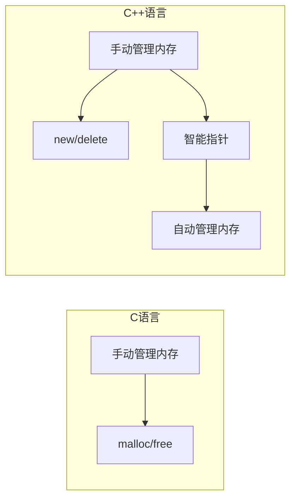

# C++ 与C指针

## 介绍

在混合编程环境中，理解C++与C语言之间指针的差异和交互至关重要。虽然C++是C语言的超集，但它对指针的处理引入了一些新的概念和安全机制。本文将详细探讨C++与C指针的异同，以及它们之间的互操作方法，帮助初学者在混合编程环境中正确地使用指针。

## 基本概念对比

### C语言中的指针

C语言中的指针是存储内存地址的变量，直接操作内存。它简单但功能强大，同时也容易出错。

```c
// C语言中的指针示例
#include <stdio.h>

int main() {
    int number = 42;
    int* ptr = &number; // 指向number的指针
    
    printf("Value: %d\n", *ptr); // 解引用
    *ptr = 100; // 修改指针指向的值
    printf("New value: %d\n", number);
    
    return 0;
}
```

输出结果：
```
Value: 42
New value: 100
```

### C++ 中的指针

C++保留了C的所有指针功能，但增加了更多安全特性和抽象层次：

```cpp
// C++中的指针示例
#include <iostream>

int main() {
    int number = 42;
    int* ptr = &number;
    
    std::cout << "Value: " << *ptr << std::endl;
    *ptr = 100;
    std::cout << "New value: " << number << std::endl;
    
    return 0;
}
```

输出结果：
```
Value: 42
New value: 100
```

## C++ 指针的扩展功能

### 1. const指针

C++中的const限定符可以更精确地控制指针的行为：

```cpp
#include <iostream>

int main() {
    int value = 5;
    
    // 指向常量的指针 - 不能修改指向的值
    const int* ptr1 = &value;
    // *ptr1 = 10; // 错误：不能修改指向的值
    
    // 常量指针 - 不能修改指针本身
    int* const ptr2 = &value;
    *ptr2 = 10; // 正确：可以修改值
    // ptr2 = nullptr; // 错误：不能修改指针
    
    // 指向常量的常量指针 - 两者都不能修改
    const int* const ptr3 = &value;
    // *ptr3 = 15; // 错误
    // ptr3 = nullptr; // 错误
    
    std::cout << "Value after modification: " << value << std::endl;
    return 0;
}
```

输出结果：
```
Value after modification: 10
```

### 2. 智能指针

C++11引入了智能指针，提供自动内存管理，减少内存泄漏：

```cpp
#include <iostream>
#include <memory>

int main() {
    // 独占所有权的智能指针
    std::unique_ptr<int> uniquePtr = std::make_unique<int>(42);
    std::cout << "Unique ptr value: " << *uniquePtr << std::endl;
    
    // 共享所有权的智能指针
    std::shared_ptr<int> sharedPtr1 = std::make_shared<int>(100);
    std::cout << "Shared ptr value: " << *sharedPtr1 << std::endl;
    
    {
        std::shared_ptr<int> sharedPtr2 = sharedPtr1; // 引用计数增加
        std::cout << "Reference count: " << sharedPtr1.use_count() << std::endl;
    } // sharedPtr2离开作用域，引用计数减少
    
    std::cout << "Reference count after scope: " << sharedPtr1.use_count() << std::endl;
    
    return 0;
}
```

输出结果：
```
Unique ptr value: 42
Shared ptr value: 100
Reference count: 2
Reference count after scope: 1
```

:::note
注意: C++11之前，需要使用`std::auto_ptr`（现已废弃）或Boost库中的智能指针。C++14中，可以直接使用`std::make_unique`。
:::

## C与C++指针互操作

### 1. 基本类型指针的互操作

基本数据类型的指针在C和C++之间可以直接互操作：

```cpp
// C++文件
extern "C" {
    // 声明C函数
    void c_function(int* ptr);
}

int main() {
    int value = 42;
    c_function(&value); // 传递C++中的指针给C函数
    return 0;
}
```

```c
// C文件
#include <stdio.h>

void c_function(int* ptr) {
    printf("Value received in C: %d\n", *ptr);
    *ptr = 100; // 修改指针指向的值
}
```

### 2. 结构体指针的互操作

结构体指针需要注意内存布局：

```cpp
// 共享头文件
#ifdef __cplusplus
extern "C" {
#endif

typedef struct {
    int id;
    char name[50];
} Person;

// C函数声明
void process_person(Person* person);

#ifdef __cplusplus
}
#endif
```

```cpp
// C++文件
#include "shared_header.h"
#include <iostream>
#include <cstring>

int main() {
    Person person;
    person.id = 1;
    strcpy(person.name, "John Doe");
    
    process_person(&person);
    
    std::cout << "After C processing: " << person.name << std::endl;
    return 0;
}
```

```c
// C文件
#include "shared_header.h"
#include <string.h>

void process_person(Person* person) {
    printf("Processing person: %s\n", person->name);
    strcat(person->name, " (processed)");
}
```

### 3. 函数指针互操作

函数指针在C和C++间传递时需要注意函数签名和名称修饰：

```cpp
// 共享头文件
#ifdef __cplusplus
extern "C" {
#endif

typedef void (*CallbackFunc)(int);
void register_callback(CallbackFunc callback);

#ifdef __cplusplus
}
#endif
```

```cpp
// C++文件
#include "shared_header.h"
#include <iostream>

// C++回调函数
extern "C" void cpp_callback(int value) {
    std::cout << "C++ callback with value: " << value << std::endl;
}

int main() {
    register_callback(cpp_callback);
    return 0;
}
```

```c
// C文件
#include "shared_header.h"

static CallbackFunc g_callback = NULL;

void register_callback(CallbackFunc callback) {
    g_callback = callback;
    if (g_callback) {
        g_callback(42); // 调用回调
    }
}
```

## 常见指针问题与注意事项

### 1. 内存管理差异



:::caution
切记不要混用内存分配方法：使用`malloc`分配的内存应该用`free`释放，使用`new`分配的内存应该用`delete`释放。
:::

```cpp
// 错误示例
int* p1 = (int*)malloc(sizeof(int));
delete p1; // 错误！应该使用free(p1)

int* p2 = new int;
free(p2); // 错误！应该使用delete p2
```

### 2. 类指针类型转换

C++提供了四种类型转换运算符，而C只有简单的强制类型转换：

```cpp
// C++风格类型转换
#include <iostream>

class Base {
    virtual void dummy() {}
};

class Derived : public Base {
public:
    void specificMethod() {
        std::cout << "Derived specific method" << std::endl;
    }
};

int main() {
    // 向上转型 - 安全
    Derived* d = new Derived();
    Base* b = d;
    
    // 向下转型 - 需要检查
    Derived* d2 = dynamic_cast<Derived*>(b);
    if (d2) {
        d2->specificMethod();
    }
    
    delete d; // 清理内存
    return 0;
}
```

### 3. C++对象传递给C函数

当需要将C++对象传递给C函数时，通常使用以下方式：

```cpp
// 封装示例
#include <iostream>

// C++类
class Complex {
private:
    double real, imag;
public:
    Complex(double r, double i) : real(r), imag(i) {}
    double getReal() const { return real; }
    double getImag() const { return imag; }
};

// 为C代码提供的接口
extern "C" {
    typedef void* ComplexHandle;
    
    ComplexHandle create_complex(double real, double imag) {
        return new Complex(real, imag);
    }
    
    double complex_get_real(ComplexHandle handle) {
        Complex* ptr = static_cast<Complex*>(handle);
        return ptr->getReal();
    }
    
    double complex_get_imag(ComplexHandle handle) {
        Complex* ptr = static_cast<Complex*>(handle);
        return ptr->getImag();
    }
    
    void destroy_complex(ComplexHandle handle) {
        Complex* ptr = static_cast<Complex*>(handle);
        delete ptr;
    }
}
```

C代码：
```c
#include <stdio.h>

// 导入C++提供的接口
typedef void* ComplexHandle;
extern ComplexHandle create_complex(double real, double imag);
extern double complex_get_real(ComplexHandle handle);
extern double complex_get_imag(ComplexHandle handle);
extern void destroy_complex(ComplexHandle handle);

int main() {
    ComplexHandle complex = create_complex(3.0, 4.0);
    
    printf("Complex number: %f + %fi\n", 
           complex_get_real(complex),
           complex_get_imag(complex));
    
    destroy_complex(complex);
    return 0;
}
```

输出结果：
```
Complex number: 3.000000 + 4.000000i
```

## 实际应用案例

### 案例一：跨语言库集成

假设有一个用C编写的图像处理库需要集成到C++应用中：

```cpp
// C++应用程序

// 导入C库的头文件
extern "C" {
    #include "c_image_lib.h"
}

#include <iostream>
#include <memory>

// C++封装C库
class ImageProcessor {
private:
    Image* img;
    
public:
    ImageProcessor(const char* filename) {
        img = image_load(filename);
        if (!img) {
            throw std::runtime_error("Failed to load image");
        }
    }
    
    ~ImageProcessor() {
        if (img) {
            image_free(img);
        }
    }
    
    // 禁止拷贝
    ImageProcessor(const ImageProcessor&) = delete;
    ImageProcessor& operator=(const ImageProcessor&) = delete;
    
    void applyFilter(FilterType type, float strength) {
        if (image_apply_filter(img, type, strength) != SUCCESS) {
            throw std::runtime_error("Filter application failed");
        }
    }
    
    void save(const char* filename) {
        if (image_save(img, filename) != SUCCESS) {
            throw std::runtime_error("Failed to save image");
        }
    }
};

int main() {
    try {
        ImageProcessor processor("input.jpg");
        processor.applyFilter(FILTER_BLUR, 2.5f);
        processor.save("output.jpg");
        std::cout << "Image processed successfully" << std::endl;
    }
    catch (const std::exception& e) {
        std::cerr << "Error: " << e.what() << std::endl;
        return 1;
    }
    
    return 0;
}
```

### 案例二：插件系统

创建一个可以加载C编写的插件的C++系统：

```cpp
// C++插件管理器
#include <iostream>
#include <vector>
#include <string>
#include <dlfcn.h> // POSIX动态加载库

// 插件接口 (C ABI)
extern "C" {
    typedef struct {
        const char* name;
        const char* version;
        int (*initialize)();
        void (*process)(const char*, char*, int);
        void (*shutdown)();
    } PluginAPI;
}

class PluginManager {
private:
    struct LoadedPlugin {
        void* handle;
        PluginAPI* api;
    };
    
    std::vector<LoadedPlugin> plugins;
    
public:
    ~PluginManager() {
        unloadAll();
    }
    
    bool loadPlugin(const std::string& path) {
        void* handle = dlopen(path.c_str(), RTLD_NOW);
        if (!handle) {
            std::cerr << "Failed to load plugin: " << dlerror() << std::endl;
            return false;
        }
        
        // 获取插件API
        PluginAPI* (*getAPI)() = (PluginAPI* (*)())dlsym(handle, "getPluginAPI");
        if (!getAPI) {
            std::cerr << "Invalid plugin: missing getPluginAPI function" << std::endl;
            dlclose(handle);
            return false;
        }
        
        PluginAPI* api = getAPI();
        if (!api) {
            std::cerr << "Plugin API retrieval failed" << std::endl;
            dlclose(handle);
            return false;
        }
        
        // 初始化插件
        if (api->initialize() != 0) {
            std::cerr << "Plugin initialization failed" << std::endl;
            dlclose(handle);
            return false;
        }
        
        std::cout << "Loaded plugin: " << api->name << " v" << api->version << std::endl;
        
        LoadedPlugin plugin = {handle, api};
        plugins.push_back(plugin);
        return true;
    }
    
    void processWithAllPlugins(const std::string& input) {
        const int bufferSize = 1024;
        char output[bufferSize];
        
        for (auto& plugin : plugins) {
            plugin.api->process(input.c_str(), output, bufferSize);
            std::cout << "Plugin " << plugin.api->name << " output: " << output << std::endl;
        }
    }
    
    void unloadAll() {
        for (auto& plugin : plugins) {
            plugin.api->shutdown();
            dlclose(plugin.handle);
        }
        plugins.clear();
    }
};

int main() {
    PluginManager manager;
    
    // 加载插件
    if (manager.loadPlugin("./plugins/filter.so") &&
        manager.loadPlugin("./plugins/analyzer.so")) {
        
        // 使用插件
        manager.processWithAllPlugins("Test data");
    }
    
    return 0;
}
```

## 总结

在C++与C混合编程环境中，理解和正确处理指针是关键技能。本文详细介绍了：

1. C与C++指针的基本概念与差异
2. C++特有的指针扩展功能（const指针、智能指针）
3. 两种语言间指针的互操作技巧
4. 常见指针问题与注意事项
5. 实际应用案例

掌握这些知识点将有助于编写更安全、更高效的混合语言程序。通过正确的封装和接口设计，可以充分利用C语言的高效性和C++的抽象能力，创建出既稳定又易于维护的软件系统。

## 练习与进阶学习

### 练习题

1. 编写一个C++程序，通过指针调用C语言编写的数学库函数。
2. 实现一个C++类，通过适当的接口将其功能暴露给C程序使用。
3. 创建一个内存泄漏检测工具，能够跟踪C和C++代码中的内存分配和释放。

### 进阶资源

- 《Effective C++》by Scott Meyers（特别是关于资源管理的章节）
- 《C++ Primer》by Stanley Lippman（深入理解C++指针）
- [ISO C++标准委员会文档](https://isocpp.org/)（关于最新C++标准中的指针特性）

:::tip
记住：当在C和C++之间传递指针时，始终明确所有权和生命周期责任。这是避免内存错误的关键。
:::