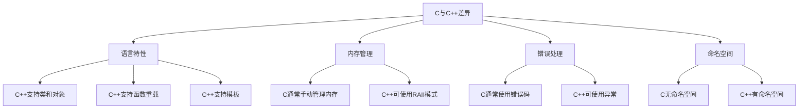

# C++ 与C库封装

## 引言

在实际开发中，我们经常需要在C++项目中使用已有的C语言库。这是因为许多基础库和系统API仍然是用C语言编写的，而C++作为C语言的超集，提供了更多的面向对象和泛型编程等高级特性。如何优雅地将C语言库封装成C++接口，是每个C++程序员都应该掌握的技能。

本文将介绍如何在C++中封装C语言库，让C语言库以更"C++风格"的方式呈现给使用者，同时保留C库的高效性能。

## 为什么需要封装C库？

在开始学习封装技术之前，让我们先理解为什么需要封装C库：

1. **提供更安全的接口**：C++提供了RAII(资源获取即初始化)、异常处理等机制，可以更安全地管理资源。
2. **增强面向对象特性**：将C函数转换为类方法，使接口更直观。
3. **改善类型安全**：利用C++的类型系统提供编译时检查。
4. **简化使用体验**：隐藏底层实现细节，提供更高层次的抽象。

## C与C++的主要差异

在封装之前，了解两种语言的主要差异很重要：



## 基本封装技术

### 1. 使用extern "C"

在C++代码中引用C函数时，需要使用`extern "C"`来防止函数名被修饰：

```cpp
// example_lib.h
#ifdef __cplusplus
extern "C" {
#endif

int add_numbers(int a, int b);
char* get_greeting();
void free_string(char* str);

#ifdef __cplusplus
}
#endif
```

### 2. 创建C++包装类

将C函数封装为C++类的方法：

```cpp
// CPP封装层
#include "example_lib.h"
#include <string>

class Calculator {
private:
    // 可能的内部状态

public:
    Calculator() {
        // 初始化逻辑
    }
    
    ~Calculator() {
        // 清理逻辑
    }
    
    int add(int a, int b) {
        return add_numbers(a, b);  // 调用C函数
    }
    
    std::string getGreeting() {
        char* cstr = get_greeting();
        std::string result(cstr);
        free_string(cstr);  // 不要忘记释放C分配的内存
        return result;
    }
};
```

## 内存管理

### 资源管理和RAII模式

在C++封装中，处理好C库的内存分配非常重要：

```cpp
// 不好的做法 - 用户容易忘记释放资源
class BadWrapper {
public:
    char* getData() {
        return get_data_from_c_lib();  // 返回C库分配的内存
    }
};

// 好的做法 - 使用RAII
class GoodWrapper {
public:
    std::string getData() {
        char* cdata = get_data_from_c_lib();
        std::string result(cdata);
        free_c_data(cdata);  // 在返回前释放C资源
        return result;
    }
};
```

:::caution
当C库和C++代码使用不同的内存分配器时，必须确保内存由分配它的同一个库来释放。
:::

## 错误处理

C库通常使用返回错误码的方式处理错误，而C++更倾向于使用异常：

```cpp
// C库风格的错误处理
int result = c_function();
if (result != SUCCESS) {
    // 处理错误
}

// 封装为C++风格
class CppWrapper {
public:
    void doOperation() {
        int result = c_function();
        if (result != SUCCESS) {
            switch (result) {
                case ERR_INVALID_INPUT:
                    throw std::invalid_argument("Invalid input provided");
                case ERR_OUT_OF_MEMORY:
                    throw std::bad_alloc();
                default:
                    throw std::runtime_error("Unknown error occurred");
            }
        }
    }
};
```

## 实际案例：封装 libcurl

让我们看一个实际的例子，如何封装流行的网络请求库libcurl：

```cpp
// HttpClient.h
#pragma once
#include <string>
#include <vector>

class HttpClient {
public:
    HttpClient();
    ~HttpClient();
    
    // 禁止复制
    HttpClient(const HttpClient&) = delete;
    HttpClient& operator=(const HttpClient&) = delete;
    
    // 简化的HTTP GET请求
    std::string get(const std::string& url);
    
    // 设置请求头
    void setHeader(const std::string& name, const std::string& value);
    
private:
    struct Impl;  // 前向声明，隐藏实现细节
    Impl* pImpl;  // 指向实现的指针
};
```

```cpp
// HttpClient.cpp
#include "HttpClient.h"
#include <curl/curl.h>
#include <stdexcept>

// 回调函数，用于接收数据
static size_t WriteCallback(void* contents, size_t size, size_t nmemb, void* userp) {
    ((std::string*)userp)->append((char*)contents, size * nmemb);
    return size * nmemb;
}

struct HttpClient::Impl {
    CURL* curl;
    struct curl_slist* headers;
    
    Impl() : curl(nullptr), headers(nullptr) {
        curl = curl_easy_init();
        if (!curl) {
            throw std::runtime_error("Failed to initialize CURL");
        }
    }
    
    ~Impl() {
        if (headers) {
            curl_slist_free_all(headers);
        }
        if (curl) {
            curl_easy_cleanup(curl);
        }
    }
};

HttpClient::HttpClient() : pImpl(new Impl()) {
    // 全局初始化，实际应用中应确保只初始化一次
    curl_global_init(CURL_GLOBAL_DEFAULT);
}

HttpClient::~HttpClient() {
    delete pImpl;
    // 实际应用中应考虑何时调用curl_global_cleanup()
}

std::string HttpClient::get(const std::string& url) {
    std::string response;
    
    curl_easy_setopt(pImpl->curl, CURLOPT_URL, url.c_str());
    curl_easy_setopt(pImpl->curl, CURLOPT_WRITEFUNCTION, WriteCallback);
    curl_easy_setopt(pImpl->curl, CURLOPT_WRITEDATA, &response);
    
    if (pImpl->headers) {
        curl_easy_setopt(pImpl->curl, CURLOPT_HTTPHEADER, pImpl->headers);
    }
    
    CURLcode res = curl_easy_perform(pImpl->curl);
    if (res != CURLE_OK) {
        throw std::runtime_error(
            std::string("CURL request failed: ") + curl_easy_strerror(res)
        );
    }
    
    return response;
}

void HttpClient::setHeader(const std::string& name, const std::string& value) {
    std::string header = name + ": " + value;
    pImpl->headers = curl_slist_append(pImpl->headers, header.c_str());
}
```

使用示例：

```cpp
#include "HttpClient.h"
#include <iostream>

int main() {
    try {
        HttpClient client;
        client.setHeader("User-Agent", "MyApp/1.0");
        
        std::string response = client.get("https://api.example.com/data");
        std::cout << "Response: " << response << std::endl;
    }
    catch (const std::exception& e) {
        std::cerr << "Error: " << e.what() << std::endl;
        return 1;
    }
    
    return 0;
}
```

:::tip
上述实现使用了PIMPL(Pointer to Implementation)设计模式，隐藏了实现细节和依赖项。这种方式可以减少编译依赖，提高代码的封装性。
:::

## 高级封装技术

### 1. 智能指针管理C资源

使用自定义删除器的智能指针可以安全地管理C资源：

```cpp
#include <memory>
#include <cstdio>

// 封装C的FILE操作
class FileReader {
private:
    std::unique_ptr<FILE, int(*)(FILE*)> file;

public:
    FileReader(const char* filename) : 
        file(fopen(filename, "r"), &fclose) {
        if (!file) {
            throw std::runtime_error("Could not open file");
        }
    }
    
    std::string readLine() {
        char buffer[1024];
        if (fgets(buffer, sizeof(buffer), file.get())) {
            return std::string(buffer);
        }
        return "";
    }
    
    // 不需要手动调用fclose，智能指针会处理
};
```

### 2. 使用回调函数

将C回调函数封装为C++的函数对象或lambda表达式：

```cpp
extern "C" {
    // C库定义的回调类型
    typedef void (*callback_t)(int status, void* user_data);
    
    // C库API
    void c_operation_with_callback(callback_t callback, void* user_data);
}

// C++封装
template <typename Func>
void performOperation(Func&& callback) {
    // 包装C回调函数
    struct CallbackData {
        Func func;
        CallbackData(Func&& f) : func(std::forward<Func>(f)) {}
    };
    
    auto* data = new CallbackData(std::forward<Func>(callback));
    
    c_operation_with_callback(
        [](int status, void* user_data) {
            auto* cb_data = static_cast<CallbackData*>(user_data);
            cb_data->func(status);
            delete cb_data;  // 清理
        },
        data
    );
}

// 使用
performOperation([](int status) {
    std::cout << "Operation completed with status: " << status << std::endl;
});
```

## 注意事项

在封装C库时，需要注意以下几点：

1. **ABI兼容性**：C和C++有不同的ABI(应用程序二进制接口)，要确保正确使用`extern "C"`。
2. **线程安全**：确保封装后的C++接口保持原C库的线程安全特性。
3. **异常安全**：在C++异常传播过程中，确保C资源能够正确释放。
4. **性能开销**：避免不必要的数据复制，特别是对大型数据结构。
5. **版本兼容性**：设计接口时考虑C库可能的版本变更。

## 总结

C++封装C库是软件开发中常见的任务，它能让我们同时利用C的高性能和C++的高级特性。本文介绍了：

- 为什么需要C++封装C库
- 基本的封装技术，包括`extern "C"`和包装类设计
- 如何处理内存管理和错误转换
- 通过libcurl的实例展示了完整的封装过程
- 高级封装技术，如智能指针和回调封装

掌握这些技术后，你将能够更有效地在C++项目中集成和使用C语言库，让两种语言的优势互补。

## 练习

1. 尝试封装C标准库中的`qsort`函数，使其接受C++的比较器函数对象。
2. 为`sqlite3`数据库C API创建一个简单的C++封装类，处理连接、查询和结果获取。
3. 扩展HttpClient类，添加POST方法和文件上传功能。
4. 设计一个通用的C资源包装模板类，可以自动管理不同类型的C资源。

## 参考资源

- C++核心指南：[http://isocpp.github.io/CppCoreGuidelines/CppCoreGuidelines](http://isocpp.github.io/CppCoreGuidelines/CppCoreGuidelines)
- 《Effective C++》by Scott Meyers
- 《API Design for C++》by Martin Reddy

:::note
本文只涵盖了C++封装C库的基础知识。在实际项目中，可能需要考虑更多因素，如跨平台兼容性、性能优化等高级话题。
:::