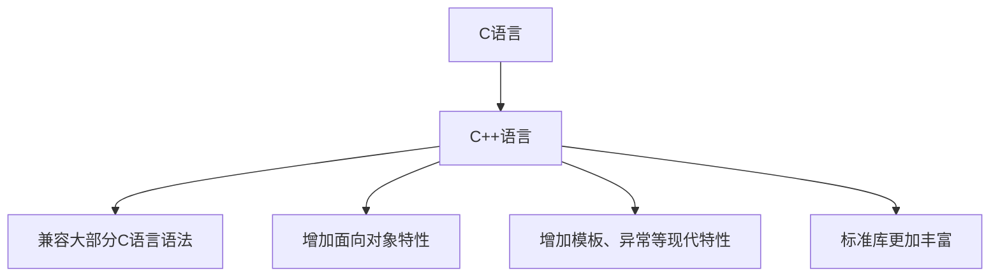

# C++ 与C混合编程最佳实践

## 引言

在实际的软件开发中，我们经常需要将C++与C代码混合使用。这种需求可能源于需要复用已有的C代码库、与C语言编写的系统接口交互，或者是为了利用两种语言各自的优势。虽然C++向后兼容C语言，但两者在设计理念和特性上仍有显著差异，不恰当的混合编程可能导致各种问题。

本文将介绍C++与C混合编程的最佳实践，帮助你避免常见陷阱，编写高效、安全的跨语言代码。

## C++ 与C语言的关系

在深入讨论混合编程前，我们需要先了解C++与C的关系：



:::note
虽然C++在设计上兼容C语言，但并非所有C代码都是有效的C++代码。随着两种语言的独立发展，一些细微的不兼容性已经出现。
:::

## 混合编程的基础：extern "C"

C++与C最基本的交互方式是通过`extern "C"`声明，它告诉C++编译器以C语言的方式处理函数名：

```cpp
// header.h - 可同时被C和C++包含的头文件
#ifdef __cplusplus
extern "C" {
#endif

// 函数声明
void c_function(int param);
int calculate_sum(int a, int b);

#ifdef __cplusplus
}  // extern "C" 结束
#endif
```

### 为什么需要extern "C"？

C++支持函数重载，编译器通过名称修饰（name mangling）来区分同名但参数不同的函数。而C语言不支持重载，函数名就是它在目标文件中的符号名。

例如，考虑以下函数：

```cpp
// C++中
void func(int);
void func(double);

// 编译后可能变为
// _Z4funci    (func with int)
// _Z4funcd    (func with double)

// C中
void func(int);
// 编译后就是
// func
```

如果不使用`extern "C"`，C++编写的函数在编译后会被修饰名称，C代码将无法找到这些函数。

## 数据类型兼容性

### 基本数据类型

大多数基本数据类型在C和C++之间是兼容的：

```cpp
// 兼容的基本类型
int, char, float, double, void*
```

但要注意以下几点：

1. C++中`bool`类型在C中通常用`int`或`_Bool`(C99)表示
2. C++有更严格的类型检查
3. C语言中没有引用类型

### 结构体和联合体

结构体和联合体基本兼容，但C++增加了成员函数等特性：

```cpp
// C风格结构体
struct Point {
    int x;
    int y;
};

// C++风格结构体
struct PointCpp {
    int x;
    int y;
    
    void move(int dx, int dy) {
        x += dx;
        y += dy;
    }
};
```

:::caution
带有成员函数、构造函数或析构函数的C++结构体不能直接在C中使用。混合编程时，共享的结构体应保持C风格。
:::

### 函数指针

当函数指针跨越C/C++边界时需要特别小心：

```cpp
// C++代码
extern "C" typedef void (*CallbackFunc)(int);

void register_callback(CallbackFunc func) {
    // 存储回调函数供以后使用
}

// C代码
void my_callback(int value) {
    printf("Callback received: %d\n", value);
}

// 在C中调用
register_callback(my_callback);
```

## 内存管理

C和C++的内存管理机制有显著差异，混合编程时需要特别注意：

### 内存分配与释放

```cpp
// C语言方式
void* ptr_c = malloc(100);
free(ptr_c);

// C++方式
int* ptr_cpp = new int[25];
delete[] ptr_cpp;
```

:::warning
一个重要原则：在哪种语言中分配的内存，就应该在哪种语言中释放。
不要用`free()`释放`new`分配的内存，也不要用`delete`释放`malloc`分配的内存。
:::

### 跨边界传递对象

当需要在C和C++之间传递复杂对象时，最好采用不透明指针（opaque pointer）模式：

```cpp
// C++头文件 (wrapper.h)
#ifdef __cplusplus
extern "C" {
#endif

typedef struct ComplexObj_t* ComplexObjHandle;

ComplexObjHandle create_object();
void destroy_object(ComplexObjHandle handle);
void object_do_something(ComplexObjHandle handle, int param);

#ifdef __cplusplus
}
#endif

// C++实现文件 (wrapper.cpp)
#include "wrapper.h"
#include "complex_cpp_class.h" // C++实际类定义

extern "C" {
    ComplexObjHandle create_object() {
        return reinterpret_cast<ComplexObjHandle>(new ComplexClass());
    }
    
    void destroy_object(ComplexObjHandle handle) {
        delete reinterpret_cast<ComplexClass*>(handle);
    }
    
    void object_do_something(ComplexObjHandle handle, int param) {
        reinterpret_cast<ComplexClass*>(handle)->doSomething(param);
    }
}

// C语言使用方式 (main.c)
#include "wrapper.h"

int main() {
    ComplexObjHandle obj = create_object();
    object_do_something(obj, 42);
    destroy_object(obj);
    return 0;
}
```

## 异常处理

C语言没有异常机制，而C++广泛使用异常。在混合编程中，C++抛出的异常不应该传播到C代码：

```cpp
// C++代码中调用C函数
extern "C" void c_function_that_might_crash(int param);

void cpp_wrapper() {
    try {
        c_function_that_might_crash(42);
    } catch (const std::exception& e) {
        std::cerr << "Exception caught: " << e.what() << std::endl;
    }
}

// C++函数被C代码调用
extern "C" int cpp_function_for_c() {
    try {
        // 可能抛出异常的C++代码
        throw std::runtime_error("Something went wrong");
        return 1;
    } catch (...) {
        // 捕获所有异常，不让它们传播到C代码
        return -1; // 错误码
    }
}
```

## 实际案例：封装C库给C++使用

假设我们有一个C语言编写的图像处理库，我们想在C++项目中使用它：

```c
// image_lib.h (C库)
typedef struct Image {
    unsigned char* data;
    int width;
    int height;
    int channels;
} Image;

Image* image_create(int width, int height, int channels);
void image_destroy(Image* img);
int image_process(Image* img, const char* filter_type);
```

我们可以这样封装它：

```cpp
// image_wrapper.hpp (C++封装)
#include <string>
#include <stdexcept>

extern "C" {
    #include "image_lib.h"
}

class ImageWrapper {
private:
    Image* m_image;

public:
    ImageWrapper(int width, int height, int channels) {
        m_image = image_create(width, height, channels);
        if (!m_image) {
            throw std::runtime_error("Failed to create image");
        }
    }
    
    ~ImageWrapper() {
        if (m_image) {
            image_destroy(m_image);
        }
    }
    
    // 防止拷贝（C资源管理）
    ImageWrapper(const ImageWrapper&) = delete;
    ImageWrapper& operator=(const ImageWrapper&) = delete;
    
    // 允许移动
    ImageWrapper(ImageWrapper&& other) noexcept : m_image(other.m_image) {
        other.m_image = nullptr;
    }
    
    ImageWrapper& operator=(ImageWrapper&& other) noexcept {
        if (this != &other) {
            if (m_image) image_destroy(m_image);
            m_image = other.m_image;
            other.m_image = nullptr;
        }
        return *this;
    }
    
    bool applyFilter(const std::string& filterType) {
        int result = image_process(m_image, filterType.c_str());
        return result == 0;
    }
    
    // 提供更多C++风格的接口...
};
```

使用这个封装：

```cpp
// main.cpp
#include "image_wrapper.hpp"
#include <iostream>

int main() {
    try {
        ImageWrapper img(800, 600, 3);
        
        if (img.applyFilter("blur")) {
            std::cout << "Blur filter applied successfully" << std::endl;
        } else {
            std::cout << "Failed to apply blur filter" << std::endl;
        }
        
        // ImageWrapper的析构函数会自动释放C资源
    } catch (const std::exception& e) {
        std::cerr << "Error: " << e.what() << std::endl;
        return 1;
    }
    
    return 0;
}
```

这种封装方式提供了多重好处：
1. 资源管理自动化（RAII原则）
2. 异常安全
3. 提供了更符合C++风格的接口
4. 避免内存泄漏

## 实际案例：C++库提供C接口

当你开发C++库但需要提供C接口给其他程序使用时：

```cpp
// library_impl.hpp（内部C++实现）
class ComplexAlgorithm {
public:
    ComplexAlgorithm();
    ~ComplexAlgorithm();
    
    int initialize(const std::string& config);
    double calculate(double* data, size_t dataSize);
    
private:
    // 私有实现细节
    std::vector<double> m_cache;
    // ...
};
```

```cpp
// library_c_api.h（公开的C接口）
#ifdef __cplusplus
extern "C" {
#endif

typedef struct ComplexAlgorithm_t* AlgoHandle;

AlgoHandle algo_create(void);
void algo_destroy(AlgoHandle handle);
int algo_initialize(AlgoHandle handle, const char* config);
double algo_calculate(AlgoHandle handle, double* data, size_t data_size);

#ifdef __cplusplus
}
#endif
```

```cpp
// library_c_api.cpp（实现C接口）
#include "library_c_api.h"
#include "library_impl.hpp"
#include <cstring>

extern "C" {
    AlgoHandle algo_create(void) {
        try {
            return reinterpret_cast<AlgoHandle>(new ComplexAlgorithm());
        } catch (...) {
            return nullptr;
        }
    }
    
    void algo_destroy(AlgoHandle handle) {
        if (handle) {
            delete reinterpret_cast<ComplexAlgorithm*>(handle);
        }
    }
    
    int algo_initialize(AlgoHandle handle, const char* config) {
        if (!handle || !config) return -1;
        try {
            ComplexAlgorithm* algo = reinterpret_cast<ComplexAlgorithm*>(handle);
            std::string configStr(config);
            return algo->initialize(configStr);
        } catch (...) {
            return -2;
        }
    }
    
    double algo_calculate(AlgoHandle handle, double* data, size_t data_size) {
        if (!handle || !data) return -1.0;
        try {
            ComplexAlgorithm* algo = reinterpret_cast<ComplexAlgorithm*>(handle);
            return algo->calculate(data, data_size);
        } catch (...) {
            return -1.0;
        }
    }
}
```

## 混合编程的最佳实践总结

1. **明确接口边界**：定义清晰的接口，避免频繁的C/C++边界交叉

2. **使用extern "C"**：确保C++导出的函数可以被C代码调用

3. **小心名称冲突**：避免使用可能与标准库冲突的名称

4. **正确管理内存**：在分配内存的同一语言环境中释放内存

5. **封装C++异常**：不要让C++异常传播到C代码中

6. **避免复杂C++类型传递**：跨语言传递时使用简单的C类型或不透明指针

7. **考虑ABI兼容性**：注意不同编译器和平台的ABI差异

8. **头文件兼容性**：设计同时兼容C和C++的头文件

9. **注意构建系统**：正确配置构建系统以处理混合代码

10. **尽可能使用RAII**：C++中封装C资源时使用RAII原则管理资源

## 构建混合代码项目

混合C和C++代码的项目可能需要特殊的构建配置：

```cmake
# CMakeLists.txt 示例
cmake_minimum_required(VERSION 3.10)
project(MixedCppC)

# 添加C库
add_library(c_part c_library.c c_library.h)
target_include_directories(c_part PUBLIC ${CMAKE_CURRENT_SOURCE_DIR})

# 添加C++库
add_library(cpp_part cpp_library.cpp cpp_library.hpp)
target_include_directories(cpp_part PUBLIC ${CMAKE_CURRENT_SOURCE_DIR})
set_target_properties(cpp_part PROPERTIES
    CXX_STANDARD 11
    CXX_STANDARD_REQUIRED YES
)

# 添加使用两者的可执行程序
add_executable(mixed_app main.cpp)
target_link_libraries(mixed_app c_part cpp_part)
```

:::tip
当使用不同的编译器编译C和C++代码时，请确保它们具有兼容的ABI（应用二进制接口）。
:::

## 练习

1. **基础练习**：创建一个C函数，然后编写C++程序调用它。确保通过`extern "C"`正确声明。

2. **资源管理练习**：编写一个C++类，封装一个需要手动释放资源的C库函数（例如打开/关闭文件或分配/释放内存）。

3. **回调练习**：创建一个C接口，允许注册C++函数作为回调，然后从C代码调用这些回调。

4. **错误处理练习**：编写一个C++函数，它可能会抛出异常，但提供一个C接口版本，将异常转换为错误码。

## 总结

C++和C的混合编程是一项重要技能，特别是在系统编程、嵌入式开发或与遗留代码交互时。虽然两种语言有很多共同点，但它们的设计理念和特性差异也很大。掌握本文介绍的最佳实践，将帮助你编写更安全、更可维护的混合代码。

通过恰当地使用`extern "C"`、管理内存、处理异常，以及创建清晰的语言边界，你可以充分利用两种语言的优势，同时避免常见陷阱。

## 扩展资源

- **C++标准**：查阅关于`extern "C"`和语言链接的章节
- **《Effective C++》**和**《Modern C++》**系列书籍：学习更多C++最佳实践
- **各种编译器文档**：了解不同编译器的ABI细节和兼容性问题

对于初学者，建议先在小项目中练习这些技术，逐步熟悉C和C++交互的复杂性，然后再应用于更大的项目中。

Happy coding!