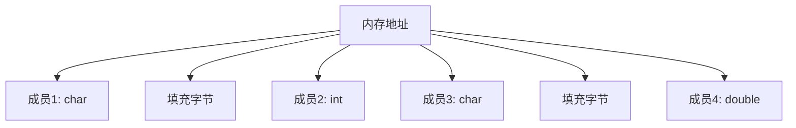

# C++ 与C结构体

## 引言

在混合编程环境中，理解C和C++结构体的异同点对于确保代码的正确性和互操作性至关重要。尽管C++从C演化而来并保持了向后兼容性，但两种语言中的结构体有一些重要的区别。本文将探讨C和C++结构体的特性、它们之间的差异，以及如何在两种语言之间安全地共享结构体数据。

## C结构体基础

C语言中的结构体是一种用户定义的数据类型，它允许将不同类型的数据项组合成一个单元。

### C结构体的基本语法

```c
// C语言结构体定义
struct Person {
    char name[50];
    int age;
    float height;
};

// 使用结构体
int main() {
    struct Person person1;
    strcpy(person1.name, "John");
    person1.age = 30;
    person1.height = 175.5;
    
    printf("Name: %s\n", person1.name);
    printf("Age: %d\n", person1.age);
    printf("Height: %.1f cm\n", person1.height);
    
    return 0;
}
```

**输出：**
```
Name: John
Age: 30
Height: 175.5 cm
```

### C结构体的特点

1. **关键字必须**：在C中，使用结构体变量时必须包含`struct`关键字
2. **只包含数据**：C结构体只能包含数据成员，不能包含成员函数
3. **无访问控制**：所有成员默认为公有（public）
4. **无继承机制**：C结构体不支持继承
5. **无构造与析构**：没有自动初始化和清理机制

## C++ 结构体特性

C++扩展了结构体的功能，使其几乎与类完全相同，只是默认访问权限不同。

```cpp
// C++结构体定义
struct Person {
    std::string name;
    int age;
    float height;
    
    // 构造函数
    Person(const std::string& n, int a, float h) 
        : name(n), age(a), height(h) {}
    
    // 成员函数
    void display() const {
        std::cout << "Name: " << name << std::endl;
        std::cout << "Age: " << age << std::endl;
        std::cout << "Height: " << height << " cm" << std::endl;
    }
};

int main() {
    Person person1("Jane", 25, 165.0);
    person1.display();
    
    return 0;
}
```

**输出：**
```
Name: Jane
Age: 25
Height: 165.0 cm
```

### C++ 结构体的特点

1. **关键字可选**：声明变量时可以省略`struct`关键字
2. **可包含函数**：结构体可以包含成员函数、构造函数和析构函数
3. **支持访问控制**：可以使用`public`、`private`和`protected`关键字
4. **支持继承**：可以从其他结构体或类继承
5. **默认公有**：与类不同，结构体的成员默认为公有（public）

## C++ 与C结构体的兼容性

### 内存布局

C和C++保证结构体成员在内存中的布局顺序与声明顺序相同，这是两种语言之间互操作的基础。

:::caution 警告
虽然基本内存布局相同，但C++可能因对象模型添加额外的隐藏成员（如虚函数表指针）。在互操作场景中，应避免在共享结构体中使用C++特有功能。
:::

### C++ 中使用C风格结构体

```cpp
// 在C++中使用C风格结构体
extern "C" {
    struct CPoint {
        int x;
        int y;
    };
}

int main() {
    // 在C++中可以省略struct关键字
    CPoint p;
    p.x = 10;
    p.y = 20;
    
    std::cout << "Point: (" << p.x << ", " << p.y << ")" << std::endl;
    return 0;
}
```

**输出：**
```
Point: (10, 20)
```

### 在C中使用C++定义的结构体

要在C代码中使用C++定义的结构体，需要确保该结构体与C兼容：

1. 不包含C++特有的功能（成员函数、构造函数等）
2. 不使用C++特有的数据类型（如std::string）
3. 使用`extern "C"`包装接口函数

```cpp
// header.h
#ifdef __cplusplus
extern "C" {
#endif

typedef struct {
    int id;
    char name[100]; // 使用C兼容的字符数组而非std::string
    double value;
} SharedStruct;

// 用于在C代码中处理此结构体的函数
void process_struct(SharedStruct* data);

#ifdef __cplusplus
}
#endif
```

## 数据对齐与内存填充

C和C++中的结构体成员在内存中的排列受到数据对齐规则的影响，这对于跨语言互操作很重要。



### 对齐问题示例

```cpp
#include <stdio.h>

struct Alignment1 {
    char c;    // 1字节
    int i;     // 4字节
    char d;    // 1字节
};

struct Alignment2 {
    int i;     // 4字节
    char c;    // 1字节
    char d;    // 1字节
};

int main() {
    printf("Size of Alignment1: %zu\n", sizeof(struct Alignment1));
    printf("Size of Alignment2: %zu\n", sizeof(struct Alignment2));
    return 0;
}
```

**输出：**
```
Size of Alignment1: 12
Size of Alignment2: 8
```

:::tip 提示
注意两个结构体尽管包含相同的成员，但因排列顺序不同导致总大小不同。这是由于内存对齐引起的填充。
:::

### 控制对齐行为

在不同编译器之间共享结构体数据时，可以使用属性或编译器指令控制对齐行为：

```cpp
// GCC和Clang
struct __attribute__((packed)) PackedStruct {
    char c;
    int i;
    char d;
};

// MSVC
#pragma pack(push, 1)
struct PackedStruct {
    char c;
    int i;
    char d;
};
#pragma pack(pop)
```

## 实际应用案例

### 案例一：C/C++混合项目中的配置结构

在一个嵌入式系统项目中，配置数据需要在C和C++模块间共享：

```cpp
// config.h - 可被C和C++共同使用的头文件

#ifdef __cplusplus
extern "C" {
#endif

typedef struct {
    int deviceId;
    char deviceName[32];
    unsigned int sampleRate;
    unsigned char channels;
    char reserved[3]; // 明确的填充字段以保证跨平台一致性
} DeviceConfig;

// 用于加载/保存配置的函数
int load_config(DeviceConfig* config);
int save_config(const DeviceConfig* config);

#ifdef __cplusplus
}
#endif
```

C++端实现：

```cpp
// config.cpp
#include "config.h"
#include <fstream>
#include <cstring>

extern "C" {
    int load_config(DeviceConfig* config) {
        std::ifstream file("device.cfg", std::ios::binary);
        if (!file) return -1;
        
        file.read(reinterpret_cast<char*>(config), sizeof(DeviceConfig));
        return file.good() ? 0 : -2;
    }
    
    int save_config(const DeviceConfig* config) {
        std::ofstream file("device.cfg", std::ios::binary);
        if (!file) return -1;
        
        file.write(reinterpret_cast<const char*>(config), sizeof(DeviceConfig));
        return file.good() ? 0 : -2;
    }
}
```

C端使用：

```c
// main.c
#include <stdio.h>
#include "config.h"

int main() {
    DeviceConfig config;
    
    if (load_config(&config) == 0) {
        printf("Loaded configuration for device: %s (ID: %d)\n", 
               config.deviceName, config.deviceId);
        printf("Sample rate: %u Hz, Channels: %u\n", 
               config.sampleRate, config.channels);
    } else {
        // 设置默认配置
        config.deviceId = 1;
        strcpy(config.deviceName, "DefaultDevice");
        config.sampleRate = 44100;
        config.channels = 2;
        
        save_config(&config);
        printf("Created default configuration\n");
    }
    
    return 0;
}
```

### 案例二：图形库中的结构体互操作

在一个图形处理库中，C++核心算法需要与C语言编写的接口层交换图像数据：

```cpp
// image.h
#ifdef __cplusplus
extern "C" {
#endif

typedef struct {
    unsigned char* data;
    int width;
    int height;
    int channels;
    size_t stride;
} Image;

Image* create_image(int width, int height, int channels);
void destroy_image(Image* img);
int process_image(Image* input, Image* output);

#ifdef __cplusplus
}
#endif
```

在C++实现中：

```cpp
// image.cpp
#include "image.h"
#include <cstdlib>
#include <cstring>
#include <algorithm>

// C++中的高级图像类（仅内部使用）
class ImageProcessor {
private:
    // 复杂的C++处理算法
public:
    static void process(const Image* input, Image* output) {
        // 使用C++算法处理图像数据
        // ...
    }
};

extern "C" {
    Image* create_image(int width, int height, int channels) {
        Image* img = new Image();
        img->width = width;
        img->height = height;
        img->channels = channels;
        img->stride = width * channels;
        img->data = new unsigned char[height * img->stride];
        memset(img->data, 0, height * img->stride);
        return img;
    }
    
    void destroy_image(Image* img) {
        if (img) {
            delete[] img->data;
            delete img;
        }
    }
    
    int process_image(Image* input, Image* output) {
        if (!input || !output) return -1;
        
        // 从C接口调用C++处理逻辑
        ImageProcessor::process(input, output);
        return 0;
    }
}
```

## 常见陷阱与最佳实践

### 避免的做法

1. **不要在共享结构体中使用C++特有类型**：如`std::string`、`std::vector`等
2. **避免使用虚函数**：虚函数会添加虚函数表指针，改变内存布局
3. **避免使用引用成员**：C不支持引用
4. **不要依赖默认构造和析构行为**：C不理解这些概念

### 推荐的做法

1. **使用`#ifdef __cplusplus`条件编译**：确保头文件在C和C++中都可用
2. **使用`extern "C"`**：防止C++名称修饰
3. **显式控制内存对齐**：在必要时使用`#pragma pack`或`__attribute__((packed))`
4. **使用基本C类型**：确保跨语言兼容性
5. **提供明确的初始化和清理函数**：不依赖C++的构造和析构
6. **编写详细的文档**：清楚标明结构体的预期用法和限制

## 总结

C++和C结构体的互操作是混合编程环境中常见的需求。尽管C++结构体提供了诸多增强功能，但在跨语言场景下，我们需要回归到两种语言共同支持的基础特性。通过遵循本文提到的最佳实践，可以确保数据结构在C和C++之间安全、准确地传递，使两种语言协同工作发挥各自的优势。

理解内存布局、对齐规则和两种语言的差异，是成功实现C/C++结构体互操作的关键。在实际项目中，通常需要在功能丰富性和互操作性之间取得平衡，根据具体场景选择适当的方案。

## 练习

1. 创建一个能在C和C++中共享的结构体，表示一个三维点，并为其编写读取和写入文件的函数。
2. 分析以下结构体在32位系统上的大小，解释为什么会有这样的结果：
   ```c
   struct Test1 { char a; int b; char c; };
   struct Test2 { char a; char c; int b; };
   ```
3. 实现一个小型库，提供图形基本元素（点、线、矩形）的结构体，使其能够在C和C++程序中共同使用。

## 附加资源

- 《C++ Primer》第19章：特殊工具与技术
- 《The C Programming Language》（K&R）第6章：结构体
- [C++ Core Guidelines](https://isocpp.github.io/CppCoreGuidelines/CppCoreGuidelines)，特别是C与C++接口相关的章节

通过掌握C++与C结构体的互操作技术，你将能够更有效地设计和实现跨语言项目，充分利用两种语言的优势。