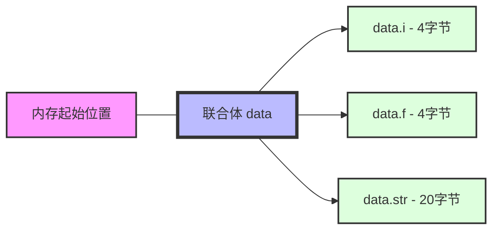

# C++ 与C联合体

## 什么是联合体(union)?

联合体(union)是C和C++中的一种特殊数据结构，它允许在相同的内存位置存储不同的数据类型。与结构体(struct)不同，联合体的所有成员共享同一块内存空间，这意味着一次只能使用一个成员变量。

:::note
联合体的大小通常等于其最大成员的大小，因为它需要足够的空间来存储任何一个成员。
:::

## C语言中的联合体

在C语言中，联合体的基本语法如下：

```c
union UnionName {
    dataType1 member1;
    dataType2 member2;
    // ...
};
```

### 简单示例

```c
#include <stdio.h>

union Data {
    int i;
    float f;
    char str[20];
};

int main() {
    union Data data;

    // 使用整数成员
    data.i = 10;
    printf("data.i: %d\n", data.i);

    // 使用浮点数成员，这会覆盖之前的整数值
    data.f = 220.5;
    printf("data.f: %f\n", data.f);
    // 此时整数成员的值已被破坏
    printf("data.i: %d\n", data.i);

    // 使用字符串成员
    sprintf(data.str, "C Programming");
    printf("data.str: %s\n", data.str);
    // 其他成员的值已被破坏
    printf("data.f: %f\n", data.f);
    printf("data.i: %d\n", data.i);

    return 0;
}
```

输出结果类似于：

```
data.i: 10
data.f: 220.500000
data.i: 1129316352
data.str: C Programming
data.f: 1.4139e-33
data.i: 1094861636
```

## C++ 中的联合体

C++继承了C的联合体概念，但添加了一些扩展特性：

1. 在C++中，联合体可以包含构造函数、析构函数和成员函数
2. C++11引入了"带标记的联合体"(tagged union)概念
3. 现代C++中，`std::variant`提供了更安全的替代方案

### C++ 中联合体的基本使用

```cpp
#include <iostream>
#include <cstring>

union Data {
    int i;
    float f;
    char str[20];
    
    // C++允许在联合体中定义构造函数
    Data() { 
        std::memset(str, 0, sizeof(str)); 
    }
};

int main() {
    Data data;
    
    data.i = 10;
    std::cout << "data.i: " << data.i << std::endl;
    
    data.f = 220.5;
    std::cout << "data.f: " << data.f << std::endl;
    std::cout << "data.i: " << data.i << std::endl;
    
    std::strcpy(data.str, "C++ Programming");
    std::cout << "data.str: " << data.str << std::endl;
    
    return 0;
}
```

### C++ 11中的匿名联合体

C++11允许在类/结构体中定义匿名联合体：

```cpp
#include <iostream>
#include <string>

struct Device {
    enum Type { KEYBOARD, MOUSE, TOUCHPAD };
    
    Type type;
    
    // 匿名联合体
    union {
        struct {
            int numKeys;
            bool hasNumpad;
        } keyboard;
        
        struct {
            int dpi;
            bool wireless;
        } mouse;
        
        struct {
            float width;
            float height;
            bool multiTouch;
        } touchpad;
    };
};

int main() {
    Device dev;
    dev.type = Device::MOUSE;
    dev.mouse.dpi = 1200;
    dev.mouse.wireless = true;
    
    std::cout << "设备类型: " << dev.type << std::endl;
    if (dev.type == Device::MOUSE) {
        std::cout << "DPI: " << dev.mouse.dpi << std::endl;
        std::cout << "是否无线: " << (dev.mouse.wireless ? "是" : "否") << std::endl;
    }
    
    return 0;
}
```

## C++ 与C联合体的主要区别

| 特性 | C语言联合体 | C++联合体 |
|------|------------|-----------|
| 成员函数 | 不支持 | 支持 |
| 静态成员 | 不支持 | 支持 |
| 引用成员 | 不适用 | 不允许 |
| 具有构造函数/析构函数的类成员 | 不适用 | C++11之前不允许，C++11之后允许 |
| 匿名联合体 | 支持但有限制 | 完全支持，且可以在类内部使用 |
| 继承 | 不支持 | 支持但很少使用 |

:::caution
C++17之前，联合体成员不能包含非平凡构造函数、非平凡拷贝赋值运算符、非平凡析构函数的类类型。从C++17开始，这些限制被取消了。
:::

## 在C和C++混合代码中使用联合体

当在混合C和C++的项目中使用联合体时，需要注意以下几点：

1. 确保联合体定义在两种语言下兼容
2. 注意内存对齐差异
3. C++的高级特性在C中不可用

### 兼容性示例

假设我们需要定义一个在C和C++中都能使用的联合体：

```cpp
// shared_header.h
#ifdef __cplusplus
extern "C" {
#endif

typedef union SharedData {
    int i;
    float f;
    char str[20];
    
    // C++特有的成员函数应该放在条件编译块中
    #ifdef __cplusplus
    void clear() {
        memset(str, 0, sizeof(str));
    }
    #endif
} SharedData;

// 可以在C和C++中共同使用的函数
void print_shared_data(SharedData* data);

#ifdef __cplusplus
}  // extern "C"
#endif
```

```cpp
// cpp_file.cpp
#include "shared_header.h"
#include <iostream>

int main() {
    SharedData data;
    data.i = 42;
    
    // 使用C++特有的成员函数
    data.clear();
    
    // 调用共享函数
    print_shared_data(&data);
    return 0;
}
```

```c
// c_file.c
#include <stdio.h>
#include "shared_header.h"

void print_shared_data(SharedData* data) {
    printf("Integer value: %d\n", data->i);
    printf("Float value: %f\n", data->f);
    printf("String value: %s\n", data->str);
}
```

## 实际应用案例

### 案例1: 网络协议解析

联合体常用于网络编程，用于处理不同格式的网络数据包：

```cpp
#include <iostream>

// 简化的网络协议解析示例
union PacketData {
    struct {
        uint16_t source_port;
        uint16_t dest_port;
        uint32_t seq_num;
    } tcp;
    
    struct {
        uint16_t source_port;
        uint16_t dest_port;
        uint16_t length;
    } udp;
    
    struct {
        uint8_t type;
        uint8_t code;
        uint16_t checksum;
    } icmp;
    
    uint8_t raw[20]; // 原始字节访问
};

enum ProtocolType { TCP, UDP, ICMP };

void processPacket(const PacketData& data, ProtocolType type) {
    switch(type) {
        case TCP:
            std::cout << "TCP Packet: Source Port=" << data.tcp.source_port 
                      << ", Destination Port=" << data.tcp.dest_port << std::endl;
            break;
        case UDP:
            std::cout << "UDP Packet: Source Port=" << data.udp.source_port 
                      << ", Destination Port=" << data.udp.dest_port << std::endl;
            break;
        case ICMP:
            std::cout << "ICMP Packet: Type=" << static_cast<int>(data.icmp.type) 
                      << ", Code=" << static_cast<int>(data.icmp.code) << std::endl;
            break;
    }
}
```

### 案例2: 硬件驱动接口

在嵌入式系统和硬件驱动程序中，联合体用于访问寄存器的不同位域：

```cpp
union ControlRegister {
    struct {
        uint32_t enable:1;        // 位0: 启用标志
        uint32_t direction:2;     // 位1-2: 方向控制
        uint32_t mode:3;          // 位3-5: 操作模式
        uint32_t interrupt:1;     // 位6: 中断启用
        uint32_t reserved:25;     // 位7-31: 保留位
    } bits;
    
    uint32_t value;  // 完整的32位寄存器值
};

void configureDevice() {
    ControlRegister reg;
    reg.value = 0;  // 清除所有位
    
    // 通过位域设置各个控制位
    reg.bits.enable = 1;      // 启用设备
    reg.bits.direction = 2;   // 设置方向为"输出"
    reg.bits.mode = 4;        // 设置为模式4
    reg.bits.interrupt = 1;   // 启用中断
    
    // 将整个值写入硬件寄存器
    writeToHardwareRegister(0x1000, reg.value);
}
```

## C++ 11及更高版本的现代替代方案

虽然联合体在某些情况下仍然有用，但现代C++提供了更安全的替代方案：

### std::variant (C++17)

```cpp
#include <iostream>
#include <variant>
#include <string>

int main() {
    // 可以存储int, float或string的类型安全容器
    std::variant<int, float, std::string> data;
    
    data = 10;
    std::cout << "值为int: " << std::get<int>(data) << std::endl;
    
    data = 3.14f;
    std::cout << "值为float: " << std::get<float>(data) << std::endl;
    
    data = "Hello, variant!";
    std::cout << "值为string: " << std::get<std::string>(data) << std::endl;
    
    // 安全地检查当前存储的类型
    if (std::holds_alternative<std::string>(data)) {
        std::cout << "当前data包含string类型的值" << std::endl;
    }
    
    return 0;
}
```

:::tip
与传统联合体相比，`std::variant`能正确地管理其内部对象的生命周期，并提供类型安全的访问方法。
:::

## 联合体的内存布局

联合体的所有成员共享相同的内存空间，这在需要了解底层内存布局时非常有用：



## 总结

联合体是C和C++中用于在同一内存位置存储不同类型数据的重要工具。主要要点：

1. 联合体允许多个不同类型的成员共享同一块内存
2. 一次只能安全地使用联合体的一个成员
3. C++对联合体进行了扩展，允许成员函数和构造函数等
4. 在C和C++混合编程中要注意联合体的兼容性
5. 现代C++提供了更安全的替代方案，如`std::variant`
6. 联合体在底层编程、硬件接口和内存优化场景中特别有用

## 练习

1. 创建一个联合体来表示不同类型的传感器数据（温度、湿度、压力）
2. 编写一个程序，使用联合体在C和C++文件间共享数据
3. 使用C++的匿名联合体实现一个简单的变体类型
4. 比较使用联合体和`std::variant`实现同一功能的不同之处
5. 设计一个使用联合体的位域来控制硬件设备的寄存器

## 延伸阅读

- C++17标准中关于联合体的新特性
- `std::variant`的完整API和使用技巧
- 字节对齐和联合体内存布局的详细分析
- 带标记联合体(tagged union)设计模式

通过掌握联合体的使用，你可以更深入地理解内存管理，并在需要时灵活运用这一强大的工具。