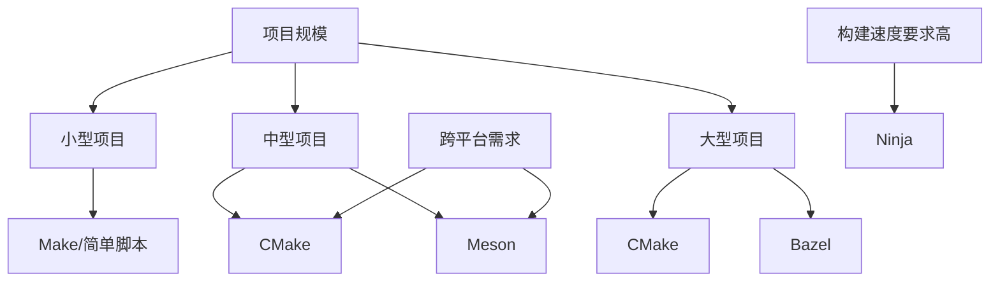

# C++ 构建系统

## 什么是构建系统？

在C++编程中，尤其是当项目规模扩大时，手动编译源代码变得繁琐且容易出错。C++构建系统解决了这个问题，它是一套工具和规则，用于自动化编译、链接和管理依赖关系的过程。

:::note
构建系统就像一个厨师的食谱：它告诉计算机如何处理原料（源代码），按照什么步骤来操作，最终烹饪出成品（可执行文件）。
:::

## 为什么需要构建系统？

对于只有一两个源文件的简单项目，你可能习惯于直接使用命令行编译：

```bash
g++ main.cpp -o program
```

但随着项目的扩大，你会面临以下挑战：

1. 多文件管理
2. 依赖关系处理
3. 库的链接
4. 编译标志配置
5. 跨平台兼容性
6. 增量编译需求

## 常见的C++构建系统

### 1. Make 和 Makefile

Make是历史最悠久的构建工具之一，通过Makefile文件定义编译规则。

**简单的Makefile示例：**

```makefile
CC = g++
CFLAGS = -Wall -std=c++17

program: main.o utils.o
	$(CC) $(CFLAGS) -o program main.o utils.o

main.o: main.cpp
	$(CC) $(CFLAGS) -c main.cpp

utils.o: utils.cpp utils.h
	$(CC) $(CFLAGS) -c utils.cpp

clean:
	rm -f *.o program
```

这个Makefile定义了如何编译`main.cpp`和`utils.cpp`，然后将它们链接为可执行文件`program`。

**使用方法：**
```bash
# 编译整个项目
make

# 只清理编译产生的文件
make clean
```

:::tip
Make的优势在于它的简单性和广泛可用性，几乎所有Unix/Linux系统都预装了它。
:::

### 2. CMake

CMake是目前最流行的C++项目构建系统之一，它是一个跨平台的构建系统生成器。CMake不直接构建项目，而是生成其他构建系统（如Make、Visual Studio、Ninja等）的配置文件。

**基本CMakeLists.txt示例：**

```cmake
cmake_minimum_required(VERSION 3.10)
project(MyProject)

# 设置C++标准
set(CMAKE_CXX_STANDARD 17)
set(CMAKE_CXX_STANDARD_REQUIRED ON)

# 添加可执行文件
add_executable(program main.cpp utils.cpp)

# 添加头文件路径
target_include_directories(program PRIVATE ${CMAKE_CURRENT_SOURCE_DIR}/include)

# 链接外部库（如果需要）
# target_link_libraries(program PRIVATE some_library)
```

**使用方法：**
```bash
# 创建构建目录
mkdir build && cd build

# 生成构建系统文件
cmake ..

# 构建项目
cmake --build .
```

:::caution
CMake的学习曲线稍陡，但它的跨平台能力和灵活性使其成为许多大型C++项目的首选。
:::

### 3. Ninja

Ninja是一个专注于速度的小型构建系统，通常与CMake结合使用。

**配合CMake使用Ninja：**
```bash
# 生成Ninja构建文件
cmake -G Ninja ..

# 使用Ninja构建
ninja
```

### 4. Bazel

Bazel是Google开发的构建系统，专为大规模软件项目设计。它提供了可靠的增量构建和测试功能。

**简单的BUILD文件示例：**

```python
cc_binary(
    name = "program",
    srcs = ["main.cpp", "utils.cpp"],
    hdrs = ["utils.h"],
    copts = ["-std=c++17"],
)
```

**使用方法：**
```bash
# 构建项目
bazel build //:program

# 运行程序
bazel run //:program
```

### 5. Meson

Meson是一个现代、快速的构建系统，语法简单且易于学习。

**meson.build示例：**

```python
project('myproject', 'cpp',
  version : '0.1',
  default_options : ['cpp_std=c++17'])

executable('program',
  ['main.cpp', 'utils.cpp'],
  install : true)
```

**使用方法：**
```bash
# 配置构建
meson setup builddir

# 构建项目
meson compile -C builddir
```

## 构建系统的选择指南

对于不同的项目规模和需求，可以考虑以下建议：



## 实际应用案例：多文件C++项目

假设我们有一个简单的计算器项目，包含以下文件：

- `main.cpp`: 主程序入口
- `calculator.h`: 计算器类声明
- `calculator.cpp`: 计算器类实现
- `utils.h`: 实用工具函数声明
- `utils.cpp`: 实用工具函数实现

### 使用CMake管理这个项目

**1. 创建项目结构：**
```
calculator/
├── CMakeLists.txt
├── include/
│   ├── calculator.h
│   └── utils.h
└── src/
    ├── main.cpp
    ├── calculator.cpp
    └── utils.cpp
```

**2. 编写CMakeLists.txt：**
```cmake
cmake_minimum_required(VERSION 3.10)
project(Calculator VERSION 1.0)

# 设置C++标准
set(CMAKE_CXX_STANDARD 17)
set(CMAKE_CXX_STANDARD_REQUIRED ON)

# 添加包含目录
include_directories(${CMAKE_CURRENT_SOURCE_DIR}/include)

# 创建可执行文件
add_executable(calculator
    src/main.cpp
    src/calculator.cpp
    src/utils.cpp
)

# 安装目标
install(TARGETS calculator DESTINATION bin)
```

**3. 构建项目：**
```bash
mkdir build && cd build
cmake ..
cmake --build .
```

**4. 运行程序：**
```bash
./calculator
```

### 代码示例

**calculator.h:**
```cpp
#pragma once

class Calculator {
public:
    double add(double a, double b);
    double subtract(double a, double b);
    double multiply(double a, double b);
    double divide(double a, double b);
};
```

**calculator.cpp:**
```cpp
#include "calculator.h"
#include <stdexcept>

double Calculator::add(double a, double b) {
    return a + b;
}

double Calculator::subtract(double a, double b) {
    return a - b;
}

double Calculator::multiply(double a, double b) {
    return a * b;
}

double Calculator::divide(double a, double b) {
    if (b == 0) {
        throw std::invalid_argument("Division by zero");
    }
    return a / b;
}
```

**main.cpp:**
```cpp
#include <iostream>
#include "calculator.h"
#include "utils.h"

int main() {
    Calculator calc;
    
    std::cout << "Welcome to C++ Calculator\n";
    std::cout << "------------------------\n";
    
    double a = 10.0;
    double b = 5.0;
    
    std::cout << a << " + " << b << " = " << calc.add(a, b) << "\n";
    std::cout << a << " - " << b << " = " << calc.subtract(a, b) << "\n";
    std::cout << a << " * " << b << " = " << calc.multiply(a, b) << "\n";
    std::cout << a << " / " << b << " = " << calc.divide(a, b) << "\n";
    
    std::cout << "\nMemory used: " << formatMemorySize(getMemoryUsage()) << "\n";
    
    return 0;
}
```

**输出：**
```
Welcome to C++ Calculator
------------------------
10 + 5 = 15
10 - 5 = 5
10 * 5 = 50
10 / 5 = 2

Memory used: 4.2 MB
```

## 构建系统的高级功能

随着项目的增长，你可能需要这些高级功能：

### 1. 依赖管理

现代C++项目通常需要处理外部依赖，有几种方案：

- **CMake的FetchContent**：直接在构建过程中下载和构建依赖
- **Conan**：C++专用的包管理器，与CMake集成良好
- **vcpkg**：Microsoft开发的C++库管理器

### 2. 单元测试集成

构建系统可以帮助自动运行测试：

```cmake
# 添加测试（在CMake中）
enable_testing()
add_executable(my_tests tests/my_tests.cpp)
target_link_libraries(my_tests PRIVATE GTest::gtest_main)
add_test(NAME my_tests COMMAND my_tests)
```

### 3. 自定义构建配置

大多数构建系统允许定义不同的构建配置：

```cmake
# 在CMake中添加调试信息
set(CMAKE_CXX_FLAGS_DEBUG "${CMAKE_CXX_FLAGS_DEBUG} -Og -g3")
```

## 总结

C++构建系统是管理复杂C++项目的关键工具。从简单的Make到复杂的CMake或Bazel，选择合适的构建系统取决于你的项目规模、团队经验和特定需求。

作为初学者，建议从以下步骤入手：

1. 首先尝试使用Make理解构建过程的基本概念
2. 随着项目增长，过渡到CMake以获得更好的跨平台支持
3. 根据需要学习依赖管理工具（如Conan或vcpkg）
4. 在实践中持续优化你的构建配置

### 推荐练习

1. **基础练习**：创建一个包含3-5个源文件的小型项目，并使用Make和CMake分别构建它。
2. **中级练习**：为现有项目添加一个外部库依赖（如fmt或nlohmann/json），并使用CMake管理这个依赖。
3. **高级练习**：创建一个多模块项目，包含可执行文件和静态库，使用你选择的构建系统管理它们之间的依赖关系。

### 进一步学习资源

- [CMake官方文档](https://cmake.org/documentation/)
- [Modern CMake教程](https://cliutils.gitlab.io/modern-cmake/)
- [Meson用户手册](https://mesonbuild.com/Manual.html)
- [Bazel入门指南](https://docs.bazel.build/versions/master/tutorial/cpp.html)

:::tip
记住，构建系统是工具，而不是目的。选择最适合你需求的工具，并随着项目的发展调整你的选择。
:::