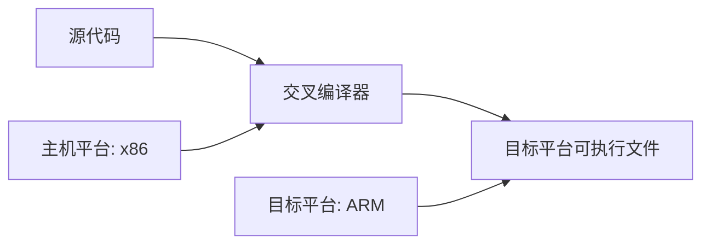

# C++ 交叉编译

## 什么是交叉编译？

交叉编译是在一种计算机架构上（称为主机，host）生成可在另一种不同架构上（称为目标，target）执行的代码的过程。简单来说，你可以在你的PC（如x86架构）上编译出可以在完全不同系统（如ARM架构）上运行的程序。

:::note 为什么需要交叉编译？
想象一下，你需要为树莓派（ARM架构）开发应用程序。在树莓派上直接编译大型程序可能会非常慢，而在你强大的桌面电脑上进行交叉编译，则可以大大缩短编译时间。
:::



## 交叉编译的核心概念

### 工具链（Toolchain）

交叉编译工具链是一组用于构建可在目标平台上运行的软件的工具，通常包括：

- 编译器（如gcc、g++）
- 链接器（linker）
- 汇编器（assembler）
- 库文件和头文件
- 调试器（如gdb）

工具链的命名通常遵循以下格式：`<架构>-<厂商>-<操作系统>-<二进制接口>`

例如：`arm-linux-gnueabihf-g++` 表示:
- `arm`: 目标架构
- `linux`: 目标操作系统
- `gnueabihf`: GNU EABI，带硬件浮点支持
- `g++`: C++编译器

## 设置交叉编译环境

### 在Linux上安装交叉编译工具链

以Ubuntu/Debian为例，安装ARM工具链：

```bash
sudo apt update
sudo apt install gcc-arm-linux-gnueabihf g++-arm-linux-gnueabihf
```

验证安装：

```bash
arm-linux-gnueabihf-g++ --version
```

输出示例：
```
arm-linux-gnueabihf-g++ (Ubuntu 9.3.0-17ubuntu1~20.04) 9.3.0
Copyright (C) 2019 Free Software Foundation, Inc.
This is free software; see the source for copying conditions.  There is NO
warranty; not even for MERCHANTABILITY or FITNESS FOR A PARTICULAR PURPOSE.
```

### 在Windows上设置交叉编译环境

在Windows上，可以使用以下方法之一：

1. **WSL (Windows Subsystem for Linux)**：安装Ubuntu子系统，然后按照Linux方式安装工具链
2. **Mingw-w64**：针对Windows的交叉编译工具
3. **Cygwin**：提供类Unix环境

### 使用CMake进行交叉编译

CMake是一个强大的跨平台构建系统，可以简化交叉编译过程。创建一个`toolchain.cmake`文件：

```cmake
set(CMAKE_SYSTEM_NAME Linux)
set(CMAKE_SYSTEM_PROCESSOR arm)

# 指定交叉编译器
set(CMAKE_C_COMPILER arm-linux-gnueabihf-gcc)
set(CMAKE_CXX_COMPILER arm-linux-gnueabihf-g++)

# 指定目标环境的根路径（可选）
set(CMAKE_FIND_ROOT_PATH /usr/arm-linux-gnueabihf)

# 调整查找行为
set(CMAKE_FIND_ROOT_PATH_MODE_PROGRAM NEVER)
set(CMAKE_FIND_ROOT_PATH_MODE_LIBRARY ONLY)
set(CMAKE_FIND_ROOT_PATH_MODE_INCLUDE ONLY)
```

使用此工具链文件：

```bash
cmake -DCMAKE_TOOLCHAIN_FILE=toolchain.cmake ..
```

## 实战示例

让我们通过一个简单的实例来演示交叉编译的整个流程。

### 示例1：基本的Hello World程序

1. 创建一个简单的C++源文件 `hello.cpp`：

```cpp
#include <iostream>

int main() {
    std::cout << "Hello from ARM device!" << std::endl;
    #ifdef __arm__
        std::cout << "Compiled for ARM architecture" << std::endl;
    #else
        std::cout << "Not compiled for ARM architecture" << std::endl;
    #endif
    return 0;
}
```

2. 使用交叉编译器进行编译：

```bash
arm-linux-gnueabihf-g++ -o hello_arm hello.cpp
```

3. 检查生成的可执行文件类型：

```bash
file hello_arm
```

输出示例：
```
hello_arm: ELF 32-bit LSB executable, ARM, EABI5 version 1 (SYSV), dynamically linked, interpreter /lib/ld-linux-armhf.so.3, for GNU/Linux 3.2.0, ...
```

4. 将编译好的程序传输到目标ARM设备（如树莓派）并执行：

```bash
scp hello_arm pi@raspberrypi.local:~/
ssh pi@raspberrypi.local './hello_arm'
```

输出示例：
```
Hello from ARM device!
Compiled for ARM architecture
```

### 示例2：使用CMake的复杂项目

对于更复杂的项目，我们可以使用CMake管理交叉编译。

1. 创建项目结构：

```
my_project/
├── CMakeLists.txt
├── toolchain.cmake
└── src/
    ├── main.cpp
    └── utils.cpp
    └── utils.h
```

2. 编写`CMakeLists.txt`：

```cmake
cmake_minimum_required(VERSION 3.10)
project(MyArmProject)

set(CMAKE_CXX_STANDARD 14)

add_executable(my_program src/main.cpp src/utils.cpp)
```

3. 编写源文件 `src/utils.h`：

```cpp
#pragma once

namespace utils {
    void printPlatformInfo();
}
```

4. 编写源文件 `src/utils.cpp`：

```cpp
#include "utils.h"
#include <iostream>

namespace utils {
    void printPlatformInfo() {
        #ifdef __arm__
            std::cout << "Running on ARM architecture" << std::endl;
            #ifdef __ARM_ARCH_7A__
                std::cout << "ARMv7-A architecture" << std::endl;
            #endif
        #elif defined(__aarch64__)
            std::cout << "Running on AArch64 architecture" << std::endl;
        #elif defined(__x86_64__)
            std::cout << "Running on x86_64 architecture" << std::endl;
        #else
            std::cout << "Running on unknown architecture" << std::endl;
        #endif
    }
}
```

5. 编写源文件 `src/main.cpp`：

```cpp
#include "utils.h"
#include <iostream>

int main() {
    std::cout << "Cross-compiled C++ application" << std::endl;
    utils::printPlatformInfo();
    return 0;
}
```

6. 使用CMake和工具链文件构建：

```bash
mkdir build && cd build
cmake -DCMAKE_TOOLCHAIN_FILE=../toolchain.cmake ..
make
```

## 常见问题与解决方案

### 1. 链接错误

问题：找不到所需的库文件
解决方案：确保在工具链中正确设置了目标库路径

```cmake
# 在toolchain.cmake中添加
set(CMAKE_FIND_ROOT_PATH /path/to/target/sysroot)
```

### 2. 二进制兼容性问题

问题：在目标设备上执行时出现"Exec format error"
解决方案：确保为正确的目标架构进行编译，检查工具链是否与目标设备匹配

### 3. 依赖库问题

问题：目标平台缺少开发过程中使用的库
解决方案：考虑静态链接库，或确保目标系统上安装了所需的共享库

```bash
# 静态链接示例
arm-linux-gnueabihf-g++ -static -o hello_static hello.cpp
```

## 高级交叉编译技巧

### 1. Sysroot

Sysroot是目标文件系统的根目录副本，包含了目标平台的库和头文件。

```bash
arm-linux-gnueabihf-g++ --sysroot=/path/to/sysroot -o hello hello.cpp
```

### 2. 多架构支持

可以使用条件编译为不同架构提供不同实现：

```cpp
#if defined(__arm__) || defined(__aarch64__)
    // ARM-specific code
#elif defined(__x86_64__) || defined(__i386__)
    // x86-specific code
#else
    // Generic implementation
#endif
```

### 3. 交叉调试

可以使用GDB远程调试在目标设备上运行的程序：

```bash
# 在目标设备上
gdbserver :1234 ./my_program

# 在主机上
arm-linux-gnueabihf-gdb
(gdb) target remote target-device:1234
```

## 实际应用案例

### 嵌入式设备开发

假设你正在为一款基于ARM的智能家居控制器开发软件：

1. 在性能强劲的开发PC上编写和测试代码
2. 使用交叉编译工具链将代码编译为ARM可执行文件
3. 将编译好的程序部署到控制器设备上
4. 远程调试解决问题

### 移动应用开发

虽然Android Studio提供了完整的工具链，但了解背后的交叉编译原理可以帮助你更好地理解：

- Android NDK允许在C/C++中编写性能关键代码
- 这些代码通过交叉编译被转换为可在多种移动架构上运行的库

### 云服务部署

有些云服务提供基于ARM的实例（如AWS的Graviton处理器），为了最佳性能：

1. 在开发环境中交叉编译程序
2. 将优化后的二进制文件部署到ARM云实例上
3. 获得更好的性能/成本比

## 总结

交叉编译是一项强大的技术，它允许开发者在一种计算机架构上生成可在不同架构上运行的程序。主要优势包括：

- 利用强大的开发机器加速编译过程
- 为资源受限的目标设备开发应用
- 支持无需在目标设备上安装开发工具
- 同时针对多个平台进行开发

掌握交叉编译需要理解工具链配置、目标平台特性和依赖管理等概念，但这一技能对于嵌入式系统开发、物联网应用和跨平台软件开发至关重要。

## 进一步学习资源

- 官方GCC交叉编译文档：[GCC Cross Compiler](https://gcc.gnu.org/install/specific.html)
- CMake交叉编译指南：[CMake Toolchains](https://cmake.org/cmake/help/latest/manual/cmake-toolchains.7.html)
- 嵌入式Linux Wiki: [Embedded Linux Wiki](https://elinux.org/Main_Page)

## 练习

1. 安装ARM交叉编译工具链并编译一个简单的C++程序
2. 创建一个使用外部库的C++程序，并为ARM平台交叉编译它
3. 编写一个CMake工具链文件，支持同时为x86和ARM编译代码
4. 尝试使用条件编译创建一个在不同架构上有不同实现的程序

:::tip 实践建议
从简单开始，先确保能够成功编译和运行基本程序。掌握基础后再尝试处理依赖库和复杂项目结构。保持主机和目标平台工具链版本的兼容性，可以避免许多问题。
:::