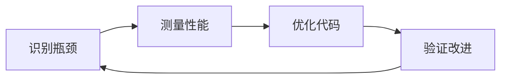

# C++ 性能优化

## 什么是C++性能优化

性能优化是编程中的重要环节，特别是对于C++这类被广泛应用于高性能计算、游戏开发和系统编程的语言。C++性能优化旨在提高程序的执行速度、减少内存占用并提升资源利用效率。

:::tip
性能优化应当是在程序功能完善且正确无误的基础上进行的。正如Donald Knuth所言："过早优化是万恶之源"。
:::

## 为什么需要进行性能优化

1. **提高用户体验**：更快的响应速度和更流畅的操作
2. **节约计算资源**：降低CPU和内存占用
3. **降低能耗**：特别是在移动和嵌入式设备上
4. **处理更大规模的数据**：优化后的程序能处理更多数据

## 性能优化的基本步骤



### 1. 识别性能瓶颈

在开始优化之前，首先需要找出程序中的性能瓶颈。

:::caution
不要盲目优化！应该使用性能分析工具找出真正的瓶颈所在。
:::

**常用性能分析工具**：
- **Windows**: Visual Studio Profiler
- **Linux**: gprof, perf
- **跨平台**: Valgrind, Intel VTune

### 2. C++性能优化技术

#### 算法与数据结构优化

选择合适的算法和数据结构是性能优化的基础。

```cpp
// 低效实现：使用vector查找元素 O(n)
std::vector<int> numbers = {1, 2, 3, 4, 5, 6, 7, 8, 9, 10};
auto findNumber = [&numbers](int target) {
    for (int num : numbers) {
        if (num == target) return true;
    }
    return false;
};

// 优化实现：使用unordered_set查找元素 O(1)
std::unordered_set<int> numberSet = {1, 2, 3, 4, 5, 6, 7, 8, 9, 10};
auto findNumberOptimized = [&numberSet](int target) {
    return numberSet.find(target) != numberSet.end();
};
```

#### 编译器优化

现代C++编译器提供了多种优化选项：

```bash
# GCC/G++优化标志
g++ -O2 myprogram.cpp -o myprogram

# MSVC优化标志
cl /O2 myprogram.cpp
```

常用优化级别：
- **-O0/Od**: 无优化（调试用）
- **-O1**: 基本优化
- **-O2**: 较多优化，平衡性能和编译时间
- **-O3**: 激进优化，可能增加代码体积
- **-Os**: 优化代码体积

#### 内存管理优化

##### 避免频繁的动态内存分配

```cpp
// 低效方式：在循环中频繁分配内存
void inefficient() {
    for (int i = 0; i < 10000; i++) {
        std::string* str = new std::string("hello");
        // 处理str
        delete str;
    }
}

// 优化方式：重用对象
void efficient() {
    std::string str;
    for (int i = 0; i < 10000; i++) {
        str = "hello";
        // 处理str
    }
}
```

##### 使用适当的容器预分配内存

```cpp
// 低效方式：不预分配内存
std::vector<int> v;
for (int i = 0; i < 10000; i++) {
    v.push_back(i);  // 可能导致多次重新分配内存
}

// 优化方式：预分配内存
std::vector<int> v;
v.reserve(10000);  // 一次性分配足够的内存
for (int i = 0; i < 10000; i++) {
    v.push_back(i);
}
```

#### 减少复制操作

##### 使用移动语义和完美转发

```cpp
// 避免不必要的复制
std::vector<std::string> createAndProcess() {
    std::vector<std::string> result;
    // 填充result
    return result;  // 使用移动语义避免复制
}

// 使用函数
void useVector() {
    auto v = createAndProcess();  // 移动而非复制
}
```

##### 使用引用传递大对象

```cpp
// 低效：值传递大对象
void processData(std::vector<int> data) {
    // 处理数据
}

// 优化：使用const引用传递大对象
void processData(const std::vector<int>& data) {
    // 处理数据
}
```

#### 循环优化

##### 循环展开

```cpp
// 标准循环
for (int i = 0; i < 100; i++) {
    // 操作
}

// 手动展开的循环
for (int i = 0; i < 100; i += 4) {
    // 操作(i)
    // 操作(i+1)
    // 操作(i+2)
    // 操作(i+3)
}
```

:::note
现代编译器通常会自动进行循环展开优化，但在特定场景下手动展开可能仍有益处。
:::

##### 避免循环中的条件判断

```cpp
// 带条件判断的循环
for (int i = 0; i < arraySize; i++) {
    if (i % 2 == 0) {
        // 处理偶数
    } else {
        // 处理奇数
    }
}

// 优化：分离循环，避免每次迭代都判断
for (int i = 0; i < arraySize; i += 2) {
    // 处理偶数
}
for (int i = 1; i < arraySize; i += 2) {
    // 处理奇数
}
```

#### 并行计算

利用现代CPU的多核特性进行并行计算：

```cpp
#include <vector>
#include <algorithm>
#include <execution>  // C++17及以上

std::vector<int> data(10000000);
// 填充数据...

// 串行排序
std::sort(data.begin(), data.end());

// 并行排序 (C++17)
std::sort(std::execution::par, data.begin(), data.end());
```

#### 内联函数

对于小型且频繁调用的函数，使用内联可以减少函数调用开销：

```cpp
// 显式内联函数
inline int add(int a, int b) {
    return a + b;
}

// 类内成员函数自动成为内联候选
class Calculator {
public:
    int multiply(int a, int b) { return a * b; }  // 隐式内联
};
```

## 实际案例：优化矩阵乘法

以下是一个矩阵乘法优化的实例，展示了多种优化技术的结合应用：

```cpp
#include <vector>
#include <chrono>
#include <iostream>

// 简单矩阵表示
using Matrix = std::vector<std::vector<double>>;

// 朴素矩阵乘法实现
Matrix multiplyNaive(const Matrix& A, const Matrix& B) {
    int n = A.size();
    Matrix C(n, std::vector<double>(n, 0));
    
    for (int i = 0; i < n; i++) {
        for (int j = 0; j < n; j++) {
            for (int k = 0; k < n; k++) {
                C[i][j] += A[i][k] * B[k][j];
            }
        }
    }
    
    return C;
}

// 优化的矩阵乘法实现（缓存友好）
Matrix multiplyOptimized(const Matrix& A, const Matrix& B) {
    int n = A.size();
    Matrix C(n, std::vector<double>(n, 0));
    Matrix BT(n, std::vector<double>(n, 0));
    
    // 转置B以提高缓存命中率
    for (int i = 0; i < n; i++) {
        for (int j = 0; j < n; j++) {
            BT[i][j] = B[j][i];
        }
    }
    
    // 使用转置后的B计算
    for (int i = 0; i < n; i++) {
        for (int j = 0; j < n; j++) {
            double sum = 0;
            for (int k = 0; k < n; k++) {
                sum += A[i][k] * BT[j][k];
            }
            C[i][j] = sum;
        }
    }
    
    return C;
}

// 使用循环分块进一步优化
Matrix multiplyBlockOptimized(const Matrix& A, const Matrix& B) {
    int n = A.size();
    Matrix C(n, std::vector<double>(n, 0));
    
    // 分块大小
    const int blockSize = 16;
    
    for (int i0 = 0; i0 < n; i0 += blockSize) {
        for (int j0 = 0; j0 < n; j0 += blockSize) {
            for (int k0 = 0; k0 < n; k0 += blockSize) {
                // 处理一个块
                for (int i = i0; i < std::min(i0 + blockSize, n); i++) {
                    for (int j = j0; j < std::min(j0 + blockSize, n); j++) {
                        double sum = C[i][j];
                        for (int k = k0; k < std::min(k0 + blockSize, n); k++) {
                            sum += A[i][k] * B[k][j];
                        }
                        C[i][j] = sum;
                    }
                }
            }
        }
    }
    
    return C;
}

int main() {
    const int n = 500;  // 矩阵大小
    
    // 创建测试矩阵
    Matrix A(n, std::vector<double>(n, 1.0));
    Matrix B(n, std::vector<double>(n, 2.0));
    
    // 测试朴素实现
    auto start = std::chrono::high_resolution_clock::now();
    Matrix C1 = multiplyNaive(A, B);
    auto end = std::chrono::high_resolution_clock::now();
    std::chrono::duration<double> diff = end - start;
    std::cout << "朴素实现: " << diff.count() << " 秒" << std::endl;
    
    // 测试优化实现
    start = std::chrono::high_resolution_clock::now();
    Matrix C2 = multiplyOptimized(A, B);
    end = std::chrono::high_resolution_clock::now();
    diff = end - start;
    std::cout << "优化实现: " << diff.count() << " 秒" << std::endl;
    
    // 测试分块优化实现
    start = std::chrono::high_resolution_clock::now();
    Matrix C3 = multiplyBlockOptimized(A, B);
    end = std::chrono::high_resolution_clock::now();
    diff = end - start;
    std::cout << "分块优化实现: " << diff.count() << " 秒" << std::endl;
    
    return 0;
}
```

**输出示例**：
```
朴素实现: 1.25641 秒
优化实现: 0.45237 秒
分块优化实现: 0.20865 秒
```

在这个例子中，我们应用了多种优化技术：
1. 改善数据访问模式以提高缓存命中率
2. 通过分块减少缓存未命中率
3. 避免在内循环中的重复计算

## 性能优化最佳实践

1. **先测量，后优化**：使用性能分析工具找出真正的瓶颈
2. **关注热点**：优化执行频率最高的代码部分
3. **权衡取舍**：有时候需要在可读性和性能之间做出取舍
4. **验证效果**：每次优化后都应该测量效果，确保改进是有价值的
5. **了解硬件**：理解CPU缓存、分支预测等硬件特性
6. **使用现代C++特性**：如移动语义、constexpr等
7. **避免过度优化**：不要为了微小的性能提升而大幅降低代码可维护性

## 总结

C++性能优化是一项需要经验和知识的技术，需要对语言特性、硬件原理和算法有深入的了解。本文介绍了多种优化技术，从简单的编码习惯到复杂的算法改进。记住，优化应该是有目的、有测量的过程，而非盲目追求。

作为初学者，建议先掌握这些基本概念，然后在实际项目中逐步应用和深化理解。

## 练习与进阶学习

1. **练习题**：尝试优化一个简单的排序算法，比较不同数据结构和优化方法的性能差异。
2. **项目实践**：对一个已有的小型程序进行性能分析并优化。
3. **进阶学习资源**：
   - 《Effective C++》和《More Effective C++》- Scott Meyers
   - 《C++ High Performance》- Björn Andrist & Viktor Sehr
   - 《Optimizing C++》- Steve Heller

:::tip 学习建议
性能优化是一个逐步深入的过程，初学者应该首先关注编写正确、清晰的代码，然后随着经验积累逐步学习和应用更高级的优化技术。
:::