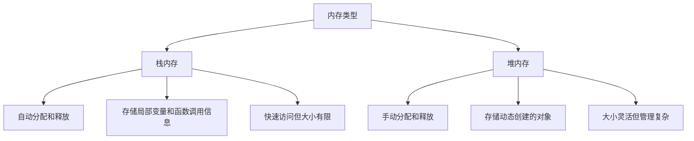

# C++ 内存优化

## 介绍

内存优化是C++编程中的一个关键方面，它直接影响应用程序的性能、稳定性和可扩展性。对于初学者来说，了解如何有效地管理内存不仅可以帮助你编写更高效的代码，还能避免常见的内存相关问题，如内存泄漏、碎片化和访问冲突。

在本教程中，我们将探讨C++内存管理的基础知识，以及如何应用各种技术来优化程序的内存使用。

## 内存管理基础

在深入内存优化之前，让我们先了解C++中内存管理的基本概念。

### 栈内存与堆内存

C++程序主要使用两种类型的内存：



#### 栈内存示例：

```cpp
void function() {
    int a = 5;           // 栈上分配
    double b = 3.14;     // 栈上分配
    
    // 函数结束时，a和b自动被释放
}
```

#### 堆内存示例：

```cpp
void function() {
    int* ptr = new int;  // 在堆上分配一个整数
    *ptr = 10;
    
    // 必须手动释放内存，否则会造成内存泄漏
    delete ptr;
}
```

## 常见内存问题

初学者在C++编程中经常会遇到以下内存相关问题：

### 1. 内存泄漏

当动态分配的内存没有被正确释放时，就会发生内存泄漏，导致程序随着时间的推移消耗越来越多的内存。

**泄漏示例：**

```cpp
void leakMemory() {
    int* array = new int[1000]; 
    // 忘记调用 delete[] array
    // 每次调用这个函数都会泄漏4000字节的内存
}
```

### 2. 悬空指针/野指针

指向已释放内存的指针被称为悬空指针，对其进行操作可能导致程序崩溃或不可预测的行为。

```cpp
int* getPointer() {
    int x = 10;        // 局部变量在栈上
    return &x;         // 返回局部变量的地址 - 危险！
}                      // x在函数返回后不再存在

void usePointer() {
    int* ptr = getPointer();
    cout << *ptr;      // 未定义行为：访问已不存在的内存
}
```

### 3. 内存碎片化

频繁的内存分配和释放可能导致内存碎片化，使得大块连续内存变得难以获取。

## 内存优化技术

现在让我们学习一些优化C++程序内存使用的技术。

### 1. 使用智能指针

C++11引入了智能指针，它们可以自动管理内存释放，大大减少了内存泄漏的风险。

```cpp
#include <memory>

void smartPointerExample() {
    // 独占所有权智能指针
    std::unique_ptr<int> uniquePtr = std::make_unique<int>(42);
    
    // 共享所有权智能指针
    std::shared_ptr<int> sharedPtr1 = std::make_shared<int>(100);
    {
        std::shared_ptr<int> sharedPtr2 = sharedPtr1; // 引用计数增加到2
        *sharedPtr2 = 200;                           // 修改同一个对象
    }
    // sharedPtr2离开作用域，引用计数减为1，内存不会释放
    
    // 函数结束时，uniquePtr和sharedPtr1自动释放它们指向的内存
}
```

:::tip
使用`std::make_unique`和`std::make_shared`而不是直接使用`new`可以提供额外的性能和安全性优势。
:::

### 2. 避免不必要的动态内存分配

尽可能使用栈内存而不是堆内存，可以提高性能并减少内存管理负担。

**优化前：**

```cpp
void processData(int size) {
    int* data = new int[size];
    
    // 处理数据
    for (int i = 0; i < size; i++) {
        data[i] = i * 2;
    }
    
    delete[] data;
}
```

**优化后：**

```cpp
#include <vector>

void processData(int size) {
    // 使用标准容器自动管理内存
    std::vector<int> data(size);
    
    // 处理数据
    for (int i = 0; i < size; i++) {
        data[i] = i * 2;
    }
    
    // 不需要手动释放内存
}
```

### 3. 对象池模式

当需要频繁创建和销毁许多小对象时，可以使用对象池来重用对象，减少内存分配和碎片化。

```cpp
#include <vector>
#include <memory>

class ObjectPool {
private:
    std::vector<std::unique_ptr<int>> pool;
    std::vector<int*> freeList;
    
public:
    ObjectPool(size_t initialSize) {
        // 预分配对象
        for (size_t i = 0; i < initialSize; i++) {
            auto obj = std::make_unique<int>(0);
            freeList.push_back(obj.get());
            pool.push_back(std::move(obj));
        }
    }
    
    int* acquire() {
        if (freeList.empty()) {
            // 池已空，创建新对象
            auto obj = std::make_unique<int>(0);
            int* ptr = obj.get();
            pool.push_back(std::move(obj));
            return ptr;
        } else {
            // 复用现有对象
            int* obj = freeList.back();
            freeList.pop_back();
            return obj;
        }
    }
    
    void release(int* obj) {
        // 将对象放回空闲列表
        freeList.push_back(obj);
    }
};

// 使用示例
void useObjectPool() {
    ObjectPool pool(100); // 预分配100个对象
    
    int* obj1 = pool.acquire();
    *obj1 = 42;
    
    // 使用完毕后返回池中
    pool.release(obj1);
}
```

### 4. 内存对齐

适当的内存对齐可以提高内存访问效率，特别是在处理大量数据结构时。

```cpp
// 未对齐的结构体
struct BadLayout {
    char a;      // 1字节
    double b;    // 8字节
    char c;      // 1字节
};                // 总大小可能是24字节（因为填充）

// 优化后的结构体
struct GoodLayout {
    double b;    // 8字节
    char a;      // 1字节
    char c;      // 1字节
    // 6字节填充
};               // 总大小16字节

// 进一步优化
struct BetterLayout {
    double b;    // 8字节
    char a, c;   // 各1字节，放在一起
    // 6字节填充
};               // 总大小16字节
```

### 5. 小对象优化

对于小型对象，可以实现小对象优化以避免堆分配。例如，`std::string`通常会在小字符串时使用内部缓冲区而不是动态分配内存。

```cpp
#include <string>

void stringExample() {
    std::string small = "hi";    // 可能使用内部缓冲区，不分配堆内存
    std::string large(1000, 'x'); // 需要堆分配
}
```

## 内存优化工具

为了有效地优化内存，你可以使用以下工具来检测和分析内存使用情况：

1. **Valgrind** - 检测内存泄漏和使用错误
2. **AddressSanitizer (ASAN)** - 快速内存错误检测器
3. **Memory Profilers** - 如Visual Studio内存分析器或Intel VTune

## 实际案例：图像处理应用中的内存优化

让我们看一个图像处理应用中优化内存使用的例子：

**优化前：**

```cpp
void processImages(const std::vector<std::string>& filenames) {
    for (const auto& filename : filenames) {
        // 为每个图像分配新内存
        Image* img = new Image(filename);
        
        // 处理图像
        img->applyFilter();
        img->saveResult();
        
        // 释放内存
        delete img;
    }
}
```

**优化后：**

```cpp
void processImages(const std::vector<std::string>& filenames) {
    // 重用单个Image对象
    std::unique_ptr<Image> img = std::make_unique<Image>();
    
    for (const auto& filename : filenames) {
        // 加载图像到现有对象
        img->load(filename);
        
        // 处理图像
        img->applyFilter();
        img->saveResult();
        
        // 不需要每次都分配和释放内存
    }
    
    // img会在函数结束时自动释放
}
```

这个优化通过重用单个Image对象而不是为每个图像分配新内存，大幅减少了内存分配和释放操作，降低了内存碎片化风险，提高了程序性能。

## 总结

内存优化是C++编程中一个重要的技能，它可以显著提高程序的性能和可靠性。通过遵循本教程中的最佳实践，你可以：

- 减少内存泄漏
- 提高程序性能
- 降低内存碎片化风险
- 更有效地利用可用内存

记住，内存优化是一个持续的过程，需要在整个开发周期中不断关注。随着你的C++技能提高，你将能够应用更高级的内存优化技术。

## 练习

1. 创建一个简单的程序，故意制造内存泄漏，然后使用Valgrind或类似工具检测它。
2. 修改一个使用原始指针的程序，改用智能指针来自动管理内存。
3. 实现一个简单的对象池，并比较使用和不使用对象池时的性能差异。
4. 研究STL容器（如`std::vector`, `std::string`）的内存分配模式，并讨论它们如何优化内存使用。

## 附加资源

- [Effective Modern C++](https://www.oreilly.com/library/view/effective-modern-c/9781491908419/) by Scott Meyers
- [C++ Core Guidelines](https://isocpp.github.io/CppCoreGuidelines/CppCoreGuidelines) - 内存管理部分
- [Valgrind 官方文档](https://valgrind.org/docs/)
- [CppCon talks on YouTube](https://www.youtube.com/user/CppCon) - 有许多关于内存优化的演讲

:::caution
记住，过早优化可能是万恶之源。在实际需要优化之前，先确保代码正确且可维护。
:::