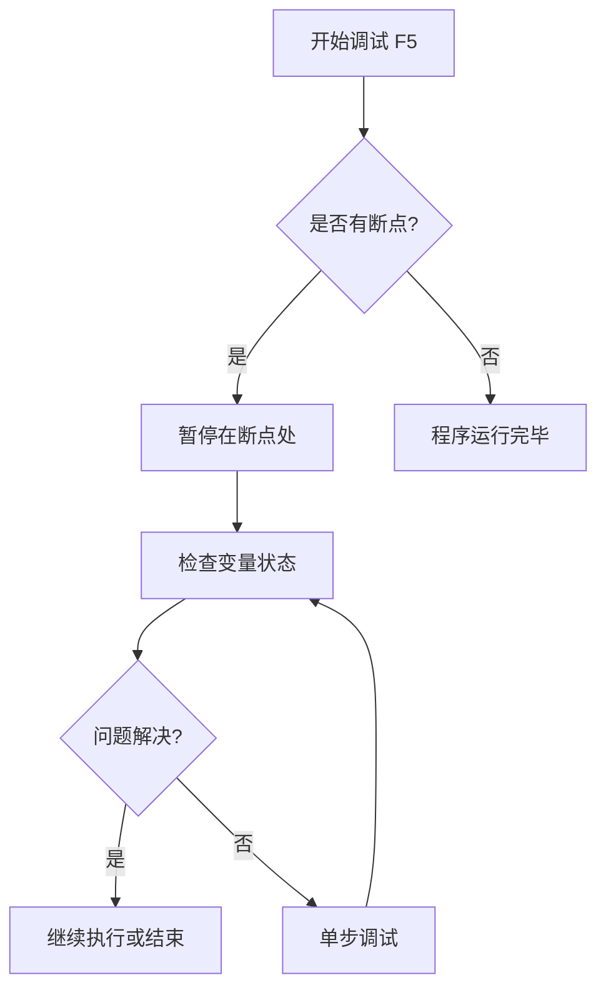

# C++ 调试工具

在C++编程过程中，代码错误几乎是无法避免的。无论是初学者还是专业人士，都需要掌握有效的调试技巧，帮助快速定位和修复问题。本文将介绍常用的C++调试工具和方法，从简单的打印调试到专业的调试器使用，帮助你成为更高效的C++开发者。

## 为什么需要调试工具

调试是软件开发过程中不可或缺的一部分。即使是最熟练的程序员也会写出含有错误的代码，这些错误可能是：

- 编译时错误：语法错误，编译器会直接报告
- 链接时错误：函数声明与定义不匹配等问题
- 运行时错误：空指针引用、内存泄漏、逻辑错误等

:::tip 对初学者的建议
不要害怕遇到错误！调试是学习编程的重要部分，每解决一个问题都会让你的编程技能更进一步。
:::

## 基础调试技巧

### 打印调试 (Print Debugging)

最简单的调试方式是使用`cout`或`printf`语句来输出变量值或程序执行流程。

```cpp
#include <iostream>

int main() {
    int x = 10;
    int y = 0;
    std::cout << "x = " << x << ", y = " << y << std::endl;
    
    if (y != 0) {
        int z = x / y;
        std::cout << "z = " << z << std::endl;
    } else {
        std::cout << "除数不能为零" << std::endl;
    }
    
    return 0;
}
```

输出：
```
x = 10, y = 0
除数不能为零
```

**优点**：
- 简单易用
- 不需要额外工具

**缺点**：
- 需要修改代码
- 大量的调试输出会使代码难以阅读
- 针对复杂问题效率较低

### 断言 (Assert)

断言是一种运行时检查机制，用于验证代码中的假设。

```cpp
#include <iostream>
#include <cassert>

int divide(int a, int b) {
    // 断言b不为0
    assert(b != 0 && "除数不能为零");
    return a / b;
}

int main() {
    int result = divide(10, 2);
    std::cout << "结果: " << result << std::endl;
    
    // 这将触发断言失败
    // result = divide(10, 0);
    
    return 0;
}
```

:::caution
在发布版本中，断言通常会被禁用。因此，不要在断言中放置必要的程序逻辑。
:::

## 专业调试工具

### GDB (GNU Debugger)

GDB是Unix/Linux环境下最常用的命令行调试器，功能强大。

#### 基本使用流程

1. 编译时添加调试信息：
```bash
g++ -g -o myprogram myprogram.cpp
```

2. 启动GDB：
```bash
gdb myprogram
```

3. 常用GDB命令：

```
break main    # 在main函数设置断点
run           # 运行程序直到断点
next          # 执行下一行代码，不进入函数
step          # 执行下一行代码，进入函数
print x       # 打印变量x的值
continue      # 继续执行直到下一个断点
backtrace     # 显示当前调用栈
quit          # 退出GDB
```

#### 实例演示

假设我们有一个简单的程序：

```cpp
#include <iostream>

int factorial(int n) {
    if (n <= 1)
        return 1;
    return n * factorial(n - 1);
}

int main() {
    int n = 5;
    std::cout << n << "! = " << factorial(n) << std::endl;
    return 0;
}
```

在GDB中调试此程序：

```
$ g++ -g -o factorial factorial.cpp
$ gdb factorial
(gdb) break main
(gdb) run
(gdb) next
(gdb) print n
$1 = 5
(gdb) break factorial
(gdb) continue
(gdb) print n
$2 = 5
(gdb) next
(gdb) print n
$3 = 5
(gdb) continue
```

### Visual Studio Debugger

如果你使用Windows平台进行开发，Visual Studio提供了一个强大的图形界面调试器。

#### 主要功能：

- 断点设置：在代码行号旁点击或按F9
- 单步执行：F10执行下一行，F11进入函数
- 监视窗口：观察变量值的变化
- 调用栈窗口：显示函数调用层次
- 即时窗口：交互式执行代码片段



### CLion Debugger

JetBrains CLion IDE同样提供了出色的调试体验，适用于多平台：

- 集成的CMake支持
- 智能断点功能
- 内存视图
- 动态值更新

## 内存调试工具

### Valgrind

Valgrind是Linux环境下用于检测内存泄漏和其他内存相关问题的强大工具。

```cpp
#include <iostream>

int main() {
    int* arr = new int[10];
    // 忘记释放内存
    // delete[] arr;
    return 0;
}
```

使用Valgrind检测：

```bash
g++ -g -o memtest memtest.cpp
valgrind --leak-check=full ./memtest
```

输出将类似：

```
==12345== HEAP SUMMARY:
==12345==     in use at exit: 40 bytes in 1 blocks
==12345==   total heap usage: 1 allocs, 0 frees, 40 bytes allocated
==12345== 
==12345== 40 bytes in 1 blocks are definitely lost in loss record 1 of 1
```

### AddressSanitizer

AddressSanitizer是一种编译时工具，可以检测各种内存错误：

```bash
g++ -fsanitize=address -g -o memtest memtest.cpp
./memtest
```

## 使用日志库

对于大型项目，使用专业的日志库比简单的cout语句更有效：

```cpp
#include <iostream>
#include <spdlog/spdlog.h>

int main() {
    // 初始化日志
    spdlog::set_level(spdlog::level::debug);
    
    spdlog::info("程序开始执行");
    int x = 42;
    spdlog::debug("x的值为: {}", x);
    
    try {
        throw std::runtime_error("示例异常");
    } catch (const std::exception& e) {
        spdlog::error("发生异常: {}", e.what());
    }
    
    spdlog::info("程序执行结束");
    return 0;
}
```

:::note
要使用spdlog，你需要先安装该库。可以通过包管理器安装或直接从GitHub下载。
:::

## 实际调试案例

下面展示一个常见的内存错误和如何调试：

```cpp
#include <iostream>
#include <vector>

void process_data(std::vector<int>& data) {
    for (size_t i = 0; i <= data.size(); i++) {  // 注意这里的<=
        data[i] *= 2;  // 当i=data.size()时将越界
    }
}

int main() {
    std::vector<int> numbers = {1, 2, 3, 4, 5};
    
    try {
        process_data(numbers);
        
        std::cout << "处理后的数据: ";
        for (int num : numbers) {
            std::cout << num << " ";
        }
        std::cout << std::endl;
    }
    catch (const std::exception& e) {
        std::cerr << "捕获到异常: " << e.what() << std::endl;
    }
    
    return 0;
}
```

### 调试过程

1. **识别问题**：程序可能会崩溃或产生未定义行为。

2. **使用调试器**：
   - 设置断点在`process_data`函数
   - 监视`i`和`data.size()`的值
   - 单步执行循环

3. **发现问题**：循环条件应为`i < data.size()`而非`i <= data.size()`

4. **修复问题**：
```cpp
void process_data(std::vector<int>& data) {
    for (size_t i = 0; i < data.size(); i++) {  // 修复为<
        data[i] *= 2;
    }
}
```

## 调试技巧与最佳实践

1. **系统化调试**：
   - 首先重现问题
   - 简化问题（创建最小复现示例）
   - 隔离可能的原因
   - 验证解决方案

2. **有效使用断点**：
   - 条件断点：只在特定条件满足时停止
   - 数据断点：当变量值改变时停止

3. **避免常见陷阱**：
   - 不要假设，要验证
   - 检查边界条件
   - 关注类型转换

4. **防御性编程**：
   - 添加参数检查
   - 使用RAII管理资源
   - 尽可能使用标准库组件

## 总结

掌握调试技能是成为高效C++程序员的关键。从简单的打印调试到复杂的调试器使用，每种方法都有其适用场景。初学者应从基础开始，逐步掌握更复杂的调试工具和技巧。记住，调试不仅是修复错误，也是理解代码执行过程的重要方式。

## 练习与深入学习

1. **基础练习**：编写一个包含常见错误（如数组越界、空指针等）的简单程序，并使用打印调试定位问题。

2. **中级练习**：使用GDB或Visual Studio调试器单步调试递归函数，观察调用栈的变化。

3. **高级练习**：创建一个包含内存泄漏的程序，使用Valgrind或AddressSanitizer检测并修复。

## 推荐资源

- **GDB文档**：官方GDB使用手册
- **Visual Studio调试指南**：微软官方文档
- **《Debugging with GDB》**：GDB深入学习资源
- **Valgrind官方教程**：内存问题检测指南
- **C++ Core Guidelines**：避免常见错误的最佳实践

:::tip
调试是一项技能，需要通过实践不断提高。不要害怕错误，而是将它们视为学习机会！
:::