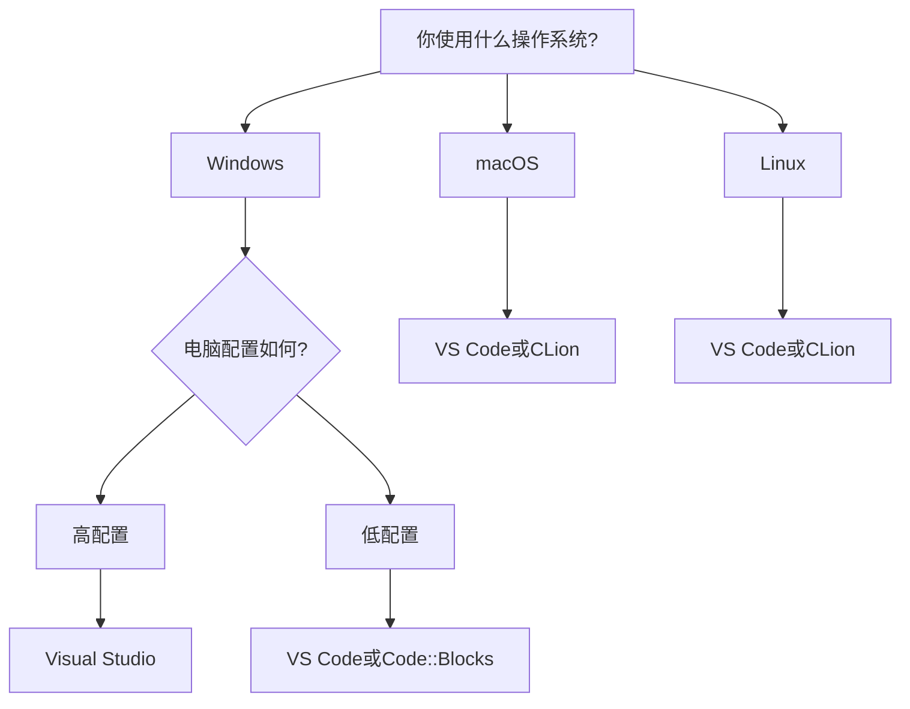

# C++ IDE选择

## 什么是IDE？

集成开发环境(Integrated Development Environment，简称IDE)是一种用于程序开发的应用程序，它通常包括代码编辑器、编译器、调试器以及许多其他功能，旨在简化开发过程并提高开发效率。对于C++开发来说，选择一个合适的IDE能够极大地提升学习和开发体验。

:::tip
好的IDE不仅可以帮助你更高效地编写代码，还能在调试和理解代码方面提供巨大帮助！
:::

## 主流C++ IDE对比

### Visual Studio (Windows平台首选)

Visual Studio是微软开发的功能强大的IDE，拥有完整的C++开发工具链和丰富的插件生态。

**优点：**
- 强大的调试工具
- 智能代码补全和提示
- 内置版本控制
- 直观的界面设计
- 完整的工具链（编译器、链接器等）

**缺点：**
- 占用系统资源较多
- 完整版本需要付费（社区版对个人和小团队免费）
- 主要针对Windows平台

**适合人群：** Windows平台用户，尤其是初学者和需要开发Windows应用的开发者

**安装示例：**
1. 访问Visual Studio官网下载安装程序
2. 运行安装程序并选择"C++桌面开发"工作负载
3. 完成安装后，创建新项目时选择C++模板

### CLion (跨平台商业选择)

由JetBrains开发的专注于C/C++的现代化IDE，具有智能代码辅助功能。

**优点：**
- 优秀的代码导航和智能提示
- 强大的重构工具
- 跨平台（Windows、macOS、Linux）
- 与CMake深度集成

**缺点：**
- 需要付费（学生可申请免费使用）
- 对系统要求较高
- 默认使用CMake构建系统，初学者可能需要学习曲线

**适合人群：** 专业开发者，追求高效编码体验的用户，学生（可申请免费许可）

### Visual Studio Code (轻量级跨平台选择)

VS Code是一款轻量级但功能强大的代码编辑器，通过安装插件可转变为C++ IDE。

**优点：**
- 轻量级，启动快速
- 跨平台支持
- 丰富的扩展生态
- 免费开源
- 内置终端

**缺点：**
- 需要手动配置C++环境
- 功能依赖于插件
- 调试配置较复杂

**配置C++环境示例：**

1. 安装VS Code
2. 安装C/C++扩展
3. 安装编译器（如MinGW、GCC或MSVC）
4. 创建并配置`tasks.json`和`launch.json`文件

```json
// tasks.json 示例
{
  "version": "2.0.0",
  "tasks": [
    {
      "type": "cppbuild",
      "label": "C/C++: g++.exe build active file",
      "command": "g++",
      "args": ["-g", "${file}", "-o", "${fileDirname}\\${fileBasenameNoExtension}.exe"],
      "options": {
        "cwd": "${workspaceFolder}"
      },
      "problemMatcher": ["$gcc"],
      "group": {
        "kind": "build",
        "isDefault": true
      }
    }
  ]
}
```

### Code::Blocks (开源跨平台选择)

Code::Blocks是一个免费、开源的C++ IDE，适合初学者和轻度开发。

**优点：**
- 完全免费开源
- 跨平台支持
- 轻量级
- 内置编译器（如果选择带MinGW的安装包）

**缺点：**
- 界面不够现代
- 功能相对有限
- 开发不够活跃

**适合人群：** 初学者，资源受限的计算机，偏好轻量级IDE的用户

### Qt Creator (GUI开发首选)

专注于Qt框架开发的IDE，但也支持一般的C++开发。

**优点：**
- 与Qt框架完美集成
- 内置UI设计器
- 跨平台支持
- 代码导航和补全功能出色

**缺点：**
- 主要针对Qt开发优化
- 界面可能复杂
- 完整版需要商业许可

**适合人群：** 需要开发GUI应用的开发者，特别是使用Qt框架的项目

## IDE功能详解

### 代码编辑功能

现代IDE提供了众多提升编码效率的功能：

- **语法高亮**：不同语法元素用不同颜色显示
- **代码自动完成**：输入部分代码，IDE提供可能的完成选项
- **实时错误检查**：在编译前发现语法错误
- **代码格式化**：自动整理代码格式，使其更易读

**示例：VS Code中的代码自动完成**

当你开始输入`std::`时，IDE会显示可用的标准库组件：
```cpp
#include <iostream>

int main() {
    std::         // 此时IDE会显示vector、string、cout等选项
    return 0;
}
```

### 调试功能

调试是学习C++过程中至关重要的一环，好的IDE提供：

- **断点设置**：在代码中设置停止点
- **单步执行**：逐行执行代码
- **变量监视**：查看变量的实时值
- **调用堆栈**：查看函数调用路径

**示例：使用断点调试**

```cpp
#include <iostream>

int factorial(int n) {
    if (n <= 1) return 1;
    return n * factorial(n-1);  // 在此设置断点
}

int main() {
    int result = factorial(5);
    std::cout << "5! = " << result << std::endl;
    return 0;
}
```

在递归调用行设置断点，你可以观察参数n的变化以及递归调用的过程。

## 初学者如何选择？

为了帮助你选择合适的IDE，请考虑以下因素：

1. **操作系统兼容性**：确保IDE支持你的操作系统
2. **硬件资源**：如果电脑配置较低，选择轻量级IDE如VS Code或Code::Blocks
3. **学习曲线**：初学者可能更适合界面直观的IDE，如Visual Studio
4. **特定需求**：如果需要开发GUI，考虑Qt Creator；如果是跨平台项目，选择CLion或VS Code
5. **社区支持**：选择有活跃社区的IDE，遇到问题时更容易找到解决方案

### 初学者推荐



## 实际案例：不同IDE的应用场景

### 案例1：大学C++课程项目

**推荐IDE**：Visual Studio（Windows）或VS Code（跨平台）

**理由**：
- 简单直观的界面适合初学者
- 强大的调试工具帮助理解代码执行流程
- 丰富的学习资源和社区支持

### 案例2：跨平台开源项目

**推荐IDE**：VS Code或CLion

**理由**：
- 跨平台支持确保团队成员在不同操作系统上有一致体验
- 与Git等版本控制系统良好集成
- 支持CMake等跨平台构建系统

### 案例3：图形用户界面(GUI)应用开发

**推荐IDE**：Qt Creator

**理由**：
- 内置UI设计器
- 与Qt框架无缝集成
- 提供跨平台GUI开发能力

## IDE配置与使用技巧

### 基本配置

无论选择哪种IDE，以下基本配置可提升开发体验：

1. **配置代码风格**：设置缩进、括号风格等
2. **设置自动保存**：防止意外丢失代码
3. **配置编译器选项**：根据项目需要设置警告级别和优化选项
4. **设置快捷键**：熟悉并自定义常用操作的快捷键

### 提高效率的小技巧

1. **学习快捷键**：熟练使用快捷键可大幅提升编码速度
2. **使用代码片段**：创建常用代码块的模板
3. **利用宏或脚本**：自动化重复任务
4. **使用版本控制集成**：直接在IDE中管理代码版本

**VS Code快捷键示例：**

- `F5`: 开始调试
- `Ctrl+/`: 注释/取消注释
- `F12`: 转到定义
- `Shift+F12`: 查看引用

:::caution
不要过度依赖IDE的自动完成功能！确保你理解了代码的含义，而不是只会"按照提示点击"。
:::

## 总结

选择合适的C++ IDE对于提高学习和开发效率至关重要。初学者可以从以下方面考虑：

- **Windows用户**：Visual Studio社区版是入门首选
- **跨平台需求**：VS Code具有良好的平衡性
- **资源有限**：Code::Blocks是轻量级选择
- **专业开发**：CLion提供先进的开发工具
- **GUI开发**：Qt Creator为最佳选择

无论选择哪种IDE，关键是要熟悉它的使用方法，充分利用其功能来提高编码效率和代码质量。随着经验的积累，你可能会根据不同项目需求使用不同的IDE，或者深入定制你最喜欢的IDE。

## 练习与资源

### 练习

1. 安装本文介绍的至少两种IDE，创建同一个简单的C++程序（如"Hello World"），比较开发体验
2. 在你选择的IDE中，尝试设置断点并调试一个包含循环的简单程序
3. 探索IDE的自动完成功能，尝试使用STL容器和算法

### 进一步学习资源

- Visual Studio文档：[https://docs.microsoft.com/visualstudio/](https://docs.microsoft.com/visualstudio/)
- VS Code C++教程：[https://code.visualstudio.com/docs/languages/cpp](https://code.visualstudio.com/docs/languages/cpp)
- CLion文档：[https://www.jetbrains.com/clion/documentation/](https://www.jetbrains.com/clion/documentation/)
- C++参考文档：[https://en.cppreference.com/](https://en.cppreference.com/)

选择最适合你的IDE，开启C++学习之旅吧！

:::tip
记住，最好的IDE是最适合你的工作流程和项目需求的那个，不必追求最流行或功能最多的选择。
:::