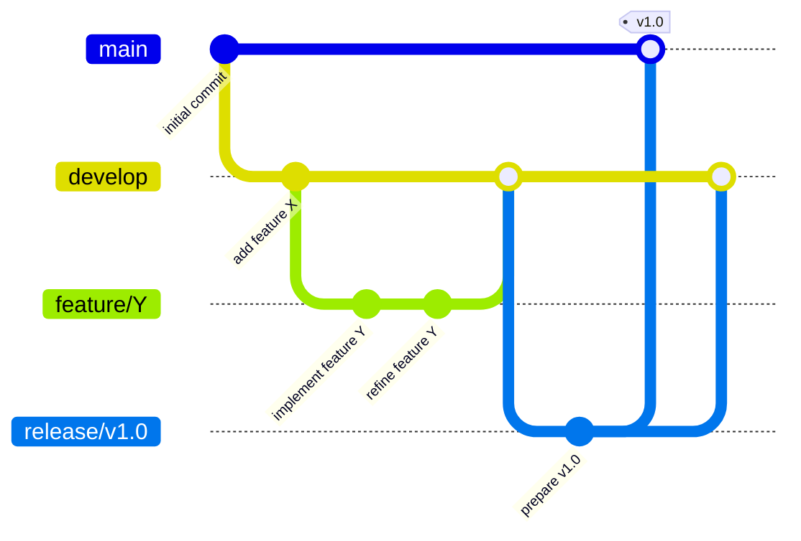
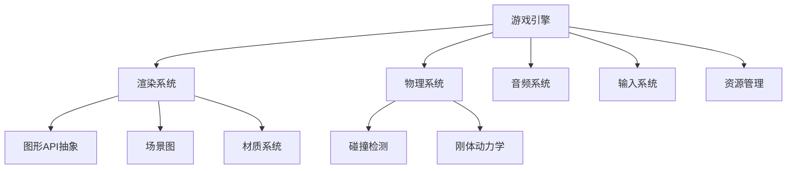

# C++ 大型项目最佳实践

当你从简单的C++程序过渡到大型项目时，会面临许多新的挑战。良好的项目组织、可维护的代码结构和高效的开发流程对于项目成功至关重要。本文将介绍C++大型项目开发的最佳实践，帮助你构建健壮、可维护的软件系统。

## 为什么需要最佳实践？

随着项目规模的增长，代码复杂度会呈指数级增长。没有良好的实践指导，可能导致：

- 代码难以维护
- 团队协作困难
- 构建时间过长
- 难以发现和修复bug
- 技术债务积累

:::tip
一个设计良好的大型项目可以持续多年，甚至几十年，而糟糕的设计可能导致项目在几个月内就需要重写。
:::

## 项目结构与组织

### 目录结构

一个良好的目录结构能显著提高代码的可发现性和组织性：

```
project-root/
│
├── build/            # 构建输出目录
├── cmake/            # CMake模块和配置
├── docs/             # 文档
├── external/         # 第三方库
├── include/          # 公共头文件
│   └── project/
│       ├── module1/
│       └── module2/
├── src/              # 源代码
│   ├── module1/
│   └── module2/
├── tests/            # 测试文件
│   ├── module1/
│   └── module2/
├── tools/            # 工具和脚本
├── .clang-format     # 代码格式化配置
├── .gitignore
├── CMakeLists.txt    # 主CMake文件
└── README.md
```

### 模块化设计

将代码按功能划分为逻辑模块，每个模块应该：

- 有明确的职责
- 定义清晰的API
- 尽量减少与其他模块的耦合

```cpp
// 模块化设计示例 - 数据库模块API (include/project/database/database.h)
namespace project {
namespace database {

class Database {
public:
    Database();
    ~Database();
    
    bool connect(const std::string& connection_string);
    bool disconnect();
    
    bool executeQuery(const std::string& query, QueryResult& result);
    
private:
    // 实现细节
    class DatabaseImpl;
    std::unique_ptr<DatabaseImpl> pimpl_;
};

} // namespace database
} // namespace project
```

## 代码风格与规范

### 代码规范

统一的代码规范是团队协作的基础：

- 使用一致的命名规则（如Google C++风格或Microsoft风格）
- 采用自动化工具强制代码风格（如clang-format）

```cpp
// Google风格示例
class DatabaseConnection {
public:
    bool ConnectToServer(const std::string& server_address);
    
private:
    std::string server_address_;
    int connection_timeout_ms_;
};
```

### 编码指南

以下是一些关键的编码指南：

- 遵循SOLID原则
- 优先使用标准库
- 明确内存所有权
- 使用RAII来管理资源
- 限制函数和类的大小

:::caution
避免在头文件中使用`using namespace`语句，这可能导致命名冲突。
:::

## 构建系统

### CMake

CMake是C++项目中最流行的构建系统之一：

```cmake
# CMakeLists.txt示例
cmake_minimum_required(VERSION 3.15)
project(MyProject VERSION 1.0.0 LANGUAGES CXX)

set(CMAKE_CXX_STANDARD 17)
set(CMAKE_CXX_STANDARD_REQUIRED ON)

# 添加库
add_library(core
    src/core/core.cpp
    src/core/utility.cpp
)

target_include_directories(core
    PUBLIC include
    PRIVATE src
)

# 添加可执行文件
add_executable(main src/main.cpp)
target_link_libraries(main PRIVATE core)

# 添加测试
enable_testing()
add_subdirectory(tests)
```

### 依赖管理

大型项目通常依赖许多外部库，有几种方法可以管理这些依赖：

1. **包管理器**：如Conan、vcpkg
2. **Git子模块**
3. **CMake的FetchContent**

```cmake
# 使用FetchContent示例
include(FetchContent)
FetchContent_Declare(
    fmt
    GIT_REPOSITORY https://github.com/fmtlib/fmt.git
    GIT_TAG 8.0.1
)
FetchContent_MakeAvailable(fmt)

target_link_libraries(main PRIVATE fmt::fmt)
```

## 测试策略

### 单元测试

使用如Google Test或Catch2等框架进行单元测试：

```cpp
// 使用Google Test的示例
#include <gtest/gtest.h>
#include "project/calculator.h"

TEST(CalculatorTest, AdditionWorks) {
    Calculator calc;
    EXPECT_EQ(calc.add(2, 3), 5);
}

TEST(CalculatorTest, SubtractionWorks) {
    Calculator calc;
    EXPECT_EQ(calc.subtract(5, 3), 2);
}
```

### 集成测试和系统测试

除了单元测试，还应包括：

- 集成测试（测试多个组件之间的交互）
- 系统测试（测试整个系统）
- 性能测试（确保性能符合要求）

## 版本控制最佳实践

### Git工作流

采用结构化的Git工作流，如：

- Git Flow
- GitHub Flow
- GitLab Flow



### 提交规范

采用清晰的提交消息规范：

- 使用类别前缀（feat:, fix:, docs:, etc.）
- 保持提交消息简洁明了
- 在描述中提供更多详细信息

```
feat: add user authentication feature

- Implement login form
- Add password hashing
- Create session management
```

## 文档

### 代码文档

使用Doxygen或其他工具记录代码：

```cpp
/**
 * @brief Connects to the database server
 * 
 * Establishes a connection to the specified database server
 * using the provided credentials.
 * 
 * @param host Database server hostname or IP
 * @param user Username for authentication
 * @param password Password for authentication
 * @param database Name of the database to connect to
 * 
 * @return true if connection successful, false otherwise
 * 
 * @throws ConnectionException if network error occurs
 */
bool connectToDatabase(const std::string& host,
                       const std::string& user,
                       const std::string& password,
                       const std::string& database);
```

### 项目文档

确保项目有完善的文档：

- README文件
- 设计文档
- API文档
- 使用指南
- 贡献指南

## 性能与优化

### 性能分析

使用性能分析工具识别瓶颈：

- 性能分析器（如Valgrind, perf, Intel VTune）
- 内存分析（如Valgrind's Memcheck, AddressSanitizer）

### 优化策略

- 首先使代码正确，然后才考虑优化
- 基于数据进行优化决策
- 避免过早优化
- 记录优化的基准测试结果

## 实际案例研究：游戏引擎开发

假设我们正在开发一个简单的游戏引擎，让我们看看如何应用这些最佳实践：

### 模块划分



### 代码组织

```
game-engine/
├── include/
│   └── engine/
│       ├── core/
│       ├── rendering/
│       ├── physics/
│       ├── audio/
│       └── input/
├── src/
│   ├── core/
│   ├── rendering/
│   ├── physics/
│   ├── audio/
│   └── input/
├── examples/
│   ├── simple-game/
│   └── demo-scenes/
└── tests/
    ├── core/
    ├── rendering/
    └── physics/
```

### 接口设计示例

```cpp
// 抽象渲染器接口 (include/engine/rendering/renderer.h)
namespace engine {
namespace rendering {

class Renderer {
public:
    virtual ~Renderer() = default;
    
    // 初始化渲染系统
    virtual bool initialize(const RendererSettings& settings) = 0;
    
    // 准备新帧
    virtual void beginFrame() = 0;
    
    // 提交场景进行渲染
    virtual void renderScene(const Scene& scene) = 0;
    
    // 完成帧渲染并呈现
    virtual void endFrame() = 0;
    
    // 释放资源
    virtual void shutdown() = 0;
};

// 工厂函数创建具体渲染器
std::unique_ptr<Renderer> createRenderer(RendererType type);

} // namespace rendering
} // namespace engine
```

### 实现示例

```cpp
// OpenGL渲染器实现 (src/rendering/opengl_renderer.cpp)
namespace engine {
namespace rendering {

class OpenGLRenderer : public Renderer {
public:
    bool initialize(const RendererSettings& settings) override {
        // 初始化OpenGL上下文
        // ...
        return true;
    }
    
    void beginFrame() override {
        glClear(GL_COLOR_BUFFER_BIT | GL_DEPTH_BUFFER_BIT);
    }
    
    void renderScene(const Scene& scene) override {
        for (const auto& entity : scene.getEntities()) {
            if (entity.hasComponent<MeshComponent>()) {
                renderMesh(entity.getComponent<MeshComponent>(),
                           entity.getComponent<TransformComponent>());
            }
        }
    }
    
    // 其他方法实现...
private:
    void renderMesh(const MeshComponent& mesh, const TransformComponent& transform) {
        // 渲染网格
        // ...
    }
    
    // OpenGL特定的状态和资源
};

std::unique_ptr<Renderer> createRenderer(RendererType type) {
    if (type == RendererType::OpenGL) {
        return std::make_unique<OpenGLRenderer>();
    }
    // 支持其他渲染器类型...
    return nullptr;
}

} // namespace rendering
} // namespace engine
```

## 总结

开发C++大型项目需要同时关注技术和流程两个方面：

1. **技术方面**：
   - 良好的代码组织和模块化
   - 恰当的构建系统配置
   - 全面的测试策略
   - 一致的编码规范

2. **流程方面**：
   - 有效的版本控制实践
   - 持续集成/持续部署
   - 完善的文档
   - 团队协作规范

通过应用这些最佳实践，你可以构建更可维护、更健壮的大型C++项目，并提高团队协作效率。

## 学习资源与练习

### 推荐资源

- 《Large-Scale C++ Software Design》by John Lakos
- 《Effective Modern C++》by Scott Meyers
- Google C++ Style Guide
- "CppCon" 会议视频（YouTube）
- CMake官方文档

### 练习项目

1. **创建模板项目**：建立一个包含所有最佳实践的项目模板，包括目录结构、CMakeLists、CI配置等。

2. **重构小项目**：选择一个之前完成的小型项目，应用这些最佳实践对其进行重构。

3. **多模块应用**：开发一个具有明确模块分离的应用程序，如一个简单的文本编辑器，包含UI、文件I/O、文本处理等模块。

:::note
记住，软件开发是一门实践的艺术。这些最佳实践来自无数开发者多年的经验，但你仍需在自己的项目中不断调整和改进它们。
:::