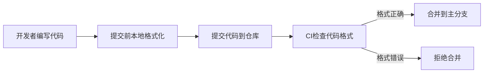

# C++ 代码格式化

## 什么是代码格式化？

代码格式化是指按照一定的规则和标准调整代码的排版和风格，使其更加易读、一致和美观。良好的代码格式不仅提高了代码的可读性，还能帮助开发团队保持一致的编码风格，减少合并冲突，并且使代码审查更加高效。

:::tip 为什么格式化很重要
研究表明，开发人员花在阅读代码上的时间比写代码多出几倍。一个良好格式化的代码库可以显著提高开发效率！
:::

## 格式化的基本原则

在C++中，常见的代码格式化涉及以下几个方面：

1. **缩进和空格**：合理的缩进和空格使代码层次分明。
2. **括号风格**：大括号的放置位置（同行或新行）。
3. **换行和对齐**：长语句的换行和多行语句的对齐方式。
4. **命名约定**：变量、函数、类等的命名规则。
5. **注释格式**：注释的位置和样式。

## 常用的C++代码格式化风格

### Google风格

Google的C++编码规范是业界广泛采用的标准之一。

特点：
- 使用2个空格进行缩进（不用制表符）
- 大括号通常放在同一行（K&R风格）
- 函数参数分开排列

```cpp
// Google风格示例
void Function(bool param1, bool param2) {  // 大括号和函数声明在同一行
  if (param1) {
    // 使用2个空格缩进
    DoSomething();
  } else if (param2) {
    DoSomethingElse();
  }
}
```

### LLVM风格

LLVM项目使用的格式风格，也很受欢迎。

特点：
- 使用2个空格进行缩进
- 大括号通常放在同一行
- 在控制语句和循环后面的大括号前有空格

```cpp
// LLVM风格示例
void function(bool param1, bool param2) {
  if (param1) {
    doSomething();
  } else if (param2) {
    doSomethingElse();
  }
}
```

### 微软风格

微软的C++代码风格在Windows开发中常见。

特点：
- 通常使用4个空格进行缩进
- 大括号放在新行（Allman风格）
- 使用PascalCase命名约定

```cpp
// 微软风格示例
void Function(bool param1, bool param2)
{
    if (param1)
    {
        DoSomething();
    }
    else if (param2)
    {
        DoSomethingElse();
    }
}
```

## 自动格式化工具

手动维护代码格式既费时又容易出错，所以使用自动格式化工具是更好的选择。以下是几种常用的C++代码格式化工具：

### 1. clang-format

ClangFormat是LLVM项目的一部分，是最流行的C++代码格式化工具之一。

#### 安装clang-format

在不同系统上安装clang-format：

```bash
# Ubuntu/Debian
sudo apt-get install clang-format

# macOS (使用Homebrew)
brew install clang-format

# Windows
# 可通过LLVM安装包或Visual Studio插件安装
```

#### 使用clang-format

基本用法：

```bash
# 格式化单个文件并覆盖原文件
clang-format -i your_file.cpp

# 查看格式化后的代码但不修改原文件
clang-format your_file.cpp
```

#### 配置clang-format

clang-format使用`.clang-format`配置文件来定制格式化规则。你可以在项目根目录创建这个文件：

```yaml
# 基于某种风格
BasedOnStyle: Google
# 自定义规则
IndentWidth: 4
ColumnLimit: 100
```

也可以使用以下命令生成配置文件：

```bash
clang-format -style=google -dump-config > .clang-format
```

### 2. VS Code中使用clang-format

Visual Studio Code是一个流行的代码编辑器，可以轻松集成clang-format。

1. 安装C/C++扩展
2. 在设置中配置clang-format：
   ```json
   "C_Cpp.clang_format_path": "路径/到/clang-format",
   "editor.formatOnSave": true,
   "C_Cpp.formatting": "clangFormat"
   ```

### 3. 其他格式化工具

- **Artistic Style (astyle)**：另一种流行的C++代码格式化工具
- **Uncrustify**：高度可配置的源代码美化工具
- **Visual Studio的内置格式化器**：适用于Visual Studio用户

## 实际应用案例

### 案例1：团队项目中统一代码风格

问题：团队中每个开发者使用不同的编辑器和编码风格，导致代码库混乱。

解决方案：
1. 在项目根目录创建标准化的`.clang-format`配置文件
2. 配置CI/CD流水线在提交时检查代码格式
3. 要求所有团队成员在提交前格式化代码



### 案例2：遗留代码清理

问题：接手一个格式混乱的旧项目，需要清理代码格式但不影响功能。

解决方案：
1. 创建一个专门的git分支进行格式化
2. 使用clang-format批量格式化代码
3. 仔细审查更改，确保只有格式发生了变化
4. 提交格式化更改并合并回主分支

```bash
# 创建格式化分支
git checkout -b code-formatting

# 格式化所有C++文件
find . -name "*.cpp" -o -name "*.h" | xargs clang-format -i

# 检查并提交更改
git diff
git commit -am "Apply consistent code formatting"
```

## 格式化的最佳实践

1. **项目开始就建立格式规范**：在项目初期就确定格式化规则，避免后期大规模修改。

2. **使用版本控制的配置文件**：将`.clang-format`等配置文件纳入版本控制，确保团队使用相同的格式规则。

3. **自动化格式检查**：在CI/CD流水线中加入格式检查步骤，拒绝格式不符合规范的提交。

4. **分离格式更改与功能更改**：代码格式调整和功能修改应该分开提交，方便代码审查。

5. **编辑器集成**：配置你的IDE或编辑器，使其在保存文件时自动应用格式化。

:::caution 注意事项
大规模格式化可能会影响git历史记录，增加合并冲突的可能性。建议在低频变动时段进行格式化工作。
:::

## 总结

代码格式化是提高代码质量和团队协作效率的重要环节。通过采用一致的格式化规则并利用自动化工具，可以显著提高代码的可读性和可维护性。对于C++项目，clang-format是一个强大且灵活的工具，能够满足不同项目的格式化需求。

不管你选择哪种格式风格，最重要的是在项目中保持一致性，并确保所有团队成员都遵循相同的规则。良好的代码格式将使你的项目更加专业，也更容易维护和扩展。

## 进一步学习资源

- [Google C++风格指南](https://google.github.io/styleguide/cppguide.html)
- [ClangFormat官方文档](https://clang.llvm.org/docs/ClangFormat.html)
- [LLVM编码标准](https://llvm.org/docs/CodingStandards.html)

## 练习

1. 在你的计算机上安装clang-format，并尝试格式化一个简单的C++文件。
2. 创建一个自定义的`.clang-format`配置文件，设置你喜欢的缩进和括号风格。
3. 在GitHub上找一个开源C++项目，查看他们是如何处理代码格式化的。
4. 安装VS Code的C/C++扩展，并配置它使用clang-format自动格式化你的代码。