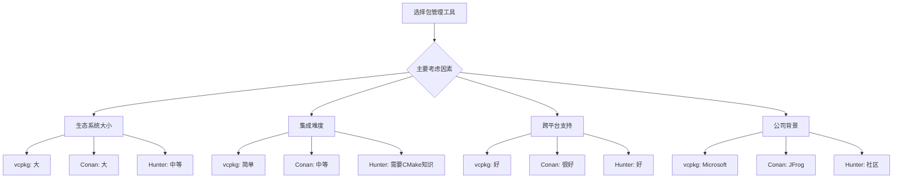

# C++ 包管理

## 什么是包管理？

包管理是一种用于自动化安装、升级、配置和删除软件包的工具系统。在C++的世界里，包管理器帮助开发者处理项目所需的外部库和依赖关系，使得团队成员可以更容易地共享代码和保持一致的开发环境。

:::note
在其他编程语言如Python (pip)、Node.js (npm)、Rust (cargo)中，包管理器已经成为标准配置。而C++在这方面的发展相对较晚，但近年来已经有了很大进步。
:::

## 为什么C++需要包管理？

想象一下，你正在开发一个需要使用多个第三方库的C++项目：

1. 没有包管理器时，你需要：
   - 手动下载每个库
   - 按照各自的文档进行编译
   - 配置链接路径
   - 处理版本兼容性问题
   - 为不同操作系统重复这些步骤

2. 有了包管理器后：
   ```bash
   # 安装依赖只需一个命令
   conan install boost/1.79.0
   ```

## 主流的C++包管理工具

### 1. Conan

Conan是目前最受欢迎的C++包管理器之一，由JFrog支持。

#### 基本使用流程

1. 安装Conan:
   ```bash
   pip install conan
   ```

2. 创建`conanfile.txt`文件:
   ```ini
   [requires]
   boost/1.79.0
   poco/1.9.4

   [generators]
   cmake
   ```

3. 安装依赖:
   ```bash
   mkdir build && cd build
   conan install ..
   ```

4. 在CMake中使用:
   ```cmake
   include(${CMAKE_BINARY_DIR}/conanbuildinfo.cmake)
   conan_basic_setup()

   add_executable(myapp main.cpp)
   target_link_libraries(myapp ${CONAN_LIBS})
   ```

### 2. vcpkg

由Microsoft开发的开源包管理器，与Visual Studio和CMake集成良好。

#### 基本使用流程

1. 安装vcpkg:
   ```bash
   git clone https://github.com/Microsoft/vcpkg.git
   cd vcpkg
   ./bootstrap-vcpkg.sh  # Linux/macOS
   # 或
   bootstrap-vcpkg.bat  # Windows
   ```

2. 安装库:
   ```bash
   ./vcpkg install boost
   ```

3. 在CMake中使用:
   ```cmake
   # 使用vcpkg的toolchain文件
   cmake -B build -S . -DCMAKE_TOOLCHAIN_FILE=[path to vcpkg]/scripts/buildsystems/vcpkg.cmake
   ```

### 3. Hunter

基于CMake的包管理器，无需额外安装步骤。

#### 基本使用流程

```cmake
include("cmake/HunterGate.cmake")
HunterGate(
    URL "https://github.com/cpp-pm/hunter/archive/v0.23.304.tar.gz"
    SHA1 "904195d54b1ad94f70cdd0ee90985c44e741ace2"
)

hunter_add_package(Boost COMPONENTS system filesystem)
find_package(Boost CONFIG REQUIRED system filesystem)

add_executable(myapp main.cpp)
target_link_libraries(myapp Boost::system Boost::filesystem)
```

## 比较各种包管理工具



## 实际案例：使用Conan创建一个简单的HTTP客户端

让我们创建一个使用`cpp-httplib`库的简单HTTP客户端。

1. 首先创建`conanfile.txt`:
   ```ini
   [requires]
   cpp-httplib/0.10.5

   [generators]
   cmake
   ```

2. 创建`CMakeLists.txt`:
   ```cmake
   cmake_minimum_required(VERSION 3.15)
   project(http_client)

   include(${CMAKE_BINARY_DIR}/conanbuildinfo.cmake)
   conan_basic_setup()

   add_executable(http_client main.cpp)
   target_link_libraries(http_client ${CONAN_LIBS})
   ```

3. 创建`main.cpp`:
   ```cpp
   #include <httplib.h>
   #include <iostream>

   int main() {
       httplib::Client cli("example.com");

       if (auto res = cli.Get("/")) {
           if (res->status == 200) {
               std::cout << "Response body: " << res->body << std::endl;
           } else {
               std::cout << "Error status: " << res->status << std::endl;
           }
       } else {
           auto err = res.error();
           std::cout << "Error: " << httplib::to_string(err) << std::endl;
       }

       return 0;
   }
   ```

4. 构建和运行:
   ```bash
   mkdir build && cd build
   conan install ..
   cmake ..
   make
   ./http_client
   ```

输出:
```
Response body: <!doctype html>
<html>
<head>
    <title>Example Domain</title>
    ...
</html>
```

## 最佳实践

### 1. 版本锁定

始终指定依赖的精确版本，以确保构建的可重复性：

```ini
# 在conanfile.txt中
[requires]
boost/1.79.0
poco/1.9.4
```

### 2. 保持依赖最小化

只包含你真正需要的库，减少构建时间和二进制大小。

### 3. 集成到CI/CD管道中

```yaml
# 示例GitHub Actions工作流
jobs:
  build:
    runs-on: ubuntu-latest
    steps:
      - uses: actions/checkout@v2
      - name: Install Conan
        run: pip install conan
      - name: Install dependencies
        run: |
          mkdir build
          cd build
          conan install ..
      - name: Build
        run: |
          cd build
          cmake ..
          make
```

### 4. 创建自己的包

当你需要在多个项目之间共享代码时，可以考虑创建自己的包。

## 常见问题与解决方案

### 1. 冲突的依赖版本

:::caution
当不同的库依赖同一个库的不同版本时，可能会出现冲突。
:::

解决方案：
- 使用包管理器的冲突解决策略
- 在Conan中，可以使用`[options]`节区指定库的特定配置

### 2. 平台特定的问题

某些库在不同操作系统上可能有不同的依赖或编译要求。

解决方案：
- 使用条件依赖
- 在CI中测试多种平台

## 总结

C++包管理虽然相对较新，但已经成为现代C++项目开发的重要工具：

- **简化依赖管理**：自动处理下载、编译和链接
- **提高可重复性**：确保所有开发者使用相同的依赖版本
- **加速开发**：减少搭建环境的时间
- **提供跨平台支持**：处理不同平台的差异

选择最适合你项目的包管理器（Conan、vcpkg或Hunter）将大大简化你的C++开发体验。

## 延伸学习

想要深入了解C++包管理，可以探索以下资源：

1. [Conan官方文档](https://docs.conan.io/)
2. [vcpkg官方文档](https://vcpkg.io/en/docs/index.html)
3. [Hunter GitHub文档](https://github.com/cpp-pm/hunter)

## 练习

1. 使用Conan或vcpkg安装并使用一个流行的C++库（如Boost、OpenCV或gRPC）。
2. 创建一个依赖多个外部库的小型项目。
3. 尝试为你自己的库创建一个Conan包。
4. 比较在同一项目上使用不同包管理器的体验。

通过这些实践，你将能够掌握C++包管理工具，并在你的项目中高效地使用它们。