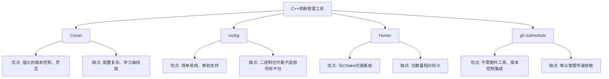

# C++ 依赖管理

在现代C++开发中，几乎没有项目是完全独立的。我们通常需要依赖各种第三方库来实现功能，比如使用JSON库处理数据，使用网络库进行通信，或者使用图形库创建用户界面。但是，如何有效地管理这些依赖一直是C++开发中的一大挑战。本文将带你了解C++依赖管理的基础知识、常用工具及最佳实践。

## 什么是依赖管理？

依赖管理是指在软件开发过程中，处理项目所依赖的外部代码库的过程，包括获取、编译、链接和更新这些库。

:::note
在C++中，一个"依赖"通常指的是你的项目使用的第三方库或框架。
:::

## 为什么C++依赖管理很复杂？

与Python、JavaScript等语言相比，C++依赖管理面临以下特有挑战：

1. **无标准包管理器**：C++没有像npm(JavaScript)或pip(Python)那样的官方包管理器
2. **跨平台编译**：C++代码通常需要在不同操作系统上编译
3. **ABI兼容性**：不同编译器、不同版本编译出的库可能无法互相使用
4. **构建系统多样性**：CMake、Make、Visual Studio、Bazel等多种构建系统并存
5. **头文件与库文件分离**：需要同时管理头文件和二进制库文件

## C++ 依赖管理的常见方法

### 1. 手动管理

最原始的方法是手动下载、编译和设置第三方库：

```bash
# 下载
git clone https://github.com/example/library.git

# 编译
cd library
mkdir build && cd build
cmake ..
make

# 安装（可能需要管理员权限）
make install
```

然后在你的CMakeLists.txt中：

```cmake
find_package(Library REQUIRED)
target_link_libraries(your_project PRIVATE Library)
```

:::caution
手动管理依赖对于小项目可行，但随着项目规模增大或依赖数量增加，这种方法会变得极其繁琐和易出错。
:::

### 2. 子模块方式

Git子模块允许你在一个Git仓库中包含其他Git仓库：

```bash
# 添加子模块
git submodule add https://github.com/example/library.git external/library

# 初始化和更新子模块
git submodule update --init --recursive
```

在CMake中：

```cmake
add_subdirectory(external/library)
target_link_libraries(your_project PRIVATE library)
```

### 3. 使用包管理工具

现在有多种C++包管理工具可以简化依赖管理：

#### Conan

[Conan](https://conan.io/)是一个分布式、开源的C/C++包管理器，设计用于帮助开发者管理依赖。

**安装Conan**:

```bash
pip install conan
```

**创建conanfile.txt**:

```
[requires]
fmt/8.1.1
nlohmann_json/3.10.5

[generators]
cmake
```

**使用Conan安装依赖**:

```bash
mkdir build && cd build
conan install ..
```

**在CMakeLists.txt中使用**:

```cmake
include(${CMAKE_BINARY_DIR}/conanbuildinfo.cmake)
conan_basic_setup()

add_executable(example main.cpp)
target_link_libraries(example ${CONAN_LIBS})
```

#### vcpkg

Microsoft开发的[vcpkg](https://github.com/microsoft/vcpkg)是另一个流行的选择。

**安装vcpkg**:

```bash
# Windows (PowerShell)
git clone https://github.com/microsoft/vcpkg
cd vcpkg
.\bootstrap-vcpkg.bat

# Linux/macOS
git clone https://github.com/microsoft/vcpkg
cd vcpkg
./bootstrap-vcpkg.sh
```

**安装库**:

```bash
./vcpkg install fmt nlohmann-json
```

**在CMake中使用**:

```cmake
# 设置vcpkg工具链文件
set(CMAKE_TOOLCHAIN_FILE "[path to vcpkg]/scripts/buildsystems/vcpkg.cmake")

find_package(fmt CONFIG REQUIRED)
find_package(nlohmann_json CONFIG REQUIRED)

add_executable(example main.cpp)
target_link_libraries(example PRIVATE fmt::fmt nlohmann_json::nlohmann_json)
```

#### Hunter

[Hunter](https://github.com/ruslo/hunter)是一个完全基于CMake的跨平台包管理器。

**在CMakeLists.txt中使用**:

```cmake
include("cmake/HunterGate.cmake")
HunterGate(
    URL "https://github.com/cpp-pm/hunter/archive/v0.23.251.tar.gz"
    SHA1 "5659b15dc0884d4b03dbd95710e6a1fa0fc3258d"
)

hunter_add_package(fmt)
hunter_add_package(nlohmann_json)

find_package(fmt CONFIG REQUIRED)
find_package(nlohmann_json CONFIG REQUIRED)

add_executable(example main.cpp)
target_link_libraries(example PRIVATE fmt::fmt nlohmann_json::nlohmann_json)
```

## 实际案例：使用Conan管理依赖

让我们通过一个实际例子来看看如何使用Conan管理C++项目的依赖。假设我们想创建一个简单的HTTP客户端，需要使用[cpr](https://github.com/whoshuu/cpr)库和[nlohmann_json](https://github.com/nlohmann/json)库。

### 步骤1：创建项目结构

```
http_client/
├── src/
│   ├── main.cpp
│   └── http_client.cpp
├── include/
│   └── http_client.h
├── CMakeLists.txt
└── conanfile.txt
```

### 步骤2：创建conanfile.txt

```
[requires]
cpr/1.8.3
nlohmann_json/3.11.2

[generators]
cmake_find_package
cmake_paths
```

### 步骤3：编写CMakeLists.txt

```cmake
cmake_minimum_required(VERSION 3.15)
project(http_client VERSION 0.1.0)

set(CMAKE_CXX_STANDARD 17)
set(CMAKE_CXX_STANDARD_REQUIRED ON)

include(${CMAKE_BINARY_DIR}/conan_paths.cmake)

find_package(cpr REQUIRED)
find_package(nlohmann_json REQUIRED)

add_executable(http_client src/main.cpp src/http_client.cpp)
target_include_directories(http_client PRIVATE include)
target_link_libraries(http_client PRIVATE cpr::cpr nlohmann_json::nlohmann_json)
```

### 步骤4：编写代码

**include/http_client.h**:
```cpp
#pragma once
#include <string>
#include <nlohmann/json.hpp>

class HttpClient {
public:
    nlohmann::json get(const std::string& url);
};
```

**src/http_client.cpp**:
```cpp
#include "http_client.h"
#include <cpr/cpr.h>

nlohmann::json HttpClient::get(const std::string& url) {
    cpr::Response r = cpr::Get(cpr::Url{url});
    return nlohmann::json::parse(r.text);
}
```

**src/main.cpp**:
```cpp
#include <iostream>
#include "http_client.h"

int main() {
    HttpClient client;
    try {
        auto data = client.get("https://jsonplaceholder.typicode.com/todos/1");
        std::cout << "Title: " << data["title"] << std::endl;
        std::cout << "Completed: " << (data["completed"].get<bool>() ? "Yes" : "No") << std::endl;
    } catch (const std::exception& e) {
        std::cerr << "Error: " << e.what() << std::endl;
        return 1;
    }
    return 0;
}
```

### 步骤5：构建项目

```bash
mkdir build && cd build
conan install ..
cmake ..
cmake --build .
```

### 步骤6：运行程序

```bash
./http_client
```

**输出**:
```
Title: delectus aut autem
Completed: No
```

## 依赖管理最佳实践

1. **一致性优先**：选择一种依赖管理方式并在整个项目中保持一致

2. **依赖锁定**：记录精确的依赖版本，确保构建的可重现性

3. **最小化依赖**：只引入真正必要的依赖，减少项目复杂性

4. **依赖隔离**：使用接口隔离外部依赖，便于将来替换

5. **自动化构建**：设置CI/CD管道，确保依赖在不同环境下都能正常工作

6. **考虑许可证**：了解所使用依赖的许可证条款，避免法律风险

## 依赖管理工具比较

以下是几种流行C++依赖管理工具的简要比较：



## 总结

C++依赖管理虽然复杂，但通过使用现代工具如Conan、vcpkg或Hunter，可以大大简化这一过程。随着项目规模增长，良好的依赖管理实践将帮助你维持代码质量，提高开发效率。

选择哪种依赖管理工具取决于你的具体需求：

- **Conan**：适合大型项目和需要精细控制的场景
- **vcpkg**：适合Windows开发者或需要简单设置的场景
- **Hunter**：适合喜欢纯CMake解决方案的开发者
- **Git子模块**：适合依赖少且希望完全掌控源码的项目

无论选择哪种方式，重要的是在项目中保持一致，并建立良好的依赖管理习惯。

## 进一步学习资源

- [Conan官方文档](https://docs.conan.io/)
- [vcpkg GitHub仓库](https://github.com/microsoft/vcpkg)
- [Hunter文档](https://hunter.readthedocs.io/)
- [Modern CMake指南](https://cliutils.gitlab.io/modern-cmake/)
- [C++ Weekly - Jason Turner关于依赖管理的视频](https://www.youtube.com/c/JasonTurner-lefticus)

## 练习

1. 使用Conan创建一个简单的项目，它依赖fmt库来格式化输出
2. 尝试使用vcpkg安装并链接SQLite库
3. 将一个使用手动管理依赖的现有项目转换为使用包管理器
4. 创建一个使用多个依赖的项目，并比较使用不同依赖管理工具的体验

通过这些练习，你将获得实用的依赖管理经验，为更大的C++项目做好准备。