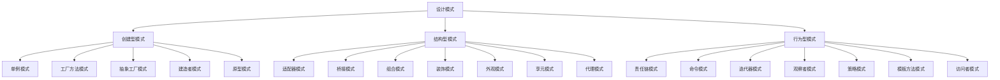

# C++ 设计模式概述

## 什么是设计模式？

设计模式是软件开发过程中针对特定问题的通用解决方案。它们代表了经验丰富的软件开发人员在解决常见软件设计问题时积累的最佳实践。设计模式不是现成的代码，而是代码设计的模板，可以在不同的场景中进行调整和应用。

:::tip
设计模式可以看作是建筑领域的"蓝图"，提供解决特定设计问题的通用方法，但需要根据具体情况进行调整和实现。
:::

## 为什么学习设计模式？

学习设计模式有以下几个重要原因：

1. **复用成功的解决方案**：避免重复发明轮子
2. **提高代码质量**：遵循设计模式往往能产生更易维护的代码
3. **促进团队沟通**：设计模式提供了通用词汇，便于开发者交流
4. **解决复杂问题**：提供处理复杂系统设计的思路
5. **适应变化**：良好的设计模式可以使系统更容易适应需求变化

## 设计模式的类型

设计模式通常分为三大类：



### 1. 创建型模式（Creational Patterns）

创建型模式关注对象的创建机制，试图根据实际情况使用合适的方式创建对象。这些模式通过以某种方式控制对象的创建来解决问题。

主要的创建型模式包括：
- 单例模式（Singleton）
- 工厂方法模式（Factory Method）
- 抽象工厂模式（Abstract Factory）
- 建造者模式（Builder）
- 原型模式（Prototype）

### 2. 结构型模式（Structural Patterns）

结构型模式关注如何将类和对象组合成更大的结构，同时保持这些结构的灵活和高效。

主要的结构型模式包括：
- 适配器模式（Adapter）
- 桥接模式（Bridge）
- 组合模式（Composite）
- 装饰模式（Decorator）
- 外观模式（Facade）
- 享元模式（Flyweight）
- 代理模式（Proxy）

### 3. 行为型模式（Behavioral Patterns）

行为型模式关注对象之间的通信，以及对象之间的责任分配。

主要的行为型模式包括：
- 责任链模式（Chain of Responsibility）
- 命令模式（Command）
- 迭代器模式（Iterator）
- 中介者模式（Mediator）
- 观察者模式（Observer）
- 策略模式（Strategy）
- 模板方法模式（Template Method）
- 访问者模式（Visitor）

## 设计模式示例：单例模式

让我们通过一个简单的示例来了解单例模式，这是最基础也是应用最广泛的设计模式之一。

### 单例模式概念

单例模式确保一个类只有一个实例，并提供一个全局访问点来访问该实例。

### C++ 实现单例模式

```cpp
class Singleton {
private:
    // 私有构造函数，防止外部创建对象
    Singleton() {
        std::cout << "构造单例对象" << std::endl;
    }
    
    // 禁止拷贝构造和赋值
    Singleton(const Singleton&) = delete;
    Singleton& operator=(const Singleton&) = delete;
    
    // 保存唯一实例
    static Singleton* instance;
    
public:
    // 获取单例实例的全局访问点
    static Singleton* getInstance() {
        if (instance == nullptr) {
            instance = new Singleton();
        }
        return instance;
    }
    
    void showMessage() {
        std::cout << "你好，我是单例对象！" << std::endl;
    }
};

// 初始化静态成员
Singleton* Singleton::instance = nullptr;
```

### 使用单例模式

```cpp
#include <iostream>

// 单例类定义（如上）...

int main() {
    // 错误：不能直接创建对象
    // Singleton singleton = Singleton(); // 编译错误
    
    // 正确：通过静态方法获取实例
    Singleton* singleton = Singleton::getInstance();
    singleton->showMessage();
    
    // 再次获取实例（将返回同一个实例）
    Singleton* anotherSingleton = Singleton::getInstance();
    
    // 验证是否为同一实例
    std::cout << "两个指针指向同一个对象吗？ " 
              << (singleton == anotherSingleton ? "是" : "否") << std::endl;
              
    return 0;
}
```

### 输出结果

```
构造单例对象
你好，我是单例对象！
两个指针指向同一个对象吗？ 是
```

:::caution
上面的单例实现不是线程安全的。在多线程环境中，应使用更复杂的实现方式，如双重检查锁定（Double-Checked Locking）或C++11的局部静态变量实现。
:::

## 设计模式应用实例

### 现实案例：日志系统

假设我们正在开发一个应用程序，需要一个日志系统记录操作和错误。这个日志系统应该在整个应用程序中只有一个实例，以确保所有日志按顺序写入同一文件。这是单例模式的典型用例。

```cpp
#include <iostream>
#include <fstream>
#include <string>
#include <mutex>

class Logger {
private:
    static Logger* instance;
    static std::mutex mutex_;
    std::ofstream logFile;
    
    // 私有构造函数
    Logger() {
        logFile.open("application.log", std::ios::app);
    }
    
    // 禁止拷贝和赋值
    Logger(const Logger&) = delete;
    Logger& operator=(const Logger&) = delete;
    
public:
    ~Logger() {
        if (logFile.is_open()) {
            logFile.close();
        }
    }
    
    static Logger* getInstance() {
        std::lock_guard<std::mutex> lock(mutex_);
        if (instance == nullptr) {
            instance = new Logger();
        }
        return instance;
    }
    
    void log(const std::string& message) {
        std::lock_guard<std::mutex> lock(mutex_);
        if (logFile.is_open()) {
            logFile << message << std::endl;
            std::cout << "日志记录: " << message << std::endl;
        }
    }
};

// 初始化静态成员
Logger* Logger::instance = nullptr;
std::mutex Logger::mutex_;

// 应用程序中使用日志
int main() {
    // 在不同的地方获取相同的日志实例
    Logger::getInstance()->log("程序启动");
    
    // 模拟其他模块使用日志
    Logger::getInstance()->log("用户登录");
    Logger::getInstance()->log("数据库操作完成");
    Logger::getInstance()->log("程序关闭");
    
    return 0;
}
```

### 工厂模式应用：图形编辑器

工厂模式适用于需要创建不同但相关类对象的情况，例如图形编辑器中创建不同类型的图形。

```cpp
#include <iostream>
#include <string>
#include <memory>

// 抽象图形类
class Shape {
public:
    virtual void draw() = 0;
    virtual ~Shape() {}
};

// 具体图形类 - 圆形
class Circle : public Shape {
public:
    void draw() override {
        std::cout << "画一个圆形" << std::endl;
    }
};

// 具体图形类 - 矩形
class Rectangle : public Shape {
public:
    void draw() override {
        std::cout << "画一个矩形" << std::endl;
    }
};

// 具体图形类 - 三角形
class Triangle : public Shape {
public:
    void draw() override {
        std::cout << "画一个三角形" << std::endl;
    }
};

// 图形工厂
class ShapeFactory {
public:
    std::unique_ptr<Shape> createShape(const std::string& shapeType) {
        if (shapeType == "CIRCLE") {
            return std::make_unique<Circle>();
        } else if (shapeType == "RECTANGLE") {
            return std::make_unique<Rectangle>();
        } else if (shapeType == "TRIANGLE") {
            return std::make_unique<Triangle>();
        }
        return nullptr;
    }
};

// 使用工厂模式
int main() {
    ShapeFactory factory;
    
    // 创建并绘制不同的图形
    auto circle = factory.createShape("CIRCLE");
    if (circle) circle->draw();
    
    auto rectangle = factory.createShape("RECTANGLE");
    if (rectangle) rectangle->draw();
    
    auto triangle = factory.createShape("TRIANGLE");
    if (triangle) triangle->draw();
    
    return 0;
}
```

输出结果：
```
画一个圆形
画一个矩形
画一个三角形
```

## 设计模式的原则

在学习和应用设计模式时，了解以下设计原则很重要：

1. **单一责任原则（SRP）**：一个类应该只有一个引起它变化的原因
2. **开闭原则（OCP）**：软件实体应该对扩展开放，对修改关闭
3. **里氏替换原则（LSP）**：子类对象应该能够替换其父类对象而不影响程序正确性
4. **接口隔离原则（ISP）**：不应该强迫客户依赖于他们不使用的方法
5. **依赖倒置原则（DIP）**：高层模块不应该依赖于低层模块，两者都应该依赖于抽象

这些原则通常被称为SOLID原则，是面向对象设计的基础。良好的设计模式应该遵循这些原则。

## 如何选择合适的设计模式

选择设计模式时，应考虑以下几点：

1. **明确问题**：首先要清楚地理解你要解决的问题
2. **考虑各种备选方案**：不要急于应用设计模式，考虑简单解决方案
3. **研究模式的意图**：了解每种设计模式的主要目的和适用场景
4. **考虑上下文**：考虑系统的其他部分如何与该模式交互
5. **权衡利弊**：设计模式有时会增加复杂性，需要评估成本和收益

:::warning
过度使用设计模式可能导致代码不必要的复杂化。只有当问题真正需要某种模式时才应用它。
:::

## 总结

设计模式是软件开发中解决特定问题的通用解决方案。它们可以分为创建型、结构型和行为型三大类，每一类都包含多种具体的模式。学习设计模式可以帮助我们写出更高质量的代码、更好地理解已有的代码，并促进开发者之间的沟通。

然而，设计模式并不是银弹，它们只是工具。在实际开发中，应该根据具体问题选择合适的模式，避免过度设计和不必要的复杂性。最重要的是理解每种模式背后的原理和应用场景，灵活运用而不是生搬硬套。

## 学习资源与练习

### 推荐书籍
- 《设计模式：可复用面向对象软件的基础》(Gang of Four)
- 《Head First 设计模式》
- 《Effective C++》与《More Effective C++》(Scott Meyers)

### 练习
1. 实现线程安全的单例模式（使用C++11特性）
2. 为一个简单的计算器应用实现策略模式，支持加减乘除操作
3. 使用观察者模式实现一个简单的事件通知系统
4. 为文件操作实现装饰器模式，添加额外功能如压缩、加密等
5. 使用工厂模式设计一个游戏中的怪物生成系统

通过实践这些设计模式，你会更深入地理解它们的原理和应用，为未来的软件开发打下坚实的基础。