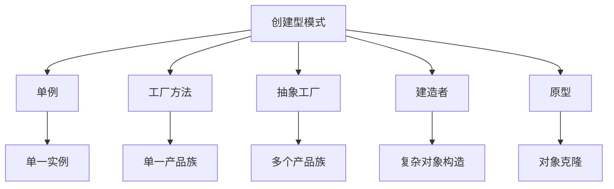

# C++ 创建型模式

## 什么是创建型模式？

创建型模式是设计模式中的一个重要类别，主要关注如何创建对象。这些模式旨在通过封装对象的实例化过程，使系统独立于对象的创建、组合和表示方式。当系统需要与对象的创建、组合和表示分离时，创建型模式特别有用。

:::tip 为什么学习创建型模式？
创建型模式可以帮助我们将系统与对象的创建过程解耦，提供更大的灵活性，并使代码更易于维护和扩展。
:::

在C++中，常见的创建型模式包括：

1. 单例模式 (Singleton Pattern)
2. 工厂方法模式 (Factory Method Pattern)
3. 抽象工厂模式 (Abstract Factory Pattern)
4. 建造者模式 (Builder Pattern)
5. 原型模式 (Prototype Pattern)

让我们一一探索这些模式。

## 单例模式 (Singleton Pattern)

### 基本概念

单例模式确保一个类只有一个实例，并提供一个全局访问点来访问该实例。这在需要协调整个系统行为的场景中非常有用。

### 实现方式

下面是一个线程安全的现代C++单例模式实现：

```cpp
class Singleton {
private:
    Singleton() {
        std::cout << "单例被创建" << std::endl;
    }

    Singleton(const Singleton&) = delete;
    Singleton& operator=(const Singleton&) = delete;

public:
    static Singleton& getInstance() {
        static Singleton instance;
        return instance;
    }

    void someBusinessLogic() {
        std::cout << "执行业务逻辑" << std::endl;
    }
};
```

### 使用示例

```cpp
#include <iostream>

int main() {
    // 获取单例实例
    Singleton& singleton = Singleton::getInstance();
    
    // 使用单例
    singleton.someBusinessLogic();
    
    // 再次获取单例（仍然是同一个实例）
    Singleton& anotherReference = Singleton::getInstance();
    
    // 验证是同一个实例
    std::cout << "两个引用是否指向同一个实例: " 
              << (&singleton == &anotherReference ? "是" : "否") << std::endl;
    
    return 0;
}
```

**输出：**
```
单例被创建
执行业务逻辑
两个引用是否指向同一个实例: 是
```

### 实际应用场景

- 配置管理器：应用程序通常需要一个统一的配置管理器
- 数据库连接池：管理和限制数据库连接数量
- 日志系统：提供一个全局访问点进行日志记录

## 工厂方法模式 (Factory Method Pattern)

### 基本概念

工厂方法模式定义了一个用于创建对象的接口，但让子类决定实例化哪一个类。工厂方法让类的实例化延迟到子类中进行。

### 实现示例

```cpp
#include <iostream>
#include <string>
#include <memory>

// 产品接口
class Product {
public:
    virtual ~Product() {}
    virtual std::string operation() const = 0;
};

// 具体产品A
class ConcreteProductA : public Product {
public:
    std::string operation() const override {
        return "ConcreteProductA的结果";
    }
};

// 具体产品B
class ConcreteProductB : public Product {
public:
    std::string operation() const override {
        return "ConcreteProductB的结果";
    }
};

// 创建者抽象类
class Creator {
public:
    virtual ~Creator() {}
    
    // 工厂方法
    virtual std::unique_ptr<Product> factoryMethod() const = 0;
    
    // 使用产品的业务逻辑
    std::string someOperation() const {
        std::unique_ptr<Product> product = this->factoryMethod();
        return "Creator: 与 " + product->operation() + " 一起工作";
    }
};

// 具体创建者A
class ConcreteCreatorA : public Creator {
public:
    std::unique_ptr<Product> factoryMethod() const override {
        return std::make_unique<ConcreteProductA>();
    }
};

// 具体创建者B
class ConcreteCreatorB : public Creator {
public:
    std::unique_ptr<Product> factoryMethod() const override {
        return std::make_unique<ConcreteProductB>();
    }
};
```

### 使用示例

```cpp
void clientCode(const Creator& creator) {
    std::cout << "客户端代码: " << creator.someOperation() << std::endl;
}

int main() {
    std::cout << "使用ConcreteCreatorA:" << std::endl;
    ConcreteCreatorA creatorA;
    clientCode(creatorA);
    
    std::cout << "\n使用ConcreteCreatorB:" << std::endl;
    ConcreteCreatorB creatorB;
    clientCode(creatorB);
    
    return 0;
}
```

**输出：**
```
使用ConcreteCreatorA:
客户端代码: Creator: 与 ConcreteProductA的结果 一起工作

使用ConcreteCreatorB:
客户端代码: Creator: 与 ConcreteProductB的结果 一起工作
```

### 实际应用场景

- UI框架：根据不同平台创建适当的UI元素
- 数据访问层：根据配置创建特定的数据访问对象
- 插件系统：动态加载和创建不同类型的插件

## 抽象工厂模式 (Abstract Factory Pattern)

### 基本概念

抽象工厂模式提供一个接口，用于创建一系列相关或依赖对象的家族，而不指定它们具体的类。

### 实现示例

```cpp
#include <iostream>
#include <memory>

// 抽象产品A
class AbstractProductA {
public:
    virtual ~AbstractProductA() {}
    virtual std::string usefulFunctionA() const = 0;
};

// 具体产品A1
class ConcreteProductA1 : public AbstractProductA {
public:
    std::string usefulFunctionA() const override {
        return "产品A1的结果";
    }
};

// 具体产品A2
class ConcreteProductA2 : public AbstractProductA {
public:
    std::string usefulFunctionA() const override {
        return "产品A2的结果";
    }
};

// 抽象产品B
class AbstractProductB {
public:
    virtual ~AbstractProductB() {}
    virtual std::string usefulFunctionB() const = 0;
    virtual std::string anotherUsefulFunctionB(const AbstractProductA& collaborator) const = 0;
};

// 具体产品B1
class ConcreteProductB1 : public AbstractProductB {
public:
    std::string usefulFunctionB() const override {
        return "产品B1的结果";
    }
    
    std::string anotherUsefulFunctionB(const AbstractProductA& collaborator) const override {
        const std::string result = collaborator.usefulFunctionA();
        return "B1与(" + result + ")协作的结果";
    }
};

// 具体产品B2
class ConcreteProductB2 : public AbstractProductB {
public:
    std::string usefulFunctionB() const override {
        return "产品B2的结果";
    }
    
    std::string anotherUsefulFunctionB(const AbstractProductA& collaborator) const override {
        const std::string result = collaborator.usefulFunctionA();
        return "B2与(" + result + ")协作的结果";
    }
};

// 抽象工厂接口
class AbstractFactory {
public:
    virtual ~AbstractFactory() {};
    virtual std::unique_ptr<AbstractProductA> createProductA() const = 0;
    virtual std::unique_ptr<AbstractProductB> createProductB() const = 0;
};

// 具体工厂1
class ConcreteFactory1 : public AbstractFactory {
public:
    std::unique_ptr<AbstractProductA> createProductA() const override {
        return std::make_unique<ConcreteProductA1>();
    }
    
    std::unique_ptr<AbstractProductB> createProductB() const override {
        return std::make_unique<ConcreteProductB1>();
    }
};

// 具体工厂2
class ConcreteFactory2 : public AbstractFactory {
public:
    std::unique_ptr<AbstractProductA> createProductA() const override {
        return std::make_unique<ConcreteProductA2>();
    }
    
    std::unique_ptr<AbstractProductB> createProductB() const override {
        return std::make_unique<ConcreteProductB2>();
    }
};
```

### 使用示例

```cpp
void clientCode(const AbstractFactory& factory) {
    auto productA = factory.createProductA();
    auto productB = factory.createProductB();
    
    std::cout << productB->usefulFunctionB() << std::endl;
    std::cout << productB->anotherUsefulFunctionB(*productA) << std::endl;
}

int main() {
    std::cout << "客户端使用工厂类型1：" << std::endl;
    ConcreteFactory1 factory1;
    clientCode(factory1);
    
    std::cout << std::endl;
    
    std::cout << "客户端使用工厂类型2：" << std::endl;
    ConcreteFactory2 factory2;
    clientCode(factory2);
    
    return 0;
}
```

**输出：**
```
客户端使用工厂类型1：
产品B1的结果
B1与(产品A1的结果)协作的结果

客户端使用工厂类型2：
产品B2的结果
B2与(产品A2的结果)协作的结果
```

### 实际应用场景

- 跨平台UI开发：为不同操作系统创建一套视觉上相似的UI元素
- 数据库访问层：支持多种数据库系统，如MySQL、Oracle等
- 主题系统：在应用中实现不同的视觉主题

## 建造者模式 (Builder Pattern)

### 基本概念

建造者模式将复杂对象的构建与其表示分离，使得同样的构建过程可以创建不同的表示。

### 实现示例

```cpp
#include <iostream>
#include <string>
#include <vector>

// 产品类
class Product {
public:
    std::vector<std::string> parts;
    
    void listParts() const {
        std::cout << "产品部件: ";
        for (const auto& part : parts) {
            if (part == parts.back()) {
                std::cout << part;
            } else {
                std::cout << part << ", ";
            }
        }
        std::cout << std::endl;
    }
};

// 建造者接口
class Builder {
public:
    virtual ~Builder() {}
    virtual void producePartA() = 0;
    virtual void producePartB() = 0;
    virtual void producePartC() = 0;
};

// 具体建造者
class ConcreteBuilder : public Builder {
private:
    Product product;
    
public:
    ConcreteBuilder() {
        this->reset();
    }
    
    void reset() {
        product = Product();
    }
    
    void producePartA() override {
        product.parts.push_back("部件A");
    }
    
    void producePartB() override {
        product.parts.push_back("部件B");
    }
    
    void producePartC() override {
        product.parts.push_back("部件C");
    }
    
    Product getProduct() {
        Product result = this->product;
        this->reset();
        return result;
    }
};

// 指导者
class Director {
private:
    Builder* builder;
    
public:
    void setBuilder(Builder* builder) {
        this->builder = builder;
    }
    
    void buildMinimalViableProduct() {
        this->builder->producePartA();
    }
    
    void buildFullFeaturedProduct() {
        this->builder->producePartA();
        this->builder->producePartB();
        this->builder->producePartC();
    }
};
```

### 使用示例

```cpp
int main() {
    Director director;
    ConcreteBuilder builder;
    director.setBuilder(&builder);
    
    std::cout << "基本产品：" << std::endl;
    director.buildMinimalViableProduct();
    Product p = builder.getProduct();
    p.listParts();
    
    std::cout << "完整产品：" << std::endl;
    director.buildFullFeaturedProduct();
    p = builder.getProduct();
    p.listParts();
    
    // 无需指导者，自定义产品
    std::cout << "自定义产品：" << std::endl;
    builder.producePartA();
    builder.producePartC();
    p = builder.getProduct();
    p.listParts();
    
    return 0;
}
```

**输出：**
```
基本产品：
产品部件: 部件A
完整产品：
产品部件: 部件A, 部件B, 部件C
自定义产品：
产品部件: 部件A, 部件C
```

### 实际应用场景

- 构建复杂的文档对象：如HTML、PDF文档
- 配置对象创建：如网络连接配置
- 复杂对象初始化：如图形用户界面构建

## 原型模式 (Prototype Pattern)

### 基本概念

原型模式通过复制现有对象来创建新对象，而不是通过实例化类。当创建对象成本较高时，这种模式特别有用。

### 实现示例

```cpp
#include <iostream>
#include <string>
#include <memory>
#include <unordered_map>

// 抽象原型
class Prototype {
public:
    virtual ~Prototype() {}
    virtual std::unique_ptr<Prototype> clone() const = 0;
    virtual void display() const = 0;
};

// 具体原型1
class ConcretePrototype1 : public Prototype {
private:
    std::string field1;
    
public:
    ConcretePrototype1(std::string field) : field1(field) {}
    
    std::unique_ptr<Prototype> clone() const override {
        return std::make_unique<ConcretePrototype1>(*this);
    }
    
    void display() const override {
        std::cout << "具体原型1: " << field1 << std::endl;
    }
};

// 具体原型2
class ConcretePrototype2 : public Prototype {
private:
    std::string field2;
    
public:
    ConcretePrototype2(std::string field) : field2(field) {}
    
    std::unique_ptr<Prototype> clone() const override {
        return std::make_unique<ConcretePrototype2>(*this);
    }
    
    void display() const override {
        std::cout << "具体原型2: " << field2 << std::endl;
    }
};

// 原型管理器
class PrototypeManager {
private:
    std::unordered_map<std::string, std::unique_ptr<Prototype>> prototypes;
    
public:
    PrototypeManager() {}
    
    void addPrototype(const std::string& key, std::unique_ptr<Prototype> prototype) {
        prototypes[key] = std::move(prototype);
    }
    
    std::unique_ptr<Prototype> getClone(const std::string& key) {
        if (prototypes.find(key) != prototypes.end()) {
            return prototypes[key]->clone();
        }
        return nullptr;
    }
};
```

### 使用示例

```cpp
int main() {
    PrototypeManager manager;
    
    // 添加原型
    manager.addPrototype("prototype1", std::make_unique<ConcretePrototype1>("示例字段1"));
    manager.addPrototype("prototype2", std::make_unique<ConcretePrototype2>("示例字段2"));
    
    // 克隆原型
    auto clone1 = manager.getClone("prototype1");
    auto clone2 = manager.getClone("prototype2");
    
    // 显示克隆结果
    if (clone1) {
        clone1->display();
    }
    
    if (clone2) {
        clone2->display();
    }
    
    return 0;
}
```

**输出：**
```
具体原型1: 示例字段1
具体原型2: 示例字段2
```

### 实际应用场景

- 图形编辑器：复制现有图形对象
- 游戏开发：快速复制游戏对象（如敌人、道具）
- 对象缓存：缓存预配置的对象以便快速克隆

## 创建型模式之间的关系

创建型模式可以根据不同场景选择使用。下面是一个简单的对比：



## 如何选择合适的创建型模式？

- 需要确保只有一个实例？使用**单例模式**
- 需要将对象的创建与使用分离？使用**工厂方法模式**
- 需要创建一系列相关的对象家族？使用**抽象工厂模式**
- 需要分步骤构建复杂对象？使用**建造者模式**
- 需要基于现有对象创建新对象？使用**原型模式**

## 总结

创建型模式提供了不同的对象创建机制，能够增加代码的灵活性和可维护性。选择适当的创建型模式可以帮助您解决特定的设计问题，并改善代码结构。这些模式是面向对象设计原则的体现，掌握它们对于高质量的软件开发至关重要。

## 练习与深入学习

1. **练习题**：为一个简单的图形编辑器实现原型模式，允许用户复制不同类型的图形（圆形、矩形等）。
2. **练习题**：实现一个使用建造者模式的餐厅点餐系统，可以创建不同的套餐组合。
3. **练习题**：使用抽象工厂模式创建一个跨平台UI库，支持不同操作系统的按钮、文本框等控件。

## 附加资源

- 《设计模式：可复用面向对象软件的基础》- GoF (Gang of Four)
- 《Head First 设计模式》- Eric Freeman & Elisabeth Robson
- 《Modern C++ Design》- Andrei Alexandrescu

:::tip 学习建议
设计模式需要在实践中理解和运用。尝试在自己的项目中识别可以应用创建型模式的场景，并实际实现它们，这样可以加深对模式的理解。
:::