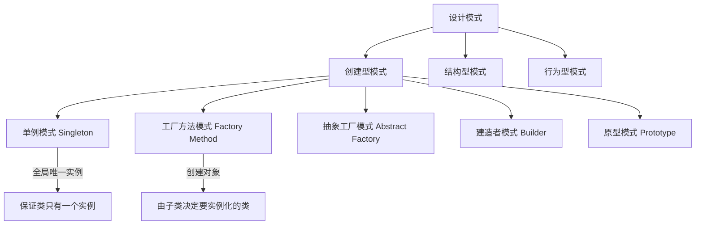

# C++ 单例模式实现

---
title: C++ 单例模式实现
description: 详细介绍C++单例设计模式的概念、实现方法、应用场景及注意事项。适合C++初学者学习单例模式的基础知识。
---

## 单例模式简介

单例模式（Singleton Pattern）是一种创建型设计模式，它保证一个类只有一个实例，并提供一个全局访问点来访问这个唯一实例。这对于需要协调整个系统行为的对象尤为重要，例如配置管理器、日志记录器或数据库连接池等。

### 单例模式的特点

- 确保类只有一个实例
- 提供对该实例的全局访问点
- 延迟初始化（通常在首次使用时创建）
- 控制实例的创建过程

## 单例模式的基本实现

### 最简单的单例模式

让我们从一个基本的单例模式实现开始：

```cpp
class Singleton {
private:
    // 私有构造函数，防止外部直接创建实例
    Singleton() {
        std::cout << "Singleton构造函数被调用" << std::endl;
    }
    
    // 禁止复制构造和赋值操作
    Singleton(const Singleton&) = delete;
    Singleton& operator=(const Singleton&) = delete;
    
    // 静态实例指针
    static Singleton* instance;
    
public:
    // 获取单例实例的静态方法
    static Singleton* getInstance() {
        if (instance == nullptr) {
            instance = new Singleton();
        }
        return instance;
    }
    
    // 业务方法示例
    void showMessage() {
        std::cout << "Hello from Singleton!" << std::endl;
    }
    
    // 析构函数
    ~Singleton() {
        std::cout << "Singleton析构函数被调用" << std::endl;
    }
};

// 静态成员变量初始化
Singleton* Singleton::instance = nullptr;
```

使用示例：

```cpp
#include <iostream>

int main() {
    // 获取单例实例
    Singleton* singleton = Singleton::getInstance();
    
    // 使用单例
    singleton->showMessage();
    
    // 再次获取单例（将返回相同实例）
    Singleton* anotherReference = Singleton::getInstance();
    
    // 验证是同一个实例
    std::cout << "是否是同一实例: " << (singleton == anotherReference) << std::endl;
    
    return 0;
}
```

输出结果：
```
Singleton构造函数被调用
Hello from Singleton!
是否是同一实例: 1
```

:::warning
上面的基本实现存在内存泄漏问题，因为我们创建了实例但从未释放它。此外，它在多线程环境下也不是安全的。
:::

## 单例模式的高级实现

### 懒汉式（延迟初始化）单例

懒汉式单例在第一次使用时才创建实例，以上面的例子为基础实现。

### 饿汉式（立即初始化）单例

饿汉式单例在程序启动时就创建实例：

```cpp
class EagerSingleton {
private:
    EagerSingleton() {
        std::cout << "EagerSingleton构造函数被调用" << std::endl;
    }
    
    EagerSingleton(const EagerSingleton&) = delete;
    EagerSingleton& operator=(const EagerSingleton&) = delete;
    
    // 在程序启动时静态初始化实例
    static EagerSingleton instance;
    
public:
    static EagerSingleton& getInstance() {
        return instance;
    }
    
    void showMessage() {
        std::cout << "Hello from EagerSingleton!" << std::endl;
    }
};

// 静态成员变量初始化
EagerSingleton EagerSingleton::instance;
```

### 线程安全的懒汉式单例

使用互斥锁来保证线程安全：

```cpp
#include <mutex>

class ThreadSafeSingleton {
private:
    ThreadSafeSingleton() {
        std::cout << "ThreadSafeSingleton构造函数被调用" << std::endl;
    }
    
    ThreadSafeSingleton(const ThreadSafeSingleton&) = delete;
    ThreadSafeSingleton& operator=(const ThreadSafeSingleton&) = delete;
    
    static ThreadSafeSingleton* instance;
    static std::mutex mutex;
    
public:
    static ThreadSafeSingleton* getInstance() {
        std::lock_guard<std::mutex> lock(mutex);
        if (instance == nullptr) {
            instance = new ThreadSafeSingleton();
        }
        return instance;
    }
    
    void showMessage() {
        std::cout << "Hello from ThreadSafeSingleton!" << std::endl;
    }
};

// 静态成员初始化
ThreadSafeSingleton* ThreadSafeSingleton::instance = nullptr;
std::mutex ThreadSafeSingleton::mutex;
```

### 双检锁机制（Double-Check Locking）

为了提高性能，我们可以使用双检锁机制减少锁的使用：

```cpp
class DoubleCheckSingleton {
private:
    DoubleCheckSingleton() {
        std::cout << "DoubleCheckSingleton构造函数被调用" << std::endl;
    }
    
    DoubleCheckSingleton(const DoubleCheckSingleton&) = delete;
    DoubleCheckSingleton& operator=(const DoubleCheckSingleton&) = delete;
    
    static DoubleCheckSingleton* instance;
    static std::mutex mutex;
    
public:
    static DoubleCheckSingleton* getInstance() {
        // 第一次检查
        if (instance == nullptr) {
            // 加锁
            std::lock_guard<std::mutex> lock(mutex);
            // 第二次检查
            if (instance == nullptr) {
                instance = new DoubleCheckSingleton();
            }
        }
        return instance;
    }
    
    void showMessage() {
        std::cout << "Hello from DoubleCheckSingleton!" << std::endl;
    }
};

DoubleCheckSingleton* DoubleCheckSingleton::instance = nullptr;
std::mutex DoubleCheckSingleton::mutex;
```

:::caution
双检锁在C++11之前可能存在内存重排序问题，导致在多线程环境下出现未定义行为。C++11后可使用`std::atomic`解决这个问题。
:::

### 使用局部静态变量的方法（C++11推荐）

C++11标准保证了局部静态变量的初始化是线程安全的，这是实现单例的最简洁方法：

```cpp
class ModernSingleton {
private:
    ModernSingleton() {
        std::cout << "ModernSingleton构造函数被调用" << std::endl;
    }
    
    ModernSingleton(const ModernSingleton&) = delete;
    ModernSingleton& operator=(const ModernSingleton&) = delete;
    
public:
    static ModernSingleton& getInstance() {
        // C++11保证这个局部静态变量的初始化是线程安全的
        static ModernSingleton instance;
        return instance;
    }
    
    void showMessage() {
        std::cout << "Hello from ModernSingleton!" << std::endl;
    }
};
```

使用示例：

```cpp
int main() {
    ModernSingleton& singleton = ModernSingleton::getInstance();
    singleton.showMessage();
    
    return 0;
}
```

输出：
```
ModernSingleton构造函数被调用
Hello from ModernSingleton!
```

## 单例模式的实际应用场景

单例模式在实际开发中有很多应用场景：

1. **配置管理器**：存储应用程序配置信息，需要在全局范围内访问。

```cpp
class ConfigManager {
private:
    ConfigManager() {
        // 从配置文件加载配置
        loadConfigFromFile("config.ini");
    }
    
    std::map<std::string, std::string> configMap;
    
    void loadConfigFromFile(const std::string& filename) {
        // 简化实现：添加一些配置项
        configMap["database_url"] = "localhost:3306";
        configMap["max_connections"] = "100";
        configMap["timeout"] = "30";
    }
    
public:
    static ConfigManager& getInstance() {
        static ConfigManager instance;
        return instance;
    }
    
    std::string getConfig(const std::string& key) {
        if (configMap.find(key) != configMap.end()) {
            return configMap[key];
        }
        return "";
    }
};
```

2. **日志系统**：集中管理所有日志记录功能。

```cpp
class Logger {
private:
    Logger() {
        logFile.open("application.log", std::ios::app);
    }
    
    ~Logger() {
        if (logFile.is_open()) {
            logFile.close();
        }
    }
    
    std::ofstream logFile;
    
public:
    static Logger& getInstance() {
        static Logger instance;
        return instance;
    }
    
    void log(const std::string& message) {
        std::string timestamp = getCurrentTimestamp();
        logFile << timestamp << " - " << message << std::endl;
    }
    
    std::string getCurrentTimestamp() {
        auto now = std::chrono::system_clock::now();
        auto time = std::chrono::system_clock::to_time_t(now);
        std::string timestamp = std::ctime(&time);
        timestamp.pop_back(); // 移除换行符
        return timestamp;
    }
};
```

3. **数据库连接池**：管理数据库连接的创建与复用。

```cpp
class DatabaseConnectionPool {
private:
    DatabaseConnectionPool() {
        // 初始化连接池
        for (int i = 0; i < 5; i++) {
            connections.push_back(createNewConnection());
        }
    }
    
    std::vector<Connection*> connections;
    std::mutex connectionMutex;
    
    Connection* createNewConnection() {
        // 简化实现
        return new Connection("database_url", "username", "password");
    }
    
public:
    static DatabaseConnectionPool& getInstance() {
        static DatabaseConnectionPool instance;
        return instance;
    }
    
    Connection* getConnection() {
        std::lock_guard<std::mutex> lock(connectionMutex);
        
        if (connections.empty()) {
            return createNewConnection();
        } else {
            Connection* conn = connections.back();
            connections.pop_back();
            return conn;
        }
    }
    
    void releaseConnection(Connection* connection) {
        std::lock_guard<std::mutex> lock(connectionMutex);
        connections.push_back(connection);
    }
};
```

## 单例模式的优缺点

### 优点

1. **全局访问点**：提供一个全局访问点，方便所有对象使用。
2. **节约资源**：避免创建多个实例，节约系统资源。
3. **协调行为**：可以协调系统中各组件的行为。

### 缺点

1. **全局状态**：引入全局状态，可能导致代码耦合度增加。
2. **测试困难**：由于全局唯一性，单元测试变得困难。
3. **多线程问题**：需要特别注意线程安全问题。
4. **隐藏依赖**：依赖关系不明显，可能导致"意外的行为"。

## 单例模式与其他设计模式的比较



## 单例模式实践与注意事项

### 实践建议

1. **在C++11及以上版本中**，优先使用局部静态变量法实现单例，简洁且线程安全。
2. **明智地选择懒汉式或饿汉式**，根据实例初始化的复杂性和资源消耗来决定。
3. **注意内存管理**，避免内存泄漏，考虑使用智能指针。
4. **避免过度使用单例**，只有在确实需要全局唯一实例时才使用。

### 容易犯的错误

1. **忽视线程安全**
2. **未禁止复制构造和赋值操作**
3. **内存泄漏**
4. **单例依赖其他单例（死锁风险）**
5. **在静态变量析构顺序不确定的情况下使用单例**

## 总结

单例模式是一种简单但强大的设计模式，适用于需要全局唯一实例的场景。在C++中，有多种实现单例的方法，从最基本的懒汉式、饿汉式到线程安全的实现和现代C++11推荐的局部静态变量法。

选择合适的单例实现需要考虑线程安全性、初始化时机和性能开销等因素。现代C++（C++11及以后）提供了更简洁、更安全的实现方法。

虽然单例模式很有用，但应该谨慎使用，避免过度依赖全局状态，这可能导致代码耦合度增加和测试困难。

## 练习

1. 实现一个线程安全的单例日志类，能够将日志信息写入文件。
2. 修改基本的单例实现，使用智能指针防止内存泄漏。
3. 实现一个配置管理器单例，可以从文件加载配置并提供全局访问。
4. 比较懒汉式和饿汉式单例在不同场景下的性能差异。
5. 设计一个游戏引擎中的资源管理器，使用单例模式实现。

## 扩展阅读

- 《设计模式：可复用面向对象软件的基础》- GoF
- 《Effective C++》- Scott Meyers
- 《Modern C++ Design》- Andrei Alexandrescu
- C++11标准文档关于局部静态变量线程安全性的章节

通过理解和掌握单例模式，你可以在适当的场景下高效地使用这种设计模式，同时避免其潜在的陷阱。祝你学习愉快！