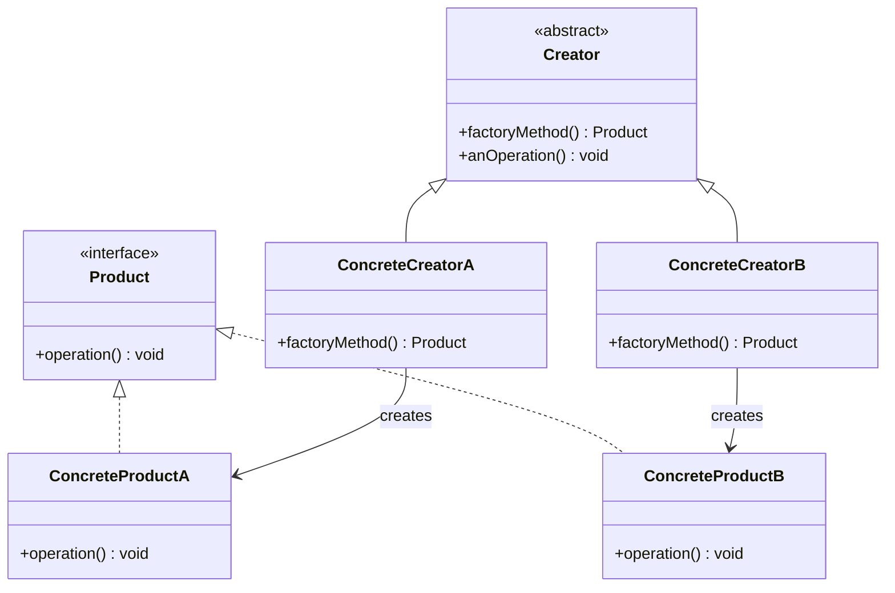

# C++ 工厂方法模式

## 概述

工厂方法模式是一种创建型设计模式，它提供了一种创建对象的最佳方式。在工厂方法模式中，我们通过调用工厂方法而不是直接使用 `new` 运算符来创建对象。这种模式特别适合当一个类不知道它所必须创建的对象的类时，或者当一个类希望由其子类来指定所创建的对象时使用。

工厂方法模式将对象的实例化逻辑委托给了子类，这使得代码更加灵活，更易于扩展。

:::note
工厂方法模式是《设计模式》一书中介绍的 23 种设计模式之一，在许多大型项目中被广泛应用。
:::

## 为什么需要工厂方法模式？

假设我们正在开发一个跨平台的 UI 应用程序，需要根据不同的操作系统创建适合的按钮。如果直接在代码中使用 `new WindowsButton()` 或 `new MacButton()`，那么每次添加新平台支持时，我们都需要修改大量代码。

工厂方法模式可以让我们：

1. 将对象的创建与使用分离
2. 轻松添加新类型的产品
3. 增强代码的可维护性
4. 遵循"开闭原则"：对扩展开放，对修改关闭

## 工厂方法模式的结构



工厂方法模式包含以下主要角色：

1. **抽象产品**（Product）：定义工厂方法所创建的对象的接口
2. **具体产品**（Concrete Product）：实现抽象产品接口的类
3. **抽象工厂**（Creator）：声明工厂方法的抽象类
4. **具体工厂**（Concrete Creator）：实现工厂方法以返回特定的具体产品

## C++ 实现工厂方法模式

下面通过一个跨平台 UI 开发的例子来实现工厂方法模式：

```cpp
#include <iostream>
#include <string>
#include <memory>

// 抽象产品：按钮
class Button {
public:
    virtual ~Button() = default;
    virtual void render() = 0;
    virtual void onClick() = 0;
};

// 具体产品：Windows按钮
class WindowsButton : public Button {
public:
    void render() override {
        std::cout << "渲染 Windows 风格的按钮" << std::endl;
    }
    
    void onClick() override {
        std::cout << "Windows 按钮的点击效果" << std::endl;
    }
};

// 具体产品：Mac按钮
class MacButton : public Button {
public:
    void render() override {
        std::cout << "渲染 Mac 风格的按钮" << std::endl;
    }
    
    void onClick() override {
        std::cout << "Mac 按钮的点击效果" << std::endl;
    }
};

// 抽象工厂：对话框
class Dialog {
public:
    virtual ~Dialog() = default;
    
    // 工厂方法
    virtual std::unique_ptr<Button> createButton() = 0;
    
    // 使用产品的方法
    void render() {
        // 调用工厂方法创建按钮
        std::unique_ptr<Button> button = createButton();
        // 使用产品
        button->render();
    }
};

// 具体工厂：Windows对话框
class WindowsDialog : public Dialog {
public:
    std::unique_ptr<Button> createButton() override {
        return std::make_unique<WindowsButton>();
    }
};

// 具体工厂：Mac对话框
class MacDialog : public Dialog {
public:
    std::unique_ptr<Button> createButton() override {
        return std::make_unique<MacButton>();
    }
};

// 客户端代码
std::unique_ptr<Dialog> createDialogBasedOnOS() {
    std::string os = "Windows"; // 这里可以通过某种方式获取当前操作系统
    
    if (os == "Windows") {
        return std::make_unique<WindowsDialog>();
    } else {
        return std::make_unique<MacDialog>();
    }
}

int main() {
    std::unique_ptr<Dialog> dialog = createDialogBasedOnOS();
    dialog->render();
    
    return 0;
}
```

### 输出结果

```
渲染 Windows 风格的按钮
```

## 代码解析

1. **抽象产品**：`Button` 类定义了所有按钮必须实现的接口。
2. **具体产品**：`WindowsButton` 和 `MacButton` 分别实现了特定风格的按钮。
3. **抽象工厂**：`Dialog` 类声明了工厂方法 `createButton()`，还包含使用该产品的方法 `render()`。
4. **具体工厂**：`WindowsDialog` 和 `MacDialog` 分别实现工厂方法，创建对应风格的按钮。
5. **客户端代码**：`createDialogBasedOnOS()` 函数根据操作系统选择合适的对话框工厂。

## 工厂方法模式的优势

1. **避免了创建者和具体产品之间的紧密耦合**：创建者不需要知道具体产品的类。

2. **符合单一职责原则**：将产品创建代码集中到一个位置，使代码更容易维护。

3. **符合开闭原则**：无需更改现有代码就可以引入新的产品类型。

4. **增强了代码的灵活性**：可以在运行时决定创建哪种产品。

## 工厂方法模式的缺点

1. **可能导致类的个数增加**：每增加一个产品就需要增加一个具体工厂类。

2. **增加了系统的复杂度**：引入了抽象层次，使系统变得更加复杂。

## 实际应用场景

### 1. 数据库连接

一个应用程序可能需要连接不同类型的数据库，如 MySQL、PostgreSQL、Oracle 等。可以使用工厂方法模式来创建适当的数据库连接对象。

```cpp
// 抽象产品：数据库连接
class DBConnection {
public:
    virtual ~DBConnection() = default;
    virtual bool connect() = 0;
    virtual bool disconnect() = 0;
    virtual bool executeQuery(const std::string& query) = 0;
};

// 具体产品：MySQL连接
class MySQLConnection : public DBConnection {
    // 实现细节...
};

// 具体产品：PostgreSQL连接
class PostgreSQLConnection : public DBConnection {
    // 实现细节...
};

// 抽象工厂：数据库连接工厂
class DBConnectionFactory {
public:
    virtual ~DBConnectionFactory() = default;
    virtual std::unique_ptr<DBConnection> createConnection() = 0;
};

// 具体工厂：MySQL连接工厂
class MySQLConnectionFactory : public DBConnectionFactory {
public:
    std::unique_ptr<DBConnection> createConnection() override {
        return std::make_unique<MySQLConnection>();
    }
};

// 具体工厂：PostgreSQL连接工厂
class PostgreSQLConnectionFactory : public DBConnectionFactory {
public:
    std::unique_ptr<DBConnection> createConnection() override {
        return std::make_unique<PostgreSQLConnection>();
    }
};
```

### 2. 日志记录系统

一个应用可能需要将日志输出到不同的目标（文件、控制台、网络等）。

```cpp
// 抽象产品：日志记录器
class Logger {
public:
    virtual ~Logger() = default;
    virtual void log(const std::string& message) = 0;
};

// 具体产品：文件日志记录器
class FileLogger : public Logger {
public:
    void log(const std::string& message) override {
        std::cout << "File Logger: " << message << std::endl;
        // 实际实现中会写入文件
    }
};

// 具体产品：控制台日志记录器
class ConsoleLogger : public Logger {
public:
    void log(const std::string& message) override {
        std::cout << "Console Logger: " << message << std::endl;
    }
};

// 抽象工厂：日志记录器工厂
class LoggerFactory {
public:
    virtual ~LoggerFactory() = default;
    virtual std::unique_ptr<Logger> createLogger() = 0;
};

// 具体工厂：文件日志记录器工厂
class FileLoggerFactory : public LoggerFactory {
public:
    std::unique_ptr<Logger> createLogger() override {
        return std::make_unique<FileLogger>();
    }
};

// 具体工厂：控制台日志记录器工厂
class ConsoleLoggerFactory : public LoggerFactory {
public:
    std::unique_ptr<Logger> createLogger() override {
        return std::make_unique<ConsoleLogger>();
    }
};
```

:::tip
工厂方法模式特别适合于：
- 当一个类不知道它所必须创建的对象的类时
- 当一个类希望由它的子类来指定它所创建的对象时
- 当类将创建对象的职责委托给多个帮助子类中的某一个，并且你希望将哪一个帮助子类是代理者这一信息局部化时
:::

## 常见误区和注意事项

1. **与简单工厂的区别**：简单工厂通常是一个独立的类，包含一个方法根据参数返回不同的对象；而工厂方法是一个抽象方法，由子类实现它来创建对象。

2. **与抽象工厂的区别**：抽象工厂关注的是创建一系列相关的产品，而工厂方法关注的是创建单一产品。

3. **过度设计**：对于简单的创建逻辑，使用工厂方法可能是过度设计。应根据实际需求选择合适的模式。

## 总结

工厂方法模式是一种创建型设计模式，它通过定义一个创建对象的接口，让子类决定实例化哪一个类。工厂方法模式使得一个类的实例化延迟到其子类，从而增强了代码的灵活性和可维护性。

这种模式在许多现代 C++ 框架和库中被广泛使用，特别是在需要处理对象创建但又不想直接依赖于具体类的场景下。通过使用工厂方法模式，你可以使代码更加灵活，更易于扩展，并且符合面向对象设计的多项原则。

## 练习

1. 实现一个使用工厂方法模式的文档生成系统，能够生成不同格式的文档（如 HTML、PDF、Text）。

2. 扩展上面的 UI 例子，添加更多的 UI 组件（如复选框、文本框）和更多的平台支持（如 Linux）。

3. 设计一个使用工厂方法模式的游戏角色创建系统，能够创建不同类型的游戏角色（如战士、法师、弓箭手）。

## 参考资源

- 《设计模式：可复用面向对象软件的基础》- Gamma, Helm, Johnson, Vlissides
- 《C++ 设计模式》- Kjell Gunnar Høgberg
- Modern C++ Design: Generic Programming and Design Patterns Applied - Andrei Alexandrescu