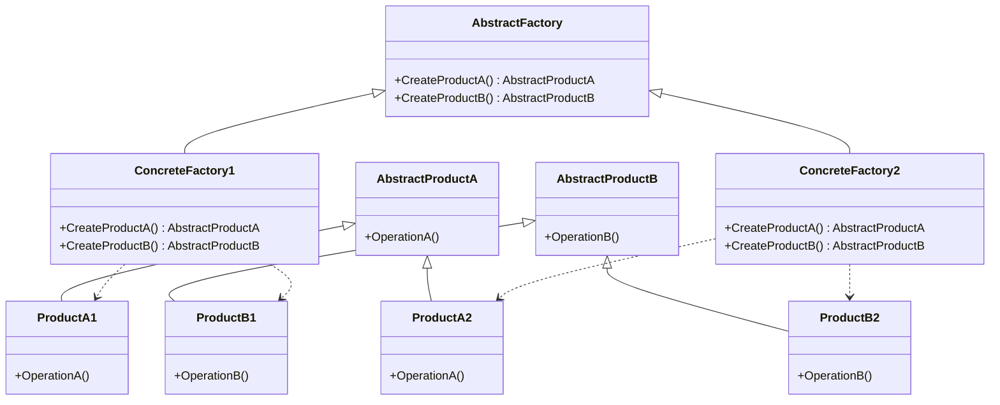

# C++ 抽象工厂模式

## 什么是抽象工厂模式？

抽象工厂模式（Abstract Factory Pattern）是一种创建型设计模式，它提供了一种方式，可以将一组具有相同主题的单独的工厂封装起来。在不直接指定具体类的情况下创建产品对象。

简单来说，抽象工厂模式就是提供一个创建一系列相关或相互依赖对象的接口，而无需指定它们具体的类。

:::tip
抽象工厂模式与工厂方法模式的区别：工厂方法模式关注的是**一个**产品等级结构，而抽象工厂模式关注的是**多个**产品等级结构。
:::

## 抽象工厂模式的结构



抽象工厂模式包含以下几个关键角色：

1. **抽象工厂（AbstractFactory）**：声明一组用于创建产品对象的方法，每个方法对应一种产品类型。
2. **具体工厂（ConcreteFactory）**：实现抽象工厂接口中声明的创建产品的方法，生成一组具体产品。
3. **抽象产品（AbstractProduct）**：为一类产品声明接口。
4. **具体产品（ConcreteProduct）**：实现抽象产品接口，由具体工厂创建。
5. **客户端（Client）**：仅使用由抽象工厂和抽象产品声明的接口。

## C++ 实现抽象工厂模式

下面我们通过一个跨平台UI组件的示例来实现抽象工厂模式：

```cpp
#include <iostream>
#include <memory>
#include <string>

// 抽象产品A：按钮
class Button {
public:
    virtual ~Button() = default;
    virtual void render() const = 0;
    virtual void onClick() const = 0;
};

// 具体产品A1：Windows按钮
class WindowsButton : public Button {
public:
    void render() const override {
        std::cout << "Rendering a button in Windows style" << std::endl;
    }
    
    void onClick() const override {
        std::cout << "Windows button clicked!" << std::endl;
    }
};

// 具体产品A2：macOS按钮
class MacOSButton : public Button {
public:
    void render() const override {
        std::cout << "Rendering a button in macOS style" << std::endl;
    }
    
    void onClick() const override {
        std::cout << "macOS button clicked!" << std::endl;
    }
};

// 抽象产品B：复选框
class Checkbox {
public:
    virtual ~Checkbox() = default;
    virtual void render() const = 0;
    virtual void toggle() const = 0;
};

// 具体产品B1：Windows复选框
class WindowsCheckbox : public Checkbox {
public:
    void render() const override {
        std::cout << "Rendering a checkbox in Windows style" << std::endl;
    }
    
    void toggle() const override {
        std::cout << "Windows checkbox toggled!" << std::endl;
    }
};

// 具体产品B2：macOS复选框
class MacOSCheckbox : public Checkbox {
public:
    void render() const override {
        std::cout << "Rendering a checkbox in macOS style" << std::endl;
    }
    
    void toggle() const override {
        std::cout << "macOS checkbox toggled!" << std::endl;
    }
};

// 抽象工厂
class GUIFactory {
public:
    virtual ~GUIFactory() = default;
    virtual std::unique_ptr<Button> createButton() const = 0;
    virtual std::unique_ptr<Checkbox> createCheckbox() const = 0;
};

// 具体工厂1：Windows GUI工厂
class WindowsFactory : public GUIFactory {
public:
    std::unique_ptr<Button> createButton() const override {
        return std::make_unique<WindowsButton>();
    }
    
    std::unique_ptr<Checkbox> createCheckbox() const override {
        return std::make_unique<WindowsCheckbox>();
    }
};

// 具体工厂2：macOS GUI工厂
class MacOSFactory : public GUIFactory {
public:
    std::unique_ptr<Button> createButton() const override {
        return std::make_unique<MacOSButton>();
    }
    
    std::unique_ptr<Checkbox> createCheckbox() const override {
        return std::make_unique<MacOSCheckbox>();
    }
};

// 客户端代码
class Application {
private:
    std::unique_ptr<Button> button;
    std::unique_ptr<Checkbox> checkbox;

public:
    Application(const GUIFactory& factory) {
        button = factory.createButton();
        checkbox = factory.createCheckbox();
    }
    
    void render() {
        button->render();
        checkbox->render();
    }
    
    void click() {
        button->onClick();
        checkbox->toggle();
    }
};

// 应用程序入口
int main() {
    std::cout << "Client: Testing client code with Windows factory:" << std::endl;
    WindowsFactory windowsFactory;
    Application app1(windowsFactory);
    app1.render();
    app1.click();
    
    std::cout << "\nClient: Testing the same client code with macOS factory:" << std::endl;
    MacOSFactory macFactory;
    Application app2(macFactory);
    app2.render();
    app2.click();
    
    return 0;
}
```

### 执行结果

```
Client: Testing client code with Windows factory:
Rendering a button in Windows style
Rendering a checkbox in Windows style
Windows button clicked!
Windows checkbox toggled!

Client: Testing the same client code with macOS factory:
Rendering a button in macOS style
Rendering a checkbox in macOS style
macOS button clicked!
macOS checkbox toggled!
```

## 抽象工厂模式的详细解析

让我们逐步分析上面的代码示例：

1. **抽象产品类**：`Button` 和 `Checkbox` 是两个抽象产品类，定义了产品的接口。
   
2. **具体产品类**：
   - `WindowsButton` 和 `MacOSButton` 是 `Button` 的具体实现。
   - `WindowsCheckbox` 和 `MacOSCheckbox` 是 `Checkbox` 的具体实现。

3. **抽象工厂**：`GUIFactory` 声明了创建不同抽象产品的接口方法。

4. **具体工厂**：
   - `WindowsFactory` 创建 Windows 风格的组件。
   - `MacOSFactory` 创建 macOS 风格的组件。

5. **客户端**：`Application` 类使用抽象工厂和抽象产品，而不关心具体的实现细节。

抽象工厂模式的工作流程：

1. 在应用程序初始化时，根据配置或环境，创建特定的具体工厂对象。
2. 将该工厂对象传递给需要创建产品的客户端代码。
3. 客户端使用工厂对象创建产品，而不直接实例化具体产品类。

## 抽象工厂模式的实际应用场景

1. **跨平台UI库**：如上面的示例所示，不同操作系统需要不同风格的UI组件。

2. **数据库抽象层**：创建一个抽象工厂来处理不同类型的数据库连接、命令和结果集。

```cpp
// 数据库抽象工厂示例
class DatabaseFactory {
public:
    virtual ~DatabaseFactory() = default;
    virtual std::unique_ptr<Connection> createConnection() = 0;
    virtual std::unique_ptr<Command> createCommand() = 0;
    virtual std::unique_ptr<ResultSet> createResultSet() = 0;
};

// MySQL具体工厂
class MySQLFactory : public DatabaseFactory {
    // 实现创建MySQL连接、命令和结果集的方法
};

// PostgreSQL具体工厂
class PostgreSQLFactory : public DatabaseFactory {
    // 实现创建PostgreSQL连接、命令和结果集的方法
};
```

3. **游戏开发中的资源管理器**：为不同平台创建适合的资源加载器和管理器。

4. **不同风格的图形渲染器**：如2D、3D等不同渲染方式。

5. **多主题应用程序**：管理不同主题下的UI元素和样式。

## 抽象工厂模式的优缺点

### 优点

1. **隔离具体类**：客户端与具体产品解耦，只需要知道抽象产品。
2. **产品族一致性**：确保客户端始终使用同一个产品族中的对象。
3. **易于替换产品族**：整体替换产品族非常容易。
4. **促进开闭原则**：增加新的产品族不需要修改已有代码。

### 缺点

1. **难以支持新种类的产品**：增加新种类的产品需要修改抽象工厂和所有的具体工厂实现。
2. **代码复杂性增加**：引入大量接口和类，使系统更加复杂。

## 与其他设计模式的关系

1. **工厂方法模式**：抽象工厂通常基于一组工厂方法来实现，但它关注的是产品族。
2. **单例模式**：抽象工厂常被实现为单例。
3. **建造者模式**：抽象工厂关注于创建产品族，而建造者关注于如何分步创建复杂对象。

## 实践练习

1. 实现一个跨平台游戏引擎的抽象工厂，支持Windows、macOS和Linux三个平台，每个平台有渲染器、音频系统和输入处理器三种产品。

2. 设计一个主题化的应用程序，使用抽象工厂来切换深色和浅色主题的各种UI元素。

3. 为一个支持多种数据库的ORM框架设计抽象工厂结构。

## 总结

抽象工厂模式提供了一种优雅的方式来创建一系列相关或互相依赖的对象，而不需要指定它们的具体类。这种模式特别适用于需要保持产品一致性、隔离具体类的实现，以及希望系统能够独立于产品创建、组成和表示的情况。

在C++中实现抽象工厂模式时，我们通常使用虚函数和多态性来定义抽象接口，并通过继承和实现这些接口来创建具体的工厂和产品。使用智能指针（如`std::unique_ptr`）可以简化内存管理。

虽然抽象工厂模式增加了系统的复杂性，但它提供的灵活性和可维护性往往使这种权衡是值得的，特别是在处理具有多种变体的复杂系统时。

## 进一步学习资源

- 《设计模式：可复用面向对象软件的基础》(GoF)
- 《Head First设计模式》
- 《C++设计模式》，作者：James W. Cooper
- [Refactoring.Guru - Abstract Factory Pattern](https://refactoring.guru/design-patterns/abstract-factory)

记住，设计模式是解决问题的工具，而不是目标。在实际应用中，应该根据具体问题来判断是否需要使用抽象工厂模式，避免过度设计。