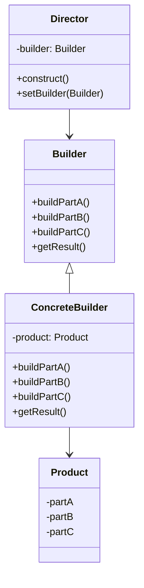

# C++ 建造者模式

## 引言

在软件开发过程中，我们经常需要创建复杂的对象，这些对象可能由多个部分组成，且构建过程可能相当复杂。如果直接在构造函数中设置所有参数，代码将变得难以阅读和维护。这时，**建造者模式**（Builder Pattern）就派上用场了。

建造者模式是一种创建型设计模式，它允许我们分步骤创建复杂对象，并且可以生成不同类型和表现形式的对象，同时保持相同的构建过程。

## 建造者模式的基本概念

建造者模式主要包含以下几个角色：



1. **产品（Product）**：最终要创建的复杂对象。
2. **抽象建造者（Builder）**：为创建产品的各个部件指定抽象接口。
3. **具体建造者（ConcreteBuilder）**：实现抽象建造者的接口，构建和装配各个部件。
4. **指挥者（Director）**：构建一个使用Builder接口的对象，它主要用于创建一个复杂的对象。

## C++ 实现建造者模式

下面我们通过一个创建电脑的例子来展示建造者模式的实现：

```cpp
#include <iostream>
#include <string>
#include <memory>

// 产品类：电脑
class Computer {
private:
    std::string cpu_;
    std::string memory_;
    std::string storage_;
    std::string display_;
    
public:
    void setCPU(const std::string& cpu) { cpu_ = cpu; }
    void setMemory(const std::string& memory) { memory_ = memory; }
    void setStorage(const std::string& storage) { storage_ = storage; }
    void setDisplay(const std::string& display) { display_ = display; }
    
    void show() const {
        std::cout << "Computer Configuration:" << std::endl;
        std::cout << "CPU: " << cpu_ << std::endl;
        std::cout << "Memory: " << memory_ << std::endl;
        std::cout << "Storage: " << storage_ << std::endl;
        std::cout << "Display: " << display_ << std::endl;
    }
};

// 抽象建造者
class ComputerBuilder {
public:
    virtual void buildCPU() = 0;
    virtual void buildMemory() = 0;
    virtual void buildStorage() = 0;
    virtual void buildDisplay() = 0;
    virtual std::shared_ptr<Computer> getComputer() = 0;
    virtual ~ComputerBuilder() {}
};

// 具体建造者：高配电脑
class HighEndComputerBuilder : public ComputerBuilder {
private:
    std::shared_ptr<Computer> computer_;
    
public:
    HighEndComputerBuilder() {
        computer_ = std::make_shared<Computer>();
    }
    
    void buildCPU() override {
        computer_->setCPU("Intel Core i9");
    }
    
    void buildMemory() override {
        computer_->setMemory("32GB DDR4");
    }
    
    void buildStorage() override {
        computer_->setStorage("1TB SSD");
    }
    
    void buildDisplay() override {
        computer_->setDisplay("4K Ultra HD");
    }
    
    std::shared_ptr<Computer> getComputer() override {
        return computer_;
    }
};

// 具体建造者：低配电脑
class BudgetComputerBuilder : public ComputerBuilder {
private:
    std::shared_ptr<Computer> computer_;
    
public:
    BudgetComputerBuilder() {
        computer_ = std::make_shared<Computer>();
    }
    
    void buildCPU() override {
        computer_->setCPU("Intel Core i3");
    }
    
    void buildMemory() override {
        computer_->setMemory("8GB DDR4");
    }
    
    void buildStorage() override {
        computer_->setStorage("256GB HDD");
    }
    
    void buildDisplay() override {
        computer_->setDisplay("Full HD");
    }
    
    std::shared_ptr<Computer> getComputer() override {
        return computer_;
    }
};

// 指挥者
class ComputerDirector {
private:
    std::shared_ptr<ComputerBuilder> builder_;
    
public:
    void setBuilder(std::shared_ptr<ComputerBuilder> builder) {
        builder_ = builder;
    }
    
    std::shared_ptr<Computer> buildComputer() {
        builder_->buildCPU();
        builder_->buildMemory();
        builder_->buildStorage();
        builder_->buildDisplay();
        return builder_->getComputer();
    }
};

int main() {
    // 创建指挥者
    ComputerDirector director;
    
    // 构建高配电脑
    auto highEndBuilder = std::make_shared<HighEndComputerBuilder>();
    director.setBuilder(highEndBuilder);
    auto highEndComputer = director.buildComputer();
    
    std::cout << "High-End Computer Configuration:" << std::endl;
    highEndComputer->show();
    
    // 构建低配电脑
    auto budgetBuilder = std::make_shared<BudgetComputerBuilder>();
    director.setBuilder(budgetBuilder);
    auto budgetComputer = director.buildComputer();
    
    std::cout << "\nBudget Computer Configuration:" << std::endl;
    budgetComputer->show();
    
    return 0;
}
```

**输出结果：**

```
High-End Computer Configuration:
Computer Configuration:
CPU: Intel Core i9
Memory: 32GB DDR4
Storage: 1TB SSD
Display: 4K Ultra HD

Budget Computer Configuration:
Computer Configuration:
CPU: Intel Core i3
Memory: 8GB DDR4
Storage: 256GB HDD
Display: Full HD
```

## 流式接口（链式调用）形式的建造者模式

建造者模式的一种常见变体是使用流式接口（链式调用），这种方式特别适合于设置可选参数：

```cpp
#include <iostream>
#include <string>
#include <memory>

class Computer {
private:
    std::string cpu_;
    std::string memory_;
    std::string storage_;
    std::string display_;
    bool wifi_enabled_ = false;
    bool bluetooth_enabled_ = false;
    
public:
    void setCPU(const std::string& cpu) { cpu_ = cpu; }
    void setMemory(const std::string& memory) { memory_ = memory; }
    void setStorage(const std::string& storage) { storage_ = storage; }
    void setDisplay(const std::string& display) { display_ = display; }
    void setWiFi(bool enabled) { wifi_enabled_ = enabled; }
    void setBluetooth(bool enabled) { bluetooth_enabled_ = enabled; }
    
    void show() const {
        std::cout << "Computer Configuration:" << std::endl;
        std::cout << "CPU: " << cpu_ << std::endl;
        std::cout << "Memory: " << memory_ << std::endl;
        std::cout << "Storage: " << storage_ << std::endl;
        std::cout << "Display: " << display_ << std::endl;
        std::cout << "WiFi: " << (wifi_enabled_ ? "Enabled" : "Disabled") << std::endl;
        std::cout << "Bluetooth: " << (bluetooth_enabled_ ? "Enabled" : "Disabled") << std::endl;
    }
};

// 流式建造者
class ComputerBuilder {
private:
    std::shared_ptr<Computer> computer_;
    
public:
    ComputerBuilder() {
        computer_ = std::make_shared<Computer>();
    }
    
    ComputerBuilder& setCPU(const std::string& cpu) {
        computer_->setCPU(cpu);
        return *this;
    }
    
    ComputerBuilder& setMemory(const std::string& memory) {
        computer_->setMemory(memory);
        return *this;
    }
    
    ComputerBuilder& setStorage(const std::string& storage) {
        computer_->setStorage(storage);
        return *this;
    }
    
    ComputerBuilder& setDisplay(const std::string& display) {
        computer_->setDisplay(display);
        return *this;
    }
    
    ComputerBuilder& enableWiFi() {
        computer_->setWiFi(true);
        return *this;
    }
    
    ComputerBuilder& enableBluetooth() {
        computer_->setBluetooth(true);
        return *this;
    }
    
    std::shared_ptr<Computer> build() {
        return computer_;
    }
};

int main() {
    // 使用链式调用创建电脑
    auto computer = ComputerBuilder()
                    .setCPU("Intel Core i7")
                    .setMemory("16GB DDR4")
                    .setStorage("512GB SSD")
                    .setDisplay("2K")
                    .enableWiFi()
                    .enableBluetooth()
                    .build();
    
    computer->show();
    
    return 0;
}
```

**输出结果：**

```
Computer Configuration:
CPU: Intel Core i7
Memory: 16GB DDR4
Storage: 512GB SSD
Display: 2K
WiFi: Enabled
Bluetooth: Enabled
```

## 建造者模式的优缺点

### 优点

1. **分步创建**：可以分步创建复杂对象，并且可以暂停创建过程。
2. **避免构造函数膨胀**：当一个类有很多可选参数时，传统做法会导致构造函数参数过多。建造者模式可以解决这个问题。
3. **隐藏构建细节**：客户端只需要知道产品的类型，不需要了解其内部构造细节。
4. **代码可读性**：使用链式调用形式的建造者模式可以使代码更加清晰和可读。
5. **复用性**：相同的构建过程可以用于创建不同的表示形式。

### 缺点

1. **增加代码量**：相比直接使用构造函数，建造者模式需要创建更多的类。
2. **与产品紧密耦合**：具体建造者通常与它们构造的产品类紧密耦合。

## 实际应用场景

1. **GUI构建**：构建复杂的用户界面，各个组件可能需要不同的配置。
2. **文档生成**：构建不同格式的文档（HTML、PDF、Markdown等）。
3. **数据库查询构建器**：以流畅的接口方式构建SQL查询。
4. **配置类创建**：创建具有多个可选参数的配置类。
5. **网络请求构建**：构建HTTP请求，设置不同的头部、参数等。

:::note
在实际开发中，C++标准库中的`std::ostringstream`就是建造者模式的一种应用，它允许我们分步骤构建字符串。
:::

## 示例：实际应用 - SQL查询构建器

下面是一个简单的SQL查询构建器示例，展示了建造者模式在实际开发中的应用：

```cpp
#include <iostream>
#include <string>
#include <vector>
#include <sstream>

class SQLQueryBuilder {
private:
    std::string table_;
    std::vector<std::string> columns_;
    std::vector<std::string> conditions_;
    std::vector<std::string> orderBy_;
    int limit_ = -1;
    
public:
    SQLQueryBuilder& select(const std::vector<std::string>& columns) {
        columns_ = columns;
        return *this;
    }
    
    SQLQueryBuilder& from(const std::string& table) {
        table_ = table;
        return *this;
    }
    
    SQLQueryBuilder& where(const std::string& condition) {
        conditions_.push_back(condition);
        return *this;
    }
    
    SQLQueryBuilder& orderBy(const std::string& column, bool asc = true) {
        orderBy_.push_back(column + (asc ? " ASC" : " DESC"));
        return *this;
    }
    
    SQLQueryBuilder& limit(int limit) {
        limit_ = limit;
        return *this;
    }
    
    std::string build() const {
        std::ostringstream query;
        
        query << "SELECT ";
        
        if (columns_.empty()) {
            query << "*";
        } else {
            for (size_t i = 0; i < columns_.size(); ++i) {
                if (i > 0) {
                    query << ", ";
                }
                query << columns_[i];
            }
        }
        
        query << " FROM " << table_;
        
        if (!conditions_.empty()) {
            query << " WHERE ";
            for (size_t i = 0; i < conditions_.size(); ++i) {
                if (i > 0) {
                    query << " AND ";
                }
                query << conditions_[i];
            }
        }
        
        if (!orderBy_.empty()) {
            query << " ORDER BY ";
            for (size_t i = 0; i < orderBy_.size(); ++i) {
                if (i > 0) {
                    query << ", ";
                }
                query << orderBy_[i];
            }
        }
        
        if (limit_ >= 0) {
            query << " LIMIT " << limit_;
        }
        
        return query.str();
    }
};

int main() {
    SQLQueryBuilder builder;
    std::string query = builder
                        .select({"id", "name", "email"})
                        .from("users")
                        .where("age > 18")
                        .where("status = 'active'")
                        .orderBy("name")
                        .limit(10)
                        .build();
    
    std::cout << "Generated SQL Query: " << query << std::endl;
    
    return 0;
}
```

**输出结果：**

```
Generated SQL Query: SELECT id, name, email FROM users WHERE age > 18 AND status = 'active' ORDER BY name ASC LIMIT 10
```

## 总结

建造者模式是一种强大的设计模式，特别适合于构建复杂对象。它通过将构建过程分解为多个步骤，使得代码更加清晰和易于维护。在C++中，我们可以使用传统的建造者模式或流式接口（链式调用）形式的建造者模式。

关键要点：

1. 当需要构建的对象很复杂，有很多可选参数时，考虑使用建造者模式。
2. 流式接口形式的建造者模式特别适合于设置可选参数。
3. 建造者模式可以隐藏产品的具体创建步骤，使客户端代码更加清晰。
4. 在实际开发中，建造者模式常用于创建配置类、数据库查询、GUI构建等。

## 练习

1. 创建一个餐厅点餐系统，使用建造者模式构建不同类型的套餐（如儿童套餐、成人套餐等）。
2. 实现一个Email消息构建器，允许设置收件人、主题、正文、附件等。
3. 扩展上面的SQL查询构建器，添加对JOIN、GROUP BY等SQL语句的支持。

## 扩展阅读

- 《Design Patterns: Elements of Reusable Object-Oriented Software》by Gamma, Helm, Johnson, and Vlissides
- 《Modern C++ Design: Generic Programming and Design Patterns Applied》by Andrei Alexandrescu
- 《Effective Modern C++》by Scott Meyers

通过掌握建造者模式，你将能够编写更加清晰、灵活和可维护的代码，特别是在处理复杂对象创建时。