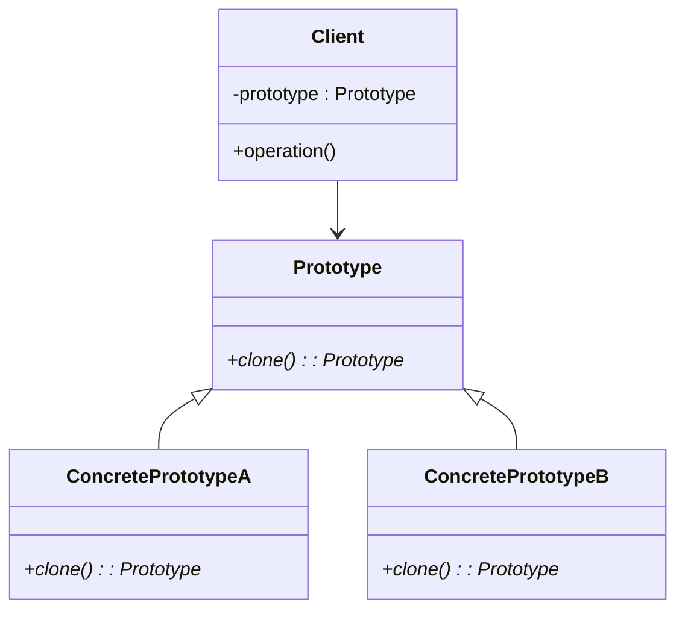

# C++ 原型模式

## 什么是原型模式

原型模式（Prototype Pattern）是一种创建型设计模式，它允许我们通过复制现有对象来创建新对象，而无需知道创建的细节。这种方式避免了直接使用构造函数创建对象可能带来的复杂性，特别是当对象的创建过程很复杂或者依赖于其他对象时。

原型模式的核心思想是：**通过克隆自身来创建新对象**。

:::note 原型模式的定义
原型模式：使用原型实例指定创建对象的种类，并且通过拷贝这些原型来创建新的对象。
:::

## 为什么需要原型模式？

在以下情况下，原型模式特别有用：

1. **当创建对象的成本较高时**：如果创建一个对象需要很多资源（例如，读取数据库数据、网络请求），那么复制已有对象比重新创建更高效。

2. **需要隐藏对象创建的复杂性**：通过提供一个克隆接口，客户端代码可以简单地获取新对象，而不需要了解对象创建的细节。

3. **需要独立于对象的具体类**：当你的代码不应该依赖于具体类来创建新实例时，可以使用原型模式。

4. **对象有多种状态组合**：当一个对象可能有多种状态组合，而手动创建所有这些组合的类会导致类爆炸时，使用原型模式更合适。

## 原型模式的基本结构



- **Prototype（原型）**：声明一个克隆自身的接口
- **ConcretePrototype（具体原型）**：实现克隆自身的操作
- **Client（客户端）**：通过调用原型的克隆方法创建新对象

## C++ 实现原型模式

### 基本实现

下面是一个简单的原型模式实现示例：

```cpp
#include <iostream>
#include <string>
#include <memory>

// 原型基类
class Prototype {
public:
    virtual ~Prototype() = default;
    virtual std::unique_ptr<Prototype> clone() const = 0;
    virtual void display() const = 0;
};

// 具体原型A
class ConcretePrototypeA : public Prototype {
private:
    std::string data;
    
public:
    ConcretePrototypeA(const std::string& data) : data(data) {}
    
    std::unique_ptr<Prototype> clone() const override {
        return std::make_unique<ConcretePrototypeA>(*this);
    }
    
    void display() const override {
        std::cout << "ConcretePrototypeA with data: " << data << std::endl;
    }
};

// 具体原型B
class ConcretePrototypeB : public Prototype {
private:
    int value;
    
public:
    ConcretePrototypeB(int value) : value(value) {}
    
    std::unique_ptr<Prototype> clone() const override {
        return std::make_unique<ConcretePrototypeB>(*this);
    }
    
    void display() const override {
        std::cout << "ConcretePrototypeB with value: " << value << std::endl;
    }
};

int main() {
    // 创建原型实例
    auto prototypeA = std::make_unique<ConcretePrototypeA>("Sample A");
    auto prototypeB = std::make_unique<ConcretePrototypeB>(42);
    
    // 克隆对象
    auto cloneA = prototypeA->clone();
    auto cloneB = prototypeB->clone();
    
    // 显示结果
    std::cout << "Original objects:" << std::endl;
    prototypeA->display();
    prototypeB->display();
    
    std::cout << "\nCloned objects:" << std::endl;
    cloneA->display();
    cloneB->display();
    
    return 0;
}
```

**输出结果：**
```
Original objects:
ConcretePrototypeA with data: Sample A
ConcretePrototypeB with value: 42

Cloned objects:
ConcretePrototypeA with data: Sample A
ConcretePrototypeB with value: 42
```

### 深拷贝与浅拷贝

在实现原型模式时，需要特别注意深拷贝与浅拷贝的问题。C++默认的复制构造函数和赋值运算符通常执行浅拷贝，这可能会导致问题，特别是当对象包含指针成员时。

下面是一个演示深拷贝实现的示例：

```cpp
#include <iostream>
#include <string>
#include <memory>

class Prototype {
public:
    virtual ~Prototype() = default;
    virtual std::unique_ptr<Prototype> clone() const = 0;
    virtual void display() const = 0;
};

class ComplexObject : public Prototype {
private:
    std::string name;
    int* dataArray;
    size_t arraySize;
    
public:
    // 构造函数
    ComplexObject(const std::string& name, size_t size) 
        : name(name), arraySize(size) {
        dataArray = new int[size];
        for (size_t i = 0; i < size; i++) {
            dataArray[i] = static_cast<int>(i);
        }
    }
    
    // 拷贝构造函数实现深拷贝
    ComplexObject(const ComplexObject& other) 
        : name(other.name), arraySize(other.arraySize) {
        dataArray = new int[arraySize];
        for (size_t i = 0; i < arraySize; i++) {
            dataArray[i] = other.dataArray[i];
        }
    }
    
    // 析构函数
    ~ComplexObject() override {
        delete[] dataArray;
    }
    
    // 克隆方法
    std::unique_ptr<Prototype> clone() const override {
        return std::make_unique<ComplexObject>(*this);
    }
    
    void display() const override {
        std::cout << "ComplexObject: " << name << ", Array values: ";
        for (size_t i = 0; i < arraySize; i++) {
            std::cout << dataArray[i] << " ";
        }
        std::cout << std::endl;
    }
    
    // 修改数据，用于测试是否深拷贝成功
    void modifyData(int index, int value) {
        if (index >= 0 && static_cast<size_t>(index) < arraySize) {
            dataArray[index] = value;
        }
    }
};

int main() {
    // 创建原型对象
    auto prototype = std::make_unique<ComplexObject>("Original", 5);
    prototype->display();
    
    // 克隆对象
    auto clone = std::unique_ptr<ComplexObject>(
        dynamic_cast<ComplexObject*>(prototype->clone().release())
    );
    
    // 修改克隆对象的数据
    clone->modifyData(2, 99);
    
    // 显示两个对象
    std::cout << "\nAfter modifying clone:" << std::endl;
    prototype->display();
    clone->display();
    
    return 0;
}
```

**输出结果：**
```
ComplexObject: Original, Array values: 0 1 2 3 4 

After modifying clone:
ComplexObject: Original, Array values: 0 1 2 3 4 
ComplexObject: Original, Array values: 0 1 99 3 4 
```

:::caution 注意
在实现深拷贝时，需要确保所有指针成员变量都被正确地复制。否则，当一个对象被销毁时，可能会导致另一个对象的指针无效，从而引发严重的内存错误。
:::

## 原型模式的应用场景

### 1. 图形编辑器

在图形编辑器中，用户可以绘制各种形状（如矩形、圆形、线条）。当用户想要复制一个已有的形状时，原型模式可以派上用场。

```cpp
#include <iostream>
#include <memory>
#include <vector>
#include <string>

// 形状接口（原型）
class Shape {
public:
    virtual ~Shape() = default;
    virtual std::unique_ptr<Shape> clone() const = 0;
    virtual void draw() const = 0;
};

// 矩形
class Rectangle : public Shape {
private:
    int width, height;
    std::string color;
    
public:
    Rectangle(int w, int h, const std::string& c) 
        : width(w), height(h), color(c) {}
    
    std::unique_ptr<Shape> clone() const override {
        return std::make_unique<Rectangle>(*this);
    }
    
    void draw() const override {
        std::cout << "Drawing a " << color << " rectangle with width " 
                  << width << " and height " << height << std::endl;
    }
};

// 圆形
class Circle : public Shape {
private:
    int radius;
    std::string color;
    
public:
    Circle(int r, const std::string& c) : radius(r), color(c) {}
    
    std::unique_ptr<Shape> clone() const override {
        return std::make_unique<Circle>(*this);
    }
    
    void draw() const override {
        std::cout << "Drawing a " << color << " circle with radius " 
                  << radius << std::endl;
    }
};

// 图形编辑器
class GraphicEditor {
private:
    std::vector<std::unique_ptr<Shape>> shapes;
    
public:
    void addShape(std::unique_ptr<Shape> shape) {
        shapes.push_back(std::move(shape));
    }
    
    void cloneAndAddShape(size_t index) {
        if (index < shapes.size()) {
            shapes.push_back(shapes[index]->clone());
        }
    }
    
    void drawAll() const {
        for (const auto& shape : shapes) {
            shape->draw();
        }
    }
};

int main() {
    GraphicEditor editor;
    
    // 添加一些形状
    editor.addShape(std::make_unique<Rectangle>(10, 5, "blue"));
    editor.addShape(std::make_unique<Circle>(7, "red"));
    
    std::cout << "Original shapes:" << std::endl;
    editor.drawAll();
    
    // 复制第一个形状（蓝色矩形）
    editor.cloneAndAddShape(0);
    // 复制第二个形状（红色圆形）
    editor.cloneAndAddShape(1);
    
    std::cout << "\nAfter cloning:" << std::endl;
    editor.drawAll();
    
    return 0;
}
```

**输出结果：**
```
Original shapes:
Drawing a blue rectangle with width 10 and height 5
Drawing a red circle with radius 7

After cloning:
Drawing a blue rectangle with width 10 and height 5
Drawing a red circle with radius 7
Drawing a blue rectangle with width 10 and height 5
Drawing a red circle with radius 7
```

### 2. 游戏对象生成

在游戏开发中，原型模式可用于快速复制游戏对象（如敌人、道具等）。

```cpp
#include <iostream>
#include <memory>
#include <string>
#include <unordered_map>

// 游戏对象接口
class GameObject {
public:
    virtual ~GameObject() = default;
    virtual std::unique_ptr<GameObject> clone() const = 0;
    virtual void render() const = 0;
};

// 敌人类
class Enemy : public GameObject {
private:
    std::string type;
    int health;
    int damage;
    
public:
    Enemy(const std::string& type, int health, int damage)
        : type(type), health(health), damage(damage) {}
    
    std::unique_ptr<GameObject> clone() const override {
        return std::make_unique<Enemy>(*this);
    }
    
    void render() const override {
        std::cout << "Enemy: " << type << " (Health: " << health 
                  << ", Damage: " << damage << ")" << std::endl;
    }
};

// 道具类
class Item : public GameObject {
private:
    std::string name;
    std::string effect;
    
public:
    Item(const std::string& name, const std::string& effect)
        : name(name), effect(effect) {}
    
    std::unique_ptr<GameObject> clone() const override {
        return std::make_unique<Item>(*this);
    }
    
    void render() const override {
        std::cout << "Item: " << name << " (Effect: " << effect << ")" << std::endl;
    }
};

// 游戏对象工厂
class GameObjectFactory {
private:
    std::unordered_map<std::string, std::unique_ptr<GameObject>> prototypes;
    
public:
    void registerPrototype(const std::string& id, std::unique_ptr<GameObject> prototype) {
        prototypes[id] = std::move(prototype);
    }
    
    std::unique_ptr<GameObject> createObject(const std::string& id) {
        if (prototypes.find(id) != prototypes.end()) {
            return prototypes[id]->clone();
        }
        return nullptr;
    }
};

int main() {
    GameObjectFactory factory;
    
    // 注册原型
    factory.registerPrototype("zombie", std::make_unique<Enemy>("Zombie", 100, 10));
    factory.registerPrototype("skeleton", std::make_unique<Enemy>("Skeleton", 80, 15));
    factory.registerPrototype("health_potion", std::make_unique<Item>("Health Potion", "Recover 50 HP"));
    
    // 创建游戏对象
    auto zombie1 = factory.createObject("zombie");
    auto zombie2 = factory.createObject("zombie");
    auto skeleton = factory.createObject("skeleton");
    auto potion = factory.createObject("health_potion");
    
    // 渲染游戏对象
    zombie1->render();
    zombie2->render();
    skeleton->render();
    potion->render();
    
    return 0;
}
```

**输出结果：**
```
Enemy: Zombie (Health: 100, Damage: 10)
Enemy: Zombie (Health: 100, Damage: 10)
Enemy: Skeleton (Health: 80, Damage: 15)
Item: Health Potion (Effect: Recover 50 HP)
```

## 原型模式的优缺点

### 优点

1. **隐藏创建对象的复杂度**：客户端代码不需要知道如何创建对象的详细过程。

2. **提高性能**：对于创建成本高的对象，复制比重新创建更有效率。

3. **动态添加和删除原型**：可以在运行时动态地添加和删除原型，增强了系统的灵活性。

4. **减少子类数量**：通过复制现有对象来创建新对象，而不是创建新的子类。

### 缺点

1. **深拷贝问题**：对于包含复杂对象或循环引用的原型，实现深拷贝可能会很复杂。

2. **克隆方法实现**：每个原型类都需要实现自己的克隆方法，增加了代码量。

## 最佳实践

1. **确保正确实现深拷贝**：当原型包含指针成员时，确保在克隆过程中正确处理深拷贝。

2. **考虑使用移动语义**：在C++11及以后版本中，可以考虑使用移动语义来优化克隆过程。

3. **使用原型管理器**：在复杂系统中，可以实现一个原型管理器来统一管理所有原型实例。

4. **结合其他模式**：原型模式可以与工厂模式结合使用，为工厂提供原型实例。

## 总结

原型模式是一种强大的创建型设计模式，通过克隆现有对象来创建新对象，从而避免了直接创建对象的复杂性。在C++中，通过实现合适的拷贝构造函数和克隆方法，可以方便地使用原型模式。

这种模式在以下场景特别有用：
- 对象创建成本高
- 需要隐藏对象创建的复杂性
- 对象有多种状态组合
- 需要独立于具体类创建对象

在实现原型模式时，最重要的是确保正确处理深拷贝，尤其是当对象包含指针或动态分配的资源时。

## 练习

1. 实现一个文档编辑器，可以复制不同类型的文档元素（段落、图像、表格等）。

2. 为游戏对象工厂添加更多功能，例如根据难度级别动态调整敌人的属性。

3. 实现一个使用原型模式的配置系统，允许创建具有默认配置的对象，然后根据需要进行修改。

## 相关资源

- 《Design Patterns: Elements of Reusable Object-Oriented Software》- Erich Gamma等人
- 《Effective Modern C++》- Scott Meyers，了解C++中的移动语义和完美转发
- 《C++ Templates: The Complete Guide》- David Vandevoorde等人，深入了解模板编程