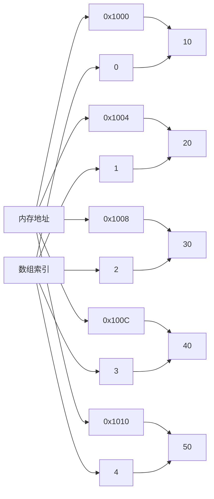

# C++ 数组基础

## 什么是数组？

数组是C++中最基本的数据结构之一，它允许我们在连续的内存位置存储相同类型的多个数据项。与单独声明多个变量相比，数组可以让我们更有效地组织和处理大量相关数据。

在C++中，数组是固定大小的，这意味着一旦定义，其大小就不能改变。如果需要可变大小的数据集合，C++提供了其他容器如`vector`，我们将在后续课程中介绍。

:::note
数组可以被视为相同类型元素的集合，每个元素通过索引访问，索引从0开始。
:::

## 声明数组

在C++中声明数组的基本语法如下：

```cpp
数据类型 数组名[数组大小];
```

例如，声明一个可以存储5个整数的数组：

```cpp
int numbers[5];
```

这将创建一个名为`numbers`的数组，可以存储5个整数值。

## 数组初始化

有多种方式可以初始化数组：

### 1. 在声明时初始化

```cpp
int numbers[5] = {10, 20, 30, 40, 50};
```

### 2. 部分初始化

如果初始化的值少于数组大小，剩余元素会被自动初始化为零：

```cpp
int numbers[5] = {10, 20, 30}; // 等价于 {10, 20, 30, 0, 0}
```

### 3. 省略数组大小

如果在声明时提供初始值，可以省略数组大小，编译器会根据初始值数量确定数组大小：

```cpp
int numbers[] = {10, 20, 30, 40, 50}; // 大小为5的数组
```

### 4. 在C++11及更高版本中使用统一初始化语法

```cpp
int numbers[5]{10, 20, 30, 40, 50};
```

### 5. 初始化为零

```cpp
int numbers[5] = {}; // 所有元素初始化为0
```

让我们看一个完整的示例：

```cpp
#include <iostream>
using namespace std;

int main() {
    // 声明并初始化数组
    int numbers[5] = {10, 20, 30, 40, 50};
    
    // 输出数组元素
    cout << "数组中的元素是: ";
    for (int i = 0; i < 5; i++) {
        cout << numbers[i] << " ";
    }
    cout << endl;
    
    return 0;
}
```

**输出：**
```
数组中的元素是: 10 20 30 40 50
```

## 访问数组元素

数组元素通过索引访问，索引从0开始。也就是说，第一个元素位于索引0，第二个元素位于索引1，依此类推。

```cpp
int numbers[5] = {10, 20, 30, 40, 50};

// 访问第一个元素
int firstElement = numbers[0]; // 10

// 访问第三个元素
int thirdElement = numbers[2]; // 30

// 修改第五个元素
numbers[4] = 100; // 数组现在是 {10, 20, 30, 40, 100}
```

:::caution
访问超出数组边界的索引会导致未定义行为，可能会导致程序崩溃或产生错误结果。C++不会自动检查数组边界！
:::

例如，以下代码可能导致错误：

```cpp
int numbers[5] = {10, 20, 30, 40, 50};
int value = numbers[5]; // 错误：索引超出范围
```

## 数组与循环

数组通常与循环一起使用来处理数据。以下是一些常见模式：

### 使用标准for循环

```cpp
#include <iostream>
using namespace std;

int main() {
    int scores[5] = {85, 92, 78, 95, 88};
    int sum = 0;
    
    // 计算总分
    for (int i = 0; i < 5; i++) {
        sum += scores[i];
    }
    
    double average = (double)sum / 5;
    cout << "平均分是: " << average << endl;
    
    return 0;
}
```

**输出：**
```
平均分是: 87.6
```

### 使用基于范围的for循环（C++11及更高版本）

```cpp
#include <iostream>
using namespace std;

int main() {
    int scores[5] = {85, 92, 78, 95, 88};
    int sum = 0;
    
    // 使用基于范围的for循环
    for (int score : scores) {
        sum += score;
    }
    
    double average = (double)sum / 5;
    cout << "平均分是: " << average << endl;
    
    return 0;
}
```

**输出：**
```
平均分是: 87.6
```

## 数组大小

在C++中，可以使用`sizeof`运算符获取数组的总字节大小，然后除以单个元素的大小来得到元素数量：

```cpp
#include <iostream>
using namespace std;

int main() {
    int numbers[] = {10, 20, 30, 40, 50, 60, 70};
    
    // 获取数组元素数量
    int size = sizeof(numbers) / sizeof(numbers[0]);
    
    cout << "数组中有 " << size << " 个元素" << endl;
    
    return 0;
}
```

**输出：**
```
数组中有 7 个元素
```

:::tip
使用`sizeof`计算数组大小只适用于函数内部声明的数组。当数组作为函数参数传递时，它会退化为指针，`sizeof`将无法正确计算元素数量。
:::

## 字符数组和字符串

在C++中，字符串可以用字符数组表示：

```cpp
char greeting[6] = {'H', 'e', 'l', 'l', 'o', '\0'};
```

或更简洁地：

```cpp
char greeting[] = "Hello";
```

第二种方式会自动添加`\0`（空终止符）在字符串末尾。

```cpp
#include <iostream>
using namespace std;

int main() {
    char greeting[] = "Hello";
    
    cout << "字符串是: " << greeting << endl;
    
    // 访问单个字符
    cout << "第一个字符是: " << greeting[0] << endl;
    
    return 0;
}
```

**输出：**
```
字符串是: Hello
第一个字符是: H
```

:::note
在现代C++中，推荐使用`std::string`类处理字符串，而不是字符数组，因为它提供了更多功能和安全性。
:::

## 多维数组

C++支持多维数组。最常见的是二维数组，可以视为"数组的数组"。

### 声明二维数组

```cpp
int matrix[3][4]; // 3行4列的二维数组
```

### 初始化二维数组

```cpp
int matrix[3][4] = {
    {1, 2, 3, 4},   // 第一行
    {5, 6, 7, 8},   // 第二行
    {9, 10, 11, 12} // 第三行
};
```

### 访问二维数组元素

```cpp
int value = matrix[1][2]; // 访问第二行第三列的元素，值为7
```

### 示例：使用二维数组

```cpp
#include <iostream>
using namespace std;

int main() {
    // 声明并初始化3x3矩阵
    int matrix[3][3] = {
        {1, 2, 3},
        {4, 5, 6},
        {7, 8, 9}
    };
    
    // 输出矩阵元素
    cout << "矩阵内容:" << endl;
    for (int i = 0; i < 3; i++) {
        for (int j = 0; j < 3; j++) {
            cout << matrix[i][j] << " ";
        }
        cout << endl;
    }
    
    return 0;
}
```

**输出：**
```
矩阵内容:
1 2 3 
4 5 6 
7 8 9 
```

## 数组内存布局

数组在内存中是连续存储的，这意味着数组的所有元素在物理内存中彼此相邻：



上图展示了一个包含5个整数的数组在32位系统上的内存布局（每个整数占4个字节）。

## 实际案例：学生成绩分析

以下是一个使用数组处理学生成绩的实际案例：

```cpp
#include <iostream>
#include <iomanip>
using namespace std;

int main() {
    const int NUM_STUDENTS = 5;
    
    // 学生成绩
    int scores[NUM_STUDENTS] = {78, 92, 67, 84, 95};
    string names[NUM_STUDENTS] = {"张三", "李四", "王五", "赵六", "钱七"};
    
    // 计算总分和平均分
    int sum = 0;
    int highest = scores[0];
    int lowest = scores[0];
    int highestIndex = 0;
    int lowestIndex = 0;
    
    for (int i = 0; i < NUM_STUDENTS; i++) {
        sum += scores[i];
        
        if (scores[i] > highest) {
            highest = scores[i];
            highestIndex = i;
        }
        
        if (scores[i] < lowest) {
            lowest = scores[i];
            lowestIndex = i;
        }
    }
    
    double average = (double)sum / NUM_STUDENTS;
    
    // 输出结果
    cout << fixed << setprecision(2);
    cout << "学生成绩统计：" << endl;
    cout << "---------------------" << endl;
    cout << "总分: " << sum << endl;
    cout << "平均分: " << average << endl;
    cout << "最高分: " << highest << " (学生: " << names[highestIndex] << ")" << endl;
    cout << "最低分: " << lowest << " (学生: " << names[lowestIndex] << ")" << endl;
    cout << "---------------------" << endl;
    
    // 输出每个学生的成绩和与平均分的差异
    cout << "各学生成绩详情：" << endl;
    for (int i = 0; i < NUM_STUDENTS; i++) {
        double difference = scores[i] - average;
        cout << names[i] << ": " << scores[i] << " (";
        
        if (difference > 0) {
            cout << "高于平均分 " << difference << " 分)";
        } else if (difference < 0) {
            cout << "低于平均分 " << -difference << " 分)";
        } else {
            cout << "等于平均分)";
        }
        cout << endl;
    }
    
    return 0;
}
```

**输出：**
```
学生成绩统计：
---------------------
总分: 416
平均分: 83.20
最高分: 95 (学生: 钱七)
最低分: 67 (学生: 王五)
---------------------
各学生成绩详情：
张三: 78 (低于平均分 5.20 分)
李四: 92 (高于平均分 8.80 分)
王五: 67 (低于平均分 16.20 分)
赵六: 84 (高于平均分 0.80 分)
钱七: 95 (高于平均分 11.80 分)
```

## 总结

在本教程中，我们学习了：

- 数组的基本概念和用途
- 如何声明和初始化数组
- 如何访问和修改数组元素
- 使用循环处理数组
- 计算数组大小
- 字符数组和字符串
- 多维数组
- 数组的内存布局
- 通过实际案例应用数组知识

数组是C++编程中的基础数据结构，掌握它对于解决各种编程问题至关重要。随着你的编程技能提升，你会发现标准库中的容器（如`vector`、`array`等）提供了更多功能和安全性，但理解基本数组仍然是必不可少的。

## 练习

1. 创建一个包含10个整数的数组，然后编写代码找出数组中的最大值和最小值。
2. 编写一个程序，将一个数组的元素按相反顺序存储到另一个数组中。
3. 创建一个5×5的二维数组，将其初始化为一个单位矩阵（主对角线上的元素为1，其余为0）。
4. 编写一个程序，计算两个3×3矩阵的和（使用二维数组）。
5. 创建一个程序，用字符数组存储一个字符串，然后统计其中元音字母（a, e, i, o, u）的数量。

:::tip
尝试自己解决这些练习，然后与他人的解决方案比较，这将帮助你更好地理解数组的应用。
:::