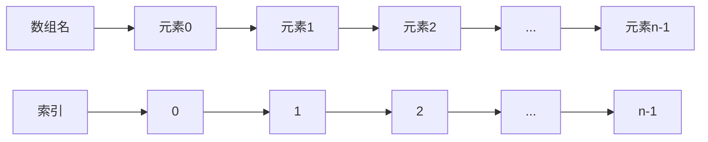

# C++ 一维数组

在C++编程中，数组是最基础也是最常用的数据结构之一，它允许你在连续的内存位置存储多个相同类型的元素。一维数组是最简单的数组类型，可以看作是一个线性的元素集合。

## 什么是一维数组？

一维数组是由相同类型的元素按顺序排列形成的集合，每个元素都有一个唯一的下标（索引）来标识其位置。在C++中，数组的索引从0开始，这意味着第一个元素的索引是0，第二个是1，以此类推。



## 声明和初始化数组

### 数组声明

在C++中声明一个一维数组的基本语法是：

```cpp
数据类型 数组名[数组大小];
```

例如，声明一个包含5个整数的数组：

```cpp
int numbers[5];
```

### 数组初始化

有多种方式可以初始化一个数组：

1. **在声明时初始化**：

```cpp
int numbers[5] = {10, 20, 30, 40, 50};
```

2. **部分初始化**（未指定的元素将被初始化为0）：

```cpp
int numbers[5] = {10, 20, 30};  // 等同于 {10, 20, 30, 0, 0}
```

3. **省略数组大小**（编译器根据初始化值的数量确定数组大小）：

```cpp
int numbers[] = {10, 20, 30, 40, 50};  // 大小为5
```

4. **使用循环进行初始化**：

```cpp
int numbers[5];
for (int i = 0; i < 5; i++) {
    numbers[i] = i * 10;  // 结果是 {0, 10, 20, 30, 40}
}
```

## 访问数组元素

使用索引访问数组中的元素：

```cpp
int value = numbers[2];  // 获取索引为2的元素(第3个元素)
numbers[3] = 100;        // 将100赋值给索引为3的元素(第4个元素)
```

:::caution
C++不会自动检查数组边界！访问超出数组范围的索引会导致未定义行为，可能会引起程序崩溃或安全漏洞。
:::

## 一维数组的遍历

遍历数组是一项常见操作，可以通过多种方式实现：

### 使用传统for循环

```cpp
int numbers[5] = {10, 20, 30, 40, 50};
for (int i = 0; i < 5; i++) {
    std::cout << "Element at index " << i << ": " << numbers[i] << std::endl;
}
```

### 使用基于范围的for循环（C++11及以上）

```cpp
int numbers[5] = {10, 20, 30, 40, 50};
for (int num : numbers) {
    std::cout << num << " ";
}
std::cout << std::endl;
```

## 数组的内存布局

在内存中，一维数组的元素是连续存储的，这使得数组访问非常高效。

```mermaid
graph LR
    subgraph 内存
    A[numbers[0]] --> B[numbers[1]] --> C[numbers[2]] --> D[numbers[3]] --> E[numbers[4]]
    end
```

数组名本质上是指向数组第一个元素的指针。这意味着 `numbers` 和 `&numbers[0]` 是等价的。

## 数组大小的确定

### 使用sizeof操作符

```cpp
int numbers[] = {10, 20, 30, 40, 50};
int arraySize = sizeof(numbers) / sizeof(numbers[0]);
std::cout << "Array size: " << arraySize << std::endl;  // 输出: Array size: 5
```

### C++ 11中使用std::size（C++17）或std::size_t（C++11）

```cpp
#include <array>
int numbers[] = {10, 20, 30, 40, 50};
std::cout << "Array size: " << std::size(numbers) << std::endl;  // C++17及以上
```

## 实际应用案例

### 案例1：计算学生成绩平均分

```cpp
#include <iostream>

int main() {
    // 存储5名学生的成绩
    int scores[5] = {85, 92, 78, 90, 88};
    int sum = 0;
    
    // 计算总分
    for (int score : scores) {
        sum += score;
    }
    
    // 计算平均分
    double average = static_cast<double>(sum) / 5;
    
    std::cout << "学生成绩: ";
    for (int score : scores) {
        std::cout << score << " ";
    }
    std::cout << std::endl;
    
    std::cout << "平均分: " << average << std::endl;
    
    return 0;
}
```

**输出**:
```
学生成绩: 85 92 78 90 88 
平均分: 86.6
```

### 案例2：寻找数组中的最大值和最小值

```cpp
#include <iostream>
#include <climits>  // 为了使用INT_MIN和INT_MAX

int main() {
    int numbers[] = {34, 15, 88, 2, 67, 12, 96, 45};
    int size = sizeof(numbers) / sizeof(numbers[0]);
    
    int max = INT_MIN;  // 初始化为最小可能的整数
    int min = INT_MAX;  // 初始化为最大可能的整数
    
    // 查找最大值和最小值
    for (int i = 0; i < size; i++) {
        if (numbers[i] > max) {
            max = numbers[i];
        }
        if (numbers[i] < min) {
            min = numbers[i];
        }
    }
    
    std::cout << "数组元素: ";
    for (int i = 0; i < size; i++) {
        std::cout << numbers[i] << " ";
    }
    std::cout << std::endl;
    
    std::cout << "最大值: " << max << std::endl;
    std::cout << "最小值: " << min << std::endl;
    
    return 0;
}
```

**输出**:
```
数组元素: 34 15 88 2 67 12 96 45 
最大值: 96
最小值: 2
```

## 一维数组的常见问题和解决方案

### 1. 数组越界

```cpp
int numbers[5] = {1, 2, 3, 4, 5};
numbers[5] = 6;  // 错误! 索引5超出了数组边界
```

**解决方案**：始终确保索引在有效范围内（0到数组大小减1）。

### 2. 数组作为函数参数

当数组作为参数传递给函数时，实际上传递的是指向数组第一个元素的指针，而不是整个数组的副本。

```cpp
#include <iostream>

// 数组作为参数 - 方式1
void printArray(int arr[], int size) {
    for (int i = 0; i < size; i++) {
        std::cout << arr[i] << " ";
    }
    std::cout << std::endl;
}

// 数组作为参数 - 方式2
void modifyArray(int* arr, int size) {
    for (int i = 0; i < size; i++) {
        arr[i] *= 2;  // 将每个元素翻倍
    }
}

int main() {
    int numbers[5] = {1, 2, 3, 4, 5};
    
    std::cout << "原始数组: ";
    printArray(numbers, 5);
    
    modifyArray(numbers, 5);
    
    std::cout << "修改后的数组: ";
    printArray(numbers, 5);
    
    return 0;
}
```

**输出**:
```
原始数组: 1 2 3 4 5 
修改后的数组: 2 4 6 8 10 
```

## 总结

一维数组是C++编程中最基础的数据结构之一，提供了一种简单高效的方式来存储和管理相同类型的数据集合。本文涵盖了C++一维数组的声明、初始化、访问、遍历以及在实际编程中的应用。掌握这些基础知识对于进一步学习更复杂的数据结构和算法至关重要。

## 练习题

1. 编写一个程序，创建一个包含10个整数的数组，计算这些整数的和与平均值。
2. 创建一个程序，允许用户输入5个数字，然后按照相反的顺序显示这些数字。
3. 编写一个函数，接受一个整数数组和其大小作为参数，返回数组中偶数的个数。
4. 实现一个程序，将两个数组合并成一个新数组。
5. 创建一个程序，检查一个数组是否已按升序排序。

:::tip
要巩固对数组的理解，建议尝试解决这些练习题，并尝试编写自己的程序来操作数组。通过实践，你将更好地理解数组的工作原理及其在程序中的应用。
:::